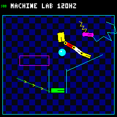

# Toy Factory

Toy Factory is an idle toy for the Pimoroni PicoSystem PIM559.



The current baseline exercises the complete board and a game-oriented graphics
path:

- boots a Zephyr 4.4.2 image from the RP2040 UF2 bootloader;
- exposes an interactive Zephyr shell and log console as `Toy Factory PicoSystem`
  over USB CDC ACM;
- reads all eight buttons;
- performs an RGB LED self-test and then mirrors the face buttons;
- owns one 240 x 240 RGB565 framebuffer and supports both damage-region and
  continuous full-frame presentation;
- runs a deterministic seven-body circle/box/capsule lab at an exact 120 Hz
  fixed step with Q16.16 linear/angular motion, gravity, friction, and
  restitution;
- filters collision candidates through a fixed 16 x 16 uniform grid while
  retaining a deterministic brute-force fallback and native oracle;
- supports bounded bilateral distance joints, impulse-limited damped springs,
  revolute point constraints, and prismatic rails between two bodies or a body
  and a fixed world anchor;
- drives signed-speed static conveyors through the ordinary friction row,
  without adding normal velocity or moving collision geometry;
- drives bounded revolute and prismatic motors against creation-relative limits,
  with a powered three-link chain and reciprocating press in the canonical lab;
- resolves every circle/box/capsule body pairing, static-segment contact, and
  fixed-box-sensor overlap without polygonizing capsules;
- simulates a fixed-capacity Verlet rope with world/body pins and six
  alternating position-constraint passes;
- emits deterministic pair-level `BEGIN`, `STAY`, and `END` contact events;
- deterministically sleeps whole contact/joint islands after 0.5 seconds of
  quiet, wakes them through physical interaction, leaves sensors observational,
  and keeps powered conveyor contacts awake;
- publishes fixed-size state snapshots to an independent renderer;
- launches a bounded bare-metal worker on RP2040 core 1 for deterministic
  full-scene rasterization while Zephyr, physics, USB, and display drivers stay
  on core 0;
- late-latches immutable snapshots and aligns display writes with the LCD's GP8
  tearing-effect signal;
- exposes acknowledged reset, pause, exact-step, injected-input, state-hash, and
  framebuffer-capture controls over USB;
- runs declarative deterministic device sequences with state/framebuffer assertions;
- resets the physics world to its canonical starting state when Y is pressed;
- plays a short, bounded piezo tone when B is pressed;
- averages and reports the GP26 battery-voltage ADC at startup and every 30 seconds;
- classifies the GP2 VBUS and active-low GP24 charger-status inputs;
- emits a 30-second log heartbeat and a faster visual heartbeat on the blue LED.

The LCD backlight is held off until the initial framebuffer is complete and has
been transferred, then enabled at 25%. The framebuffer consumes 115,200 bytes;
a separate 3,840-byte staging buffer packs non-full-width partial rows for
efficient driver writes, while contiguous full-width row ranges bypass it. The
piezo starts silent and uses a conservative 25 us active pulse for the tone
test. GP2 remains an input so the board's automatic red charging indicator
continues to work. PIO/DMA and PL022/DMA display transports remain optional
benchmark variants; the default uses polling SPI0/PL022.

## Build

```sh
make build
```

On the first build, Docker creates a pinned, RP2040-focused image containing
only the ARM toolchain and `west` clones Zephyr plus the two RP2040 dependencies
into a named Docker volume. Later builds reuse both. The flashable output is:

```text
build/zephyr/zephyr.uf2
```

Useful commands:

```sh
make          # show all available targets (`make help` also works)
make build    # build the firmware
make build-fast  # build the recommended dual-core PL022/DMA image at 62.5 MHz
make build-pio-dma  # build the optional PIO/DMA display benchmark
make build-pl022-dma  # build the optional PL022/DMA display benchmark
make setup    # explicitly refresh the pinned west dependencies
make format   # format the application C source in the container
make check    # formatting, whitespace, and a clean build
make container-shell  # enter the build container (`make shell` also works)
make sim-pause  # pause at a tick boundary and print exact simulation state
make sim-reset  # restore canonical tick-zero state while paused
make sim-step STEPS=1  # advance a paused simulation by exact 1/120-second ticks
make sim-test  # run the default deterministic hardware sequence
make screenshot  # save the renderer-owned software framebuffer as a PNG
make profile-ab  # compare the moving canonical world through grid/reference paths
make profile-sleep  # profile the canonical world settling under neutral input
make profile-chain  # benchmark deterministic 4/6/8-link chain scaling
```

`make build` retains the conservative 20 MHz polling-display configuration.
`make build-fast` selects the measured high-throughput configuration: PL022/DMA
at 62.5 MHz with the core-1 full-frame renderer. Its UF2 is written to
`build-render-profile-pl022-dma-62500000/zephyr/zephyr.uf2`.

The Ubuntu base, SDK archives, Python dependencies, and Zephyr release are
pinned. SDK downloads are checked against their upstream SHA-256 hashes.
Changing `west.yml` automatically causes the next build to refresh the
dependency volume.

## Flash

On Linux or macOS, `make update` handles the normal development cycle. It
builds the firmware, asks the running application to reboot into the RP2040 ROM
bootloader, waits for the `RPI-RP2` volume, validates it, and copies the UF2:

```sh
make update
```

For normal development of the dual-core full-frame path, use the shorter
performance-profile target:

```sh
make update-fast
```

If the PicoSystem is already in update mode, the command skips the reboot and
flashes it directly. If serial-port or mount detection is ambiguous, select the
device explicitly with `PORT=/dev/ttyACM0` or
`UF2_MOUNT=/path/to/RPI-RP2`. The existing `make flash` target is an alias for
the same workflow. Close `make console` before updating because only one
process can own the serial port.

On Linux, if the verified `RPI-RP2` block device appears but the desktop does
not automount it, `make update` uses `udisksctl` as a fallback. It accepts only
a unique removable USB VFAT partition whose udev vendor/model and filesystem
identity match the RP2040 ROM bootloader; ambiguous devices are never mounted
or flashed automatically. Install the host's `udisks2` package or mount the
volume manually when `udisksctl` is unavailable.

To enter update mode without building or flashing, run:

```sh
make bootloader
```

The physical gesture remains the recovery path for a blank or broken image:

1. Turn the PicoSystem off.
2. Hold **X** while turning it on.
3. Release X when the `RPI-RP2` mass-storage volume appears.
4. Run `make update` again.

The PicoSystem reboots automatically when the copy completes. Its LCD should
show a dark checkerboard arena, two circles, four moving boxes, a rotating
magenta capsule with a cyan rope, two diagonal ramps, cyan boundaries and press
rails, yellow hinge pins, a magenta sensor, and a white `MACHINE LAB 120HZ`
heading. The chain's world hinge is motorized, its far-end hinge stops at plus
or minus one radian relative to the reset pose, and the press reverses at the
ends of its 48-pixel vertical stroke. The sensor turns green while any body
overlaps it; the `Sxx` header counter records entries. The world
advances on exact rational 120 Hz deadlines. Normal presentation restores each
moved body's old and new footprints and merges touching regions before sending
them. Small moves become one rectangle; coalesced jumps do not transfer the
empty swept area between distant footprints.
The D-pad tilts the global acceleration field while neutral input retains
downward gravity. Press A to queue a full-screen redraw for comparison, B to
play a 440 Hz tone for 180 ms, and Y to reset the world. In the conservative
20 MHz build, a full transfer occupies the panel for roughly 80 ms, but it runs
on the renderer thread: physics and input sampling continue at 120 Hz and newer
snapshots coalesce while the renderer is busy. The fast build instead
rasterizes every frame on core 1 and presents it with one DMA write as described
below.

The RGB LED shows red, green, and blue in sequence at startup, then blinks blue.
A/B/X illuminate red/green/blue respectively; Y illuminates all three channels.
While the battery is actively charging, the board's independent hardware path
also illuminates the red channel, so software-selected colors can mix with red.

The ROM bootloader is independent of the application, so software-controlled
entry cannot remove the hold-X recovery path.

## USB diagnostic shell and log console

After the application boots, the same USB cable presents a CDC ACM serial
device. `make console` detects exactly one Zephyr CDC ACM device and opens the
interactive shell and log stream:

```sh
make console
```

The console runs inside Docker. Press `Ctrl+]` to exit its terminal. If more
than one matching port exists, select one with
`make console PORT=/dev/ttyACM0`. `make monitor` remains as a compatibility
alias. The port disconnects briefly each time the PicoSystem resets and may
return with a different number. Press Enter after connecting to reveal the
`toy-factory:~$` prompt. Tab completion, command history, and asynchronous Zephyr
logs share the same terminal.

For a non-interactive snapshot, run:

```sh
make status
make game-stats
make game-redraw
make core1-status
make core1-ping
make display-sync
make sim-pause
make core1-scene  # compare paused core-0/core-1 scene pixels by CRC
make sim-reset
make sim-input INPUT=right
make sim-step STEPS=1
make sim-state
make screenshot OUT=artifacts/screenshot.png
make sim-run
make sim-test
make profile-ab PROFILE_TICKS=2000 PROFILE_OUT=artifacts/physics-profile.json
make profile-chain CHAIN_LINKS=4,6,8 CHAIN_PROFILE_TICKS=1000
make render-profile RENDER_PROFILE_OUT=artifacts/render-profile.json
```

`status` briefly owns the same serial port as `console`, sends `picosystem
status`, prints the response, and exits. Close the console before using it.
`game-stats` reports detailed simulation/renderer metrics, `game-redraw` queues
the same asynchronous full redraw as the A button, and `display-sync` reports
the panel refresh signal and bounded-wait counters. The `sim-*` targets provide
acknowledged remote simulation control and deterministic sequence testing.
`screenshot` validates and converts a complete RGB565 transfer into a PNG
beneath the checkout. Captures briefly own the same framebuffer mutex as the
renderer, so pausing first is recommended when an exact stepped frame is
required.

The application adds these commands:

```text
picosystem status
picosystem buttons
picosystem led auto|off|red|green|blue|white
picosystem tone <frequency_hz> <duration_ms>
picosystem core1 status
picosystem core1 ping <challenge>
picosystem core1 raster [frame]
picosystem core1 scene
picosystem display stats
picosystem display sync [on|off]
picosystem display checksum
picosystem display capture
picosystem display profile [samples]
picosystem game stats
picosystem game redraw
picosystem game pause
picosystem game reset
picosystem game step [count]
picosystem game input physical|none|up|down|left|right|up-left|up-right|down-left|down-right
picosystem game state
picosystem game run
picosystem profile compare [ticks]
picosystem profile sleep [ticks]
picosystem profile chain <links> [ticks]
picosystem reboot bootloader
```

`picosystem status` returns current uptime and software LED mode alongside one
coherent hardware snapshot containing buttons, USB/charger state, the most
recent battery sample and its age, framebuffer/presentation timing, game-loop
rate and skipped ticks, snapshot age, body/contact/sensor counts, lifecycle-event
phases, focus-body state, and both application-thread stack high-water marks.
`buttons` is a compact live-input view.
`display sync` reports GP8 edge timing, refresh frequency, blanking-pulse width,
qualification state, wait latency, and fallback counts. Passing `off` bypasses
TE waits without disabling measurement; `on` restores automatic synchronization.
Damage updates wait before rasterization; the fast full-frame path rasterizes
first and then starts its one DMA write at a fresh TE edge. `game stats` exposes scheduler backlog and budget
counters, published/coalesced snapshots, renderer health, state age at the SPI
write, full-redraw count, and both stack high-water marks. `game redraw` only
posts a coalesced request; the shell never touches the framebuffer or display.
`game pause` is acknowledged only after the priority-0 simulation owner reaches
a tick boundary. `game reset` is accepted only while paused; it restores the
canonical tick-zero scene, selects neutral remote input, and
publishes a full-redraw snapshot without rewinding renderer sequence numbers.
While paused, `game step` executes 1-120 exact fixed-duration updates without
advancing wall-clock scheduling. `game run` starts a fresh rational deadline
sequence and performance-measurement epoch, so time and exact steps spent paused
never become catch-up debt or distort subsequent real-time rate reporting.
`game input` selects either physical buttons or a persistent injected direction;
`none` is a neutral remote input and `physical` restores the D-pad. In the
current demo, neutral means “apply gravity without directional tilt,” rather
than “stop.” Every control response includes the exact tick, Q16.16 focus-body
state, input source,
published/presented snapshot sequence, and a deterministic hash that excludes
clocks and performance counters.

`profile compare` requires a paused simulation and runs a separate canonical
world, leaving the live world untouched. `profile sleep` uses that world with
neutral input so stable bodies can settle. `profile chain` instead builds a
bounded deterministic fixture containing 1-8 short links joined to a world pin.
All three commands warm up each implementation for 120 ticks, measure the
requested replay through the uniform grid and the brute-force reference, and
reject any final hash or field-by-field state mismatch. Timings are accumulated in
fixed-size histograms instead of being logged per tick. The report separates
integration, geometry, broad phase, body/body, body/segment, and body/sensor
narrow phase, position correction, velocity solving, rope solving, final
clamping, unattributed
validation/instrumentation work, and the total. Deterministic counters report
candidate filtering, grid population, manifolds, contact points and pair events,
sensor tests/overlaps, connected-body
collision filters, distance/revolute/prismatic joint, motor, and limit counts,
awake/sleeping bodies, sleep/wake transitions, skipped sleeping constraints,
separate anchor/limit correction, cached/changed contact work, velocity-row
visits, rope particles/passes/constraint mutations, and fallbacks. Schema
version 10 identifies the fixture and reports maximum revolute-anchor
separation, angular-limit violation, prismatic lateral/angular error,
prismatic-limit violation, and rope-segment length error; those quality checks
run outside the timed physics step.

`make profile-ab` and `make profile-sleep` handle pause/resume around the two
canonical commands.
`make profile-chain` keeps one USB session open while running the requested
comma-separated link counts, prints a scaling table, and writes one aggregate
JSON artifact. Both restore the original running/paused mode even after a
failed benchmark. These are isolated physics measurements: rendering and
immutable snapshot publication are disabled, whereas `make game-stats`
continues to describe the complete live game-update and renderer pipeline.
Tracked PIM559 results and their full JSON reports are in
[benchmarks/physics-profile](benchmarks/physics-profile/README.md).

`display profile` requires a paused simulation and runs deterministic 10%,
25%, 50%, 75%, and 100% update workloads plus a full-frame dense raster scene
containing 64 moving circle/box bodies and 112 links. It separates framebuffer
draw, TE wait, and display-present time; reports application regions and actual
display writes; computes headroom against 30 Hz and 60 Hz frame budgets; and
verifies that the canonical game frame is restored. The `make render-profile`
wrapper pauses and resumes the game, validates the machine-readable response,
and writes JSON. Reproduction commands and PIM559 transport results are in
[benchmarks/display-throughput](benchmarks/display-throughput/README.md).

`display checksum` reports the CRC-32 of the renderer-owned software framebuffer.
`display capture` waits for the current published snapshot to be presented,
then streams the complete 240 x 240 RGB565 big-endian framebuffer in numbered
base64 chunks with a final CRC-32. The host rejects missing, reordered, corrupt,
or truncated chunks before writing a PNG. The PIM559 display bus is write-only,
so capture cannot prove that a faulty SPI transfer or physical LCD produced the
same pixels. Region drawing is clip-contained, so a coherent capture after
partial updates reconstructs the pixels the firmware intended to transfer.
The LED override takes effect in the main hardware loop; `auto` restores the
button colors and blue heartbeat. The independent hardware red charge indicator
is not disabled by `led off`. Tone requests are constrained to 100-4000 Hz and
1-1000 ms and are queued for the main loop rather than driving PWM from the
shell thread. Enter `picosystem -h` for command help.
`reboot bootloader` stores a one-shot boot-mode marker in reserved SRAM and
performs a cold reset; Zephyr consumes and clears the marker before entering
the RP2040 ROM USB bootloader.

### Deterministic device sequences

`make sim-test` runs
[`scripts/sequences/deterministic-smoke.json`](scripts/sequences/deterministic-smoke.json)
against the firmware currently flashed on the board; run `make update` first
after firmware changes. A sequence contains bounded directional-input segments
and optional final assertions:

```json
{
  "name": "deterministic-smoke",
  "steps": [
    {"input": "right", "ticks": 30},
    {"input": "up", "ticks": 15}
  ],
  "expect": {
    "hash": "63bfd54f",
    "framebuffer_crc32": "5111bc8b"
  }
}
```

Run another file with:

```sh
make sim-test SEQUENCE=path/to/sequence.json
```

The committed `scripts/sequences/sleep-smoke.json` drives the canonical world to
its first sleeping body and asserts both the authoritative hash and blue/white
framebuffer:

```sh
make sim-test SEQUENCE=scripts/sequences/sleep-smoke.json
```

The runner holds one exclusive USB connection, pauses and canonically resets
the simulation, applies each input, and checks the exact returned tick after
every request. Segments longer than 120 ticks are automatically divided into
bounded firmware requests. The complete file is limited to 256 segments and
100,000 ticks; physical input is deliberately unavailable inside deterministic
sequences. Hash and framebuffer assertions are independently optional while a
new baseline is being authored, but committed regression sequences should use
both.

On success, the runner restores physical input and resumes real-time scheduling.
On failure, it first saves a software-framebuffer diagnostic image to
`artifacts/sequence-failure.png`, then performs the same cleanup and returns a
nonzero status. Override that path with
`FAIL_SCREENSHOT=artifacts/another-name.png`. Close `make console` before running
a sequence because the test owns the serial port for its entire duration.

Expected messages include button press/release events and a periodic line like:

```text
<inf> picosystem_graphics: Framebuffer ready: 115200 bytes plus 3840-byte transfer buffer, SPI 20000000 Hz
<inf> toy_factory: battery: 3850 mV (raw mean 1593)
<inf> toy_factory: power: usb-charging (usb=present, charge=active)
<inf> toy_factory: alive: uptime=30000 ms, buttons=0x00, power=usb-charging, ticks=3465, frame=1721, present=820 us/18x18, skipped=0, stacks=1184/2048+628/2048 bytes
```

The animation deliberately avoids per-frame logging; use `picosystem display
stats` or `picosystem game stats` for current buffer sizes, full and dirty
presentation timing, simulation and presentation rates, skipped ticks, render
time, snapshot age, physics/contact counts, focus-body state, and stack usage.
Pressing B logs the start of the tone and confirms when the delayed shutoff has
returned the PWM output to silence. Battery readings are averaged over 16 raw
samples. They are diagnostic voltage measurements, not a charge-percentage
estimate. Power status is reported as `battery`,
`usb-powered`, or `usb-charging`; an unexpected active charger signal without
VBUS is retained as a separate diagnostic state. Each active charger sample
holds `usb-charging` for one second so sampled status pulses do not flood the
log. A resulting input combination must remain unchanged for 250 ms before it
replaces the reported state. Routine battery/heartbeat logging now occurs every
30 seconds; use `picosystem status` for an immediate snapshot.

## Repository layout

```text
boards/pimoroni/picosystem/  Out-of-tree PIM559 Zephyr board definition
docker/                      Pinned Zephyr build image
docs/                        Hardware notes and staged bring-up plan
scripts/container/           Dependency, build, and validation automation
scripts/sequences/           Declarative deterministic device tests
src/                         Firmware application
benchmarks/                  Reproducible device measurements and build variants
compose.yaml                 Isolated workspace and persistent dependencies
west.yml                     Pinned Zephyr/module manifest
```

See [the hardware map](docs/hardware.md) before adding peripherals and
[the bring-up roadmap](docs/roadmap.md) for the next milestones. The measured
[dense-display report](benchmarks/display-throughput/README.md) compares update
shape, configured bus frequency, PL022/PIO polling behavior, and both DMA paths.

## Game-loop architecture

The authoritative fixed-point circle/box/capsule bodies, static segments, box
sensors, distance/revolute/prismatic joints, position-based ropes, uniform-grid
candidate filter, contact/event generation, sequential-impulse response, and
stable field-by-field hash live in
[`src/physics_world.c`](src/physics_world.c). Canonical scene construction,
input-to-acceleration mapping, game ticks, and the outer hash live in
[`src/game_world.c`](src/game_world.c). Neither module has a Zephyr, scheduler,
renderer, USB, or wall-clock dependency. The firmware and native test suites
compile these same C sources, so host replay tests exercise the implementation
that runs on the RP2040 rather than a second simulation model.

Core 0 runs Zephyr and owns every driver. Its priority-0 main thread owns all
authoritative game state, samples input, and advances one fixed 120 Hz tick.
The priority-1 USB shell runs only while higher-priority work is blocked; once
two or more simulation deadlines are due, the main loop reserves a
one-millisecond recovery window so diagnostics and the bootloader command cannot
remain starved. An isolated late tick may catch up and reach its normal sleep
without paying that extra delay. The main thread publishes an 856-byte immutable
render snapshot into one of two slots under a short spin lock. A saturated
semaphore wakes the renderer, which coalesces obsolete snapshots instead of
making simulation wait.

Core 1 is deliberately much smaller: it is launched through the RP2040 boot-ROM
handshake, runs without Zephyr, interrupts, allocation, or drivers, and accepts
bounded commands through a shared-memory mailbox. SRAM4 holds that mailbox and
SRAM5 holds a canary-measured 4 KiB core-1 stack. The RP2040 inter-core FIFO
wakes a Zephyr semaphore only when a command or diagnostic strip is complete;
core 0 does not poll the worker. The same pure scene-rendering functions run on
either core, and diagnostic commands compare their completed framebuffers by
CRC-32. The hottest raster functions are copied into SRAM at boot to reduce
execute-in-place flash contention during a frame.

In the recommended PL022/DMA build, a short priority -1 coordinator
late-latches the newest snapshot and gives it to core 1. Core 1 renders the
complete clip-contained framebuffer while core 0 continues physics. The
coordinator then waits for a qualified TE edge and submits the entire
115,200-byte framebuffer as one contiguous DMA write. The next frame's raster
work overlaps the panel cadence rather than splitting the transfer into
multiple driver transactions. Zephyr, USB, physics, TE timing, and the display
driver never run on core 1.

The conservative display variants keep the lower-priority damage-region
renderer. It waits for TE, late-latches a snapshot, restores old and new object
footprints, and presents only the merged clip-contained regions. Both modes
preserve the same simulation/snapshot boundary, so renderer throughput can
change without changing the fixed-step world model.

Remote game-control requests cross a bounded message queue and are completed by
that same simulation-owning main thread. Canonical reset rewinds only
authoritative state; renderer publication numbers remain monotonic. The host
sequence runner keeps one CDC ACM connection open, but every mutation still
crosses the acknowledged queue. Framebuffer readers never mutate graphics
state: they wait for a presented sequence and share a mutex with the renderer
while visiting the existing framebuffer in small chunks. No second 115,200-byte
framebuffer is allocated.

## Current validation boundary

`make check` verifies configuration, device tree, compilation, linking, and UF2
generation and also runs native rigid-body collision/capacity, bounded
spring/conveyor response, exact capsule shape-pair coverage, bounded rope
dynamics, exact sensor overlap/contact-lifecycle, 1,000-tick grid/brute-force
oracle, 10,000-tick game-world replay/boundary, deadline-scheduler,
serial-shell, framebuffer protocol, RGB565 conversion, PNG-structure,
physics-profile protocol, and deterministic-sequence tests. The game-world test
uses the undefined-behavior sanitizer and treats the accepted
reset/right-30/up-15 hashes as native goldens.
The default image uses 220,140 bytes of its 255 KiB Zephyr RAM region (84.31%)
and 209,628 bytes of flash. This includes the 115,200-byte framebuffer,
3,840-byte transfer buffer, 22,584-byte fixed-capacity physics world with a
1,024-byte scratch grid, eight slots each for distance, motor/limit-capable
revolute and prismatic joints and box sensors, two 12-particle ropes, bounded
contact/event storage and per-step deterministic counters, a 33,232-byte
serialized benchmark workspace, two 856-byte render snapshots, 4,608-byte main
and 5,120-byte renderer stacks, a 5,120-byte shell stack, display-profile result
storage, and a 1,024-byte shell TX ring. The fast image uses 246,684 bytes of
that region (94.47%) and 214,960 bytes of flash. It keeps the inlined physics
step and renderer hot path in SRAM so the two cores do not contend for XIP flash
during a frame. Both images also reserve 8 KiB outside Zephyr's region for the
core-1 mailbox and stack. The default and fast images retain 40,980 and 14,436
bytes of Zephyr RAM headroom respectively. Full frames bypass the staging buffer
with one contiguous write.

On the tested PIM559, the preceding sleeping image's schema-version-8 moving
profile averaged 2.792 ms on the grid and 3.117 ms through the brute-force
reference, with zero budget
violations and exact final state agreement at `46020daa`. Its changing input
kept all seven bodies awake. The separate 2,000-tick neutral profile recorded
one sleep and one wake transition, one sleeping body for 664 sampled body-ticks,
and 663 sleeping contacts skipped by the solver. Grid/reference state agreed
exactly at `ea65ce22`; their means were 3.456 and 3.787 ms respectively. This is
a settled-contact workload, not a direct timing comparison with the moving
fixture. The exact device sleep sequence reached tick 1,228 at hash `5e0274dc`
and framebuffer CRC-32 `b78934e6`, with the sleeping body rendered blue/white.

On the tested PIM559, the preceding fast sensor/contact-event image completed
a clean 4,978-tick window at 120.0 Hz while presenting 1,235 frames at 29.8 fps.
It recorded zero skipped ticks, a three-tick worst backlog, and four updates
over the 8.333 ms budget. Mean/maximum complete update time was 5.046/20.427 ms;
physics alone was 4.356/19.664 ms and snapshot publication was 0.689/5.402 ms.
The exact device sequence reproduced tick 45 at hash `2a43f4e8` and framebuffer
CRC-32 `dd67545b`. A paused hardware check rendered the same live scene on both
cores with matching pixels in 9.728 ms and restored the original framebuffer.

On the preceding, lighter dual-core scene, the priority -1 coordinator left a
one-millisecond handoff window after each frame so a waiting framebuffer reader
could not starve. A subsequent clean
4,365-tick run sustained 119.9 Hz simulation and 29.8 fps with zero skipped
ticks. A coherent capture while paused completed in 7.1 seconds. Capturing while
the simulation runs deliberately freezes presentation and took about 99 seconds,
but simulation remained at 120.0 Hz with zero skipped ticks.

The heavier Machine Lab can take more than 120 seconds to stream a live frame;
after that old deadline, finishing the pending shell output required about one
additional minute with DTR held. The host timeout is therefore 240 seconds.
Pause before capture for practical latency, stable timing, and deterministic
automation.

GitHub Actions runs `make check` and builds the PIO, PIO/DMA, and PL022/DMA
variants for every pull request and push to `main`. Tests that need a connected
PicoSystem remain part of the physical smoke-test boundary rather than hosted CI.

The following scheduler and display results describe the preceding single-sprite
baseline. On the tested PIM559, the exact 120 Hz scheduler ran with a maximum observed
backlog of one, zero skipped ticks, and zero over-budget updates. The worst
simulation update during the run was 1,149 us of its 8,333 us budget. Normal
TE-driven presentation settled at about 59.6 fps with dirty state typically
2.8-6.4 ms old and a 10.0 ms observed maximum at the start of its SPI write.
Sixteen back-to-back USB status sessions did not change those scheduler
counters. Renderer-owned full redraws took 80,321-82,094 us; snapshots coalesced
while they ran, and simulation still reported no backlog growth or skipped tick.
Main- and render-thread stack high-water marks were 1,312 and 628 bytes of their
respective 2,048-byte stacks.

GP8 measured 59.626 Hz over the same stress run, with a 16,771 us mean period,
roughly 1.15 ms active-high blanking pulse, no GPIO read errors, and no TE wait
timeouts. Runtime sync-off made the renderer consume snapshots near the 120 Hz
publication rate; sync-on immediately restored TE-driven presentation without
rebooting or disrupting simulation. USB CDC, all eight buttons, the RGB heartbeat,
hold-X recovery, and the earlier asymmetric display target at 20 MHz and 25%
backlight have been checked on one PIM559. Its bounded eight-row renderer
measured 109393 us for the static target and about 116 ms with the movable
marker. Cardinal partial updates took 1.83-2.13 ms; diagonal updates took
2.29-2.60 ms without visible corruption. The framebuffer animation, D-pad
steering, and earlier synchronous full-redraw path were visually confirmed
without corruption. The current asynchronous A-button full-redraw path was also
visually confirmed without tearing. Its expected position jump reflects
coalesced intermediate snapshots while the renderer is occupied, rather than a
simulation pause.
A cold power-on also showed no visible bright/white backlight flash before the
completed target appeared. The 440 Hz piezo tone, silent startup/idle state,
and rapid retrigger behavior have also been checked on the same unit. Flash-size
behavior still requires physical confirmation. Eight USB-powered battery reports
over 35 seconds measured 4196-4201 mV with raw means of 1736-1738 and no ADC
errors. This confirms plausible, repeatable telemetry, not absolute calibration
against an external meter. GP2/GP24 power-state sampling and the independent
red charge indicator have also been checked. The unit continued running in the
`battery` state after USB was removed, reported charge activity after USB was
restored, and later remained `usb-powered` for a 130-second capture at
4206-4208 mV while the charge-complete LED behavior was blue-heartbeat only.
The diagnostic shell has also been checked through the physical USB connection:
help, status, display statistics, bounded tone parsing/playback, every software
LED override with `auto` recovery, and a held-X snapshot (`0x40 X`) behaved as
documented. A three-command input burst produced no RX overrun, and startup plus
30-second heartbeat logs were preserved without dropped-message reports.

The remote-debug controls have also been exercised against the physical board.
A paused state remained bit-for-bit stable at tick 11,252; injected-right steps
advanced it to ticks 11,253 and 11,263 exactly, with a new deterministic hash at
each result. The renderer subsequently acknowledged snapshot 11,264, and its
framebuffer CRC-32 was `74db97a8`. Invalid stepping while running now produces
a nonzero host-tool exit instead of a false-positive automation result.

In the preceding single-sprite image, canonical reset was also rejected while
running and repeatedly produced tick 0,
neutral remote input, and hash `482ffd98` while paused. Three consecutive runs
of the committed right-30/up-15 sequence each reached tick 45, hash `e60b17ef`,
and framebuffer CRC-32 `3e08ecbb`. The intentional mismatch path returned
nonzero, captured the expected 240 x 240 frame before cleanup, and restored
physical input plus real-time scheduling. Rebased post-test metrics returned to
120.0 Hz simulation and approximately 59.5 fps instead of counting exact manual
steps against wall time.

The first collision-lab image was then checked through the same physical-board
path. Native and RP2040 reset both produced hash `f5250cf4`; right for 30 ticks
produced `82f2e46c`; and a further 15 up ticks produced tick 45 and hash
`6a25b6d6`. The coherently presented tick-45 framebuffer had CRC-32 `c62eb3a0`.
Its captured PNG showed all six colored circles, both diagonal ramps, the arena
boundaries, and intact checkerboard restoration without stale trails.

A clean 20-second collision-lab run then held 120.0 Hz simulation and 59.3 fps
presentation with scheduler backlog one, zero skipped ticks, and zero
over-budget updates. Routine sampled updates took 1.9-2.1 ms; the observed
maximum was 6.269 ms of the 8.333 ms budget. The last 21 x 22 transfer took
1.125 ms. Separating old and new body footprints for coalesced jumps reduced
the observed worst dirty-render wall time from 77.591 ms to 33.808 ms; that
metric includes the bounded TE wait. Main and renderer stack high-water marks
were 1,392/2,048 and 1,340/2,048 bytes respectively.

CRC-validated PNG captures complete in roughly 8.0-8.6 seconds after increasing
the interrupt-driven USB shell TX ring from 8 to 1,024 bytes. Captures were
visually inspected and matched the on-device header, border, checkerboard,
sprite, and colors. During a running capture, logic advanced from tick 3,440 to
4,554; the subsequent metrics still reported 120.0 Hz, zero skipped ticks, zero
over-budget updates, and a fully caught-up presented snapshot. Capture outputs
and newly created artifact directories retain the invoking host user's ownership.

The preceding uniform-grid rigid-body image preserves the same deterministic
control path. Canonical reset hashes to `b20aaf3a`; right for 30 ticks reaches
`cb18185d`; and a further 15 up ticks reaches tick 45 at `7272656f`. The coherent
framebuffer at that state is CRC-32 `11bbf436`.
On the tested PIM559, a reset 3,692-tick window held 119.9 Hz with zero skipped
ticks and one isolated over-budget update. The sampled update was 5.724 ms and
the observed maximum was 19.848 ms. The grid retained 15 of 76 possible pairs,
occupied 91 of 256 cells, and did not fall back; TE-driven presentation was
53.9 fps.

The preceding multi-link image retains one distance-joint pendulum and adds four
revolute constraints: one world pin followed by three body-to-body hinges.
Directly connected bodies are excluded from collision generation unless a
joint explicitly opts in. Native reset hashes to `2eee9251`; right for 30 ticks
reaches `f11cec0f`; and a further 15 up ticks reaches tick 45 at `7e462383`.
The PIM559 reproduced the reset hash and the reset frame shown above is CRC-32
`c965155f`; the exact tick-45 frame remains CRC-32 `4ddc9697`. A 10,000-tick
native replay ends at `880a5335` while keeping every hinge within two pixels.
The adaptive position solver runs one forward pass, adds alternating bounded
passes only while an anchor remains more than one pixel apart, and stops after
four passes. The isolated 1,000-tick canonical profile averaged 3.539 ms for
the grid and 3.793 ms for the brute-force reference, with no budget violations
and exact final state agreement.

The corresponding 4/6/8-link device profile averaged 1.569, 2.315, and
3.897 ms. It used 1.00, 1.17, and 2.55 position passes per tick respectively;
maximum anchor separation was 0.495, 1.118, and 1.158 pixels. Even the 8-link
maximum was 5.188 ms, leaving more than three milliseconds of the 120 Hz
budget. A longer 14,416-tick live window held 120.0 Hz simulation and 29.8 fps
presentation, with one isolated skipped tick amid USB profiling and status
activity.

The current capsule-and-rope Machine Lab hashes to `63a73949` at reset,
`a1734ba1` after 30 right ticks, and `63bfd54f` after a further 15 up ticks. Its
10,000-tick native replay ends at `60bd4318`; the neutral sleep sequence reaches
tick 1,723 at `cfd92dca`. The PIM559 reproduced both device sequences with
framebuffer CRC-32 values `5111bc8b` and `5c0542c9`. The scene adds a rotating
magenta capsule and an eight-particle cyan rope while retaining the yellow
spring coil and green conveyor chevrons.

The schema-version-10 isolated 2,000-tick PIM559 profile averaged 4.502 ms on
the grid and 5.100 ms through the brute-force reference, with 6.749/7.458 ms
maxima, zero 8.333 ms budget violations, and exact final agreement at
`91744aeb`. The grid retained 6.951 of 70 possible pairs per tick. The rope
stage averaged 1.157/1.154 ms, visited exactly 42 constraints per tick, and held
maximum segment error to 0.534 px. A separate 2,000-tick neutral profile
averaged 5.346/5.949 ms and agreed exactly at `7d4ae8ca`; the production grid
had no deadline violations while the diagnostic reference path had 18. A clean
concurrent window advanced 4,233 ticks at 118.9 Hz with 35 skipped ticks while
full-frame presentation held 29.7 fps; mean physics time was 6.042 ms.

The preceding schema-version-9 spring/conveyor profile averaged 2.718/3.060 ms
for the moving fixture and 3.630/3.989 ms for the neutral fixture. It ended at
`728d8683` and `3d88bb5f` respectively.

The preceding sleeping Machine Lab hashes to `765185a2` at reset, `4a1dd4fa` after
30 right ticks, and `2a43f4e8` after a further 15 up ticks. The exact tick-45
frame is CRC-32 `dd67545b`; the 10,000-tick native replay ends at `52844673`.
Its schema-version-8 PIM559 profile averaged 2.792 ms on the grid and 3.117 ms
through the brute-force reference, with zero budget violations and exact final
state agreement at `46020daa`. Grid filtering retained 8.017 of 70 possible
pairs and only 0.685 of seven possible body/sensor tests per tick. The replay
produced 182 `BEGIN`, 523 `STAY`, and 182 `END` events in each mode. Maximum
revolute-anchor, angular-limit, prismatic-lateral, prismatic-angular, and
travel-limit errors were 0.814 pixels, 0.0418 radian, 0.0885 pixels, 0.00461
radian, and 0.0651 pixels. A separate neutral fixture exercised one sleep and
one wake transition and ended with exact grid/reference agreement at `ea65ce22`.

The preceding motor-and-limit image gives the world pin a bounded 1/96-radian
per-tick target and limits the final hinge to plus or minus one radian from its
creation pose. Native reset/right-30/right-30-up-15 hashes are `13420a19`,
`c65f5731`, and `66e3ab10`; the 10,000-tick replay ends at `2ff53bff`. The
PIM559 reproduced all short-sequence hashes and the tick-45 framebuffer CRC-32
`0633575c`. Its 1,000-tick isolated grid profile averaged 4.136 ms with a 5.760
ms p95 and no 8.333 ms budget violations; the brute-force reference averaged
4.418 ms. Both ended at `a554f3c3` with exact state agreement. Maximum anchor
separation was 0.947 pixels and maximum angular-limit violation was 0.0175
radian. Grid filtering retained 9.956 of 76 possible pairs per tick. A 20,055
tick live window held 119.9 Hz with seven skipped ticks while full-frame
presentation remained at 29.8 fps. Concurrent rendering and USB activity made
5,143 updates exceed 8.333 ms, with a 25.008 ms maximum; faster intervening
updates recovered the deadlines represented by the live rate.
