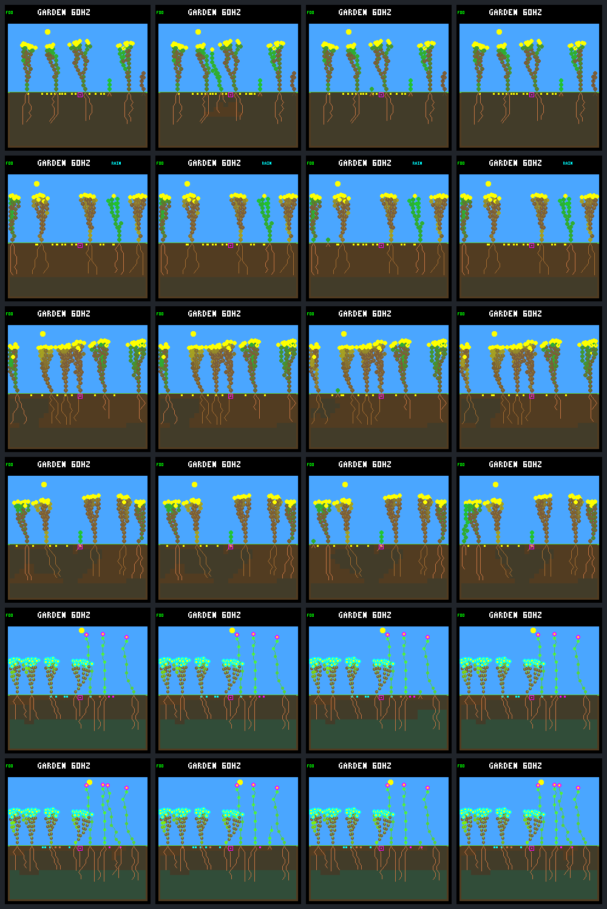

# Allocation challenge: matched seedlings, useful opposing controls

We now have a **six-case development challenge** with native checkpoint forks,
saved-model evaluation, resource ledgers and screenshots. No new controller was
trained, no scalar fitness chosen, and no ecology or firmware default changed.

The controls expose two shortcuts a future objective must avoid: **waiting can
preserve an unproductive seedling**, while **forcing an early root can either
rescue or damage the same kind of resource-limited plant**. The cases were chosen
from already inspected evidence; this is not held-out validation or an unbiased
estimate of how often a strategy wins.

## Exact comparison boundary

The [predeclared protocol](allocation-challenge-protocol.md) retains the targeted
root opportunity, all three rooted-water failures, the known energy tradeoff,
and the first later full-day survivor in that energy case's original history.

For each case, the native executable replays the frozen controller/environment
to **one ecology step before birth**, then copies the entire pointer-free world
in memory. All four continuations start with identical soil, weather, neighbors,
seeds, RNGs, memory and counters. The unchanged arm reproduces the frozen trace.
There is no reset, resource injection, hand-built seedling or disk snapshot ABI.

Only the selected seedling's growth controller changes from its first decision
onward. Neighbors and children keep the reference controller; selective mature
leaf maintenance and each case's night/energy guard remain intact. Other plants'
*states* can change through interaction, so this is not a claim of isolated
resources or a whole-population model evaluation. The learned model gets its
existing local features and memory, not the selector, future weather or world.

## Eight-day follow-up

Numbers below are age in **simulation days**, not wall-clock seconds. W/E mean
natural water/energy death. P means a scheduled patch killed the plant; follow-up
after that is patch-censored, not a starvation failure. “Alive” means alive at
the eight-day horizon. Root extension is an investment, not extra water.

| Case (selected soil column) | Reference history | Wet-root control | Always WAIT | Same NN, no bootstrap |
|---|---|---|---|---|
| Wet-root opportunity (12) | W 0.207 | P 4.590; **7 seeds** | P 4.590; 0 seeds | W 0.207 |
| Rooted water, baseline (3) | W 0.250 | W 0.250 | E 4.797 | W 0.219 |
| Rooted water, bank 8 (5) | W 0.258 | W 0.258 | Alive | W 0.180 |
| Rooted water, bank 16 (0) | W 0.316 | W 0.316 | Alive | **Alive; 15 seeds** |
| Energy tradeoff (22) | E 0.531 | E 0.375 | Alive | E 0.531 |
| Previously established control (22) | P 7.723 | **E 0.422** | P 7.723 | P 7.723 |

All other entries produce zero seeds. **No direct children germinate in any of
these 24 eight-day continuations**, including after parental death/reclamation.
Seed output is therefore evidence of resource acquisition and reproductive
spending, not successful recruitment or sustained descendants.

“Same NN” is the frozen model loaded through the candidate-model interface,
without the bootstrap on the selected seedling. It is not a newly trained model.
Three reference histories already have the bootstrap on; their wet-root arm
is intentionally a no-op. The three root-off histories reproduce exactly with
the same-model candidate. Each case retains its own guard and prefix; counts
must not be presented as independent replications or compared directly with the
previous eight-world panel's aggregate death rates.

### What the contrasts tell us

- **A survival-only target is insufficient.** WAIT survives the first day in
  6/6 cases, but makes zero root/shoot/finish purchases and zero seeds. Each
  reaches only its one automatically maturing initial leaf. One eventually dies
  of energy shortage, two are patch-censored and three remain alive at day eight.
- **Early versus eventual root growth matters.** In the bank-16 rooted-water
  case, removing the bootstrap delays the first root from birth to tick 637245,
  300 logic ticks later. That plant subsequently buys 18 root and 30 shoot
  extensions, produces 15 seeds and ends with energy 145/water 512. This is one
  matched opportunity, not evidence that delaying roots always helps.
- **Retain the adverse control.** Forcing the healthy flower's first root at
  birth replaces its ordinary first root 3000 ticks later. It dies from energy
  shortage at age 0.422 instead of reaching the fixed patch at 7.723. The initial
  proposal changes an entire trajectory; this does not attribute the death to
  the price of one root alone.
- **Useful investment is possible without more resources.** In the rescue
  case, wet-root and WAIT both reach the same patch. Wet-root reaches 27 active
  leaves and produces seven seeds; WAIT reaches one leaf and produces none.
  The earlier whole-population bootstrap produced five seeds for this lineage;
  seven here is a different, individual-only intervention, not a replay mismatch.

## Native visual review

Rows match the table. Columns: **reference / wet-root / WAIT / same-model**.
Each image is one day after that case's birth, so rows use different absolute
ticks and sun angles. Tiny unchanged WAIT plants are expected. These whole-world
views contain neighbors too; the table identifies the target's soil column.
The overlay's “60Hz” is the scene's simulation label, not a measured device FPS.

The bundle also contains all 96 native 240×240 images at birth, first future dawn,
day one and day eight, together with state hash and framebuffer CRC. Frame
callbacks run after ordinary ecology, **before a same-tick patch**; the ledger's
milestones use the post-patch state if there is one. The six-row contact sheet
was visually reviewed. Screenshots are not evidence of successful reproduction.

## Verification and scope

- **82 CTests pass:** default 40, experimental bank eight 21, bank sixteen 21.
  Strict warnings/UBSan, routing boundaries, error-output behavior, unchanged
  world/memory ownership, CLI rejection, feature/model identity, time boundaries,
  missing/reordered data, terminal clearing, child counting and firmware
  exclusion are checked. The C conventions skill guided the bounded host-only
  routing boundary; no `src/` changes belong to this work.
- **12,308 reference samples** match frozen full-world hashes and selected-plant
  telemetry. All four checkpoint states match within each case.
- **18,816 selected-plant live-step budgets** close exactly; terminal clearing is
  explicitly unaccounted. This is not an all-neighbor budget reanalysis.
- Each six-case run executes **24 arms with capture and 24 headless repeats**.
  All non-frame records are identical between capture on/off. All 96 raw frames
  have verified lengths/CRCs and the correct recorded world hashes.
- The first complete bundle used the parent's retained offspring counter. Code
  review found that it could miss germinations after reclamation. The accepted
  rerun records explicit child births; a regression fixture covers posthumous
  germination. All **49,366 native records match** the first run apart from the
  added census field, and all **96 raw frames are identical**. All child counts
  happen to remain zero. No controller, case, price, rain or action was tuned.

The accepted bundle is `artifacts/garden-allocation-v2` (229 artifacts, 396 source
fingerprints); `artifacts/garden-allocation-v1` is retained as the superseded
telemetry prototype. Neither was a model search. Bundle manifest SHA-256:
`a7cb927521ab5188a1a1622cbfda4ffdd9d930843403fcc9b3cbe43774f98738`.

[Compact results/provenance](allocation-challenge-summary.json) ·
[Reproduction and candidate-model usage](../../docs/garden-allocation-challenge.md).

## Next discussion

Use this suite to evaluate **productive persistence**, not to select a winner
by survival or seed count alone. We can now test saved candidate models from
identical births without changing their ancestors. Before wiring a search into
it, agree on a small objective experiment that keeps survival, productive growth,
reserves and recruitment separate in the report. Full-population behavior,
fresh development/validation seeds and longer descendant follow-up remain
separate requirements; these hand-picked cases must not become a final test set.
