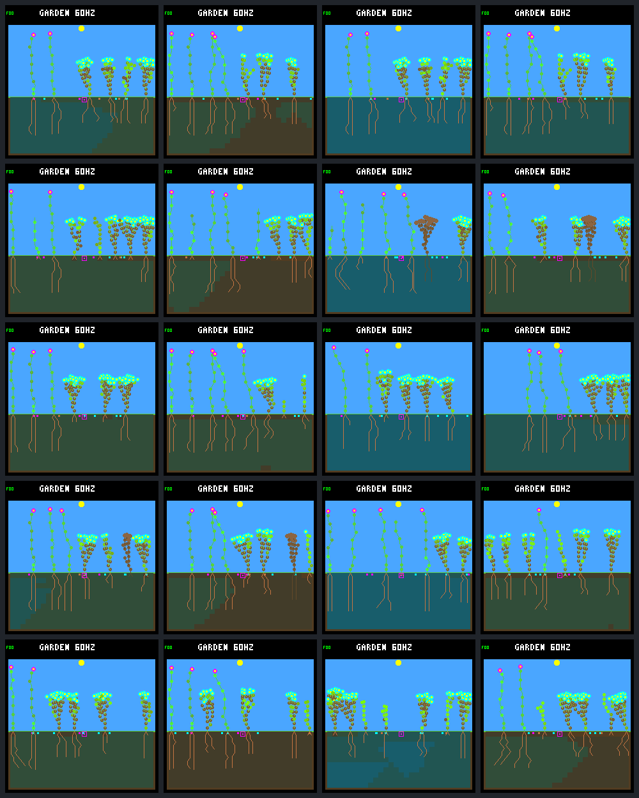
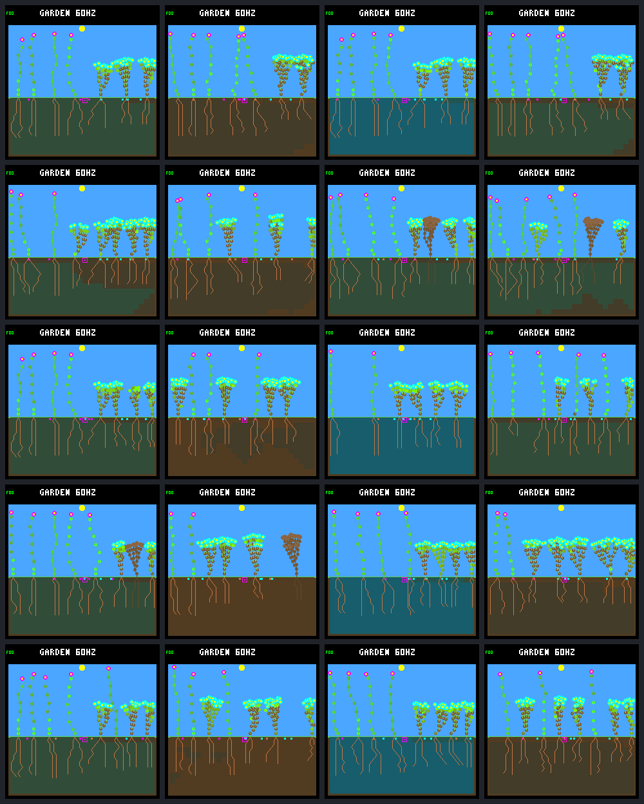
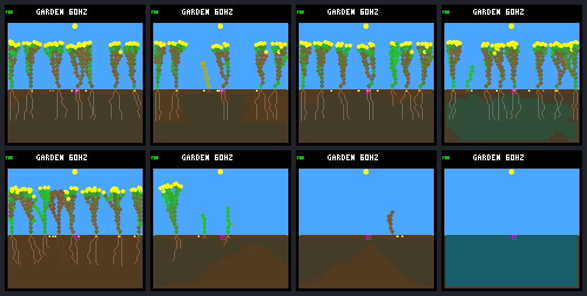

# Bottom-drainage A/B

Protocol fixed before collecting candidate outcomes, 2026-09-12. Follow-up to
the [water-budget audit](water-balance.md), not a rainfall or controller change.

## Fixed rule and panel

`bottom-drain-v1`: after ordinary downward/lateral transport and surface
evaporation, before root uptake, remove one water unit from each nonempty bottom
soil cell every 16 ecology steps (four simulated seconds). First eligible step
is 16. No minimum-moisture threshold, new RNG draws, per-cell timer, soil
capacity change or rescue watering. Maximum drainage is 28 units per event,
448 per Garden day (about 11% of recently measured offered rain). This rate is
chosen from the preceding budget, not candidate results, and will not be retuned
within this comparison. Drainage operates from startup, not only after day 16.

Explicit host-only build option, default off, requiring the existing combined
maintenance variant. No firmware promotion, training, age-counter change or
commit is included. On builds identify the rule in metadata and a hash tag;
off builds retain existing hashes and output. No authoritative world RAM is added.

Use all 160 prior starting-world/schedule/capacity combinations through 192 days:
eight exploratory seeds × two layouts × no disturbance/four existing schedules
× 256/512 nodes. Pair each drainage run with its frozen no-drainage world. The
same model `dc5e849d`, night-growth veto, selective renewal, rainfall, dispersal,
root uptake, schedules and seed/plant limits remain. No new seed selection or
held-out model-generalization claim. Replicate fresh-schedule labels, including
empty hits and unequal final-event follow-up, without targeting recovery.

## Measurements and acceptance

At days 64/128/192, compare the preceding 32-day windows and post-day-16 offspring:
births, eligible full-day survivors, durable parents, natural/environmental deaths,
total extinction, founder/species retention and trait combinations. A lower soil
stock is not sufficient: report paired harms as well as gains, especially dry
cases, with unchanged no-disturbance controls. Keep recent-birth censoring explicit.

The stage ledger separates directly measured drainage from transport/evaporation.
Check exact soil, plant and notional seed-account balances, drainage bounds,
root access, actual shortage exposures and depth profiles. Compare paired stock,
uptake, runoff, soil drift and survival distributions, not just means or visual
soil color. No invented equilibrium threshold or new scalar fitness objective.

Rebuild off/on variants. New off-budget rows must match the frozen prior ledger
exactly. Independently replay on-world population and water ledgers, matching
every daily hash, counters and event losses. Validate sparse/full census equivalence
and dry/full/one-unit/cadence boundaries. Freeze sources, model, binaries, commands,
inputs and analyses in completed SHA-256 bundles; no source edits during collection.

Visual review uses the same fixed `rainfed/9c530b07` world under all five schedules,
at days 16/64/128/192. Capture native candidate frames and verify against population
and water hashes; pair with frozen control images, without choosing best outcomes.

## Reproduction

Build the on variant with the existing maintenance flags plus the new opt-in:

```sh
docker compose run --rm firmware cmake -S sim -B artifacts/build-host-drainage-256 -G Ninja \
  -DTOY_FACTORY_GARDEN_WIDE_DISPERSAL=ON -DTOY_FACTORY_GARDEN_WATER_HEADROOM=ON \
  -DTOY_FACTORY_GARDEN_COMBINED_EXPERIMENT=ON -DTOY_FACTORY_GARDEN_LEAF_MAINTENANCE=ON \
  -DTOY_FACTORY_GARDEN_BOTTOM_DRAINAGE=ON -DTOY_FACTORY_GARDEN_LARGE_POOL=OFF \
  -DTOY_FACTORY_SIMULATOR_SANITIZERS=ON
docker compose run --rm firmware cmake --build artifacts/build-host-drainage-256
python3 sim/garden_drainage.py \
  --baseline artifacts/garden-water-budget-256 \
  --population-bundle artifacts/garden-disturbance-longevity-256 \
  --off-build artifacts/build-host-leaves-256 \
  --on-build artifacts/build-host-drainage-256 \
  --output artifacts/garden-bottom-drainage-256 --jobs 4
```

Repeat with `512` suffixes and `TOY_FACTORY_GARDEN_LARGE_POOL=ON`. Off builds
must retain `TOY_FACTORY_GARDEN_BOTTOM_DRAINAGE=OFF`. Collect into new directories.
Both builds and the baseline manifest chain are frozen; rejected or interrupted
runs lack a complete manifest. The native comparison sheet columns are off/on
at day 64, then off/on at day 192; all four declared ages are saved individually.

Recorded before collection: all 80 tests pass (30 normal, 16 per off capacity,
9 per on capacity), including dry/full/one-unit/cadence checks, audit-on/off world
equality, full/sparse census agreement, water balances and environment-label
rejection. Candidate builds run their own drainage fixtures rather than the old
ecology's frozen population expectations. Candidate outcomes below were added only
after both source-frozen collectors completed.

## Results — 2026-09-12

Drainage lowers day-192 soil water in **152/160 paired worlds**, but does not
uniformly improve survival, coexistence or late water equilibrium. All 80
256-node worlds end drier; eight 512-node worlds end wetter, including one that
goes extinct and then accumulates rain without plant uptake. Keep the rule
host-only: this is a useful perturbation, not a qualified replacement ecology.

Each world runs 192 Garden days (737,280 logic ticks, 49,152 ecology steps).
A Garden day is 64 simulated seconds, not one logic/physics update. The tables
separate 16 undisturbed controls from 64 fresh-schedule runs at each capacity.
The latter reuse 16 starting worlds across four schedules, not 64 independent
world seeds. All numbers below are off → on.

### Water storage and transfers

Closing rates are means per world per Garden day over days 160–192. Actual cell
totals, not the saturated 16-bit display summary, give final soil stock.

| Nodes / group | Final soil stock | Drain/day | Uptake/day | Runoff/day | Evaporation/day | Net soil change/day |
| --- | ---: | ---: | ---: | ---: | ---: | ---: |
| 256 / control | 68,478 → 31,380 | 0 → 448.0 | 1,797 → 1,772 | 422 → 32 | 1,775 → 1,719 | +144 → +167 |
| 256 / fresh | 58,603 → 22,329 | 0 → 447.9 | 1,963 → 1,974 | 201 → 23 | 1,767 → 1,590 | +206 → +101 |
| 512 / control | 35,260 → 16,601 | 0 → 436.2 | 2,367 → 2,237 | 84 → 47 | 1,553 → 1,353 | +134 → +65 |
| 512 / fresh | 30,058 → 16,944 | 0 → 436.7 | 2,487 → 2,288 | 109 → 41 | 1,458 → 1,299 | +83 → +71 |

Offered rain is unchanged at 4,138 units/day in all four groups. Soil germination
costs remain small (fresh: 1.44 → 1.58/day at 256; 2.55 → 2.61 at 512).
The accounting closes before rounding. Drainage partly substitutes for runoff
and evaporation, and altered populations change uptake. It cannot simply be
subtracted from the old net gain to predict a new equilibrium. The 256 controls
illustrate this: substantially less stored water, but a larger closing gain.

Mean final stock falls 62%/44% in disturbed 256/512-node worlds. Paired stock
changes are lower/same/higher in 64/0/0 and 57/0/7 disturbed worlds respectively;
controls are 16/0/0 and 15/0/1. These means are not an equilibrium claim.

Water-shortage flags occupy a mean 0.00676% → 0.02484% of living-plant samples
per disturbed 256-node world; worlds with any closing exposure rise 6 → 18/64.
At 512, the means are 0.05299% over 64 off worlds and 0.09905% over 63 nonempty
on worlds, with exposure in 29/64 → 47/63. The extinct world has no living
samples in this window: its fraction is **undefined, not zero**. These are
means of per-world fractions, not pooled plant-time rates. Maximum on-world
fractions are 0.220%/0.470% at 256/512. Dry-root sample fractions also rise
(fresh means 0.559% → 3.129%, and 4.237% → 8.517% with the same exclusion).
Dry root contact does not itself establish whole-plant water starvation.

### Survival and turnover

Closing offspring are born during days 160–192. Eligible offspring have at
least one full Garden day of possible follow-up; survivors lived at least that
long, not necessarily until day 192. A durable parent both survives a day and
has a child that survives a day. Recent births are censored, not failures.

| Nodes / group | Worlds with closing births | Closing births | Day survivors / eligible | Durable parents | Final living | Total extinction |
| --- | ---: | ---: | ---: | ---: | ---: | ---: |
| 256 / control | 0 → 0 / 16 | 0 → 0 | 0/0 → 0/0 | 0 → 0 | 106 → 103 | 0 → 0 |
| 256 / fresh | 64 → 63 / 64 | 245 → 270 | 224/232 → 225/254 | 12 → 14 | 426 → 427 | 0 → 0 |
| 512 / control | 2 → 2 / 16 | 4 → 9 | 1/4 → 6/9 | 0 → 0 | 123 → 122 | 0 → 0 |
| 512 / fresh | 64 → 63 / 64 | 435 → 445 | 281/420 → 268/429 | 20 → 15 | 480 → 469 | 0 → 1 |

Recent disturbed births: 256 off/on have 13/16 still alive; 512 off has 14 alive
and one dead, on has 13 alive and three dead. None enters the eligible count.
The rate of full-day survival falls 96.6% → 88.6% at 256, 66.9% → 62.5% at 512.
Thus more births do not establish more successful replacement.

The preceding 32-day cohorts at days 64/128/192 show the trajectory, not only
the endpoint:

| Nodes / disturbed cohort ending | Off day survivors / eligible | On day survivors / eligible | Off → on durable parents |
| --- | ---: | ---: | ---: |
| 256 / 64 | 180/188 | 192/213 | 14 → 23 |
| 256 / 128 | 244/265 | 236/260 | 21 → 27 |
| 256 / 192 | 224/232 | 225/254 | 12 → 14 |
| 512 / 64 | 298/403 | 265/474 | 26 → 28 |
| 512 / 128 | 322/477 | 294/515 | 37 → 43 |
| 512 / 192 | 281/420 | 268/429 | 20 → 15 |

Across all post-day-16 disturbed offspring, day survivors / eligible are
1,320/1,404 → 1,378/1,533 at 256 and 1,751/2,495 → 1,661/2,833 at 512;
durable parents are 437 → 469 and 546 → 576. The larger cumulative parent
count at 512 coexists with fewer late durable parents and one extinction.
Historical reproduction is not the same as continuing viability.

At 256, paired closing survivor counts decrease/tie/increase in 27/16/21 worlds;
at 512 the split is 24/16/24. Durable-parent splits are 9/46/9 and 12/40/12.
Closing natural deaths rise 19 → 48 at 256, and 189 → 190 at 512; environmental
deaths are 223 → 224 and 253 → 242. The schedules stay fixed, but different
populations can occupy the same death patches.

### Variety

Extant families/species include living plants and the seed bank; inherited
trait combinations below count living plants only.

| Nodes / disturbed worlds | Mean families | Mean species | Mean trait combinations | Single-family worlds | Single-species worlds |
| --- | ---: | ---: | ---: | ---: | ---: |
| 256 | 1.578 → 1.750 | 1.516 → 1.656 | 5.594 → 5.641 | 27 → 16 | 31 → 22 |
| 512 | 1.781 → 1.766 | 1.672 → 1.594 | 6.141 → 5.828 | 17 → 16 | 22 → 24 |

The 512 on means include the extinct world's zeros, but its zero families/species
are not counted as "single". Paired family counts decrease/tie/increase in
6/41/17 worlds at 256 and 11/41/12 at 512; species counts in 6/43/15 and 13/42/9.
Controls also lose some variety: family means 2.625 → 2.563 and 2.500 → 2.250;
species means 2.188 → 2.125 and 2.063 → 1.875. No broad coexistence win follows.

## Native visual review and failure case

Fixed review world `rainfed/9c530b07`: rows are control, fresh-1, fresh-2,
fresh-3, fresh-4; columns are **off day 64, on day 64, off day 192, on day 192**.
These are shared-renderer host captures, not photographs of flashed firmware.





A separately labeled **post-hoc failure review**, not a predeclared or best-world
selection, follows `512/rainfed/b61837dc/fresh-2` (`36.fresh-2`). Rows are off/on;
columns are days 64, 112, 119, 192. The dead stem visible at day 119 is not a
living survivor.



The drainage run has zero living plants by day 119 and first daily observation
of no plants **or seeds** at day 120. Its last living plant dies at day 118.828125;
the last patch that killed a plant was day 99.08984375. The final eleven natural
deaths carry energy-shortage flags, not water-shortage flags; the immediately
preceding death carries a water-shortage flag. Do not label the entire collapse
"drought" from soil color alone. Resource/action-level diagnosis is still needed
to connect altered water availability, architecture and energy failure.

By day 192 it has 131 historical births and maximum generation 19, but no living
plants/seeds; the off world has 71 births, eight living shrubs and eight seeds,
maximum generation seven. Soil water rebounds from 374 at day 64 to 76,328 at
day 192 once plants disappear. More generations, births, or wetter final soil
would each give a misleading standalone verdict here.

Wetter soil can also accompany survival. In `512/42.control`, both runs end with
eight plants and the same birth/death totals, but off retains three species and
357 nodes while on has only flowers and 288 nodes. The on world's lower uptake
leaves 74,517 soil water versus 26,074 off despite ongoing drainage. This is
population feedback, not a failed water ledger.

## Verification and provenance

- All 80 tests pass: 30 normal, 16 per off capacity, nine per on capacity.
  Candidate builds use UBSan and strict warnings. Formatting and diff checks pass.
- All 30,880 freshly replayed off daily rows match the frozen water audit exactly.
  All 30,880 on daily water/population hashes, births and seed counts agree;
  offered rainfall and disturbance-boundary losses reconcile throughout.
- Off/on water tools check 15,728,640 ecology steps in total. Independent
  population replays are verification, not additional independent experiments.
- Forty new predeclared native frames match their state hashes and framebuffer
  CRCs, paired with 40 verified frozen off frames. Eight additional post-hoc
  failure frames match their corresponding daily census hashes and CRCs.
- Both collectors completed without source/input changes. Every artifact digest
  was rechecked afterward: 856 files per main bundle, 29 in the failure review.

Completed local ignored bundles and manifest SHA-256:

| Bundle under `artifacts/` | Manifest SHA-256 |
| --- | --- |
| `garden-bottom-drainage-256` | `674e37ab81bd253f73ac06c3fe10c650d89453dcce333445633b8aa698de14da` |
| `garden-bottom-drainage-512` | `ad0767f35e3d71a80f47b03dc66b1a57d24c487f323a04a58a9e33e89e1693be` |
| `garden-drainage-failure-review` | `5c2b197097139c1279f00b3292135229eb1c5292be99600fab7c86e5bd1fa289` |

Main bundles freeze the source archive, both build caches, model, binaries,
baseline manifest chain, commands, daily ledgers, population traces, paired
analyses and native images. The failure bundle freezes its binaries/model,
commands and frame outputs and references the baseline manifest and trial-start
fingerprint. This results text and copied repo images were added after collection.
The collector's per-arm water summary omits fractions when any world has no
denominator; use individual water analyses for the explicitly counted valid-world
means above. The paired summary preserves undefined-pair counts.

## Interpretation and proposed next decision

The sink works and the old rule remains unchanged, but the ecology responds
through several feedbacks. The 256-node disturbed panel keeps similar survivor
counts and more family/species variety; the 512 panel has poorer late survival,
less species variety and a new failure. Neither is a universal improvement.
Rare extinction is not automatically unacceptable for A-life, and survival of
one frozen controller is not an environmental impossibility test.

Before tuning the rate or selecting the rule, discuss a bounded policy/resource
diagnostic: trace the failure's energy/water/action history and compare an explicit
adaptive/reference policy under the same off/on conditions. This can distinguish
controller weakness from inadequate observations/actions or harsh ecology. Fix
the separately noted plant-age boundary before extending beyond 192 days toward
256. No additional policy, training, age fix, device deployment, permanent rule
or commit was made in this experiment.
