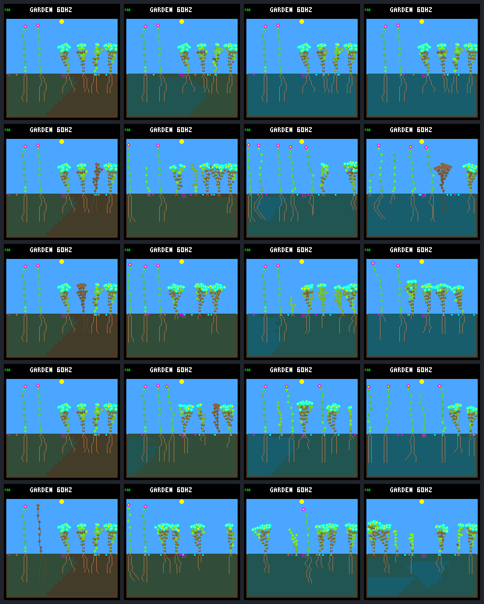
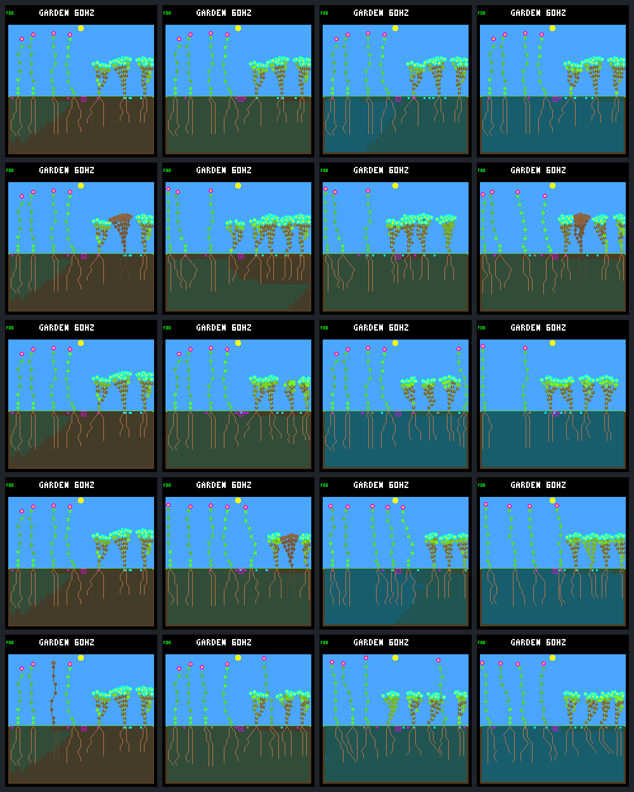

# Recurring disturbance: longevity and diversity

Predeclared 2026-09-12, before observing this panel. This extends
[patch-death-v1](patch-disturbance.md), not the ecological rules or controller.

## Fixed design

- 192 Garden days (737,280 logic ticks): three times the earlier horizon.
  Plant age is currently an unsaturated 16-bit ecology counter; 256 days could
  wrap it. Stay below that boundary for this unchanged-ecology comparison and
  track the defect separately before longer runs. Do not change age semantics here.
- Same 16 starting worlds: eight existing weather/world seeds × two layouts,
  at 256 and 512 nodes. Freeze the same model, nighttime veto, selective leaf
  renewal, wide scattering and water headroom. Gardener/irrigation remain off.
- One untouched control and four fresh environmental schedule seeds:
  `e4d65e6f`, `17c29444`, `42b9cb9c`, `f1fb8012`. These are the existing
  `evaluation-trial-seed-v1` derivation from fixed base `6c6f6e67`, indices 0–3.
  All schedules begin at day 16,
  then use the existing 4–8-day interval and small balanced-edge patch rules.
  Continue the same stateless schedule formula past day 64, without reseeding,
  filtering for hits, protecting columns or changing disturbance intensity.
- 160 unique trajectories total (32 controls, 128 disturbed). Daily observations
  and checkpoints at days 16/64/128/192 are repeated observations of each trajectory,
  not independent runs. Weather/world seeds remain exploratory; only these
  environmental seeds are fresh. No held-out model-selection claim.

Pre-run amendment: the initially written consecutive seeds `6c6f6e31`–`6c6f6e34`
were replaced **before collecting any frozen-model panel outcomes**. Inspection
of the schedule formula showed that XORing nearby seeds with the event index
creates related/permuted hash-input sequences. Use the fixed seed derivation above
to spread their input domains, without changing the generator or screening
schedules for hits, coverage or garden success. This also limits how much
independent-schedule evidence the earlier consecutive-seed panel provides.

## Measurements and evidence

Collect exact birth/death/event boundaries plus daily full world snapshots using
a host-only population-census mode. Preserve pre/post-event states separately.
Check cumulative counters, immutable lineage/trait identity, live ages and parent
links. Include dormant bank seeds when measuring retained ancestry/species;
absence of living plants alone is not family/species extinction.

Daily metrics: living/seed counts; living and extant (living + bank) species and
founder families; plant-count family dominance; inverse-Simpson effective family
number; unique living species/trait-vector combinations. These are different
definitions of variety, not interchangeable measures of neural-controller diversity.
All plants still use the same frozen NN and scripted renewal rule.

At days 64/128/192, measure cumulative post-day-16 offspring, full-day survival and
parents with a full-day-surviving child, plus the preceding 32-day birth cohort.
Use only follow-up available at each endpoint; report recent births as censored.
Report sustained closing births, extinction, ancestral/species losses and per-world
distributions, not just pooled species presence or a single fitness score.

Freeze sources, model, binaries, build cache, exact schedules/commands, compressed
censuses, boundaries and analyses with a completed SHA-256 manifest. Controls must
match the old 64-day frozen census at every emitted checkpoint; disturbed prefixes
must match through the pre-event day-16 step. Independently replay day 64/128/192
hashes and counters. Compare sparse mode against full ecology output in tests.

This panel is a population/diversity audit, not a new exhaustive per-ecology resource
budget or seed-identity ledger. The preceding 64-day experiment supplies those
full-resolution checks. No sparse-sample claim about sub-day resource exposure.

Native screenshots: fixed `rainfed/9c530b07`, control and all four schedules,
at days 16/64/128/192. No retrospective best-world selection.

Family/species extinction timing is observed daily: the census does not emit
every seed-bank expiry, so first observed disappearance is bounded by those
samples, not an exact sub-day extinction timestamp. Bank presence means potential
continuity, not guaranteed successful germination.

## Reproduction

Rebuild the two existing host leaf-maintenance variants using the flags in the
[64-day protocol](patch-disturbance.md#reproduction), then run each capacity into
a new output directory:

```sh
python3 sim/garden_diversity.py \
  --bundle artifacts/garden-patch-disturbance-256 \
  --build artifacts/build-host-leaves-256 \
  --output artifacts/garden-disturbance-longevity-256 --jobs 4
```

Replace all three suffixes with `512` for the other capacity. No source edits
during collection. A completed manifest is required before using results.
The new `--population` inspector mode is host-maintenance-only and mutually
exclusive with detailed trace/seed-site modes and lineage overrides. It changes
observation frequency, not simulation stepping or controller decisions.

## Results

Completed all 160 trajectories. Each covers 3 h 24 min 48 s of simulation time.
Recurring disturbance sustains replacement through this longer horizon, but
does not preserve founder/species diversity reliably. No world was extinct at
any daily observation or final checkpoint. This is finite-horizon evidence,
not proof of indefinite persistence or a qualified training environment.

The closing window below is **days 160–192**, not the preceding report's
days 48–64. A survivor lived at least one complete Garden day; eligible births
have that much possible follow-up at the endpoint. Counts are summed over
worlds; family/species means are per world, including dormant bank seeds.

| Nodes | Arm | Worlds with closing births | Closing births | Full-day survivors / eligible births | Mean extant families | Mean extant species | Single-species worlds |
| ---: | --- | ---: | ---: | ---: | ---: | ---: | ---: |
| 256 | Control (16 worlds) | 0/16 | 0 | 0/0 | 2.625 | 2.188 | 2/16 |
| 256 | Fresh schedules (64 worlds) | 64/64 | 245 | 224/232 | 1.578 | 1.516 | 31/64 |
| 512 | Control (16 worlds) | 2/16 | 4 | 1/4 | 2.500 | 2.063 | 3/16 |
| 512 | Fresh schedules (64 worlds) | 64/64 | 435 | 281/420 | 1.781 | 1.672 | 22/64 |

The disturbed closing cohorts have 28 births without a full day of possible
follow-up: 27 still alive, one already dead. Those are explicitly separate from
the 652 eligible births, not assumed successful or silently dropped.
127/128 disturbed worlds have a full-day survivor from the closing cohort.
Only 32 closing-cohort plants, in 26 worlds, have already both survived a day
and produced a day-surviving child. Across all post-day-16 births, the disturbed
worlds have 3,927 offspring, 3,071/3,899 eligible day survivors and 983 such durable
parents. These cumulative successes do not imply that all are still alive.

The longer horizon is not just the same static adults surviving:

| Nodes | Endpoint day | Disturbed worlds with births in preceding 32 days | Mean extant families | Mean extant species |
| ---: | ---: | ---: | ---: | ---: |
| 256 | 64 | 50/64 | 2.172 | 1.938 |
| 256 | 128 | 63/64 | 1.859 | 1.688 |
| 256 | 192 | 64/64 | 1.578 | 1.516 |
| 512 | 64 | 62/64 | 2.219 | 1.875 |
| 512 | 128 | 64/64 | 2.063 | 1.781 |
| 512 | 192 | 64/64 | 1.781 | 1.672 |

### Variety is not one metric

By day 192, 53/128 disturbed worlds retain only one species and 44/128 only
one founder family (controls: 5/32 and 3/32). Relative to just before the first
event, 77/128 lose at least one family and 59/128 lose a species; only one control
does either. Species/family retention declines even while replacement continues.
The largest living family averages 83.3% of plants at 256 nodes and 77.2% at 512,
versus 59.3% and 58.6% in controls. Extra tissue capacity helps some outcomes;
it does not prevent this concentration in a world still limited to eight plants.

That is **not** a collapse to genetically identical plants. The mean number of
distinct living species/eight-trait-vector combinations is 5.594 at 256 nodes
and 6.141 at 512, compared with 5.000 and 6.000 in controls. These are observed
trait combinations, not a measure of functional distance, successful adaptation
or NN diversity. All plants use the same frozen controller. Inherited traits can
mutate, while species and founder ancestry cannot reappear once their last plant
and bank seed are lost. Whether persistent species coexistence is required, or
variety within a surviving species is acceptable, remains a design decision.

### Schedule and interpretation limits

The fixed schedules each contain 30 events: fresh-1/4 expose all 28 ground
columns at least once; fresh-2 leaves columns 8/23 untouched and fresh-3 leaves
18/19 untouched within this finite horizon. They were not resampled to eliminate
these chance refuges; no column is protected by the generator. Across repeated
worlds, 2,670/3,840 events hit at least one living plant; empty hits remain real
events. Schedules are shared among starting worlds, so these are paired,
correlated exploratory observations, not 128 independent environmental draws.

The last event precedes day 192 by 8, 37.5, 169.25 and 275.5 simulated seconds
for fresh-1 through fresh-4 respectively. Last-frame living counts and recent
offspring have unequal recovery time. The dead body in the fresh-1 final image
is only eight seconds old, not evidence of failed corpse reclamation. The
closing-window cohorts and longer progression are more informative than ranking
the last screenshots. Nothing here changes disturbance intensity, retargets an
empty patch, trains a model, or promotes the experimental rules to firmware.

### Secondary observation: long-run soil wetting

This was noticed during visual review, **not a predeclared primary outcome**.
Actual cell totals show accumulating soil water in many worlds. The total
storage capacity is 78,540 units (308 cells × 255):

| Nodes | Arm | Mean soil water at day 16 | Day 64 | Day 128 | Day 192 | Final worlds above 65,535 |
| ---: | --- | ---: | ---: | ---: | ---: | ---: |
| 256 | Control | 12,408 | 35,597 | 61,206 | 68,478 | 13/16 |
| 256 | Fresh schedules | 12,408 | 31,576 | 49,717 | 58,603 | 30/64 |
| 512 | Control | 8,976 | 18,947 | 28,793 | 35,260 | 5/16 |
| 512 | Fresh schedules | 8,976 | 18,305 | 26,812 | 30,058 | 13/64 |

Final individual totals reach 75,901 and 75,853 at the two capacities (about 97%
of total storage). Not all worlds are wet: disturbed minima are 24,466 and 6,967.
Exactly-full cells are absent at these four fixed-phase samples; that does not
exclude saturation/runoff during rain at other times. These totals use the
inspector's 32-bit `soil.water`, not `world.moisture_total`, which deliberately
saturates at 65,535 rather than wrapping. That capped summary can mask additional
accumulation but does not cap the underlying cell storage.

Source inspection shows rain filling the surface, vertical/lateral redistribution,
and surface evaporation; `update_moisture()` has no bottom-drainage term. Plant
uptake and other lifecycle transfers also matter. This sparse population audit
does not establish a complete water budget or attribute diversity losses to
water. A matched long-run water-budget audit is a sensible next investigation
before deciding whether rain, losses, or resource-pressure mechanics need changes.

### Native visual review

Both sheets use the preselected `rainfed/9c530b07` world, not a best result.
Rows: control, fresh-1, fresh-2, fresh-3, fresh-4. Columns: days 16, 64, 128, 192.
Day-16 disturbed frames include the first event. Pixels come directly from the
production renderer; each raw RGB565 frame has a checked state hash and CRC.

256 nodes:



512 nodes:



For example, the bottom-right 256-node world has one ground-cover founder family
but six distinct trait combinations among seven living plants. Its 512-node pair
retains two families/species and seven trait combinations among eight plants.
This selected example illustrates why visual and numerical definitions of variety
need to be kept separate; panel statistics above supply the comparison.

## Validation and provenance

- 58 host CTests passed: 30 normal, 14 per experimental capacity, under strict
  compiler warnings and UBSan; changed C/header files pass the formatter.
- Full-versus-sparse tests compare complete emitted world JSON, birth/death
  identity, event boundaries and lifetime cohorts, including bank-seed species.
  Long-horizon fixtures cover both capacities and invalid/contradictory CLI input.
- 44,678 census rows and all 3,840 pre/post-event boundaries validated. The 6,801
  comparable frozen-prefix rows match the old panel exactly. All 480 independent
  milestone replays match hashes/counters; all 40 native frames verify.
- Both completed manifests verify every one of their 569 artifacts. Inputs,
  source state and binaries remained unchanged throughout collection. The
  archived report is the pre-result protocol; this results section was written
  only after collection completed.

Local, ignored bundles (not uploaded by these notes):

| Nodes | Bundle | Manifest SHA-256 |
| ---: | --- | --- |
| 256 | `artifacts/garden-disturbance-longevity-256` | `51242185f77f7b4d1204095180d7fd805cf4f85da213cf2749297ae934c5fff7` |
| 512 | `artifacts/garden-disturbance-longevity-512` | `541d358133d87a1b1ede843b25160154957b8d755936e7791ea8328c9018c5bd` |

Each includes `summary.json` distributions, per-world daily population and
lineages, exact schedules/commands, compressed censuses, independent replays,
native frames, model and source archive. The frozen model remains CRC `dc5e849d`,
SHA-256 `bd9f9c6ba7f5fd17309f917972da5f759c305c077798e1d4ba9a52701e2cd48b`.

Before extending past 256 days, fix/test the unsaturated `uint16_t` living-plant
age increment in `garden_world.c`. It wraps after 65,536 ecology steps and can
invalidate age telemetry/establishment checks. The current NN does not consume
that age field directly, but that is not a reason to permit the counter defect.
This comparison deliberately stops at 49,152 ecology steps and leaves the
ecology unchanged. No commit, training run or device flash accompanies it.
