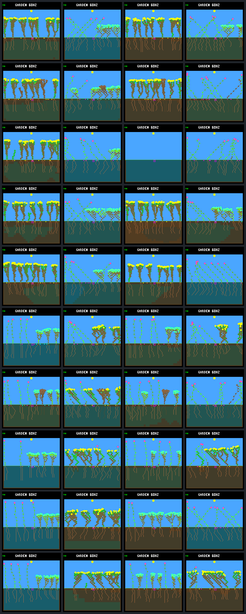

# Drainage policy/resource diagnostic

Protocol fixed 2026-09-12 before collecting adaptive outcomes. Follow-up to the
[bottom-drainage A/B](bottom-drainage.md), not a new water-rule or training trial.

## Question and fixed comparison

Does the existing adaptive growth reference fare differently from frozen neural
model `dc5e849d` under the same environment? First explain the neural failure's
observed resource spending; do not assume that its terminal energy flag proves
the original cause. A reference failure cannot establish environmental impossibility.

Use the existing `picosystem_garden_agent_adaptive_policy()` without tuning,
wrapped in the same `no-night-growth-v1` veto. Both policies retain selective
leaf renewal, identical observations/actions, startup resources, rainfall,
dispersal, uptake and patch schedules. No gardener, policy switch mid-run,
extra observations, new seed selection, rescue or drainage-rate adjustment.
Name the reference `adaptive-no-night-growth`; it has no NN model artifact.
Recurrent memory and arbitration remain those of each base controller. The
reference also has its own growth/reserve heuristics, not just a replacement
neural weight matrix.

Focused panel: 512 nodes; `rainfed/b61837dc` (post-hoc failure selection) and
`rainfed/9c530b07` (the prior fixed visual-review world), each under control and
fresh-1/2/3/4; both policies, both off/on drainage settings. Forty 192-day runs,
not forty independent seeds. No broad or held-out qualification claim.

Every new neural daily population hash/counter must match its frozen old case.
For all runs, independently replay day-64/128/192 outcomes and compare state
hashes; retain birth/death/event boundaries and 32-day/cumulative offspring
cohorts, extinction, family/species/trait retention and actual soil totals.
Preserve native final frames for every case, including failures. Check model
identity, policy labels and framebuffer CRCs. Report all arms, not only winners.

For the failed world/fresh-2, retain full ecology and decision traces for all
four policy/drainage combinations through day 128, including pre/post patch
boundaries. Reconcile live-step income, upkeep, growth, reproduction and renewal;
keep natural terminal-step cleared income explicitly unaccounted. Trace selected
lineages' stores, stress, body/tips, shortage flags and decisions before death.
Do not reconstruct erased terminal income as if it were measured. Detailed and
sparse daily hashes must agree, and observation must not change the result.

Tests cover adaptive/no-veto equivalence before first sunset, nighttime action
veto, full/sparse/native replay equality, policy identity, environmental boundaries,
live-step accounting, and rejection of incomplete/tampered traces. Sources,
commands, binaries, input manifests/model, analyses and frames are frozen into a
completed SHA-256 bundle only if all checks pass. No source edits while collecting.

Interpret as diagnostic evidence, not a new fitness score or a tuned winner.
Keep all changes host-only and uncommitted. Do not extend past the known plant-age
boundary, promote defaults, flash or train in this step.

## Reproduction

Use the off/on 512-node host builds from the preceding drainage report, rebuilding
the inspector/replayer after adding the adaptive wrapper:

```sh
docker compose run --rm firmware cmake --build artifacts/build-host-leaves-512
docker compose run --rm firmware cmake --build artifacts/build-host-drainage-512
docker compose run --rm firmware ctest --test-dir artifacts/build-host-leaves-512 --output-on-failure
docker compose run --rm firmware ctest --test-dir artifacts/build-host-drainage-512 --output-on-failure
python3 sim/garden_policy_diagnostic.py \
  --baseline artifacts/garden-bottom-drainage-512 \
  --off-build artifacts/build-host-leaves-512 \
  --on-build artifacts/build-host-drainage-512 \
  --output artifacts/garden-drainage-policy --jobs 4
```

Output directories must be new. Only a completed manifest qualifies as a run;
failures retain partial files and `failure.json`. The diagnostic is separate
from generation selection/training, and does not change the existing controller.

## Results — 2026-09-12

All 40 runs completed. The existing adaptive reference survives the previously
failed drainage case through day 192, so this particular environment is not
unconditionally lethal. However, the reference changes architecture and species
composition from startup and does not uniformly improve turnover. This is not
a controlled rescue of an already failing neural-grown body or a qualified
replacement controller.

### The failed world

`rainfed/b61837dc/fresh-2`, 512 nodes, unchanged weather and patch schedule:

| Drainage / policy | Final living / seeds | Historical births | Maximum generation | Closing day survivors / eligible | Final living species |
| --- | ---: | ---: | ---: | ---: | --- |
| Off / neural | 8 / 8 | 71 | 7 | 8/12 | Shrub |
| Off / adaptive | 7 / 8 | 31 | 5 | 3/3 | Flower, ground-cover |
| On / neural | 0 / 0 | 131 | 19 | 0/0 | None |
| On / adaptive | 7 / 8 | 29 | 4 | 3/3 | Flower |

Closing means offspring born during days 160–192, not every historical birth.
The off-neural case also has one recent living offspring not yet eligible.
The on-adaptive world has three late full-day survivors but no late durable
parent; its post-day-16 cohort has 17/18 full-day survivors and five durable
parents. This is evidence of survival and replacement within this horizon,
not proof of indefinite succession or coexistence.

### What the resource trace establishes

The on-neural population's final eleven natural deaths carry energy-shortage
flags. Nine larger plants end with 58–73 nodes; the last two seedlings have
11 nodes each. Water at their last living samples ranges from 94 to 512, so
this terminal sequence is not simply plants running out of stored water.

A particularly clean example is lineage **126**:

- Born day 113.8671875; dies day 116.734375, shortly before dawn.
- At its final sunset: 72 nodes, 55 active leaves, no growth tips, 212 energy,
  505 water and zero stress.
- From the post-sunset snapshot through its last living sample, measured energy
  income is zero. Growth, renewal and reproduction spending are all zero.
  Maintenance consumes all 212 energy; water uptake is 217 versus 210 upkeep.
- Its last living sample has zero energy, full 512 water and stress seven.
  The next maintenance step reaches the death threshold. Cleared terminal-step
  income is not reconstructed.
- Over its last 256 living samples, daylight energy income is 2,079, of which
  1,300 is discarded at the 256-energy cap. Measured spending is 460 upkeep,
  224 growth and 96 reproduction; renewal is zero.

This is a timing/storage and body-maintenance failure, not a lack of total
daylight production. Production code charges `ceil(nodes/8)` energy each second.
A 72-node body needs nine per debit; the 32-second night contains 32 maintenance
debits, nominally 288 energy with no growth. That exceeds the 256 storage cap.
This is **not a hard maximum viable body size**: stress tolerates some shortages,
starting stores and prior stress vary, and dusk/dawn production also matters.
Here the observed 212-energy sunset reserve is exhausted soon enough for eight
shortage maintenance steps to kill the plant before dawn.

Other terminal adults show the same pattern: sunset reserves of 202–216 energy,
large bodies, little or no post-sunset income, and no overnight growth spending.
Lineage 128 performs one paid extension after dawn, not during the vetoed night.
The veto is functioning; it does not stop daytime growth from raising future
maintenance costs. Renewing leaves is not the immediate drain in these examples.

The last seedlings expose a related reserve problem, without oversized bodies:

| Lineage | Born → died (day) | Lifetime measured income | Growth cost | Upkeep paid | First sunset energy | Final living water |
| --- | --- | ---: | ---: | ---: | ---: | ---: |
| 134 | 118.125 → 118.484375 | 18 | 56 | 26 | 15 | 94 |
| 133 | 118.12109375 → 118.828125 | 64 | 56 | 72 | 59 | 168 |

Both start with the ordinary 64 energy, make seven extensions, spend nothing on
renewal or seeds, and die of energy shortage. Their measured live-step accounts
close exactly (64 + income = growth + upkeep); this excludes the final cleared
death step. Neither has enough initial sunset reserve for its observed subsequent
maintenance. The trace establishes spending and income, not how well an
alternative action would have improved light access or survival.

The preceding lineage 125 really does die with water shortage (13 nodes, two
roots, full energy, zero water). Earlier water constraints and changed lineages
therefore still matter. The last lethal patch is day 99.08984375, well before
the terminal collapse. We have isolated the proximate energy failure, **not**
the complete chain from draining soil to that population's architecture/genomes.

The adaptive reference's final on-drainage plants are flowers with 29–37 nodes,
versus the large terminal neural shrubs. It keeps the same growth observations,
night veto and leaf policy, but its existing reserve checks and candidate/all-tip
priorities produce different bodies and descendants. This policy comparison
does not isolate any one adaptive heuristic as the cause of success.

### Whole focused panel, including regressions

The eight disturbed runs per row reuse two world seeds under four schedules;
they are not eight independent seed trials. Full-day survivors lived past their
one-day boundary, not necessarily until the final checkpoint. Durable parents
also have a child that lived a full day.

| Policy / drainage | Closing births | Closing day survivors / eligible | Closing durable parents | Post-day-16 survivors / eligible | Post-day-16 durable parents | Final living | Extinction |
| --- | ---: | ---: | ---: | ---: | ---: | ---: | ---: |
| Neural / off | 61 | 40/59 | 1 | 226/349 | 65 | 59 | 0/8 |
| Adaptive / off | 58 | 27/56 | 2 | 197/352 | 63 | 58 | 0/8 |
| Neural / on | 61 | 29/60 | 1 | 280/522 | 99 | 52 | 1/8 |
| Adaptive / on | 43 | 27/42 | 3 | 227/324 | 83 | 57 | 0/8 |

Recent living closing births are respectively 2, 2, 1, 1; none is scored as a
full-day survivor/failure yet. No recent closing deaths occur in this panel.
On drainage, adaptive has a better closing survival fraction (64.3% versus
48.3%), but fewer absolute survivors and fewer historical durable parents.
It avoids the observed extinction without dominating every metric.

The two undisturbed worlds per row remain alive under all settings. Closing
births/day survivors are neural off 3/0, neural on 7/5, adaptive off 0/0 and
adaptive on 0/0; none has a closing durable parent. Survival alone still masks
stagnation. Across the disturbed worlds, mean extant family/species counts are
1.50 neural off, 1.75 adaptive off, and 1.375 for both on settings. Living
trait-combination means are 5.75, 6.50, 5.125 and 5.50 respectively. The extinct
world contributes zero; the adaptive run of that case ends with only one species.

All disturbed per-case closing survivor/eligible counts (N = neural, A = adaptive):

| Seed / schedule | N off | A off | N on | A on |
| --- | ---: | ---: | ---: | ---: |
| `b61837dc` / fresh-1 | 2/10 | 4/4 | 5/11 | 5/11 |
| `b61837dc` / fresh-2 | 8/12 | 3/3 | 0/0, extinct | 3/3 |
| `b61837dc` / fresh-3 | 5/8 | 3/5 | 8/16 | 3/3 |
| `b61837dc` / fresh-4 | 6/7 | 5/12 | 3/7 | 4/4 |
| `9c530b07` / fresh-1 | 4/5 | 5/8 | 4/12 | 5/5 |
| `9c530b07` / fresh-2 | 3/3 | 3/5 | 3/3 | 1/7 |
| `9c530b07` / fresh-3 | 6/6 | 2/3 | 4/8 | 3/3 |
| `9c530b07` / fresh-4 | 6/8 | 2/16 | 2/3 | 3/6 |

### Native screenshots

All day-192 captures; columns **neural off, adaptive off, neural on, adaptive on**.
First five rows are `b61837dc`, then five `9c530b07`; within each seed: control,
fresh-1, fresh-2, fresh-3, fresh-4. The empty third-row/third-column world is
retained. These are shared-renderer host captures, not flashed-device photos.



## Verification and limits

- All 84 tests pass: 30 normal, 17 per off capacity, ten per on capacity.
  Builds retain UBSan/strict warnings. New tests reject missing ecology steps,
  missing events, tampered live budgets, incorrect night vetoes and policy labels.
- All 20 neural population analyses match the frozen old analyses exactly,
  including 3,860 daily checkpoints, cohorts and disturbance records.
- All 120 independent day-64/128/192 replays match population state hashes and
  policy/model identities. Forty native final frames pass framebuffer CRC checks.
- All four full traces match their sparse census at every daily checkpoint
  through day 128 (516 checks), with 861,106 live-step resource balances and
  47,088 committed growth decisions checked. The 182 natural terminal steps
  remain explicitly outside reconstructed income accounting.
- Every source/input fingerprint stayed fixed during collection; all 362
  artifact digests were subsequently verified. No base controller, physics,
  ecology, firmware memory layout or training objective was changed.

Local ignored bundle: `artifacts/garden-drainage-policy`; manifest SHA-256
`ba8585f0bf4ede419576983c24ebdd062d4a6929edcc569e53ee1024eef906be`.
It contains the pre-result protocol/source archive, old input manifest and selected
baseline analyses, fixed model, both builds' inspector/replayer binaries and
caches, commands, sparse/full traces, detailed per-lineage budgets/tails, cohort
analyses and native frames. This text/image were added only after completion.

The detailed ledgers cover four focal runs, not every plant in all 40 runs;
they are not a replacement for the direct world water ledger. Other cases use
the validated population census and independent replay. No post-hoc discarded
failures or new unseen-seed claim. Different controller private-state histories
also change reproduction/mutation histories; do not compare the same numerical
lineage ID between policies as if it identified the same organism.

## Proposed next discussion

Test a narrowly specified **reserve-aware growth decision** on the frozen neural
controller, keeping drainage and automatic reproduction fixed. The question is
whether preserving dusk energy and accounting for the enlarged body's upcoming
maintenance improves durable survival without preventing establishment. Compare
the same small off/on panel and retain adverse outcomes; do not automatically
install a body-size cap, increase storage or train a new model.

Before implementation, specify what existing observations can support, how
future upkeep is estimated, and how a rejected expensive growth bid interacts
with other tips. A WAIT gate can preserve today's reserves but cannot shrink an
already oversized tipless body. Automatic reproduction can also spend reserves;
it is not controlled by the growth NN. These are separate mechanisms to isolate,
not reasons to bundle more rule changes into this completed experiment.
