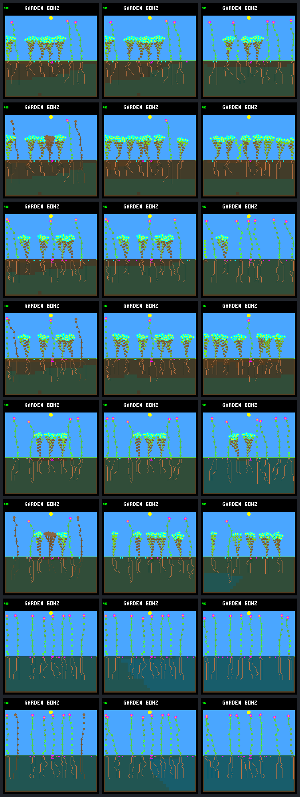

# Founder-independence challenge: fixed native frames

Fixed visual panel: fresh-2 / eb300b12. Columns: **days 64, 80, 128**.
Rows: original control/exit, broad G2 control/exit, broad final control/exit, narrow control/exit.
Day 64 is immediately after founder death in exit arms; corpses have not yet decomposed.

| Frame | World hash | Framebuffer CRC32 | Same-tick ledger hash |
|---|---|---|---|
| [g0 / control / day 64](founder-independence-frames/g0.control.64.png) | `d04aa74b` | `7fecc08a` | yes |
| [g0 / control / day 80](founder-independence-frames/g0.control.80.png) | `5744c6b9` | `44844e63` | counts + independent repeat |
| [g0 / control / day 128](founder-independence-frames/g0.control.128.png) | `036a2e57` | `a5445ab9` | yes |
| [g0 / exit / day 64](founder-independence-frames/g0.exit.64.png) | `85884965` | `886d7ae3` | yes |
| [g0 / exit / day 80](founder-independence-frames/g0.exit.80.png) | `66e7f0e4` | `59179189` | yes |
| [g0 / exit / day 128](founder-independence-frames/g0.exit.128.png) | `d421cc24` | `3dbc08f3` | yes |
| [g2 / control / day 64](founder-independence-frames/g2.control.64.png) | `866da599` | `e210ae41` | yes |
| [g2 / control / day 80](founder-independence-frames/g2.control.80.png) | `f5ad451c` | `fe7b80df` | counts + independent repeat |
| [g2 / control / day 128](founder-independence-frames/g2.control.128.png) | `734567e1` | `5345a8b9` | yes |
| [g2 / exit / day 64](founder-independence-frames/g2.exit.64.png) | `df570ca4` | `2a133203` | yes |
| [g2 / exit / day 80](founder-independence-frames/g2.exit.80.png) | `483cf739` | `2d747c88` | yes |
| [g2 / exit / day 128](founder-independence-frames/g2.exit.128.png) | `65786d50` | `05d6b254` | yes |
| [g3 / control / day 64](founder-independence-frames/g3.control.64.png) | `69381026` | `929b0e6f` | yes |
| [g3 / control / day 80](founder-independence-frames/g3.control.80.png) | `74a823af` | `3acf7f97` | counts + independent repeat |
| [g3 / control / day 128](founder-independence-frames/g3.control.128.png) | `1cf4bff9` | `37bf26a0` | yes |
| [g3 / exit / day 64](founder-independence-frames/g3.exit.64.png) | `10f57ecf` | `a7e55ea8` | yes |
| [g3 / exit / day 80](founder-independence-frames/g3.exit.80.png) | `09561d04` | `4c4341d2` | yes |
| [g3 / exit / day 128](founder-independence-frames/g3.exit.128.png) | `c0394209` | `9bdd0411` | yes |
| [narrow / control / day 64](founder-independence-frames/narrow.control.64.png) | `ff5fd80a` | `c2d6554c` | yes |
| [narrow / control / day 80](founder-independence-frames/narrow.control.80.png) | `16cfdd1e` | `fb933c64` | counts + independent repeat |
| [narrow / control / day 128](founder-independence-frames/narrow.control.128.png) | `edd6e1cc` | `d2baf5f1` | yes |
| [narrow / exit / day 64](founder-independence-frames/narrow.exit.64.png) | `2a0d8402` | `ab712a29` | yes |
| [narrow / exit / day 80](founder-independence-frames/narrow.exit.80.png) | `663794e8` | `36a03c12` | yes |
| [narrow / exit / day 128](founder-independence-frames/narrow.exit.128.png) | `88365e00` | `42ba1e98` | yes |

All 24 images reproduced byte-for-byte after independent resets. Twenty also match
same-tick ledger hashes. Four day-80 control images use ledger population/seed counts
plus independent replay hashes because the unchanged control tool has no day-80 checkpoint.
No images were selected by outcome. Images alone do not establish reproductive health.
See the [report](founder-independence.md) and [fixed protocol](founder-independence-protocol.md).

Manifest SHA-256: `a6b435dea702978a7021f4d1440afe193aa312201d0fb7a544df2700ee53951e`.
