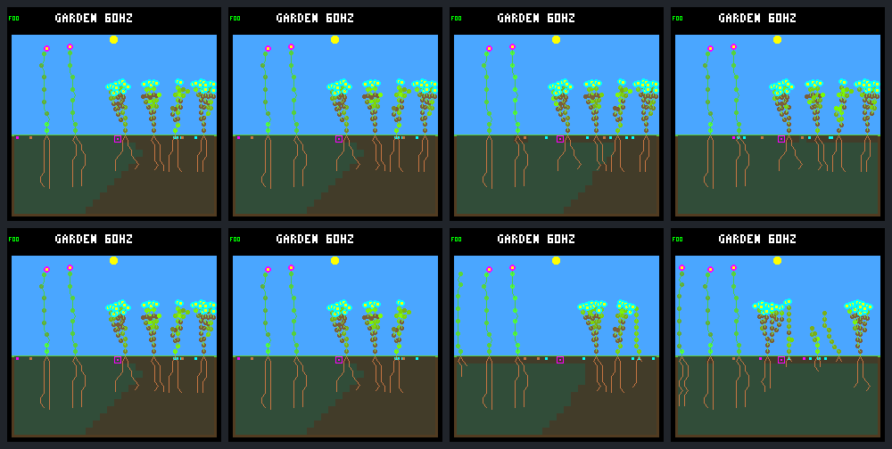
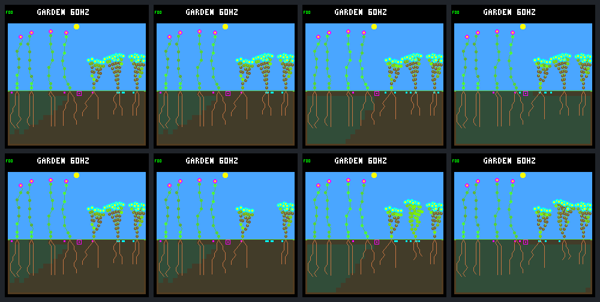

# One-gap recovery assay

Protocol declared 2026-09-11 before collecting outcomes. Follow-up to the
[maintenance-competition census](maintenance-competition.md).

## Fixed panel and intervention

Use selective maintenance with the frozen nighttime-growth-veto neural model,
both rain-fed layouts, all eight existing matched seeds, and 256/512-node host
builds: **32 pairs / 64 worlds**. Controls must match every saved census hash.
No model, ecology parameter, weather, policy, spacing or capacity changes.

At tick 61,440 (day 16), after its ordinary ecology update, remove the largest
living adult at least 256 ecology steps old; break equal node-count ties by
smallest lineage ID. Remove **one whole plant**, including roots and canopy,
immediately. Export its stored energy/water rather than returning them to soil.
Do not reset, relocate, add or remove any seed. Preserve soil moisture, weather,
RNGs, remaining plants' state, leaf conditions, lineage sequence and biological
counters. Recompute light and remap compacted node/plant indexes using the
existing reclamation machinery. Record removal independently of natural death
and decomposition counts. Failure is atomic. If no adult qualifies, fail the
case instead of choosing another protocol.

This is a deliberately generous **opportunity/recovery assay**, not a natural
death/decomposition event, random mortality model, permanent disturbance rule,
gardener policy or compulsory lifespan. Largest-adult selection favors opening
space and must not be interpreted as typical environmental damage.

Continue both arms to tick 92,160 (day 24). Compare late births, natural deaths,
seed outcomes, first germination latency, establishment within the released
base-spacing footprint (adult column ±2), full-day offspring survival and
durable parenthood. Distinguish existing bank seeds from post-gap seed creation.
Report day 20–24 activity separately to see whether a burst simply fills the
world again. Recent offspring and seeds remain censored as in the preceding
audit. No seedling insertion, reseeding or reward tuning.

## Validation and visual review

- Unit-test first/middle/last plant removal, index remaps, leaf side arrays,
  preserved soil/seeds/RNG/resources/telemetry, invalid-input atomicity, adult
  selection/tie-breaking, light recomputation and further ordinary stepping.
- Untouched replays must match the old frozen world and seed-site censuses at
  every ecology checkpoint. Perturbed replays must match through the pre-gap
  checkpoint. Record immediate before/after snapshots and exact intervention.
- Independently replay world and seed-site traces, matching every hash and
  reconciling seeds, births, natural deaths and living-step budgets. Do not count
  a removed adult as a starvation death or charge its lost stores as upkeep.
- Native screenshots for the previously selected `rainfed / 9c530b07` at day 16
  before, day 16 after, day 17 and day 24, both arms and capacities. Bind each
  rendered state to its census hash; rendering must not mutate the simulation.
- Freeze sources, build cache, executables, model, input manifest, commands,
  traces, analyses and images in fresh ignored bundles. Do not edit source while
  collecting. Record checks and limitations; do not promote anything to firmware.

Completed 2026-09-11. This work is host-only and does not qualify a training ecology.

## Results: opportunity helps, but one gap is usually a pulse

Each row pools 16 worlds over days 16–24. The gap arm exports one adult per
world; the natural-death column **excludes those 16 interventions**. Controls
are exact continuations of the previous selective-maintenance panel, not new
independent baseline trials. No outcome was used to choose a different target.

| Nodes | Arm | Worlds with births | Births | Natural deaths | Full-day survivors / eligible offspring | Durable parents | Final living |
|---|---|---:|---:|---:|---:|---:|---:|
| 256 | untouched | 0/16 | 0 | 0 | 0 / 0 | 0 | 105 |
| 256 | one gap | 15/16 | 34 | 9 | 30 / 32 | 1 | 114 |
| 512 | untouched | 2/16 | 4 | 2 | 3 / 4 | 0 | 120 |
| 512 | one gap | 15/16 | 32 | 16 | 24 / 31 | 2 | 118 |

Thus **30/32 gap worlds produce offspring somewhere**, and 54/63 eligible new
offspring survive their first full day. At 256, two additional late births are
alive but too recent for full-day follow-up; at 512, one recent birth has already
died and remains outside that eligible denominator. Full-day survival is a
lifetime milestone, not necessarily survival to the final endpoint: 32 new
offspring remain alive at the 256 endpoint, 20 at 512.

Reproduction is not wholly absent in the new generation: 13 new plants at 256
produce 66 seeds; 11 at 512 produce 38. Only one and two new plants respectively
also have a child that survives its own first full day. Those are observed
durable parents, not a guarantee of indefinitely continuing lineages.

The pulse mostly subsides. During **days 20–24**, the 256 gap arm has five births
in only two worlds; the 512 gap arm has six births in only three worlds. The
controls have zero and one respectively. Hence **27/32 gap worlds have no births
in the final four days**, despite maintenance and seed production continuing.
This is not evidence for broad sustained succession.

## Where recovery happens and where its seeds come from

An exported adult's base-spacing footprint is its column ±2, clipped to the
world. Other adults can still exclude parts of that footprint. Births elsewhere
can benefit from freed node storage, a freed plant slot or reduced shade; a birth
anywhere is not automatically local recolonization of the cleared base.

| Nodes | Gap-arm births | From seeds already banked at the gap | From seeds created later | Within exported adult's footprint | Worlds with footprint births |
|---|---:|---:|---:|---:|---:|
| 256 | 34 | 16 | 18 | 15 | 10/16 |
| 512 | 32 | 9 | 23 | 19 | 13/16 |

There is no injected seedling or resource refill. At 256, first birth occurs
on the next ecology step (0.25 simulated seconds) in 10/16 worlds. Among its
15 recovering worlds, median first-birth latency is 0.25 seconds, range
0.25–125 seconds. At 512, four worlds respond on the next step; median latency
among 15 recovering worlds is 52 seconds, range 0.25–128 seconds. These latency
medians exclude the one non-recovering world per capacity; do not treat it as
a zero or arbitrarily long observed latency.

The capacity comparison is not a speed race between otherwise identical adult
populations. Their preceding growth histories, largest selected adults, seed
landings and available ground differ. It establishes that both conditions can
respond naturally when some occupied resources are released.

## Why one release does not keep the system open

All removed adults contain 36–64 nodes. Across both capacities, 32 exports remove
1,797 nodes, 7,666 stored energy and 16,055 stored water. None is credited back to
the soil or surviving organisms. The intervention changes several constraints
at once (body occupancy, shade, root demand and slots), so it does not isolate
which of them is causal in every world.

| Nodes | Arm | Late seed-node gate | Late full plant slots | Mean free nodes | Full seed bank |
|---|---|---:|---:|---:|---:|
| 256 | untouched | 100.00% | 12.50% | 0.00 | 93.87% |
| 256 | one gap | 94.75% | 43.74% | 0.99 | 94.02% |
| 512 | untouched | 0.00% | 57.39% | 163.79 | 99.81% |
| 512 | one gap | 0.00% | 47.73% | 188.42 | 97.60% |

These are completed late snapshot fractions; the node gate means fewer than
four free nodes for a seedling. At 256, growth uses almost all the released
storage again: final allocation is 4,095 of the pooled 4,096 available nodes.
At 512 the pool never blocks seedlings, but planting/ground/landing limits
remain. Most seeds still expire. Among seeds **created after the intervention
with a full lifetime of follow-up**, 18/900 germinate at 256 and 23/909 at 512;
the rest expire. These counts intentionally exclude germinations from seeds
already banked before the gap.

### The non-recovering seed is informative

`rainfed-crowded / b61837dc` has no births after either capacity's intervention:

- **256:** export 56 nodes at column 0. Existing plants consume enough released
  storage to restore the seed-node gate after just **9.25 seconds**, with no new
  plant. Only 18/568 late bright snapshots have any legal column. Of 56 eligible
  post-gap seeds, all expire; none ever has a legal site within its parent's
  support during its sampled mature period. This cohort excludes the original
  bank, which has some transient reachable opportunities but still no births.
- **512:** export 61 nodes at column 26; 199 nodes remain free at the endpoint.
  A legal column exists in 348/568 bright snapshots. All 56 eligible new seeds
  expire even though all encounter some legal ground somewhere and 19 encounter
  it within parent dispersal support. None is observed open at its actual
  landing column. This is a landing/opportunity mismatch, not a node shortage;
  it does not prove relocated seeds would survive.

These are overlapping post-step opportunities, not reconstructed pre-germination
attempt probabilities. Opening a gap does not force existing seeds to land in it.

## Native visual review

The predeclared `rainfed / 9c530b07` panel uses the production renderer. In each
image, **top row = untouched, bottom row = one gap**. Columns are **day 16 before,
day 16 immediately after, day 17, day 24**. The first two top-row frames are
intentionally identical; no time passes across the intervention boundary.

### 256 nodes



The gap removes lineage 6 at column 26 (52 nodes). It releases planting
opportunities elsewhere as well: immediately legal columns are 0, 1, 11, 12,
25, 26 and 27. Six later births occur, but only one is in the exported adult's
base footprint. The visible reorganization is broader than a one-for-one local
replacement; the untouched top row remains occupied by the same adults.

### 512 nodes



The gap removes lineage 13 at column 22 (55 nodes), exposing legal columns
20–23. One new plant establishes in that footprint, survives, and fills the
opening; no further births occur in this case. This is the clearest visual
example of successful replacement followed by another quiet occupied state.

All 16 frames match their census state hashes and framebuffer CRCs. Corresponding
pre-gap arm images are byte-identical. The four day-16/day-24 control images also
match the preceding frozen maintenance panel byte-for-byte. The display's
`GARDEN 60HZ` header describes the simulation clock, not measured hardware or
host rendering throughput for this experiment.

## Interpretation and next design discussion

This test supports an **opportunity-limited recovery** explanation. Natural
seeds can establish and often survive when space/resources are released. It
does not show that a single gap produces a self-sustaining sequence of new
generations, nor that sacrificing the largest healthy adult is a sensible
environmental rule. No-renewal mortality and one-time artificial exports should
not be mistaken for learned ecological success.

The next choice is a mechanic/design discussion, not another automatic tuning
pass. A small **deterministic environmental disturbance/recovery regime** is
now worth considering: predeclare timing/location independently of policy or
plant success, retain intact refuges, and specify damage/decomposition/resource
semantics. Compare recovery and descendant quality across repeated opportunities,
including an undisturbed control. A permanent "kill the largest" rule would
bias against successful growth; this assay does not authorize it.

Alternatively, a competition/structural-remodeling design could allow plants
to change occupied space themselves, but that is a larger action and geometry
change. Leaf renewal alone cannot release a base reservation or plant slot.
Discuss the intended ecology before modifying either route or expanding the NN.

## Implementation, reproduction and provenance

The embedded-C conventions guided a small, atomic world-owned mutation using
the existing reclamation/remapping machinery. It exists only in host maintenance
builds; `--gap-at TICK` is an explicit inspector/replayer option. No normal
simulation step, model feature/action contract, device configuration or default
rule is changed. The core operation exports tissue/stores and refreshes light;
host code owns target selection, timing and intervention records.

The inspector emits an ordinary pre-gap sample, a `gap` event and an immediate
post-gap sample at the same tick. The collector verifies and freezes that boundary
separately, then keeps the ordinary pre-gap sample in normalized ecology traces.
This preserves its just-completed live-step budgets and seed creation (including
seeds produced by the exported adult on that step). Late samples start strictly
after the gap. The lineage ledger tags the adult's lifetime endpoint with
`removal_tick`; natural death/resource counters do not include it.

Build the same [explicit host maintenance configurations](leaf-maintenance.md),
then, with the preceding competition bundles retained:

```sh
python3 sim/garden_gap_experiment.py \
  --bundle artifacts/garden-maintenance-competition-256 \
  --build artifacts/build-host-leaves-256 \
  --output artifacts/garden-gap-recovery-256 --jobs 2
python3 sim/garden_gap_experiment.py \
  --bundle artifacts/garden-maintenance-competition-512 \
  --build artifacts/build-host-leaves-512 \
  --output artifacts/garden-gap-recovery-512 --jobs 2
```

Use fresh output paths for reruns. Sources/build cache/binaries/model, original
censuses, exact commands, normalized traces, immediate boundaries, per-case
analyses/metrics, pooled summaries and native images are retained. Controls
match both original censuses through the endpoint; gap arms match them through
day 16. Independent replays confirm perturbed endpoint hashes. Source and input
hashes are checked again before marking collection complete.

Validation totals:

- **655,488** complete-record comparisons against frozen input censuses;
- **393,280** world/seed-site checkpoint matches, plus 32 immediate post-gap
  boundary matches;
- **11,966** reconciled seed records and **2,476,173** exact living-step budgets;
- **477** natural terminal steps excluded from resource reconstruction because
  their income/stores are cleared, plus 32 separately recorded adult exports;
- **30 normal CTests and 11 per maintenance capacity**, all passing; C formatting
  and `git diff --check` also pass. No target timing or stack claim is made.

All 213 artifact hashes per output bundle were rechecked. Manifest SHA-256:

- `artifacts/garden-gap-recovery-256/manifest.json`:
  `8b5eeabb49f9c3c8795b0cf4f40bdea7bd8f5190bfebc3dfc5b6840354397015`
- `artifacts/garden-gap-recovery-512/manifest.json`:
  `c7ec5315c90a8408047854e7e42966e4aaccf4cb8e7254f57d95f2e12de41f4d`

Input manifest SHA-256 (the preceding competition census):

- 256: `e84ec3c4aec57f7de55e09c448dd24cc5ca61864132d403ca9d6e5667b50aa6a`
- 512: `2f2b60e5f19b46e7e42803a225e84247a707d9557b52693c27c052b530761fbf`

Raw bundles are local/ignored. This results write-up and copied contact sheets
were added after the collection snapshot. Everything remains uncommitted;
there was no firmware flash, training run or environment-qualification change.
