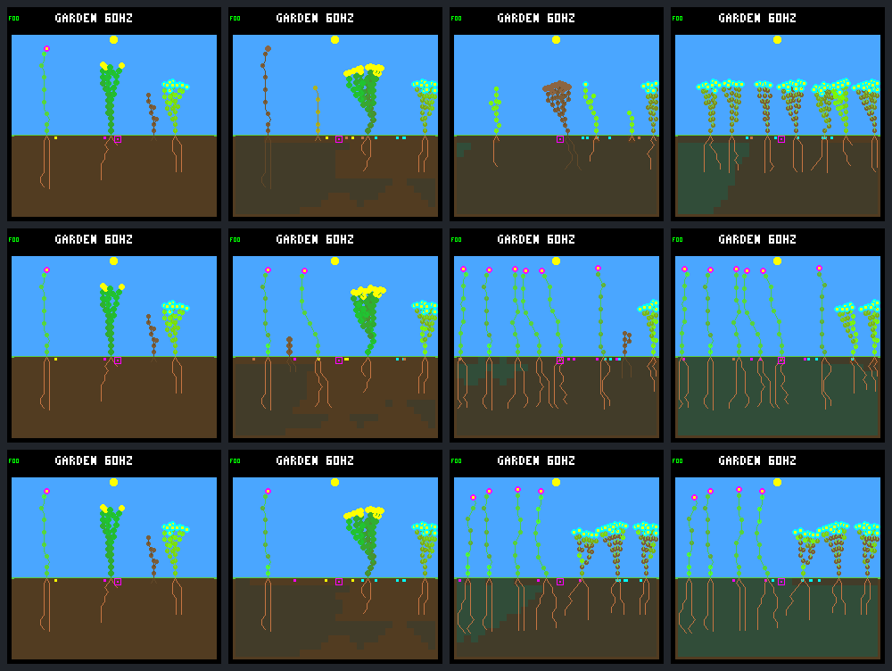
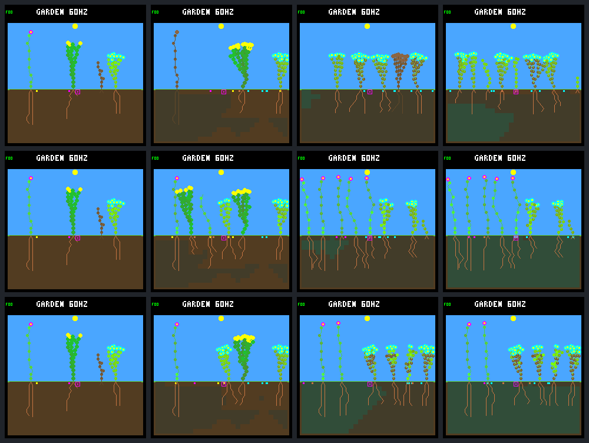

# Leaf maintenance v1 — host experiment

Protocol declared before the comparison. This is not a firmware/default change.

The late, living, tipless samples in `garden-capacity-512/traces/*.jsonl.gz`
contain 43,822 flower, 28,686 ground-cover and 7,697 shrub plant observations.
Their mean gross energy per active leaf per second is 2.179, 0.853 and 0.737;
mean whole-plant upkeep is 4.906/2.392, 6.714/5.214 and 7.331/5.532 energy/water
per second. These selected traces describe mature bodies, not the full cohort.
Stores average 157–185 energy and 503–511 water. Thus water scarcity is not
guaranteed in the unmodified rain-fed panel; include controlled dry cases.

## Fixed first trial

- Combined wide-v1/headroom-v1 ecology, first 512 then 256 nodes. No geometry,
  roots, seed rules, plant slots, weather or model changes.
- Mature living leaves lose one of 255 condition units each second, before
  light/income. Full exhaustion takes 255 seconds (almost four 64-second days).
  Immature leaves start full; dead leaves retain their condition until the
  existing corpse decay removes them. Non-leaves have zero condition.
- Productive area multiplies the existing `light / 64` income by condition/255.
  Sum numerator per plant with a persistent 0–254 remainder before division;
  do not round each leaf independently. Discard the remainder on plant death.
  Shade uses the same area multiplier, rounded down separately for center and
  neighboring cells. Full condition preserves existing collection and shade.
- Renewal costs 9 energy and 5 water (one flower growth action before vigor
  discount), immediately restores condition to 255, and affects collection on
  the next ecology step. No other body/resource/reproductive state is reset.
  At condition 128, the measured mean incremental gross payback is roughly
  8–24 seconds; this is not net profit or a guarantee for shaded leaves.
- One mature leaf is sampled per living plant per ecology step (4 Hz), using
  `(ecology_tick + lineage_id) % mature_leaf_count`, in node order. No RNG or
  persistent cursor. A stable 512-leaf body is visited in at most 128 seconds;
  actual plant leaf counts and sampling intervals must be measured.
- Explicit action precedence: affordable renewal, then the existing growth
  controller, then maintenance WAIT if growth cannot run. Renewal preempts
  growth that step. Leaf WAIT does not preempt growth. Each submitted proposal
  sees unchanged prior memory; only the selected action commits memory. Growth
  cooldown still decrements once, including during renewal. This is a scripted
  scheduling experiment, not learned priority competition.
- Compare **none**, **all** (renew condition <=128 when affordable), and
  **selective** (same, but local light >=128 and leave 40 seconds of upkeep
  reserve, capped at 128 energy/256 water). This reserve deliberately leaves
  room below storage caps; it is a fixed heuristic, not an optimized controller.
- Frozen legacy model `dc5e849d`, unchanged no-night-growth veto and adaptive
  growth controls; eight existing seeds, two rain-fed layouts, 24 days,
  late window days 16–24. Report matched cases, not only pooled totals.
- Native captures at days 1, 4, 16 and 24 for rainfed seed `0x9c530b07` with
  the veto growth controller, all three maintenance policies, both capacities.
  Preserve source/binary/model identity, repeated-run hashes and frame CRCs.

Acceptance covers exact wear/debits, insufficient-resource atomicity, mature
tipless/full-pool/poor controller access, one action per step, untouched growth
model ABI, compaction/reset/death, shading, and snapshot/dirty-render consistency.
Report renewal proposals/acceptance, condition restored/worn, stores/stress,
late births/deaths, eligible full-day survivors and durable descendants. Adult
survival alone is not ecosystem success. Do not tune constants after viewing
this panel; record failures and propose the next experiment instead.

## Results

Completed 2026-09-11 on `green-garden`, after checkpoint `4f26187`; uncommitted.
There are **288 primary matched worlds**: three maintenance rules × three
unchanged growth controllers × two layouts × eight seeds × two capacities.
The evaluator also retains baseline controls and duplicate adaptive trajectories;
those duplicates match exactly and are not counted twice below. No retraining,
device flash or default-ecology change occurred.

Renewal creates ongoing, paid decisions for mature plants, and clearly changes
the outcome. It does **not** establish that the selective rule is better or that
the ecology is qualified. Ignoring wear increases death/replacement; maintenance
preserves adults, sometimes leaving little opportunity for further generations.

### Population/lifetime comparison

Each row totals 16 independent worlds through 24 garden days. Full-day survival
uses only offspring with a complete possible follow-up; a death exactly at the
boundary fails. Durable means a full-day-surviving descendant that itself has
a full-day-surviving child. Late events are in days `(16,24]`.

512 nodes:

| Growth | Renewal | Final alive | Extinct worlds | Full-day survivors / eligible | Durable | Late births / deaths |
|---|---|---:|---:|---:|---:|---:|
| Original NN | None | 41 | 7 | 219 / 388 | 135 | 100 / 112 |
| Original NN | All | 108 | 2 | 109 / 265 | 49 | 17 / 15 |
| Original NN | Selective | 108 | 2 | 94 / 238 | 41 | 10 / 10 |
| Night-growth veto | None | 81 | 1 | 409 / 613 | 235 | 202 / 197 |
| Night-growth veto | All | 118 | 0 | 229 / 333 | 108 | 46 / 39 |
| Night-growth veto | Selective | 120 | 0 | 115 / 185 | 38 | 4 / 2 |
| Adaptive | None | 83 | 0 | 439 / 536 | 264 | 192 / 193 |
| Adaptive | All | 123 | 0 | 203 / 241 | 89 | 19 / 15 |
| Adaptive | Selective | 119 | 0 | 136 / 198 | 52 | 32 / 32 |

256 nodes reproduce the tradeoff; these are not identical trajectories after
capacity begins constraining growth:

| Growth | Renewal | Final alive | Extinct worlds | Full-day survivors / eligible | Durable | Late births / deaths |
|---|---|---:|---:|---:|---:|---:|
| Original NN | None | 35 | 7 | 210 / 383 | 126 | 94 / 108 |
| Original NN | All | 106 | 2 | 106 / 231 | 48 | 7 / 7 |
| Original NN | Selective | 107 | 2 | 93 / 214 | 43 | 4 / 3 |
| Night-growth veto | None | 93 | 0 | 393 / 508 | 227 | 169 / 164 |
| Night-growth veto | All | 117 | 0 | 210 / 300 | 103 | 42 / 39 |
| Night-growth veto | Selective | 105 | 0 | 96 / 139 | 32 | 0 / 0 |
| Adaptive | None | 94 | 0 | 373 / 455 | 223 | 150 / 149 |
| Adaptive | All | 119 | 0 | 194 / 219 | 89 | 25 / 22 |
| Adaptive | Selective | 108 | 0 | 90 / 117 | 30 | 5 / 5 |

For example, selective/veto at 512 nodes accepts 13,355 renewals, including
5,845 in the late window, despite just four late births. At 256 it still accepts
4,696 late renewals with no late births or deaths. The controller no longer
goes silent when growth tips finish; **adult maintenance and descendant turnover
are separate objectives**. More deaths/births under no renewal are not an automatic
win either, especially with seven original-NN worlds extinct at either capacity.

### Controlled payback cases

After the panel, added deterministic two-second tests of one tipless flower's
leaf at condition 100. These test the already fixed mechanism/heuristics, not
new tuning. The shaded case uses actual overhead foliage and the shared ray
solver; the dry case has empty soil and five stored water. Starting energy is
128, with 256 stored water in the two wet cases. Body upkeep continues.

| Condition | Renewal | Final energy | Final water | Stress | Paid renewals |
|---|---|---:|---:|---:|---:|
| Lit, wet | None | 135 | 298 | 0 | 0 |
| Lit, wet | All / selective | 139 | 293 | 0 | 1 |
| Shaded, wet | None / selective | 126 | 298 | 0 | 0 |
| Shaded, wet | All | 117 | 293 | 0 | 1 |
| Lit, dry | None / selective | 135 | 3 | 0 | 0 |
| Lit, dry | All | 139 | 0 | 2 | 1 |

Thus there is a real local investment decision. These tiny tests do not prove
that the reserve heuristic or its fixed light threshold is optimal over days.

### Native visual panel

Rows: **none, all, selective**. Columns: **days 1, 4, 16, 24**. All use the
predeclared rainfed layout, seed `9c530b07`, and unchanged night-growth veto.
The first-day worlds/pixels are identical across maintenance policies, before
the renewal threshold is reached. Living worn leaves fade toward brown; corpse
rendering remains distinct via the existing dead-body style. Rendering does not
advance the world. Each capture matches both traced and headless hashes.

512-node panel:



256-node panel:



The selective panel visibly keeps upper productive foliage while allowing lower
leaves to fade. This is consistent with the rule; it is not evidence of learned
behavior. Original neural weights still control growth only.

### Accounting, bounded work and compatibility

- Six detailed 24-day traces (three modes at both capacities) reconcile **210,548
  living-plant steps** exactly, including allocation, income, caps, upkeep,
  reproduction and renewal. Their condition ledgers reconcile initial/new
  leaves, wear and restoration. 123 terminal steps are explicitly excluded
  from store reconstruction because the existing death path clears income.
- Selected traces debit 28,791 energy and 15,995 water for 3,199 renewals, with
  zero water overflow. No renewal and growth action commit in the same step.
- Maximum mature leaves per plant in the full panels: 75 at 512 nodes, 67 at
  256. Stable-body sweep bounds are therefore 18.75/16.75 seconds. Actual maximum
  revisit gaps in the selected traces are 54.75/42.75 seconds: changing leaf
  counts during growth can extend the modulo sampler's sweep. This is below
  the 127-second interval from full condition to the renewal threshold in these
  cases, not a general fairness guarantee under arbitrary topology changes.
- Measured native sizes: garden world 6,912 → **7,636 B** at 512 nodes and
  4,352 → **4,820 B** at 256. This includes the side array, 24 extra bytes per
  plant (fractional state, telemetry and alignment), and 20 B world telemetry.
  Node size stays 10 B. Snapshots grow 3,456 → **3,968 B** and 1,664 → **1,920 B**,
  respectively, **per snapshot**. Leaf observations are 20 B; decisions 12 B.
  No persistent cursor, heap allocation or unbounded lineage history is added
  to the world. Total live buffers, target stack use and on-device timing still
  need qualification; these native sizes are not a device deployment budget.
- Sampling/validation scans are bounded by the node pool; one maintenance
  callback is offered per living plant with mature leaves per ecology step.
  Full-pool, tipless, cooldown and poor-resource access, shared prior memory,
  action-specific atomic rejection, wear boundaries, shade, compaction/reset,
  snapshot ownership and dirty/full reconstruction have direct tests.
- The leaf environment is compile-time opt-in, requires combined ecology and
  rejects Zephyr. Its typed WAIT/RENEW channel does not change the legacy
  three-action neural payload. It is hashed separately; condition and fractional
  income are authoritative, diagnostic counters are not. Training is disabled
  in this variant rather than silently interpreting old weights as maintenance
  controllers. Normal `make host-build` explicitly clears the option.
- Default tests remain green, and 24 selected final-state hashes across both
  old combined capacities, both layouts, two seeds and all three growth policies
  match the frozen pre-maintenance reports exactly when the option is off.
  Six old native screenshots (three growth controls at each capacity) also
  remain byte-identical. Final test runs: **29 default CTests**, and **7 CTests
  in each maintenance build**, all passing with UBSan and strict warnings.
- A single headless 24-day selective/veto replay of seed `9c530b07` takes a
  median **0.728 s at 256 nodes / 0.882 s at 512**, over three fresh processes
  each, using the native unoptimized UBSan build. That advances 1,536 seconds
  of simulation, without rasterization. These are host throughput observations,
  not device predictions or an isolated causal estimate of maintenance overhead.
- Native GCC `-fstack-usage` reports `grow_plants` 80 → 96 B and collection
  80 → 96 B; the new proposal/observation/renewal functions have individual
  frames of 112/160/64 B. Validation is 96 B in either build. Reports are in
  `artifacts/garden-leaf-stack/{legacy,maintenance}.su`. These are x86-64
  unoptimized UBSan **individual frames**, not a transitive or RP2040 stack bound.

### Reproduce and provenance

All build dependencies stay inside the existing Docker image. For the 512-node
trial (use `LARGE_POOL=OFF`, a separate build path and `--capacity 256` to repeat):

```sh
docker compose run --rm firmware cmake -S sim -B artifacts/build-host-leaves-512 -G Ninja \
  -DTOY_FACTORY_GARDEN_WIDE_DISPERSAL=ON \
  -DTOY_FACTORY_GARDEN_WATER_HEADROOM=ON \
  -DTOY_FACTORY_GARDEN_COMBINED_EXPERIMENT=ON \
  -DTOY_FACTORY_GARDEN_LARGE_POOL=ON \
  -DTOY_FACTORY_GARDEN_LEAF_MAINTENANCE=ON
docker compose run --rm firmware cmake --build artifacts/build-host-leaves-512
docker compose run --rm firmware ctest --test-dir artifacts/build-host-leaves-512 --output-on-failure
docker compose run --rm firmware python3 sim/garden_leaf_experiment.py \
  --build artifacts/build-host-leaves-512 --capacity 512 \
  --model artifacts/garden-lifetimes/champion.tgm \
  --output artifacts/garden-leaf-maintenance-512-new
```

The collector requires a fresh output path and the declared model SHA. It freezes
sources, patch, build cache, model and all three executables, validates matching
weather/identities, saves per-world reports, checks independent replays, and
captures the fixed native panel. Do not edit sources during collection. Legacy
collectors reject this new ecology; use its dedicated accounting/capture tool.

Completed bundle manifest SHA-256 values:

- `artifacts/garden-leaf-maintenance-512/manifest.json`:
  `e5ddb5ba301cf8e8159761542945b9bf900843e31942e8d80f0f59da0b51927a`
- `artifacts/garden-leaf-maintenance-256/manifest.json`:
  `10d971c242f193a472a98d0c0b3b1b2c567a659d43d9e47099f821d03a40fdb8`

All archived artifact hashes were rechecked. The experiment executables still
match the frozen copies after adding the post-panel controlled tests. Later
test-registration/documentation changes are not falsely included in those frozen
source archives. Source tables, exact paired outcomes and resource summaries are
in each bundle's `summary.json`, `cases.json` and `trace-budgets.json`.

## Next question, not another automatic change

Trace persistent-parent/offspring competition in the selective worlds: which
of plant slots, spacing, shading, seed production/reserves and allocation limits
is now preventing descendant success? Keep maintenance parameters fixed while
diagnosing that. Do not force adult death, label the selective policy a winner,
promote 512 nodes to firmware, or extend/train the NN until that distinction is
understood and discussed.
