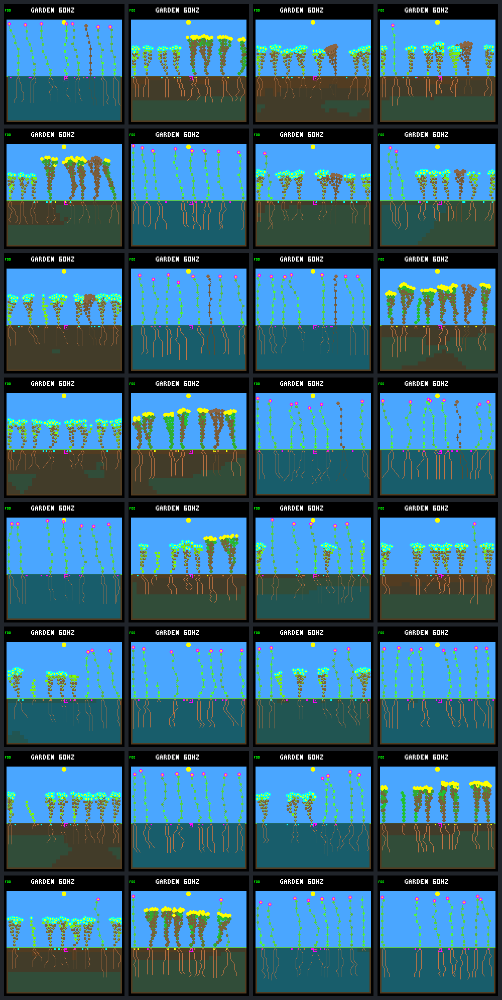

# Mixed-condition pilot: generation gallery

Fixed review worlds, never used for automated selection. Rows follow the declared
schedule/seed order; columns show generation **0 / 1 / 2 / 3** at day **192**.
These are all 32 required native captures, not a selected set of favorable worlds.
All scored checkpoint hashes and independent byte-for-byte frame repeats match.

| Row | Schedule | World seed |
|---:|---|---|
| 1 | fresh-1 | `2109e05f` |
| 2 | fresh-1 | `d21d2a74` |
| 3 | fresh-1 | `876675ac` |
| 4 | fresh-1 | `34243e22` |
| 5 | fresh-2 | `2109e05f` |
| 6 | fresh-2 | `d21d2a74` |
| 7 | fresh-2 | `876675ac` |
| 8 | fresh-2 | `34243e22` |

## Native frames and endpoint diagnostics

Counts describe living species and founder families, not seed-bank extinctions.
Fitness key: terminal tier, renewing-child live ticks, descendant live ticks,
renewing parents, new establishments. Tick totals sum over plants, not CPU time.

| Generation / condition | Model CRC | Living | Species / families | World key | World hash / framebuffer CRC |
|---|---|---:|---:|---|---|
| [g0.fresh-1.2109e05f](mixed-training-frames/g0.fresh-1.2109e05f.png) | `dc5e849d` | 7 | 1 / 2 | `[1, 182535, 958275, 3, 4]` | `b936db42` / `f56d592e` |
| [g0.fresh-1.d21d2a74](mixed-training-frames/g0.fresh-1.d21d2a74.png) | `dc5e849d` | 7 | 2 / 2 | `[1, 200775, 902655, 2, 6]` | `0b4b89e9` / `050d28a0` |
| [g0.fresh-1.876675ac](mixed-training-frames/g0.fresh-1.876675ac.png) | `dc5e849d` | 7 | 1 / 1 | `[1, 411090, 812715, 4, 9]` | `ff461070` / `55f816a6` |
| [g0.fresh-1.34243e22](mixed-training-frames/g0.fresh-1.34243e22.png) | `dc5e849d` | 8 | 1 / 1 | `[1, 232980, 934860, 2, 4]` | `73565e53` / `21753380` |
| [g0.fresh-2.2109e05f](mixed-training-frames/g0.fresh-2.2109e05f.png) | `dc5e849d` | 7 | 1 / 2 | `[1, 285570, 801915, 3, 4]` | `335cbd13` / `a1adbfc5` |
| [g0.fresh-2.d21d2a74](mixed-training-frames/g0.fresh-2.d21d2a74.png) | `dc5e849d` | 8 | 2 / 2 | `[1, 175560, 815175, 1, 5]` | `08c19099` / `0e395cdd` |
| [g0.fresh-2.876675ac](mixed-training-frames/g0.fresh-2.876675ac.png) | `dc5e849d` | 8 | 1 / 1 | `[1, 300255, 914655, 3, 6]` | `c6c01ee4` / `df0a9839` |
| [g0.fresh-2.34243e22](mixed-training-frames/g0.fresh-2.34243e22.png) | `dc5e849d` | 8 | 2 / 2 | `[1, 318015, 814245, 4, 5]` | `0a39da9c` / `471b3600` |
| [g1.fresh-1.2109e05f](mixed-training-frames/g1.fresh-1.2109e05f.png) | `5f8c5519` | 8 | 2 / 2 | `[1, 196260, 953835, 4, 4]` | `ea96f878` / `019953e5` |
| [g1.fresh-1.d21d2a74](mixed-training-frames/g1.fresh-1.d21d2a74.png) | `5f8c5519` | 8 | 1 / 2 | `[1, 189555, 967455, 3, 3]` | `972ee155` / `12ac301a` |
| [g1.fresh-1.876675ac](mixed-training-frames/g1.fresh-1.876675ac.png) | `5f8c5519` | 7 | 1 / 1 | `[1, 196410, 953985, 3, 4]` | `3c5c47fe` / `294a2047` |
| [g1.fresh-1.34243e22](mixed-training-frames/g1.fresh-1.34243e22.png) | `5f8c5519` | 6 | 1 / 2 | `[1, 86250, 834060, 2, 3]` | `58f3c501` / `d02095e5` |
| [g1.fresh-2.2109e05f](mixed-training-frames/g1.fresh-2.2109e05f.png) | `5f8c5519` | 7 | 2 / 2 | `[1, 270555, 909780, 4, 4]` | `5e5752a3` / `2d32d55d` |
| [g1.fresh-2.d21d2a74](mixed-training-frames/g1.fresh-2.d21d2a74.png) | `5f8c5519` | 8 | 1 / 2 | `[1, 239385, 788355, 2, 5]` | `b0e7aff7` / `58864c4c` |
| [g1.fresh-2.876675ac](mixed-training-frames/g1.fresh-2.876675ac.png) | `5f8c5519` | 8 | 1 / 1 | `[1, 115335, 847245, 1, 2]` | `feb3cbf1` / `df67d316` |
| [g1.fresh-2.34243e22](mixed-training-frames/g1.fresh-2.34243e22.png) | `5f8c5519` | 8 | 2 / 3 | `[1, 119490, 677955, 2, 6]` | `ce6ad007` / `030b363e` |
| [g2.fresh-1.2109e05f](mixed-training-frames/g2.fresh-1.2109e05f.png) | `5c6124d9` | 7 | 1 / 1 | `[1, 111060, 935085, 3, 4]` | `98335d9f` / `d9de5f5c` |
| [g2.fresh-1.d21d2a74](mixed-training-frames/g2.fresh-1.d21d2a74.png) | `5c6124d9` | 7 | 2 / 2 | `[1, 146190, 961185, 1, 2]` | `ca45c6c4` / `5fbc7bb1` |
| [g2.fresh-1.876675ac](mixed-training-frames/g2.fresh-1.876675ac.png) | `5c6124d9` | 7 | 1 / 2 | `[1, 178425, 954165, 3, 4]` | `a84ef167` / `5759d041` |
| [g2.fresh-1.34243e22](mixed-training-frames/g2.fresh-1.34243e22.png) | `5c6124d9` | 7 | 1 / 2 | `[1, 183945, 941520, 2, 4]` | `dfbe0a1e` / `0c439833` |
| [g2.fresh-2.2109e05f](mixed-training-frames/g2.fresh-2.2109e05f.png) | `5c6124d9` | 8 | 2 / 3 | `[1, 151125, 827910, 3, 5]` | `a0f29932` / `6e75e53d` |
| [g2.fresh-2.d21d2a74](mixed-training-frames/g2.fresh-2.d21d2a74.png) | `5c6124d9` | 8 | 2 / 3 | `[1, 217785, 836895, 3, 4]` | `1c610906` / `fa753ade` |
| [g2.fresh-2.876675ac](mixed-training-frames/g2.fresh-2.876675ac.png) | `5c6124d9` | 7 | 2 / 3 | `[1, 178815, 799890, 3, 6]` | `e052d09f` / `7af4d964` |
| [g2.fresh-2.34243e22](mixed-training-frames/g2.fresh-2.34243e22.png) | `5c6124d9` | 8 | 1 / 2 | `[1, 181290, 813360, 2, 4]` | `598173cc` / `7ed3e188` |
| [g3.fresh-1.2109e05f](mixed-training-frames/g3.fresh-1.2109e05f.png) | `449c35fe` | 7 | 2 / 2 | `[1, 154875, 877155, 3, 3]` | `9ef3412a` / `c1064d36` |
| [g3.fresh-1.d21d2a74](mixed-training-frames/g3.fresh-1.d21d2a74.png) | `449c35fe` | 7 | 2 / 2 | `[1, 132510, 947505, 1, 3]` | `4edcb04d` / `f047d891` |
| [g3.fresh-1.876675ac](mixed-training-frames/g3.fresh-1.876675ac.png) | `449c35fe` | 7 | 1 / 1 | `[1, 296610, 927660, 2, 5]` | `5a66016f` / `214a4d44` |
| [g3.fresh-1.34243e22](mixed-training-frames/g3.fresh-1.34243e22.png) | `449c35fe` | 7 | 1 / 2 | `[1, 191295, 948870, 4, 5]` | `d3a5626a` / `d2fd9b8b` |
| [g3.fresh-2.2109e05f](mixed-training-frames/g3.fresh-2.2109e05f.png) | `449c35fe` | 7 | 2 / 2 | `[1, 198225, 817335, 3, 4]` | `b3b6e252` / `7299accb` |
| [g3.fresh-2.d21d2a74](mixed-training-frames/g3.fresh-2.d21d2a74.png) | `449c35fe` | 8 | 1 / 2 | `[1, 224640, 835920, 3, 4]` | `36bc9a7e` / `26bb5620` |
| [g3.fresh-2.876675ac](mixed-training-frames/g3.fresh-2.876675ac.png) | `449c35fe` | 8 | 1 / 1 | `[1, 201675, 943665, 3, 4]` | `6c5aa42c` / `27eb9ce4` |
| [g3.fresh-2.34243e22](mixed-training-frames/g3.fresh-2.34243e22.png) | `449c35fe` | 7 | 1 / 2 | `[1, 136155, 824520, 3, 4]` | `6e14279d` / `4fcba13f` |

[All candidate scores, paired diagnostics and lifetime attribution](mixed-training-summary.json).

Frozen bundle manifest SHA-256: `511b26198ed46fbe7e1a5a7893613450613f2cb24b2abea9b2f0ec5ba6fe6fb2`.
