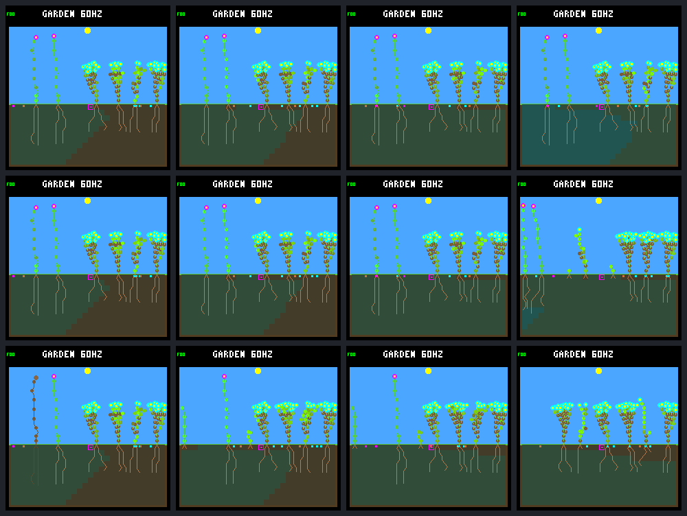
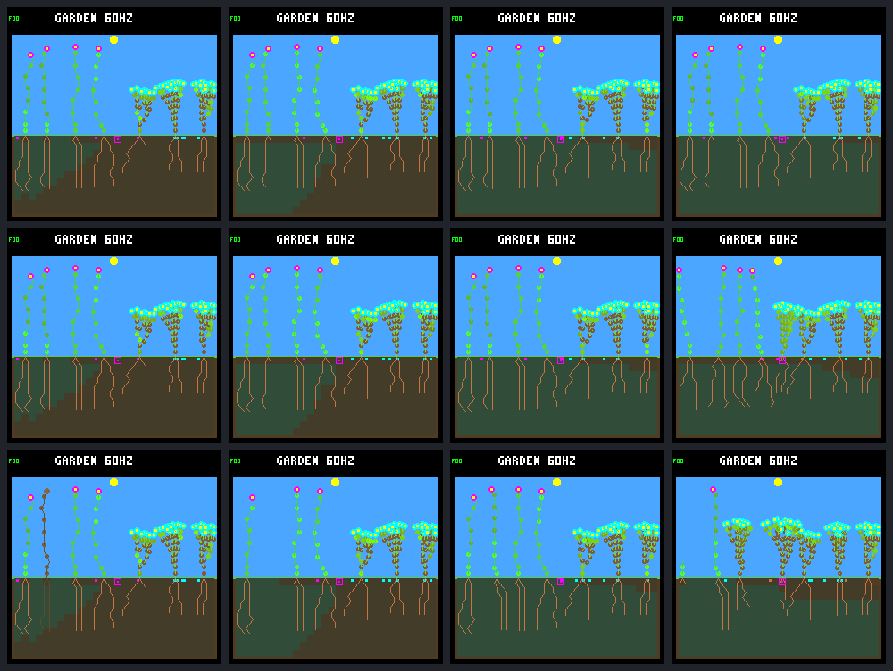

# Recurring patch-death experiment

Predeclared protocol, 2026-09-12. This is a host-only experiment, not a firmware
change or training result. The frozen legacy NN, nighttime-growth veto, selective
leaf maintenance, water headroom and wider dispersal remain unchanged.

Completed: recurring disturbances produce repeated recovery and more durable
descendants, without observed extinction in this panel. This is promising
environment evidence, not qualification for indefinite stability or training.

## Protocol: `patch-death-v1`

- 64 Garden days (245,760 logic ticks), no gardener or irrigation. Existing
  deterministic seeded rain supplies water. One day is 3,840 ticks / 64 simulated seconds.
- First disturbance immediately after ordinary ecology at day 16 (tick 61,440).
  Subsequent intervals are 1,024–2,048 ecology steps inclusive: 4–8 days, with
  varying time of day. Schedule seeds are fixed in advance: `70617431`, `70617432`.
- The host derives intervals and positions from separate hash domains of the
  environmental seed and zero-based event index. World RNG and population state
  never select or retarget an event. Empty patches still consume their event.
- Patch centers range from -1 through 28 inclusive; center ±1 is clipped to the
  28-column ground. Interior patches cover three columns, edge patches one or two.
  Thus each ground column belongs to three possible patches; there is no protected
  edge or permanent refuge. This is equal geometric exposure, not guaranteed hits
  at every column during a finite trial. Hash modulo mapping has negligible bias.
- All living plants whose bases lie in the patch die, including seedlings.
  Ordinary death/decomposition retains tissue and ground reservations until
  reclamation. Seeds, soil moisture and surviving plants are untouched. Stored
  energy/water are lost at death, separately accounted; decomposition does not
  currently return nutrients or water. This is an abstract mortality disturbance,
  not a physical fire/wind simulation.
- 256 and 512 node capacities; two layouts × eight existing weather/world seeds.
  Each base world has one control and two schedule arms: 96 worlds total.
  Controls are not duplicated or counted again for each schedule.

## Evidence and interpretation

Freeze model, sources, binaries, commands, pre/post-event snapshots, full 4 Hz
world and seed-site traces, independent final replays, and SHA-256 manifest.
Control prefixes must exactly match the previous 24-day census; disturbed prefixes
must match through the ordinary pre-event day-16 step. Native-renderer frames use
the preselected `rainfed/9c530b07` world, not a retrospectively chosen winner.

Measure births, natural versus environmental deaths, final living population and
seed bank, extinction, full-day offspring survival, and offspring with a child
that itself survives a day. Report post-establishment days 16–64 and closing days
48–64 separately. Recent offspring without a full day of follow-up are censored.
For each hit, report local births (within the killed base's ±2-column exclusion
footprint), full-day survivors born before the next event, and reclamation delay.
These are recovery associations, not proof an event caused each birth. Compare
with controls and distinguish repeated local recovery from merely more mortality.

Resource accounting uses each ordinary pre-event ecology sample, then charges the
explicit environmental loss. Seed production on the death step remains credited.
Natural terminal steps have cleared income and stay explicitly excluded from
exact live-step budgets. Environmental deaths at a survival boundary fail that
survival test; environmental causes are not mislabeled as starvation.

Frames: rows control / schedule A / schedule B; columns days 16 (post-event for
disturbed arms), 17, 32 and 64. The control day-16 frame is also the common
pre-first-event state. Screenshots are state illustrations, not fitness scores.

## Results

Each row below contains **16 worlds**. Births and natural deaths are in
`(day 16, day 64]`; environmental deaths include the first event at day 16.
"Durable parents" means new offspring that survive a full day and have a child
that also survives a full day. It does not mean either survives forever.

| Nodes | Arm | Births | Natural / environmental deaths | Day survivors / eligible | Durable parents | Final living |
| ---: | --- | ---: | ---: | ---: | ---: | ---: |
| 256 | Control | 2 | 1 / 0 | 2 / 2 | 0 | 106 |
| 256 | A | 96 | 19 / 80 | 88 / 96 | 12 | 102 |
| 256 | B | 108 | 29 / 79 | 99 / 108 | 17 | 105 |
| 512 | Control | 16 | 12 / 0 | 8 / 16 | 1 | 122 |
| 512 | A | 143 | 57 / 86 | 95 / 142 | 14 | 118 |
| 512 | B | 155 | 62 / 89 | 110 / 151 | 17 | 122 |

Across the 64 disturbed worlds, 502 offspring appear after day 16. Of 497 with
enough follow-up, 392 survive a day; 60 become durable parents. The five recent
offspring comprise three still alive and two already dead. **273** of the 502
are still alive at day 64; surviving the first day is not final survival.
No world ends without living plants, in any arm. This does not estimate a
long-horizon extinction probability from only two schedules and eight world seeds.

### Does activity persist?

| Nodes | Arm | Closing births (days 48–64) | Worlds with closing births | Closing day survivors / eligible | Worlds with ≥2 local recoveries |
| ---: | --- | ---: | ---: | ---: | ---: |
| 256 | Control | 0 | 0 / 16 | 0 / 0 | — |
| 256 | A | 42 | 16 / 16 | 42 / 42 | 15 / 16 |
| 256 | B | 28 | 15 / 16 | 28 / 28 | 10 / 16 |
| 512 | Control | 1 | 1 / 16 | 0 / 1 | — |
| 512 | A | 57 | 16 / 16 | 39 / 56 | 15 / 16 |
| 512 | B | 54 | 16 / 16 | 35 / 50 | 15 / 16 |

Thus 63/64 disturbed worlds still produce offspring in the closing window,
compared with 1/32 controls. Of 576 scheduled events, 334 hit one living plant
and 242 hit none. The three-column width and existing base spacing mean no event
kills multiple plants. No empty event is retargeted.

Of those 334 hits, 220 have a local birth before the next event; 197 have a local
offspring that completes a full day **before** the next event. At least two such
local recoveries occur in 55/64 disturbed worlds. Recovery is not guaranteed,
and these locality counts omit successful establishment elsewhere in the garden.
Follow-up ends before the next scheduled event even when that next event is empty.

All 334 environmentally killed plants are reclaimed normally. Delays range
12.5–16 simulated seconds (median about 15), rather than immediate node/ground
release. Their 64,754 stored energy and 169,406 stored water units are lost,
not redistributed to surviving plants or soil. No seeds are supplied.

### Constraints and caution

- The 256-node pool still blocks seed allocation during **90.82% / 94.65%** of
  closing samples in A/B (control 100%). Mean free nodes are just 2.51 / 0.74;
  the two arms finish with 4,095 / 4,096 pooled nodes out of 4,096 each. Disturbance
  creates temporary opportunities; it does not remove the memory ceiling.
- At 512 nodes the allocation gate is never active in the closing window.
  Mean free nodes are 158.94 / 162.19, but plant slots are full in 43.43% / 54.46%
  of samples. Some legal planting column exists in only 7.72% / 9.96% of samples
  (control 0.31%). These are overlapping post-step conditions, not independent
  seed-failure probabilities; nighttime is included.
- The 512 arms produce more offspring but have lower first-day survival than
  256 (205/293 versus 187/204 eligible) and only slightly more durable parents
  (31 versus 29). More space is not automatically better offspring quality.
- Exploratory ancestry check: mean surviving founder families per world are
  2.63 / 2.56 in 256/512 controls, versus 1.88 / 1.81 and 1.94 / 2.06 in their
  A/B arms. These were derived by following final survivors' parent links to
  founders. They measure ancestry retention, not total genetic diversity.
  All three species remain represented across each pooled arm, but turnover
  does not guarantee diversity in each individual garden.
- The old NN is frozen, with a scripted nighttime veto and selective renewal.
  Nothing here shows that a newly trained NN can learn the maintenance behavior.
  These are exploratory seeds already used during earlier investigations, not
  a fresh final-test set. Two schedules and 64 days are limited coverage.

Next discussion: retain this as a candidate environment, then stress it with
fresh predeclared schedules/longer horizons and explicitly audit ancestry/species
retention. Do not increase disturbance intensity or start tuning a fitness score
solely to maximize births. No default ecology or qualification box changes yet.

## Native screenshots

These are the same preselected garden, not "best" runs. Rows: control / A / B.
Columns: day 16 / 17 / 32 / 64. A's first patch is empty in this world, so its
day-16 image is identical to control. B kills the base at column 4: its retained
dead shoot is visible in the first image, and later growth is natural recovery.

256 nodes:



512 nodes:



## Reproduction

Build the existing host leaf-maintenance variants with the same wide-dispersal,
water-headroom and combined-experiment flags, and `LARGE_POOL` OFF/ON for 256/512:

```sh
docker compose run --rm firmware cmake -S sim -B artifacts/build-host-leaves-256 -G Ninja \
  -DTOY_FACTORY_SIMULATOR_PLAYER=OFF \
  -DTOY_FACTORY_GARDEN_WIDE_DISPERSAL=ON \
  -DTOY_FACTORY_GARDEN_WATER_HEADROOM=ON \
  -DTOY_FACTORY_GARDEN_COMBINED_EXPERIMENT=ON \
  -DTOY_FACTORY_GARDEN_LEAF_MAINTENANCE=ON \
  -DTOY_FACTORY_GARDEN_LARGE_POOL=OFF
docker compose run --rm firmware cmake --build artifacts/build-host-leaves-256 -j4
```

Dependencies stay in the Docker builder; the resulting native binaries and
stdlib Python collector run on the host. For each capacity, use a new output path:

```sh
python3 sim/garden_disturbance.py \
  --bundle artifacts/garden-maintenance-competition-256 \
  --build artifacts/build-host-leaves-256 \
  --output artifacts/garden-patch-disturbance-256 --jobs 4
```

Replace all three capacity suffixes with `512` for the second panel. Collection
refuses existing output directories and fails if sources or frozen inputs change.
Only a `status: complete` manifest represents a finished, reconciled collection.
Replay/inspection accept `--disturbance-seed 0x70617431` only in host maintenance
builds; normal builds retain their original 100,000-tick limit and no new option.

## Validation and provenance

- 917,696 complete-record comparisons against frozen pre-intervention/control
  prefixes; unchanged through the required day-16/day-24 boundaries.
- 1,572,960 ordinary world/seed-site hash matches, plus all 576 immediate
  post-event boundaries (including empty events); 96 independent final replays.
- 48,681 seed records reconciled with births/expiry, and 10,459,115 exact live-step
  resource budgets. The 855 natural terminal steps explicitly exclude erased
  income/stores; the 334 environmental losses are accounted after their ordinary
  live-step budgets. Missing event records are rejected.
- Native frame hashes match the corresponding censuses; RGB565 size and CRC
  verified for every frame. All 321 artifact hashes in each bundle rechecked.
- 30 normal tests + 13 per experimental capacity pass, with strict C warnings,
  UBSan, formatter and diff checks. Tests cover malformed/empty/repeated hits,
  decomposition/compaction, exact survival boundaries, missing records, and replay
  ending precisely on first and subsequent events. Endpoint follow-up uses only
  information available then, even when a longer trace is supplied.
- No firmware deployment, NN/model ABI or weights change, training, or commit.
  The embedded-C boundary is host-only and transactional: failed validation does
  not partly kill a plant or alter the world. Normal-build hashes remain intact.

Local ignored bundles (not uploaded with this report):

| Nodes | Bundle | Manifest SHA-256 |
| ---: | --- | --- |
| 256 | `artifacts/garden-patch-disturbance-256` | `1705890606da8cc2ade8d602d956da7cd79964193f7892b2b20ad8e2aa43d11e` |
| 512 | `artifacts/garden-patch-disturbance-512` | `653ff21a57f884d6c456ce3b7bf7ca6d3c0ae4cb4fef3090a9da6f2ab724d2bc` |

Each complete manifest freezes source files (including the predeclared protocol),
input census/model identity, exact schedules, build cache, binaries, commands,
traces, boundary snapshots, analyses and native screenshots. The results text
and copied repo screenshots were added after collection; no experimental source
changed while either collector ran. Model CRC remains `dc5e849d`, SHA-256
`bd9f9c6ba7f5fd17309f917972da5f759c305c077798e1d4ba9a52701e2cd48b`.
