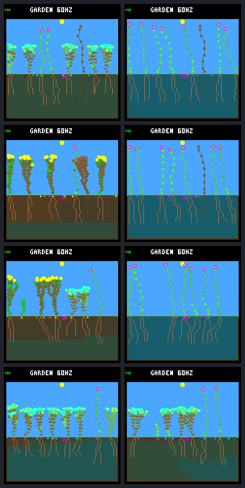

# Frozen-controller panel: selected comparisons

**Left: original controller `dc5e849d`. Right: pilot winner `fa0c2cd8`.**
All images are native 240×240 captures at day 192 (tick 737280).
Rows are the largest renewal-tick gain/loss within each schedule, chosen by
the frozen protocol. These are outcome-selected examples, not representative samples.

| Row | Selection | Patch schedule | World seed | Renewal ticks, original → winner |
|---:|---|---|---|---:|
| 1 | largest-gain | fresh-1 | `2f7ac3ab` | 80,580 → 179,520 |
| 2 | largest-loss | fresh-1 | `03cc2e9f` | 263,985 → 107,640 |
| 3 | largest-gain | fresh-2 | `56b77147` | 0 → 321,195 |
| 4 | largest-loss | fresh-2 | `1a685a80` | 278,385 → 166,215 |

## Native frames and identities

| Frame | World hash | Framebuffer CRC32 |
|---|---|---|
| [largest-gain.fresh-1.2f7ac3ab.control](pilot-validation-frames/largest-gain.fresh-1.2f7ac3ab.control.png) | `04fce6cd` | `c7afde4c` |
| [largest-gain.fresh-1.2f7ac3ab.winner](pilot-validation-frames/largest-gain.fresh-1.2f7ac3ab.winner.png) | `489ebc46` | `ab0b55a4` |
| [largest-loss.fresh-1.03cc2e9f.control](pilot-validation-frames/largest-loss.fresh-1.03cc2e9f.control.png) | `1b66325e` | `5ff7e154` |
| [largest-loss.fresh-1.03cc2e9f.winner](pilot-validation-frames/largest-loss.fresh-1.03cc2e9f.winner.png) | `190ed9df` | `5801faa7` |
| [largest-gain.fresh-2.56b77147.control](pilot-validation-frames/largest-gain.fresh-2.56b77147.control.png) | `3d6e13dc` | `298486c7` |
| [largest-gain.fresh-2.56b77147.winner](pilot-validation-frames/largest-gain.fresh-2.56b77147.winner.png) | `e8fe2b13` | `a77ccd02` |
| [largest-loss.fresh-2.1a685a80.control](pilot-validation-frames/largest-loss.fresh-2.1a685a80.control.png) | `60277402` | `3ca169c1` |
| [largest-loss.fresh-2.1a685a80.winner](pilot-validation-frames/largest-loss.fresh-2.1a685a80.winner.png) | `7f4b9c61` | `8124d3ec` |

All scored endpoints were checked against independent replays; these eight frames
also reproduced pixel-for-pixel on separate resets. Pictures did not affect scores.

[All paired scores, cohorts and diversity counts](pilot-validation-summary.json).

Bundle manifest SHA-256: `72abe5ba419b280ad02c5a9dd912b06f4caf27d6f08132d683b966824d161815`.
