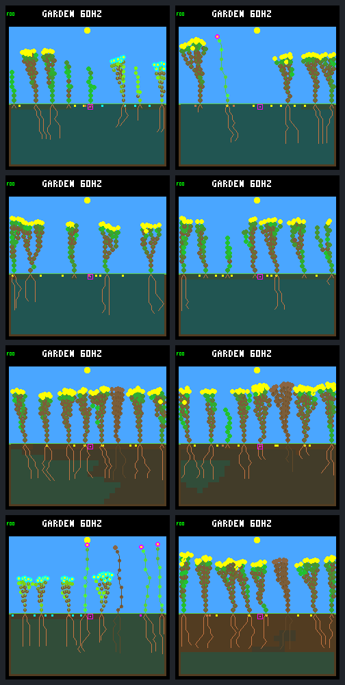

# Crowded recruitment: seeds are available, usable vacancies are scarce

The [predeclared eight-run diagnostic](recruitment-sites-protocol.md) is complete.
It replays selected adverse and better-performing pairs from the
[640-run reserve comparison](reserve-panel.md), with no policy, model or ecology
changes. These are post-hoc explanatory cases, not an unseen test set.
Progress notes are also recorded on [issue #30](https://github.com/aortez/toy-factory/issues/30#issuecomment-5649084513).

**Result:** the 256-node regression is dominated by living-tissue storage pressure;
at 512 nodes, plant slots, spacing, shade and surface moisture overlap instead.
Seed production continues in every case. The reserve gate changes body layout,
natural mortality and which plants the fixed patches hit, so its survival benefit
does not translate uniformly into recruitment. No default or training milestone
is promoted by this diagnostic.

## Matched outcomes

All runs use drainage off, selective leaf renewal, fixed model `dc5e849d`, and
192 Garden days (737,280 logic ticks). Baseline means `neural-no-night-growth`;
reserve adds the unchanged `energy-reserve-v1` gate. All layouts are crowded.
Closing offspring are born during days 160–192. A day survivor lives past its
first full-day boundary; it need not remain alive at the final checkpoint.

| Nodes / seed / schedule | Closing births, baseline → reserve | Day survivors / eligible | Durable parents | Closing occupied patch hits |
|---|---:|---:|---:|---:|
| 256 / `b61837dc` / fresh-4, adverse | 8 → 1 | 7/8 → 1/1 | 1 → 0 | 4/5 → 2/5 |
| 256 / `b61837dc` / fresh-1, comparison | 4 → 8 | 4/4 → 8/8 | 0 → 2 | 5/6 → 5/6 |
| 512 / `b61837dc` / fresh-1, adverse | 17 → 11 | 13/17 → 5/10 | 3 → 0 | 4/6 → 6/6 |
| 512 / `c7f54e18` / fresh-1, comparison | 3 → 9 | 3/3 → 7/9 | 0 → 0 | 4/6 → 4/6 |

The remaining reserve newborn in the 512 adverse case is alive but too recent
for a full day of follow-up. Durable parents and a child must each survive a
day. Different final populations do not retarget patches: the same fixed
columns/times can hit different numbers of living plants. Natural deaths in the
closing window also differ: 2 → 0, 0 → 2, 13 → 5, and 0 → 6 respectively.
More deaths or raw births alone are not a better ecological outcome.

## Seed supply versus establishment

Each case produces 255–265 seeds during the closing window. Every one of the
2,272 bright-day snapshots per run has at least one mature seed in the bank;
the bank is full in 96.0–99.2% of those snapshots. A global shortage of produced
or mature seeds is not the principal explanation for these selected cases.

| Pair | Fully followed closing seeds, baseline → reserve | Those seeds germinating | Those seeds expiring |
|---|---:|---:|---:|
| 256 adverse | 252 → 247 | 8 → 1 | 244 → 246 |
| 256 comparison | 251 → 249 | 4 → 8 | 247 → 241 |
| 512 adverse | 257 → 253 | 17 → 10 | 240 → 243 |
| 512 comparison | 248 → 252 | 3 → 9 | 245 → 243 |

These are seeds **created** during days 160–192 with a whole seed lifetime of
potential follow-up. They are not the same cohort as plants **born** during that
window; recent seeds are censored even if they germinate early. Full bank size
does not imply useful seed placement or guarantee continuing founder/species
diversity.

## Overlapping blockers at actual seed locations

Percentages below use remaining **mature-seed observations during bright day**,
not independent seeds, germination probabilities, or exclusive causes. Each
seed can have several blockers. Denominators are retained in the
[machine-readable summary](recruitment-sites-summary.json).

| Pair / policy | Node limit | Plant-slot limit | Spacing | Insufficient light | Insufficient surface water |
|---|---:|---:|---:|---:|---:|
| 256 adverse / baseline | 95.8% | 12.9% | 82.6% | 53.8% | 13.6% |
| 256 adverse / reserve | 96.8% | 0.0% | 83.2% | 54.6% | 11.1% |
| 256 comparison / baseline | 97.4% | 0.0% | 77.5% | 60.7% | 10.1% |
| 256 comparison / reserve | 93.2% | 0.0% | 95.7% | 64.5% | 17.8% |
| 512 adverse / baseline | 0.0% | 28.0% | 93.7% | 71.5% | 62.2% |
| 512 adverse / reserve | 0.0% | 47.3% | 96.3% | 77.9% | 77.1% |
| 512 comparison / baseline | 0.0% | 99.1% | 99.9% | 43.9% | 8.8% |
| 512 comparison / reserve | 0.0% | 84.3% | 98.0% | 78.3% | 84.9% |

In the 256 adverse reserve case, living tissue alone leaves fewer than four
free nodes in **97.36%** of all closing ecology snapshots. Dead tissue averages
only 0.61 nodes; this is not primarily a corpse-reclamation backlog. The final
world has five living plants and all 256 nodes occupied despite three spare
plant slots. Ignoring only the node blocker would leave some hypothetical site
open in 91.6% of bright snapshots, versus 3.3% under the actual rules. However,
only 10.5% of mature-seed observations are blocked by nodes alone: opening a
column does not move an existing seed into it.

None of the four 512-node runs encounters the seedling node gate anywhere in
the closing world census. In its adverse pair, sampled bright-day opening
frequency falls **26.5% → 11.7%**. Removing node checks changes nothing. Even
ignoring nodes, plant slots and spacing together leaves some site physically
viable in only 60.9% → 39.6% of bright snapshots. Light and water are joint
constraints here, not simply additional RAM pressure. Germination checks the
surface cell (minimum water 12, light 80), not total soil water or adult stores.

The successful 512 comparison is a useful warning against simplistic ranking:
it produces more survivors despite *more* sampled shade/water blocking. Its
plant-slot pressure is lower, while transient vacancies matter. These selected
pairs do not isolate a single causal effect of the gate or establish how much
any proposed rule change would help.

## A vacancy that existing plants recaptured

This close-up was selected **after** inspecting the diagnostic; it does not
replace the fixed comparison panel. In 256 / `b61837dc` / fresh-4 / reserve:

- The final patch, tick 720,750 (day 187.70), kills plant 24 with 46 nodes.
- Ordinary decomposition reclaims it at tick 721,650, 900 ticks later.
- That step ends with 212 occupied nodes and seven open columns:
  `0, 11, 12, 13, 14, 15, 16`. None of the eight banked seeds is at an open
  location; six are mature and two are dormant.
- At tick 722,670, existing growth has left only three free nodes—insufficient
  for a four-node seedling. The usable node-headroom window lasted about 17
  seconds of simulated time (0.266 Garden days).
- By tick 725,325, the same five surviving plants have absorbed all 46 nodes:
  plant 20 adds 1, plant 25 adds 22, plant 27 adds 23. No new plant germinates.

The retained hashes, seed positions/masks and node deltas are exported by
`review-recruitment-sites.py`. This is evidence of a missed vacancy and subsequent
incumbent growth, not proof that relocating a seed or reserving nodes would yield
a durable descendant.

## Timing limitation and next question

Seed-site queries occur **after** germination, growth, reproduction and the final
light update. Successfully germinated seeds are already absent. All eight runs
therefore have zero sampled mature seeds at completely open actual locations,
despite observed births. The baseline 512 comparison even has zero sampled
bright-day open columns while three closing seedlings germinate. Post-step
sampling can miss an opening consumed during that step.

World/site hashes and ancestry reconcile actual births and seed outcomes, but
snapshot blocker fractions cannot fully attribute failed *attempts*. Before
changing ecological spacing, mortality, dispersal, or allocation, the next
bounded diagnostic should observe the actual seed checks around vacancy openings:
blockers immediately before each germination attempt, seed age/location, and
capacity use before/after germination versus existing-plant growth. Keep it
read-only and hash-neutral. This would distinguish missed landings, transient
light/water windows, and incumbent allocation without another broad sweep.

## Native visual review

Columns: baseline, reserve. Rows match the four paired table entries above.
All images are day-192 native 240×240 renders, not new device screenshots.
They illustrate structure; they do not measure turnover or expose seed-site
timing. The complete bundle retains raw RGB565, PNG and replay metadata.



## Reproduction and checks

```sh
python3 sim/garden_recruitment.py \
  --baseline-256 artifacts/garden-reserve-panel-256 \
  --baseline-512 artifacts/garden-reserve-panel-512 \
  --output artifacts/garden-crowded-recruitment --jobs 2
python3 benchmarks/garden-longevity/review-recruitment-sites.py \
  --reanalyze --output artifacts/recruitment-sites-review.json
```

Outputs must be new. The collector verifies and copies the prior executables,
model, input analyses, censuses and native frames. It requires unchanged native
C/header sources and snapshots current diagnostic sources before running.
Original bundle `artifacts/garden-crowded-recruitment`:
`7c3e50235343b2a223e607bbacbfe6d06f55b735c0ea452fc777ed04e1b5ef77`.

All 111 recorded artifacts verify. Eight runs contain **393,224 per-step
world/site checkpoint comparisons**, 2,450 frozen sparse checkpoints, 12,386
reconciled seed lifetimes and 240 matched disturbance boundaries. Final states,
lineages and closing/post-establishment cohorts match the broad study exactly.
All 24 independent day-64/128/192 replay hashes and eight final frame CRCs/raw
byte comparisons pass. All **105 CTests** pass across default, 256/512 maintained,
and 256/512 drainage builds (33 + 22 + 22 + 14 + 14).

After collection, sparse-census completeness/order rejection was tightened and
its regression tests rerun; `--reanalyze` verifies identical analyses from all
eight frozen traces with that stronger check. This report, its exported review,
image and review helper are post-collection artifacts, not part of the original
335-file source snapshot. Full traces retain ordinary pre-patch rows; separate
validated boundaries supply post-patch observations. Patch-follow-up intervals
exclude the next boundary, with ordinary births at that boundary recorded
separately. Erased terminal resource income remains explicitly unaccounted.

No firmware, model, policy or world rules were changed. No training, deployment,
commit or push was performed by this investigation.
