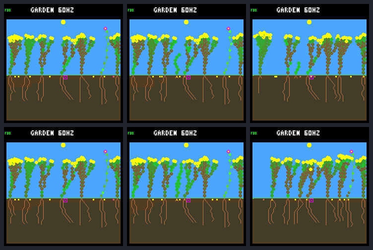

# Fractional canopy light improves survival, but not continuing renewal

The [fixed host-only A/B](renewal-canopy-transmission-protocol.md) changes only
canopy attenuation after the shared tick 69,120. It preserves night, sunlight
geometry, controllers, rain, costs, two-column spacing and all capacities.

**Both new seedlings survive, and the flower and rescued shrub remain alive.**
However, only two seedlings establish instead of nineteen. Neither new plant
produces a germinated child, and plant slots are full at 99.0% of subsequent
checkpoints. This is a mixed result: better survival and species retention,
but it fails the predeclared continuing-renewal gates. Keep it opt-in/off by
default; no training or firmware change.

## Exact optical change

The original solver subtracts each canopy cell's shade from sunlight until it
reaches the ambient floor, 24. The candidate treats that same cell shade as
opacity instead:

```text
beam = sun_strength - 24
for each cell on the existing target-to-sky ray:
    beam = (beam * (255 - shade) + 127) // 255
light = 24 + beam
```

Rounding is nearest integer at each cell. There is no fitted coefficient.
Cell shade aggregation, saturation, leaf condition, maturity and dead-tissue
shade are unchanged. Empty rays remain unchanged; opaque cells remove all
above-ambient light. At night, beam is zero and light remains 24. The unchanged
photosynthesis calculation produces **zero nighttime energy**.

The normal build keeps the original solver. The experimental per-world flag
resets off, requires the existing spacing experiment, rejects firmware, and is
recorded separately from physical state hashes. First physical divergence is
exactly the first post-boundary ecology step, **69,135**. All 46,704 world/bid
and 4,613 site prefix records and boundary pixels match through 69,120; only
explicit optical configuration metadata differs. The rebuilt additive control
also reproduces the historical two-column traces, frames and derived outcomes.

## Fixed 64-day comparison

This is the same selected `rainfed-crowded` world, seed `0d983a80`: N model
`01b9d94a` for the background/new descendants, W `c9ea07fd` for founder 5.
Both arms retain the earlier named founder export, wet germination, reserve-aware
FINISH handoff, rotating purchases, eight plant slots/eight seeds/512 nodes,
and existing growth guards. No parameter search or horizon extension.

| Outcome through tick 245,760 | Additive control | Fractional transmission |
| --- | ---: | ---: |
| Births after the shared boundary | 19 | 2 |
| New seedlings surviving a full day / eligible | 6 / 17 | 2 / 2 |
| New seedlings alive at endpoint | 3 | 2 |
| New seedling deaths | 16 | 0 |
| Deaths among seven boundary incumbents | 3 | 1 |
| New full-day parents with a full-day-surviving child | 0 | 0 |
| Births / deaths in closing 16 days | 10 / 11 | 1 / 1 |
| Whole-run births / natural deaths | 26 / 23 | 9 / 5 |
| Final living / descendants | 7 / 5 | 8 / 5 |
| Final species / founder families | 1 / 2 | 2 / 3 |
| Whole-run seed purchases / germinations / expiries | 520 / 26 / 486 | 514 / 9 / 497 |
| Final node use / capacity | 357 / 512 | 429 / 512 |

Eight seeds remain pending in each arm. The earlier identical founder export
is not a natural death. The control has two recent seedlings without a full
day of potential follow-up (one alive, one dead); the candidate has none.
Two out of two is not a general success rate or evidence of better renewal.

The predeclared positive signal required more than six new full-day survivors,
at least one new full-day parent with a full-day-surviving child, no extra
incumbent losses, and no loss of endpoint species/families relative to control.
The candidate passes the three retention gates but **fails both renewal gates**.
The broader environment remains unqualified.

## What the live budgets show

The two candidate children are shrubs: parent 12's child 13, born at 70,050,
and parent 6's child 14, born at 202,335. They survive 45.76 and 11.31 days of
observed follow-up, respectively. They buy 33 and three seeds, but none of those
seeds germinates by the endpoint. IDs after divergence are arm-local; candidate
14 is not the control's plant 14.

Both start with the unchanged 64 energy / 24 water. Their first observed income
arrives at 72,330 and 202,875. First-day gross energy income is 1,015 and 1,412,
with 464 and 831 lost to storage overflow. All first-day upkeep is paid. They
finish that day with 208 and 66 energy, respectively. Among each child's 107
bright-sky sampled leaves, none is at the ambient floor, although 57 and 33
are still below the first photosynthetic band. These are one-leaf observations,
not measurements of the entire canopy.

Flower 5 retains its 36-node/eight-leaf body. In the first shared day after the
switch, gross income rises from 662 to 871, but overflow also rises from 240
to 449; both arms end that day with the same 242 energy. More photons do not
automatically increase stored reserves. Later trajectories differ: the control
flower dies energy-starved at 214,200; the candidate survives through 245,760
with 207 energy, 510 water and zero stress. It pays all recorded post-boundary
upkeep and makes 174 successful leaf renewals. Rescued shrub 12 also survives.

Incumbent 7 still dies water-starved, at 200,580 instead of 200,160. More light
does not repair this water limitation. Also, the flower buys only one seed after
the boundary versus 29 in control. The A/B changes subsequent growth, bank
competition and spending as well as illumination; it does not isolate extra
light as the sole direct cause of the flower's rescue.

## The allocation ceiling remains visible

The candidate plant array is full at **11,658 / 11,776** post-boundary checkpoints
(99.0%), versus 11,025 / 11,776 (93.6%) in control. In the closing window those
figures are 4,039 / 4,096 (98.6%) and 3,860 / 4,096 (94.2%). No sampled checkpoint
lacks the four node slots needed to create a seedling. Spacing never blocks
every column, but the candidate has no completely open post-step column query.

These queries occur after germination can consume a vacancy: zero open queries
does **not** mean there were zero germination opportunities. The two recorded
births prove otherwise. Allocation, spacing and moisture gates may overlap;
occupancy alone does not establish that raising the plant limit fixes renewal.
Pre-step root audits again find no shared-root-cell exposure in the audited live
steps. Indirect water competition is still possible.

Next proposal: use these saved seed/site traces to distinguish cases blocked
only by the eight-plant allocation limit from those also blocked by space or
moisture. That can inform one bounded capacity/competition test. Do not yet
increase capacity, force adult deaths, tune opacity or resume training.

## Native screenshots



Rows: additive control, fractional transmission. Columns: shared tick 69,120;
one day later at 72,960; endpoint 245,760. All six native 240×240 framebuffers
were predetermined, replayed twice, exported and visually reviewed. Boundary
images match. The candidate's middle frame shows a larger new shoot; its endpoint
retains the pink-tipped flower on the right and eight living plants. The HUD's
60 Hz is configured simulation cadence, **not a measured device frame rate**.
No RP2040 performance claim is made by this host-only experiment.

## Verification and evidence

- [Portable summary](renewal-canopy-transmission-summary.json), SHA-256
  `ad7c804d94fb9ac687a7d0c5175982579ba2b118336f425b1316fb3a857ccc60`.
- Frozen bundle: `artifacts/garden-renewal-canopy-transmission-v1`, manifest
  `ea243a36dccd49eda1db5cbfc30956ebf281e81013fec5a4adc8e69bc7212b69`.
- Full results SHA-256
  `efbe0db265018a5b3bdb9233e7c6c6d4624fc354040510cd5735fd4b8d3fe826`.
- Exactly **20/20** declared experimental native calls, no capture/analysis
  failures, no additional research runs. Capture took 26.1 host seconds;
  analysis and its repeat took 79.5 seconds. These include tracing/auditing,
  not a production rendering benchmark.
- **243,005 live resource budgets, 1,034 seed lifetimes and 32,770 site
  checkpoints** checked. All 28 cleared natural-death steps remain explicitly
  unaccounted, not reconstructed as upkeep. Historical seedling-light summaries
  match exactly, with both candidate seedlings and founder 5 fully audited.
- Native fixtures cover empty/stacked/opaque rays, both directions, night,
  reset, per-world isolation, exact activation and invalid-input preservation.
  An independent Python integer reference agrees for all **256 phases × 392
  cells**. Nine new Python cases include parser/header/provenance checks.
- Strict conversion warnings, UBSan, formatting, default golden hashes,
  **88/88 default and 91/91 experimental CTests** pass. Repeated analysis,
  host export and independent Docker export verification agree.

```sh
docker compose run --rm --no-deps firmware python3 -W error \
  sim/garden_renewal_canopy_transmission.py \
  --output artifacts/garden-renewal-canopy-transmission-v1 \
  --verify --check-export benchmarks/garden-longevity/renewal-canopy-transmission
```

Work remains local, uncommitted and unpushed. No default promotion or device flash.
