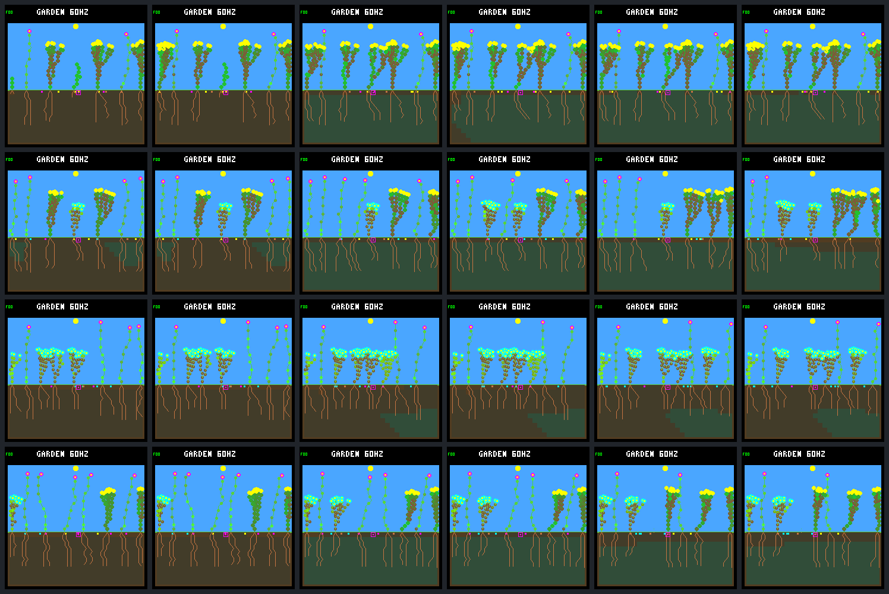

# Full-night growth guard: two rescues, not better renewal

The host-only capacity guard keeps **two of the three targeted plants alive
through day 64**. Both continue maintaining leaves and producing seeds, but
**none of their 43 seeds becomes an offspring during the run**. Whole-world
natural deaths fall, alongside fewer births and fewer durable descendant
parents. This closes a specific overgrowth failure without qualifying the
environment or establishing a better reproductive policy.

The [fixed protocol](renewal-capacity-guard-protocol.md) was
[posted before capture](https://github.com/aortez/toy-factory/issues/30#issuecomment-5748013892).
These are four selected development worlds, not held-out validation. The
control retains the ordinary dark-spending guard; the treatment adds only
`TOY_FACTORY_GARDEN_NIGHT_CAPACITY`. No model, energy cap, upkeep, seed rule,
spacing rule, fitness, firmware or default build changes.

## The intervention

Only an otherwise permitted, winning EXTEND that would append a node is
checked. The existing exact projector asks whether the proposed fixed body
could survive the complete zero-income interval from 256 energy, zero stress,
adequate water and no optional spending. The current mechanics imply a
64/65-node boundary; the implementation projects the budget rather than adding
a tunable size threshold. FINISH, blocked EXTEND, WAIT, leaf renewal and seeds
are outside this additional check.

Following the embedded-C conventions, rejection is transactional: no growth
payment, node change, private memory/RNG advancement, phase advancement or
committed-decision telemetry. Automatic seed production later in the same
world step remains possible. The new bounded, world-owned diagnostics are
separate from the ordinary guard and excluded from simulation hashes.
No lower-priority fallback bid is selected. Retrying is a measured outcome.

## Target outcomes

| World / target | Control | Capacity guard | Lifetime seeds, control → treatment | Treatment offspring |
| --- | --- | --- | ---: | ---: |
| `0d983a80`, no patches, shrub 7 | Energy death at 40,980 | Alive at 245,760 | 1 → 15 | 0 |
| `58e36558`, patches, ground-cover 12 | Energy death at 137,280 | Alive at 245,760 | 0 → 28 | 0 |
| `beda710e`, patches, ground-cover 15 | Energy death at 140,880 | Energy death at 141,240 | 0 → 0 | 0 |
| `abf7af73`, patches | Negative control | No refusal; behavior unchanged | Unchanged | Unchanged |

The three treated traces first diverge at the declared 64 → 65 purchases:
37,605, 134,940 and 138,765. All preceding raw records agree after removing the
new diagnostics, and no other plant changes at those first transactions.
Later newborn IDs are not treated as matched individuals across divergent arms.

Both rescued plants enter their first full dark interval at **64 nodes,
253 energy, zero stress**. They finish it alive at stress six; all 149
energy/stress steps match the independent reference, with no intervening
spending or other assumption break. They remain alive at the endpoint, which
is not a claim of indefinite survival.

The third plant demonstrates the remaining reserve problem. It enters night
at **64 nodes but only 237 energy**; the minimum at zero stress is **240**.
Its death is predicted exactly at 141,240, 45 logic ticks before the first
possibly productive step. Refusing growth delays death by 360 ticks (six
simulation seconds) but cannot repair the three-unit entry deficit. This is
not a water failure or an unaccounted night purchase.

## Repeated refusals and useful activity

Counts below are after the first capacity refusal, including that step.
Consecutive streaks mean adjacent ecology steps, not independent plants or
permanently identified tips; node indices can move during reclamation.

| Target | Refusals | Longest consecutive streak | Paid EXTEND / FINISH | Leaf renewals | Seeds | Committed WAIT |
| --- | ---: | ---: | ---: | ---: | ---: | ---: |
| Shrub 7 | 5,241 | 71 | 0 / 0 | 537 | 15 | 6,048 |
| Ground-cover 12 | 2,636 | 100 | 0 / 0 | 253 | 28 | 3,280 |
| Ground-cover 15 | 18 | 18 | 0 / 0 | 0 | 0 | 104 |

The treatment evaluates **10,854** eligible node additions and refuses
**7,895 attempts on three plants**, not 7,895 separate rescue opportunities.
The two survivors stay at 64 nodes and retry through the endpoint. Their
maintenance and automatic reproduction continue, but their growth decisions
never progress to another paid EXTEND or FINISH. The no-night-growth policy
also emits WAIT, so those waits are not proof that the network learned to adapt
to the capacity constraint. No new training occurred.

Refused cost sums in the machine-readable evidence are repeated hypothetical
purchase costs, **not additive causal resource savings**. The original guard
continues to make its own separate decisions after the worlds diverge.

## Whole-world consequences

Every arrow is control → capacity treatment. Full-day survivors include only
offspring with at least one complete day of possible follow-up. A durable
descendant parent and at least one child both survived a full day.

| World / condition | Natural deaths | Patch deaths | Births | Full-day survivors / eligible | Durable descendant parents | Final living species |
| --- | ---: | ---: | ---: | --- | ---: | ---: |
| `0d983a80`, no patches | 3 → 2 | 0 → 0 | 5 → 4 | 4/5 → 3/4 | 0 → 0 | 2 → 2 |
| `58e36558`, patches | 6 → 4 | 7 → 7 | 15 → 13 | 12/14 → 10/12 | 1 → 0 | 3 → 3 |
| `beda710e`, patches | 6 → 6 | 5 → 5 | 14 → 14 | 11/14 → 11/14 | 3 → 3 | 2 → 2 |
| `abf7af73`, patches | 17 → 17 | 6 → 6 | 26 → 26 | 16/25 → 16/25 | 5 → 5 | 3 → 3 |

Natural deaths in the first and fourth worlds are all energy deaths. The
second changes from five energy plus one water death to three plus one;
the third remains five energy plus one water death. These selected pairs
cannot establish a population-wide mortality rate or count three old-plant
rescues: only two predeclared target lifetimes are rescued, and the subsequent
birth histories also change.

Across this selected set, totals change as follows:

- Natural deaths **32 → 29**; patch deaths **18 → 18**.
- Births **60 → 57**; full-day survivors **43/58 → 40/55**;
  durable descendant parents **9 → 8**.
- Seed production **2,067 → 2,067**, with descendant-produced seeds
  **809 → 811**. The two rescued plants themselves produce 43 without an
  observed child; extra seed production is not successful recruitment.
- Living exposure **481,794 → 482,432 plant-steps**, a **0.13%** increase.
  Per-pair changes are +336, +278, +24 and zero steps in table order.
- Final population sizes remain 7, 7, 8 and 8. Living-plus-seed-bank species
  sets are unchanged: flower/shrub; all three; flower/ground-cover; all three.
  In `58e36558`, the living mix changes from three flowers/one ground-cover/
  three shrubs to two/two/three. Species counts alone hide that replacement.

The closing **day-48–64** window gains no births or full-day offspring
survivors in any pair. Combined births stay seven, survivors 5/5, durable
parents zero, natural deaths one and patch deaths seven. Seed production
stays 514, while descendant-produced seeds fall 267 → 264. Living exposure
increases by 409 steps, entirely in `58e36558`. The unpatched pair still has
no closing births. Thus this is adult/descendant persistence, not evidence of
improved continuing generational renewal.

## Fixed native screenshots

All 24 unique 240 × 240 production-renderer frames are retained, with exact
state/CRC and repeated framebuffer checks. No favorable frames were selected
afterward. These are simulator framebuffer captures, not generated artwork.

Columns: **day 12 control/treatment**, **day 40 control/treatment**,
**day 64 control/treatment**. Rows: `0d983a80` no patches, then patched
`58e36558`, `beda710e`, `abf7af73`.

Native individual files are in [renewal-capacity-guard-frames](renewal-capacity-guard-frames/).
The negative-control image pairs are byte-identical. Visually fuller crowns
and living plants cannot establish parentage or successful seed recruitment;
use the accompanying lifetime records.

## Verification and evidence

- Exactly **64 experimental native calls**: 16 full traces and 48 frame
  replays. All repeats agree; all four rebuilt controls reproduce the saved
  guarded traces byte-for-byte and reproduce the old endpoint images.
- The negative control matches all **156,005 raw records** after removing
  only the new diagnostics, plus its summaries, lifetimes and fixed images.
- Every new capacity receipt agrees with both the Python dark projector and
  independent storage arithmetic. **42,779 ordinary-guard expense receipts**
  and **964,282 live resource budgets** reconcile. Natural terminal budgets
  remain cleared rather than reconstructed. Patch boundaries are not extra
  ordinary steps.
- Both complete analysis passes agree. Frozen protocol, input manifests,
  native sources, build flags, binaries, models and captured artifacts are
  hash-checked. Collection took 67.66 seconds; analysis plus its first repeat
  took 338.55 seconds. These include diagnostic overhead, not a simulation
  throughput benchmark.
- **76 default, 73 control and 74 treatment CTests pass**, with UBSan and
  strict warnings. Eleven new Python cases include all-512-body native parity;
  the native fixture covers transactional boundaries, both arbitration modes,
  reset/hash exclusion, invalid inputs, overflow and untouched no-node actions.
- Two existing C fixtures were corrected to recognize the *ordinary* dark
  guard's seed refusal and successful-renewal receipt. Both failures also
  occurred with the new intervention disabled; no production behavior was
  changed to satisfy them. Formatting and `git diff --check` pass.

The [portable JSON](renewal-capacity-guard-summary.json) contains per-pair whole
and closing results, every refusal, per-plant retries/actions, target night
budgets, all lifetimes/daily samples, model/source provenance and all frame
metadata. The full local bundle is
`artifacts/garden-renewal-capacity-guard-v1`; it is ignored, not remotely
available. The portable report, JSON and PNGs remain uncommitted until reviewed.

Bundle manifest SHA-256:
`f8e7237a0db166e15fe802c12e78b5a0f76b539fd853888d7fbc2efdc7a33d2f`.
Portable JSON: 1,785,410 bytes, SHA-256
`25a11c7b3033aaecdc6f6f5e388953ebe551be2d1072a6c5edf715231052a03e`.
Its contents and all 25 PNG files (24 native frames plus overview) match the
completed frozen bundle exactly.

## Next proposal

Keep this an off-by-default diagnostic, not a permanent ecology quota. Next,
audit the **43 seeds from the two rescued plants** using these saved traces:
which sites they reached, germination blockers, expiry and remaining bank
entries. This can distinguish a recruitment-opportunity problem from an adult
maintenance problem without another native run or changing spacing.

Retain the growth-retry finding and the 237/240 reserve failure as separate
limitations. Do not silently add fallback decisions, invent a larger safety
margin, or resume training on the strength of two adult rescues. Discuss any
such mechanism change after the recruitment evidence.
