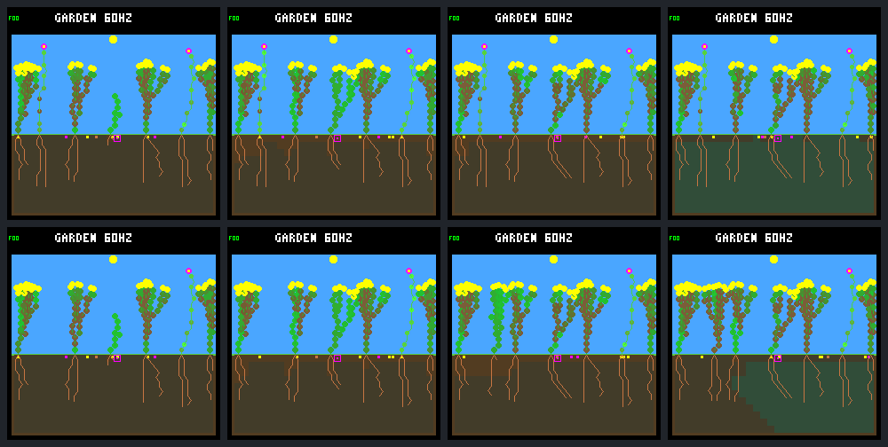

# One gap recruits a surviving sibling, not a second generation

Removing one blocking flower creates an establishment opportunity: **one new
shrub germinates, survives its first day and remains alive at day 64**. But its
parent is founder shrub 2, **not rescued shrub 7**. Shrub 7 produces more seeds
(15 → 20) without establishing a child. Two of its seeds reach spacing-free
ground yet expire while their recorded light/moisture gates never overlap.

Thus recruitment is possible after an opening, but neither the rescued parent's
reproductive success nor sustained generational renewal is demonstrated. This
is one selected deterministic world, not an environment-qualification panel.
The [fixed protocol](renewal-controlled-gap-protocol.md) was
[posted before collection](https://github.com/aortez/toy-factory/issues/30#issuecomment-5764617515).

## The fixed intervention

Both arms use world `0d983a80`, the existing mixed N/W founder routing, ordinary
dark-spending and full-night capacity guards, selective leaf maintenance,
512 nodes, wide dispersal, water headroom and eight plant/seed slots. There is
no gardener or recurring patch schedule. Seed lifetime, spacing, models and
all production simulation code are unchanged.

Immediately after the ordinary day-12 step (tick **46,080**), the treatment
exports **founder flower 1 at column 3**: 36 nodes, 240 stored energy and 510
stored water. World hash changes `5eea8cea` → `adf1a789`. Other plants and the
ordered seed bank are unchanged; body indices are compacted and light is
recomputed. The export advances neither time nor RNG and is not counted as a
natural death or decomposition event. No resources are refunded to the soil.

The embedded-C review led to a named-lineage wrapper around the existing
transactional export primitive. It rejects missing, dead or young targets
without changing the world or result; it never substitutes another plant.
The old largest-adult option remains unchanged. Explicit named export supports
the existing stable-lineage controller routing after index compaction.

## Who establishes in the gap?

| Event | Tick | Evidence |
| --- | ---: | --- |
| Flower 1 exported | 46,080 | Six living plants remain; shrub 7 and founder shrub 2 are untouched |
| Founder shrub 2 makes the successful seed | 57,240 | New seed lands at column 5; it was not in the bank at export |
| That seed germinates as shrub 10 | 57,360 | First eligible check, age eight; parent 2, generation one |
| Shrub 10 completes its first day | 61,200 | Alive, 41 nodes, 118 energy, 503 water, zero stress |
| Endpoint | 245,760 | Shrub 10 remains alive with 61 nodes |

The first recruitment comes **11,280 logic ticks / 752 ecology steps** after
export, just under three garden days. The seed's last pre-germination snapshot
at 57,345 has only the dormancy blocker; its observed birth confirms successful
germination at the next step. The birth snapshot already includes one growth
purchase (five nodes, 56 energy, 19 water), rather than only the initial
four-node endowment.

The seedling does encounter an energy shortage at 60,780, reaching stress one,
but recovers to zero stress by the full-day checkpoint. It eventually produces
one seed at 149,580, landing at column 9 and expiring at 153,420. It establishes
no offspring. Shrubs 7 and 10 are siblings from founder 2; this is **another
first-generation recruit, not a second-generation success**.

The exported flower's one pending seed is retained: created at 42,420, column
7, it expires at 46,260 in both arms. No seed is silently discarded with its
parent, and the family eventually disappears rather than gaining a replacement.

## Why shrub 7 still has no offspring

Removing flower 1 frees spacing at columns **3–5**. Columns 1–2 remain excluded
by shrub 7 at column 0; columns 6–9 remain excluded by founder shrub 2 at column
8. The three newly spacing-free columns stay that way for 752 ecology intervals,
until shrub 10 at column 5 excludes them again.

Spacing-free is not the same as germination-ready:

| Column | Spacing-free intervals | Post-step intervals with all site gates open | First → last open snapshot |
| --- | ---: | ---: | --- |
| 3 | 752 | 35 | 46,080 → 46,590 |
| 4 | 752 | 26 | 46,080 → 46,455 |
| 5 | 752 | 27 | 46,080 → 57,345 |

The open snapshots at column 5 are intermittent, not one continuous interval.
Control has zero spacing-free or fully open intervals in any of columns 1–5.
Exposure uses post-export state for `[tick, tick + 15)` and excludes the final
endpoint. Seed checks at the export tick happened *before* removal and are not
counted twice.

Two of shrub 7's later seeds actually land in that opening:

| Seed creation → expiry | Column | Mature snapshots: moisture only | Light only | Both | Spacing/plant/node blockers |
| --- | ---: | ---: | ---: | ---: | ---: |
| 49,560 → 53,400 | 3 | 40 | 91 | 117 | 0 |
| 53,400 → 57,240 | 4 | 37 | 96 | 115 | 0 |

Each has all 248 possible mature snapshots before expiry. Neither ever has an
empty post-step mask. Their destination columns' earlier fully open snapshots
precede their arrival. Another seed from shrub 7, made at 49,800, lands at the
occupied column 8; a reachable alternative is observed open at 53,490, but that
seed cannot move there. Reachable support is not a successful alternative draw.

After shrub 10 establishes, its exclusion range closes the opening. Shrub 7
remains alive through the endpoint, purchases **20 seeds versus 15 in control**,
but **all twenty expire**. Control has fourteen expiries and one pending seed,
which is censored rather than failed. Eighteen treatment purchases occur after
export: two have the 496 spacing-free mature observations above; the other
sixteen have 3,968 spacing-blocked observations. No treatment seed is pending
at the endpoint.

These are **post-step light/moisture queries**, after the actual germination
loop and later growth/light updates. They identify a resource-timing question,
not exact decision-stage receipts or an independently isolated water/light
cause. The successful seed's birth is an outcome; the failed seeds' snapshot
masks are supporting diagnostic evidence. Removing a neighbor changes shade,
water uptake, capacity and competition as well as spacing.

## Whole-world consequences

Arrows are control → named-gap treatment; all figures end at day 64.

| Measure | Control | Gap |
| --- | ---: | ---: |
| Natural deaths | 2 | 2 |
| Explicit exports | 0 | 1 |
| Births | 4 | 5 |
| Full-day survivors / eligible offspring | 3/4 | 4/5 |
| Durable descendant parents | 0 | 0 |
| All seed purchases | 512 | 513 |
| Descendant-produced seeds | 73 | 116 |
| Living plants | 7 | 7 |
| Living descendants | 3 | 4 |
| Living flowers / shrubs | 2 / 5 | 1 / 6 |
| Living-plus-bank founder families | 4 | 3 |
| Final nodes | 354 | 379 |

Neither arm has a natural death after the intervention. The treatment's whole
living exposure is lower by exactly the vacancy: **111,224 → 110,472
plant-steps**, a difference of 752. More final descendants do not imply more
total living exposure or a retained flower family.

In the closing **day-48–64 window**, both arms have **zero births and zero
natural deaths**, 128 new seeds and seven living plants. Descendant seed
production rises 19 → 33, but there is no second generation in either arm and
the maximum generation stays one. One successful opening fills, then renewal
stops again. This does not justify adopting a turnover schedule or resuming
training on a claimed continuing-renewal success.

## Fixed native screenshots

Top row: control. Bottom row: named export. Columns: **days 12, 13, 16, 64**.
The day-12 treatment image is immediately after removal. All eight unique
240 × 240 frames use the production renderer and have exact repeated state,
framebuffer and CRC checks; no favorable frame was selected afterward.



[Individual native PNGs](renewal-controlled-gap-frames/) retain the original
resolution. The disappearing left-hand flower and later shrub crown match the
lineage records, but the images alone cannot establish parentage or generations.

## Verification and evidence

- Exactly **24 experimental native calls**: eight complete trace/site captures
  and sixteen frame replays. All repeats agree. All eight parent comparison
  cases were re-verified before new collection; no parent evidence was changed.
- Rebuilt control raw trace is byte-identical to the saved capacity arm;
  day-12/day-64 control frames reproduce the old JSON and pixels. The treatment
  matches **27,766 world/bid records and 3,073 site records** through the ordinary
  day-12 step. Boundary triples independently agree on export identity and cost.
- Across the pair, **1,025 seed purchases = nine recorded germinations + 1,000
  expiries + sixteen pending seeds**. All **250,246 mature seed observations**
  reconcile. Explicit native ages independently match the reconstructed ordered
  bank at all **32,770 site checkpoints**; ancestry/per-parent counters agree.
- All **19,818 ordinary expense receipts**, **11,333 capacity evaluations**
  and **221,701 live resource budgets** verify. Terminal cleared stores remain
  unaccounted, not invented as maintenance spending. The export is separate
  from biological mortality. Original production `src/*.c`/`*.h` files match
  the archived parent; only host gap plumbing and native tests changed.
- Ten new Python synthetic cases plus native CLI checks cover named selection,
  state preservation, missing/repeated events, prefix drift, seed ages/order,
  dead-plant support, window boundaries and full-day censoring. All **78 default
  and 76 experimental-build CTests pass** with UBSan/strict-warning builds;
  changed C files pass the formatter, and `git diff --check` passes.
- Repeated analysis agrees exactly. The separate portable export and recheck
  match every result and all nine PNGs (eight native frames plus overview).
  Collection took 23.70 seconds; initial analysis plus its repeat took 55.84
  seconds. These include diagnostics and repeated runs, not a throughput benchmark.

The [portable summary](renewal-controlled-gap-summary.json) retains all seeds
and lineages, target and competing-parent outcomes, first-day child snapshots,
site masks, export boundaries, guard receipts, exposure, fixed frames and
provenance. It is 2,696,693 bytes, SHA-256
`0b425bfa990c127cca2ca30b25327ddb62a15813f1210841460dbf6154cac352`.
The full local bundle is `artifacts/garden-renewal-controlled-gap-v1`, manifest
SHA-256 `6ed1985364c40524565131bcc2684dfb4dc1ad6e80d8c4c47693e871fee2effb`.
Reports and exports remain uncommitted. Recheck without more native calls:

```sh
docker compose run --rm firmware python3 -W error sim/garden_renewal_controlled_gap.py \
  --output artifacts/garden-renewal-controlled-gap-v1 --verify \
  --check-export benchmarks/garden-longevity/renewal-controlled-gap
```

## Next proposal

Before changing rainfall, seed lifetime or another spacing rule, discuss a
**small decision-stage germination trace for the two seeds that reached open
ground**, with the successful founder seed as comparison. Reuse the existing
seed-attempt instrumentation rather than infer exact light/water gates from
post-step snapshots. Freeze the identities/windows and require unchanged
trajectory hashes; this is observation, not another ecological intervention.

That would separate a real light/moisture timing mismatch from snapshot-stage
effects and explain why the competing seed's window worked. Keep broader,
seed-independent environmental-opening tests on the roadmap, but do not tune
a permanent disturbance schedule to this one selected world. No additional
capture, training, commit, push or deployment is made by this report.
