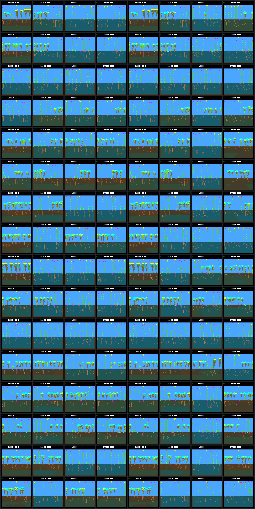
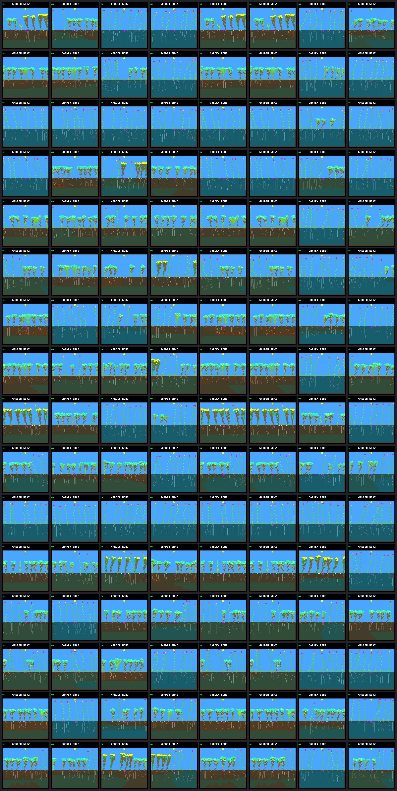

# Bounded-renewal world coverage: all review generations

Each sheet: columns **N0, N1, N2, N3, W0, W1, W2, W3**, all at day 192.
N/W train on 8/16 worlds using the same bounded-renewal selector and mutation budget.
N searches are reused; all fresh review captures are new. Review never selects parents.

| Row | Schedule | World seed |
|---:|---|---|
| 1 | review-1 | `5a30b7f3` |
| 2 | review-1 | `a9247dd8` |
| 3 | review-1 | `fc5f2200` |
| 4 | review-1 | `4f1d698e` |
| 5 | review-1 | `d0e9cf34` |
| 6 | review-1 | `e5fb561f` |
| 7 | review-1 | `f28238c7` |
| 8 | review-1 | `836f4103` |
| 9 | review-2 | `5a30b7f3` |
| 10 | review-2 | `a9247dd8` |
| 11 | review-2 | `fc5f2200` |
| 12 | review-2 | `4f1d698e` |
| 13 | review-2 | `d0e9cf34` |
| 14 | review-2 | `e5fb561f` |
| 15 | review-2 | `f28238c7` |
| 16 | review-2 | `836f4103` |

## R1 — mutation seed `d4146f83`

| Frame | Model CRC | Living | World hash | Framebuffer CRC |
|---|---|---:|---|---|
| [r1.narrow.g0.review-1.5a30b7f3](renewal-coverage-frames/r1.narrow.g0.review-1.5a30b7f3.png) | `dc5e849d` | 8 | `51bb6f32` | `9356e0b8` |
| [r1.narrow.g1.review-1.5a30b7f3](renewal-coverage-frames/r1.narrow.g1.review-1.5a30b7f3.png) | `a14ea8b7` | 8 | `10447d05` | `b3020697` |
| [r1.narrow.g2.review-1.5a30b7f3](renewal-coverage-frames/r1.narrow.g2.review-1.5a30b7f3.png) | `7ce0ed84` | 8 | `c5222412` | `76dbab5f` |
| [r1.narrow.g3.review-1.5a30b7f3](renewal-coverage-frames/r1.narrow.g3.review-1.5a30b7f3.png) | `7ce0ed84` | 8 | `c5222412` | `76dbab5f` |
| [r1.wide.g0.review-1.5a30b7f3](renewal-coverage-frames/r1.wide.g0.review-1.5a30b7f3.png) | `dc5e849d` | 8 | `51bb6f32` | `9356e0b8` |
| [r1.wide.g1.review-1.5a30b7f3](renewal-coverage-frames/r1.wide.g1.review-1.5a30b7f3.png) | `a14ea8b7` | 8 | `10447d05` | `b3020697` |
| [r1.wide.g2.review-1.5a30b7f3](renewal-coverage-frames/r1.wide.g2.review-1.5a30b7f3.png) | `0f4f52e0` | 8 | `ee993f5a` | `e9c7c013` |
| [r1.wide.g3.review-1.5a30b7f3](renewal-coverage-frames/r1.wide.g3.review-1.5a30b7f3.png) | `502e34a2` | 8 | `018b4fd0` | `7db6fcb8` |
| [r1.narrow.g0.review-1.a9247dd8](renewal-coverage-frames/r1.narrow.g0.review-1.a9247dd8.png) | `dc5e849d` | 8 | `3c6d4346` | `f769c2e5` |
| [r1.narrow.g1.review-1.a9247dd8](renewal-coverage-frames/r1.narrow.g1.review-1.a9247dd8.png) | `a14ea8b7` | 8 | `2eb0dbb7` | `48047ab3` |
| [r1.narrow.g2.review-1.a9247dd8](renewal-coverage-frames/r1.narrow.g2.review-1.a9247dd8.png) | `7ce0ed84` | 8 | `1ac829ce` | `face0a4d` |
| [r1.narrow.g3.review-1.a9247dd8](renewal-coverage-frames/r1.narrow.g3.review-1.a9247dd8.png) | `7ce0ed84` | 8 | `1ac829ce` | `face0a4d` |
| [r1.wide.g0.review-1.a9247dd8](renewal-coverage-frames/r1.wide.g0.review-1.a9247dd8.png) | `dc5e849d` | 8 | `3c6d4346` | `f769c2e5` |
| [r1.wide.g1.review-1.a9247dd8](renewal-coverage-frames/r1.wide.g1.review-1.a9247dd8.png) | `a14ea8b7` | 8 | `2eb0dbb7` | `48047ab3` |
| [r1.wide.g2.review-1.a9247dd8](renewal-coverage-frames/r1.wide.g2.review-1.a9247dd8.png) | `0f4f52e0` | 8 | `244ed69f` | `6d6e332f` |
| [r1.wide.g3.review-1.a9247dd8](renewal-coverage-frames/r1.wide.g3.review-1.a9247dd8.png) | `502e34a2` | 8 | `0a0a2cb0` | `8a107e51` |
| [r1.narrow.g0.review-1.fc5f2200](renewal-coverage-frames/r1.narrow.g0.review-1.fc5f2200.png) | `dc5e849d` | 8 | `c5777566` | `bb90b9ba` |
| [r1.narrow.g1.review-1.fc5f2200](renewal-coverage-frames/r1.narrow.g1.review-1.fc5f2200.png) | `a14ea8b7` | 8 | `1b6652c4` | `26e0eeeb` |
| [r1.narrow.g2.review-1.fc5f2200](renewal-coverage-frames/r1.narrow.g2.review-1.fc5f2200.png) | `7ce0ed84` | 8 | `86d1c17e` | `055572ad` |
| [r1.narrow.g3.review-1.fc5f2200](renewal-coverage-frames/r1.narrow.g3.review-1.fc5f2200.png) | `7ce0ed84` | 8 | `86d1c17e` | `055572ad` |
| [r1.wide.g0.review-1.fc5f2200](renewal-coverage-frames/r1.wide.g0.review-1.fc5f2200.png) | `dc5e849d` | 8 | `c5777566` | `bb90b9ba` |
| [r1.wide.g1.review-1.fc5f2200](renewal-coverage-frames/r1.wide.g1.review-1.fc5f2200.png) | `a14ea8b7` | 8 | `1b6652c4` | `26e0eeeb` |
| [r1.wide.g2.review-1.fc5f2200](renewal-coverage-frames/r1.wide.g2.review-1.fc5f2200.png) | `0f4f52e0` | 8 | `2708e429` | `9e51ab54` |
| [r1.wide.g3.review-1.fc5f2200](renewal-coverage-frames/r1.wide.g3.review-1.fc5f2200.png) | `502e34a2` | 8 | `38465411` | `58dbb634` |
| [r1.narrow.g0.review-1.4f1d698e](renewal-coverage-frames/r1.narrow.g0.review-1.4f1d698e.png) | `dc5e849d` | 8 | `ca0c885a` | `bb275978` |
| [r1.narrow.g1.review-1.4f1d698e](renewal-coverage-frames/r1.narrow.g1.review-1.4f1d698e.png) | `a14ea8b7` | 8 | `ebe39047` | `de0d884e` |
| [r1.narrow.g2.review-1.4f1d698e](renewal-coverage-frames/r1.narrow.g2.review-1.4f1d698e.png) | `7ce0ed84` | 8 | `cbf626f3` | `f64844b4` |
| [r1.narrow.g3.review-1.4f1d698e](renewal-coverage-frames/r1.narrow.g3.review-1.4f1d698e.png) | `7ce0ed84` | 8 | `cbf626f3` | `f64844b4` |
| [r1.wide.g0.review-1.4f1d698e](renewal-coverage-frames/r1.wide.g0.review-1.4f1d698e.png) | `dc5e849d` | 8 | `ca0c885a` | `bb275978` |
| [r1.wide.g1.review-1.4f1d698e](renewal-coverage-frames/r1.wide.g1.review-1.4f1d698e.png) | `a14ea8b7` | 8 | `ebe39047` | `de0d884e` |
| [r1.wide.g2.review-1.4f1d698e](renewal-coverage-frames/r1.wide.g2.review-1.4f1d698e.png) | `0f4f52e0` | 8 | `baafd1a5` | `fc66a90b` |
| [r1.wide.g3.review-1.4f1d698e](renewal-coverage-frames/r1.wide.g3.review-1.4f1d698e.png) | `502e34a2` | 8 | `b30e5183` | `d19002e1` |
| [r1.narrow.g0.review-1.d0e9cf34](renewal-coverage-frames/r1.narrow.g0.review-1.d0e9cf34.png) | `dc5e849d` | 8 | `1aef1cb3` | `af98e5f5` |
| [r1.narrow.g1.review-1.d0e9cf34](renewal-coverage-frames/r1.narrow.g1.review-1.d0e9cf34.png) | `a14ea8b7` | 8 | `784b3356` | `5995d358` |
| [r1.narrow.g2.review-1.d0e9cf34](renewal-coverage-frames/r1.narrow.g2.review-1.d0e9cf34.png) | `7ce0ed84` | 8 | `5e5048fd` | `6fa90a8f` |
| [r1.narrow.g3.review-1.d0e9cf34](renewal-coverage-frames/r1.narrow.g3.review-1.d0e9cf34.png) | `7ce0ed84` | 8 | `5e5048fd` | `6fa90a8f` |
| [r1.wide.g0.review-1.d0e9cf34](renewal-coverage-frames/r1.wide.g0.review-1.d0e9cf34.png) | `dc5e849d` | 8 | `1aef1cb3` | `af98e5f5` |
| [r1.wide.g1.review-1.d0e9cf34](renewal-coverage-frames/r1.wide.g1.review-1.d0e9cf34.png) | `a14ea8b7` | 8 | `784b3356` | `5995d358` |
| [r1.wide.g2.review-1.d0e9cf34](renewal-coverage-frames/r1.wide.g2.review-1.d0e9cf34.png) | `0f4f52e0` | 8 | `3620ae44` | `37d5782b` |
| [r1.wide.g3.review-1.d0e9cf34](renewal-coverage-frames/r1.wide.g3.review-1.d0e9cf34.png) | `502e34a2` | 7 | `d4b7f023` | `09576427` |
| [r1.narrow.g0.review-1.e5fb561f](renewal-coverage-frames/r1.narrow.g0.review-1.e5fb561f.png) | `dc5e849d` | 8 | `6a28f272` | `f81a6349` |
| [r1.narrow.g1.review-1.e5fb561f](renewal-coverage-frames/r1.narrow.g1.review-1.e5fb561f.png) | `a14ea8b7` | 8 | `30ff0830` | `047155bb` |
| [r1.narrow.g2.review-1.e5fb561f](renewal-coverage-frames/r1.narrow.g2.review-1.e5fb561f.png) | `7ce0ed84` | 7 | `1da15f73` | `482adc46` |
| [r1.narrow.g3.review-1.e5fb561f](renewal-coverage-frames/r1.narrow.g3.review-1.e5fb561f.png) | `7ce0ed84` | 7 | `1da15f73` | `482adc46` |
| [r1.wide.g0.review-1.e5fb561f](renewal-coverage-frames/r1.wide.g0.review-1.e5fb561f.png) | `dc5e849d` | 8 | `6a28f272` | `f81a6349` |
| [r1.wide.g1.review-1.e5fb561f](renewal-coverage-frames/r1.wide.g1.review-1.e5fb561f.png) | `a14ea8b7` | 8 | `30ff0830` | `047155bb` |
| [r1.wide.g2.review-1.e5fb561f](renewal-coverage-frames/r1.wide.g2.review-1.e5fb561f.png) | `0f4f52e0` | 8 | `1e31bb28` | `d60b7580` |
| [r1.wide.g3.review-1.e5fb561f](renewal-coverage-frames/r1.wide.g3.review-1.e5fb561f.png) | `502e34a2` | 6 | `753030f0` | `ab12a226` |
| [r1.narrow.g0.review-1.f28238c7](renewal-coverage-frames/r1.narrow.g0.review-1.f28238c7.png) | `dc5e849d` | 8 | `3541b059` | `3dbb08b1` |
| [r1.narrow.g1.review-1.f28238c7](renewal-coverage-frames/r1.narrow.g1.review-1.f28238c7.png) | `a14ea8b7` | 8 | `df68247d` | `a25962ee` |
| [r1.narrow.g2.review-1.f28238c7](renewal-coverage-frames/r1.narrow.g2.review-1.f28238c7.png) | `7ce0ed84` | 8 | `d0acb7e7` | `be50be83` |
| [r1.narrow.g3.review-1.f28238c7](renewal-coverage-frames/r1.narrow.g3.review-1.f28238c7.png) | `7ce0ed84` | 8 | `d0acb7e7` | `be50be83` |
| [r1.wide.g0.review-1.f28238c7](renewal-coverage-frames/r1.wide.g0.review-1.f28238c7.png) | `dc5e849d` | 8 | `3541b059` | `3dbb08b1` |
| [r1.wide.g1.review-1.f28238c7](renewal-coverage-frames/r1.wide.g1.review-1.f28238c7.png) | `a14ea8b7` | 8 | `df68247d` | `a25962ee` |
| [r1.wide.g2.review-1.f28238c7](renewal-coverage-frames/r1.wide.g2.review-1.f28238c7.png) | `0f4f52e0` | 8 | `df333cec` | `784e9eca` |
| [r1.wide.g3.review-1.f28238c7](renewal-coverage-frames/r1.wide.g3.review-1.f28238c7.png) | `502e34a2` | 8 | `843fc1fb` | `18f289d5` |
| [r1.narrow.g0.review-1.836f4103](renewal-coverage-frames/r1.narrow.g0.review-1.836f4103.png) | `dc5e849d` | 8 | `780fbe0a` | `c33e28bd` |
| [r1.narrow.g1.review-1.836f4103](renewal-coverage-frames/r1.narrow.g1.review-1.836f4103.png) | `a14ea8b7` | 8 | `3faa5d0a` | `29b3eda9` |
| [r1.narrow.g2.review-1.836f4103](renewal-coverage-frames/r1.narrow.g2.review-1.836f4103.png) | `7ce0ed84` | 8 | `ed8c6344` | `9dfe4f01` |
| [r1.narrow.g3.review-1.836f4103](renewal-coverage-frames/r1.narrow.g3.review-1.836f4103.png) | `7ce0ed84` | 8 | `ed8c6344` | `9dfe4f01` |
| [r1.wide.g0.review-1.836f4103](renewal-coverage-frames/r1.wide.g0.review-1.836f4103.png) | `dc5e849d` | 8 | `780fbe0a` | `c33e28bd` |
| [r1.wide.g1.review-1.836f4103](renewal-coverage-frames/r1.wide.g1.review-1.836f4103.png) | `a14ea8b7` | 8 | `3faa5d0a` | `29b3eda9` |
| [r1.wide.g2.review-1.836f4103](renewal-coverage-frames/r1.wide.g2.review-1.836f4103.png) | `0f4f52e0` | 8 | `2ea8bf64` | `15a977ea` |
| [r1.wide.g3.review-1.836f4103](renewal-coverage-frames/r1.wide.g3.review-1.836f4103.png) | `502e34a2` | 8 | `e653a0c5` | `7e48d102` |
| [r1.narrow.g0.review-2.5a30b7f3](renewal-coverage-frames/r1.narrow.g0.review-2.5a30b7f3.png) | `dc5e849d` | 8 | `4e31d689` | `0b3af58b` |
| [r1.narrow.g1.review-2.5a30b7f3](renewal-coverage-frames/r1.narrow.g1.review-2.5a30b7f3.png) | `a14ea8b7` | 8 | `cc205865` | `73fb98bc` |
| [r1.narrow.g2.review-2.5a30b7f3](renewal-coverage-frames/r1.narrow.g2.review-2.5a30b7f3.png) | `7ce0ed84` | 8 | `f5173862` | `a97b0609` |
| [r1.narrow.g3.review-2.5a30b7f3](renewal-coverage-frames/r1.narrow.g3.review-2.5a30b7f3.png) | `7ce0ed84` | 8 | `f5173862` | `a97b0609` |
| [r1.wide.g0.review-2.5a30b7f3](renewal-coverage-frames/r1.wide.g0.review-2.5a30b7f3.png) | `dc5e849d` | 8 | `4e31d689` | `0b3af58b` |
| [r1.wide.g1.review-2.5a30b7f3](renewal-coverage-frames/r1.wide.g1.review-2.5a30b7f3.png) | `a14ea8b7` | 8 | `cc205865` | `73fb98bc` |
| [r1.wide.g2.review-2.5a30b7f3](renewal-coverage-frames/r1.wide.g2.review-2.5a30b7f3.png) | `0f4f52e0` | 8 | `7d02383a` | `590cf9c1` |
| [r1.wide.g3.review-2.5a30b7f3](renewal-coverage-frames/r1.wide.g3.review-2.5a30b7f3.png) | `502e34a2` | 8 | `1f1e456d` | `8e48bcf2` |
| [r1.narrow.g0.review-2.a9247dd8](renewal-coverage-frames/r1.narrow.g0.review-2.a9247dd8.png) | `dc5e849d` | 8 | `3610e5ad` | `0583e80a` |
| [r1.narrow.g1.review-2.a9247dd8](renewal-coverage-frames/r1.narrow.g1.review-2.a9247dd8.png) | `a14ea8b7` | 8 | `7b490e67` | `ef362f7c` |
| [r1.narrow.g2.review-2.a9247dd8](renewal-coverage-frames/r1.narrow.g2.review-2.a9247dd8.png) | `7ce0ed84` | 8 | `3e04b4c3` | `841155a9` |
| [r1.narrow.g3.review-2.a9247dd8](renewal-coverage-frames/r1.narrow.g3.review-2.a9247dd8.png) | `7ce0ed84` | 8 | `3e04b4c3` | `841155a9` |
| [r1.wide.g0.review-2.a9247dd8](renewal-coverage-frames/r1.wide.g0.review-2.a9247dd8.png) | `dc5e849d` | 8 | `3610e5ad` | `0583e80a` |
| [r1.wide.g1.review-2.a9247dd8](renewal-coverage-frames/r1.wide.g1.review-2.a9247dd8.png) | `a14ea8b7` | 8 | `7b490e67` | `ef362f7c` |
| [r1.wide.g2.review-2.a9247dd8](renewal-coverage-frames/r1.wide.g2.review-2.a9247dd8.png) | `0f4f52e0` | 8 | `b85741ac` | `9a05e1d7` |
| [r1.wide.g3.review-2.a9247dd8](renewal-coverage-frames/r1.wide.g3.review-2.a9247dd8.png) | `502e34a2` | 8 | `a261a80b` | `8f5ca5ac` |
| [r1.narrow.g0.review-2.fc5f2200](renewal-coverage-frames/r1.narrow.g0.review-2.fc5f2200.png) | `dc5e849d` | 8 | `abbd6cce` | `858d5012` |
| [r1.narrow.g1.review-2.fc5f2200](renewal-coverage-frames/r1.narrow.g1.review-2.fc5f2200.png) | `a14ea8b7` | 8 | `efc5946c` | `db16785a` |
| [r1.narrow.g2.review-2.fc5f2200](renewal-coverage-frames/r1.narrow.g2.review-2.fc5f2200.png) | `7ce0ed84` | 8 | `361899c7` | `61ef91b6` |
| [r1.narrow.g3.review-2.fc5f2200](renewal-coverage-frames/r1.narrow.g3.review-2.fc5f2200.png) | `7ce0ed84` | 8 | `361899c7` | `61ef91b6` |
| [r1.wide.g0.review-2.fc5f2200](renewal-coverage-frames/r1.wide.g0.review-2.fc5f2200.png) | `dc5e849d` | 8 | `abbd6cce` | `858d5012` |
| [r1.wide.g1.review-2.fc5f2200](renewal-coverage-frames/r1.wide.g1.review-2.fc5f2200.png) | `a14ea8b7` | 8 | `efc5946c` | `db16785a` |
| [r1.wide.g2.review-2.fc5f2200](renewal-coverage-frames/r1.wide.g2.review-2.fc5f2200.png) | `0f4f52e0` | 8 | `ed14070c` | `9886957f` |
| [r1.wide.g3.review-2.fc5f2200](renewal-coverage-frames/r1.wide.g3.review-2.fc5f2200.png) | `502e34a2` | 8 | `6419115f` | `82123871` |
| [r1.narrow.g0.review-2.4f1d698e](renewal-coverage-frames/r1.narrow.g0.review-2.4f1d698e.png) | `dc5e849d` | 8 | `aff39657` | `08b134a0` |
| [r1.narrow.g1.review-2.4f1d698e](renewal-coverage-frames/r1.narrow.g1.review-2.4f1d698e.png) | `a14ea8b7` | 8 | `42d25eec` | `65f35aad` |
| [r1.narrow.g2.review-2.4f1d698e](renewal-coverage-frames/r1.narrow.g2.review-2.4f1d698e.png) | `7ce0ed84` | 7 | `c5fac1a4` | `d4ef8f78` |
| [r1.narrow.g3.review-2.4f1d698e](renewal-coverage-frames/r1.narrow.g3.review-2.4f1d698e.png) | `7ce0ed84` | 7 | `c5fac1a4` | `d4ef8f78` |
| [r1.wide.g0.review-2.4f1d698e](renewal-coverage-frames/r1.wide.g0.review-2.4f1d698e.png) | `dc5e849d` | 8 | `aff39657` | `08b134a0` |
| [r1.wide.g1.review-2.4f1d698e](renewal-coverage-frames/r1.wide.g1.review-2.4f1d698e.png) | `a14ea8b7` | 8 | `42d25eec` | `65f35aad` |
| [r1.wide.g2.review-2.4f1d698e](renewal-coverage-frames/r1.wide.g2.review-2.4f1d698e.png) | `0f4f52e0` | 7 | `51778789` | `fe120b79` |
| [r1.wide.g3.review-2.4f1d698e](renewal-coverage-frames/r1.wide.g3.review-2.4f1d698e.png) | `502e34a2` | 8 | `1b797f78` | `31d4a779` |
| [r1.narrow.g0.review-2.d0e9cf34](renewal-coverage-frames/r1.narrow.g0.review-2.d0e9cf34.png) | `dc5e849d` | 8 | `0e3eaa86` | `72e8e4aa` |
| [r1.narrow.g1.review-2.d0e9cf34](renewal-coverage-frames/r1.narrow.g1.review-2.d0e9cf34.png) | `a14ea8b7` | 8 | `472aeaa0` | `7e85f039` |
| [r1.narrow.g2.review-2.d0e9cf34](renewal-coverage-frames/r1.narrow.g2.review-2.d0e9cf34.png) | `7ce0ed84` | 8 | `3698bd38` | `3f5fbce6` |
| [r1.narrow.g3.review-2.d0e9cf34](renewal-coverage-frames/r1.narrow.g3.review-2.d0e9cf34.png) | `7ce0ed84` | 8 | `3698bd38` | `3f5fbce6` |
| [r1.wide.g0.review-2.d0e9cf34](renewal-coverage-frames/r1.wide.g0.review-2.d0e9cf34.png) | `dc5e849d` | 8 | `0e3eaa86` | `72e8e4aa` |
| [r1.wide.g1.review-2.d0e9cf34](renewal-coverage-frames/r1.wide.g1.review-2.d0e9cf34.png) | `a14ea8b7` | 8 | `472aeaa0` | `7e85f039` |
| [r1.wide.g2.review-2.d0e9cf34](renewal-coverage-frames/r1.wide.g2.review-2.d0e9cf34.png) | `0f4f52e0` | 8 | `fc0cc8ff` | `faf13bdd` |
| [r1.wide.g3.review-2.d0e9cf34](renewal-coverage-frames/r1.wide.g3.review-2.d0e9cf34.png) | `502e34a2` | 8 | `5a18750e` | `5091be05` |
| [r1.narrow.g0.review-2.e5fb561f](renewal-coverage-frames/r1.narrow.g0.review-2.e5fb561f.png) | `dc5e849d` | 8 | `f45fb440` | `efb73baf` |
| [r1.narrow.g1.review-2.e5fb561f](renewal-coverage-frames/r1.narrow.g1.review-2.e5fb561f.png) | `a14ea8b7` | 8 | `f440d61a` | `46513efd` |
| [r1.narrow.g2.review-2.e5fb561f](renewal-coverage-frames/r1.narrow.g2.review-2.e5fb561f.png) | `7ce0ed84` | 8 | `c96e456a` | `c029dfce` |
| [r1.narrow.g3.review-2.e5fb561f](renewal-coverage-frames/r1.narrow.g3.review-2.e5fb561f.png) | `7ce0ed84` | 8 | `c96e456a` | `c029dfce` |
| [r1.wide.g0.review-2.e5fb561f](renewal-coverage-frames/r1.wide.g0.review-2.e5fb561f.png) | `dc5e849d` | 8 | `f45fb440` | `efb73baf` |
| [r1.wide.g1.review-2.e5fb561f](renewal-coverage-frames/r1.wide.g1.review-2.e5fb561f.png) | `a14ea8b7` | 8 | `f440d61a` | `46513efd` |
| [r1.wide.g2.review-2.e5fb561f](renewal-coverage-frames/r1.wide.g2.review-2.e5fb561f.png) | `0f4f52e0` | 8 | `c8b50390` | `5c1ac6ae` |
| [r1.wide.g3.review-2.e5fb561f](renewal-coverage-frames/r1.wide.g3.review-2.e5fb561f.png) | `502e34a2` | 7 | `bc94c875` | `0a075b7b` |
| [r1.narrow.g0.review-2.f28238c7](renewal-coverage-frames/r1.narrow.g0.review-2.f28238c7.png) | `dc5e849d` | 8 | `8c640f73` | `c7eba2ec` |
| [r1.narrow.g1.review-2.f28238c7](renewal-coverage-frames/r1.narrow.g1.review-2.f28238c7.png) | `a14ea8b7` | 7 | `2e558007` | `01d6e728` |
| [r1.narrow.g2.review-2.f28238c7](renewal-coverage-frames/r1.narrow.g2.review-2.f28238c7.png) | `7ce0ed84` | 8 | `e504edd3` | `7d8a4f87` |
| [r1.narrow.g3.review-2.f28238c7](renewal-coverage-frames/r1.narrow.g3.review-2.f28238c7.png) | `7ce0ed84` | 8 | `e504edd3` | `7d8a4f87` |
| [r1.wide.g0.review-2.f28238c7](renewal-coverage-frames/r1.wide.g0.review-2.f28238c7.png) | `dc5e849d` | 8 | `8c640f73` | `c7eba2ec` |
| [r1.wide.g1.review-2.f28238c7](renewal-coverage-frames/r1.wide.g1.review-2.f28238c7.png) | `a14ea8b7` | 7 | `2e558007` | `01d6e728` |
| [r1.wide.g2.review-2.f28238c7](renewal-coverage-frames/r1.wide.g2.review-2.f28238c7.png) | `0f4f52e0` | 8 | `cb04269f` | `821165a7` |
| [r1.wide.g3.review-2.f28238c7](renewal-coverage-frames/r1.wide.g3.review-2.f28238c7.png) | `502e34a2` | 7 | `566a23cb` | `01338f58` |
| [r1.narrow.g0.review-2.836f4103](renewal-coverage-frames/r1.narrow.g0.review-2.836f4103.png) | `dc5e849d` | 8 | `607d3ee3` | `29d3ac30` |
| [r1.narrow.g1.review-2.836f4103](renewal-coverage-frames/r1.narrow.g1.review-2.836f4103.png) | `a14ea8b7` | 8 | `1e9cacdd` | `5eff5228` |
| [r1.narrow.g2.review-2.836f4103](renewal-coverage-frames/r1.narrow.g2.review-2.836f4103.png) | `7ce0ed84` | 8 | `f27537e7` | `79a70b1d` |
| [r1.narrow.g3.review-2.836f4103](renewal-coverage-frames/r1.narrow.g3.review-2.836f4103.png) | `7ce0ed84` | 8 | `f27537e7` | `79a70b1d` |
| [r1.wide.g0.review-2.836f4103](renewal-coverage-frames/r1.wide.g0.review-2.836f4103.png) | `dc5e849d` | 8 | `607d3ee3` | `29d3ac30` |
| [r1.wide.g1.review-2.836f4103](renewal-coverage-frames/r1.wide.g1.review-2.836f4103.png) | `a14ea8b7` | 8 | `1e9cacdd` | `5eff5228` |
| [r1.wide.g2.review-2.836f4103](renewal-coverage-frames/r1.wide.g2.review-2.836f4103.png) | `0f4f52e0` | 8 | `6005a9cc` | `a4b4031f` |
| [r1.wide.g3.review-2.836f4103](renewal-coverage-frames/r1.wide.g3.review-2.836f4103.png) | `502e34a2` | 8 | `2be4f24d` | `52b1811e` |

## R2 — mutation seed `2700a5a8`

| Frame | Model CRC | Living | World hash | Framebuffer CRC |
|---|---|---:|---|---|
| [r2.narrow.g0.review-1.5a30b7f3](renewal-coverage-frames/r2.narrow.g0.review-1.5a30b7f3.png) | `dc5e849d` | 8 | `51bb6f32` | `9356e0b8` |
| [r2.narrow.g1.review-1.5a30b7f3](renewal-coverage-frames/r2.narrow.g1.review-1.5a30b7f3.png) | `f51cb1d4` | 8 | `2d8fbdbe` | `f7f4cd14` |
| [r2.narrow.g2.review-1.5a30b7f3](renewal-coverage-frames/r2.narrow.g2.review-1.5a30b7f3.png) | `caaf9cbe` | 8 | `25746949` | `f6c53587` |
| [r2.narrow.g3.review-1.5a30b7f3](renewal-coverage-frames/r2.narrow.g3.review-1.5a30b7f3.png) | `01b9d94a` | 8 | `1cc0d194` | `9b8448bb` |
| [r2.wide.g0.review-1.5a30b7f3](renewal-coverage-frames/r2.wide.g0.review-1.5a30b7f3.png) | `dc5e849d` | 8 | `51bb6f32` | `9356e0b8` |
| [r2.wide.g1.review-1.5a30b7f3](renewal-coverage-frames/r2.wide.g1.review-1.5a30b7f3.png) | `dc5e849d` | 8 | `51bb6f32` | `9356e0b8` |
| [r2.wide.g2.review-1.5a30b7f3](renewal-coverage-frames/r2.wide.g2.review-1.5a30b7f3.png) | `e3eda9f7` | 8 | `33abe221` | `e94021b7` |
| [r2.wide.g3.review-1.5a30b7f3](renewal-coverage-frames/r2.wide.g3.review-1.5a30b7f3.png) | `c9ea07fd` | 8 | `1a7ea066` | `5c4496a1` |
| [r2.narrow.g0.review-1.a9247dd8](renewal-coverage-frames/r2.narrow.g0.review-1.a9247dd8.png) | `dc5e849d` | 8 | `3c6d4346` | `f769c2e5` |
| [r2.narrow.g1.review-1.a9247dd8](renewal-coverage-frames/r2.narrow.g1.review-1.a9247dd8.png) | `f51cb1d4` | 8 | `9aa41020` | `723ebd8e` |
| [r2.narrow.g2.review-1.a9247dd8](renewal-coverage-frames/r2.narrow.g2.review-1.a9247dd8.png) | `caaf9cbe` | 8 | `4fb002d6` | `e5a298a3` |
| [r2.narrow.g3.review-1.a9247dd8](renewal-coverage-frames/r2.narrow.g3.review-1.a9247dd8.png) | `01b9d94a` | 8 | `335c45ad` | `5127397e` |
| [r2.wide.g0.review-1.a9247dd8](renewal-coverage-frames/r2.wide.g0.review-1.a9247dd8.png) | `dc5e849d` | 8 | `3c6d4346` | `f769c2e5` |
| [r2.wide.g1.review-1.a9247dd8](renewal-coverage-frames/r2.wide.g1.review-1.a9247dd8.png) | `dc5e849d` | 8 | `3c6d4346` | `f769c2e5` |
| [r2.wide.g2.review-1.a9247dd8](renewal-coverage-frames/r2.wide.g2.review-1.a9247dd8.png) | `e3eda9f7` | 8 | `9f4c7103` | `efeb279f` |
| [r2.wide.g3.review-1.a9247dd8](renewal-coverage-frames/r2.wide.g3.review-1.a9247dd8.png) | `c9ea07fd` | 8 | `d4eb5cb7` | `787dfb46` |
| [r2.narrow.g0.review-1.fc5f2200](renewal-coverage-frames/r2.narrow.g0.review-1.fc5f2200.png) | `dc5e849d` | 8 | `c5777566` | `bb90b9ba` |
| [r2.narrow.g1.review-1.fc5f2200](renewal-coverage-frames/r2.narrow.g1.review-1.fc5f2200.png) | `f51cb1d4` | 8 | `aa642418` | `761dde4e` |
| [r2.narrow.g2.review-1.fc5f2200](renewal-coverage-frames/r2.narrow.g2.review-1.fc5f2200.png) | `caaf9cbe` | 7 | `ffb71c21` | `0a0cb25a` |
| [r2.narrow.g3.review-1.fc5f2200](renewal-coverage-frames/r2.narrow.g3.review-1.fc5f2200.png) | `01b9d94a` | 8 | `e22e9ef0` | `e5710e78` |
| [r2.wide.g0.review-1.fc5f2200](renewal-coverage-frames/r2.wide.g0.review-1.fc5f2200.png) | `dc5e849d` | 8 | `c5777566` | `bb90b9ba` |
| [r2.wide.g1.review-1.fc5f2200](renewal-coverage-frames/r2.wide.g1.review-1.fc5f2200.png) | `dc5e849d` | 8 | `c5777566` | `bb90b9ba` |
| [r2.wide.g2.review-1.fc5f2200](renewal-coverage-frames/r2.wide.g2.review-1.fc5f2200.png) | `e3eda9f7` | 8 | `4eba351d` | `82159a27` |
| [r2.wide.g3.review-1.fc5f2200](renewal-coverage-frames/r2.wide.g3.review-1.fc5f2200.png) | `c9ea07fd` | 8 | `a4cf9758` | `2532edcb` |
| [r2.narrow.g0.review-1.4f1d698e](renewal-coverage-frames/r2.narrow.g0.review-1.4f1d698e.png) | `dc5e849d` | 8 | `ca0c885a` | `bb275978` |
| [r2.narrow.g1.review-1.4f1d698e](renewal-coverage-frames/r2.narrow.g1.review-1.4f1d698e.png) | `f51cb1d4` | 8 | `495c09b0` | `e1c76966` |
| [r2.narrow.g2.review-1.4f1d698e](renewal-coverage-frames/r2.narrow.g2.review-1.4f1d698e.png) | `caaf9cbe` | 8 | `a74635a0` | `ab6a8aff` |
| [r2.narrow.g3.review-1.4f1d698e](renewal-coverage-frames/r2.narrow.g3.review-1.4f1d698e.png) | `01b9d94a` | 7 | `97d0d454` | `29e21ad5` |
| [r2.wide.g0.review-1.4f1d698e](renewal-coverage-frames/r2.wide.g0.review-1.4f1d698e.png) | `dc5e849d` | 8 | `ca0c885a` | `bb275978` |
| [r2.wide.g1.review-1.4f1d698e](renewal-coverage-frames/r2.wide.g1.review-1.4f1d698e.png) | `dc5e849d` | 8 | `ca0c885a` | `bb275978` |
| [r2.wide.g2.review-1.4f1d698e](renewal-coverage-frames/r2.wide.g2.review-1.4f1d698e.png) | `e3eda9f7` | 8 | `43f5d638` | `68868251` |
| [r2.wide.g3.review-1.4f1d698e](renewal-coverage-frames/r2.wide.g3.review-1.4f1d698e.png) | `c9ea07fd` | 8 | `48f7143f` | `273fbb25` |
| [r2.narrow.g0.review-1.d0e9cf34](renewal-coverage-frames/r2.narrow.g0.review-1.d0e9cf34.png) | `dc5e849d` | 8 | `1aef1cb3` | `af98e5f5` |
| [r2.narrow.g1.review-1.d0e9cf34](renewal-coverage-frames/r2.narrow.g1.review-1.d0e9cf34.png) | `f51cb1d4` | 8 | `fe9fc255` | `1cce44d5` |
| [r2.narrow.g2.review-1.d0e9cf34](renewal-coverage-frames/r2.narrow.g2.review-1.d0e9cf34.png) | `caaf9cbe` | 8 | `eb7d53a8` | `ced2b428` |
| [r2.narrow.g3.review-1.d0e9cf34](renewal-coverage-frames/r2.narrow.g3.review-1.d0e9cf34.png) | `01b9d94a` | 8 | `f6e1a12a` | `9fc0de9b` |
| [r2.wide.g0.review-1.d0e9cf34](renewal-coverage-frames/r2.wide.g0.review-1.d0e9cf34.png) | `dc5e849d` | 8 | `1aef1cb3` | `af98e5f5` |
| [r2.wide.g1.review-1.d0e9cf34](renewal-coverage-frames/r2.wide.g1.review-1.d0e9cf34.png) | `dc5e849d` | 8 | `1aef1cb3` | `af98e5f5` |
| [r2.wide.g2.review-1.d0e9cf34](renewal-coverage-frames/r2.wide.g2.review-1.d0e9cf34.png) | `e3eda9f7` | 8 | `0d2af833` | `7fff8774` |
| [r2.wide.g3.review-1.d0e9cf34](renewal-coverage-frames/r2.wide.g3.review-1.d0e9cf34.png) | `c9ea07fd` | 8 | `416422bc` | `a3ede978` |
| [r2.narrow.g0.review-1.e5fb561f](renewal-coverage-frames/r2.narrow.g0.review-1.e5fb561f.png) | `dc5e849d` | 8 | `6a28f272` | `f81a6349` |
| [r2.narrow.g1.review-1.e5fb561f](renewal-coverage-frames/r2.narrow.g1.review-1.e5fb561f.png) | `f51cb1d4` | 8 | `624cee9b` | `e8672843` |
| [r2.narrow.g2.review-1.e5fb561f](renewal-coverage-frames/r2.narrow.g2.review-1.e5fb561f.png) | `caaf9cbe` | 5 | `f5bdc0fd` | `b72404d4` |
| [r2.narrow.g3.review-1.e5fb561f](renewal-coverage-frames/r2.narrow.g3.review-1.e5fb561f.png) | `01b9d94a` | 8 | `ce208a98` | `741b77b5` |
| [r2.wide.g0.review-1.e5fb561f](renewal-coverage-frames/r2.wide.g0.review-1.e5fb561f.png) | `dc5e849d` | 8 | `6a28f272` | `f81a6349` |
| [r2.wide.g1.review-1.e5fb561f](renewal-coverage-frames/r2.wide.g1.review-1.e5fb561f.png) | `dc5e849d` | 8 | `6a28f272` | `f81a6349` |
| [r2.wide.g2.review-1.e5fb561f](renewal-coverage-frames/r2.wide.g2.review-1.e5fb561f.png) | `e3eda9f7` | 8 | `905b6e84` | `a85f1eec` |
| [r2.wide.g3.review-1.e5fb561f](renewal-coverage-frames/r2.wide.g3.review-1.e5fb561f.png) | `c9ea07fd` | 8 | `352b8cd2` | `94bca9d4` |
| [r2.narrow.g0.review-1.f28238c7](renewal-coverage-frames/r2.narrow.g0.review-1.f28238c7.png) | `dc5e849d` | 8 | `3541b059` | `3dbb08b1` |
| [r2.narrow.g1.review-1.f28238c7](renewal-coverage-frames/r2.narrow.g1.review-1.f28238c7.png) | `f51cb1d4` | 8 | `315e7f0f` | `95240693` |
| [r2.narrow.g2.review-1.f28238c7](renewal-coverage-frames/r2.narrow.g2.review-1.f28238c7.png) | `caaf9cbe` | 8 | `4cd1ae07` | `13cf5a9d` |
| [r2.narrow.g3.review-1.f28238c7](renewal-coverage-frames/r2.narrow.g3.review-1.f28238c7.png) | `01b9d94a` | 8 | `081d523f` | `4fca6014` |
| [r2.wide.g0.review-1.f28238c7](renewal-coverage-frames/r2.wide.g0.review-1.f28238c7.png) | `dc5e849d` | 8 | `3541b059` | `3dbb08b1` |
| [r2.wide.g1.review-1.f28238c7](renewal-coverage-frames/r2.wide.g1.review-1.f28238c7.png) | `dc5e849d` | 8 | `3541b059` | `3dbb08b1` |
| [r2.wide.g2.review-1.f28238c7](renewal-coverage-frames/r2.wide.g2.review-1.f28238c7.png) | `e3eda9f7` | 8 | `1a11f92c` | `fc5020c5` |
| [r2.wide.g3.review-1.f28238c7](renewal-coverage-frames/r2.wide.g3.review-1.f28238c7.png) | `c9ea07fd` | 7 | `40a12ab8` | `fb343305` |
| [r2.narrow.g0.review-1.836f4103](renewal-coverage-frames/r2.narrow.g0.review-1.836f4103.png) | `dc5e849d` | 8 | `780fbe0a` | `c33e28bd` |
| [r2.narrow.g1.review-1.836f4103](renewal-coverage-frames/r2.narrow.g1.review-1.836f4103.png) | `f51cb1d4` | 8 | `865c0818` | `c0c1960f` |
| [r2.narrow.g2.review-1.836f4103](renewal-coverage-frames/r2.narrow.g2.review-1.836f4103.png) | `caaf9cbe` | 8 | `899e7f60` | `4208ef04` |
| [r2.narrow.g3.review-1.836f4103](renewal-coverage-frames/r2.narrow.g3.review-1.836f4103.png) | `01b9d94a` | 8 | `ff2cbe54` | `854d62ae` |
| [r2.wide.g0.review-1.836f4103](renewal-coverage-frames/r2.wide.g0.review-1.836f4103.png) | `dc5e849d` | 8 | `780fbe0a` | `c33e28bd` |
| [r2.wide.g1.review-1.836f4103](renewal-coverage-frames/r2.wide.g1.review-1.836f4103.png) | `dc5e849d` | 8 | `780fbe0a` | `c33e28bd` |
| [r2.wide.g2.review-1.836f4103](renewal-coverage-frames/r2.wide.g2.review-1.836f4103.png) | `e3eda9f7` | 8 | `3774f09a` | `28239bd3` |
| [r2.wide.g3.review-1.836f4103](renewal-coverage-frames/r2.wide.g3.review-1.836f4103.png) | `c9ea07fd` | 8 | `6353edc4` | `0f0044a1` |
| [r2.narrow.g0.review-2.5a30b7f3](renewal-coverage-frames/r2.narrow.g0.review-2.5a30b7f3.png) | `dc5e849d` | 8 | `4e31d689` | `0b3af58b` |
| [r2.narrow.g1.review-2.5a30b7f3](renewal-coverage-frames/r2.narrow.g1.review-2.5a30b7f3.png) | `f51cb1d4` | 8 | `3a7540b0` | `3ea4f052` |
| [r2.narrow.g2.review-2.5a30b7f3](renewal-coverage-frames/r2.narrow.g2.review-2.5a30b7f3.png) | `caaf9cbe` | 8 | `260bc57a` | `10aceb24` |
| [r2.narrow.g3.review-2.5a30b7f3](renewal-coverage-frames/r2.narrow.g3.review-2.5a30b7f3.png) | `01b9d94a` | 8 | `836730c8` | `2f348624` |
| [r2.wide.g0.review-2.5a30b7f3](renewal-coverage-frames/r2.wide.g0.review-2.5a30b7f3.png) | `dc5e849d` | 8 | `4e31d689` | `0b3af58b` |
| [r2.wide.g1.review-2.5a30b7f3](renewal-coverage-frames/r2.wide.g1.review-2.5a30b7f3.png) | `dc5e849d` | 8 | `4e31d689` | `0b3af58b` |
| [r2.wide.g2.review-2.5a30b7f3](renewal-coverage-frames/r2.wide.g2.review-2.5a30b7f3.png) | `e3eda9f7` | 8 | `ecaa35ac` | `ca84498c` |
| [r2.wide.g3.review-2.5a30b7f3](renewal-coverage-frames/r2.wide.g3.review-2.5a30b7f3.png) | `c9ea07fd` | 8 | `234e7229` | `a02e9807` |
| [r2.narrow.g0.review-2.a9247dd8](renewal-coverage-frames/r2.narrow.g0.review-2.a9247dd8.png) | `dc5e849d` | 8 | `3610e5ad` | `0583e80a` |
| [r2.narrow.g1.review-2.a9247dd8](renewal-coverage-frames/r2.narrow.g1.review-2.a9247dd8.png) | `f51cb1d4` | 8 | `180f95b8` | `aa4f9760` |
| [r2.narrow.g2.review-2.a9247dd8](renewal-coverage-frames/r2.narrow.g2.review-2.a9247dd8.png) | `caaf9cbe` | 8 | `79601b9e` | `43f6a606` |
| [r2.narrow.g3.review-2.a9247dd8](renewal-coverage-frames/r2.narrow.g3.review-2.a9247dd8.png) | `01b9d94a` | 8 | `5d562279` | `eef5309f` |
| [r2.wide.g0.review-2.a9247dd8](renewal-coverage-frames/r2.wide.g0.review-2.a9247dd8.png) | `dc5e849d` | 8 | `3610e5ad` | `0583e80a` |
| [r2.wide.g1.review-2.a9247dd8](renewal-coverage-frames/r2.wide.g1.review-2.a9247dd8.png) | `dc5e849d` | 8 | `3610e5ad` | `0583e80a` |
| [r2.wide.g2.review-2.a9247dd8](renewal-coverage-frames/r2.wide.g2.review-2.a9247dd8.png) | `e3eda9f7` | 8 | `30f94564` | `4b2bc46d` |
| [r2.wide.g3.review-2.a9247dd8](renewal-coverage-frames/r2.wide.g3.review-2.a9247dd8.png) | `c9ea07fd` | 8 | `143c08a9` | `94ae3bcb` |
| [r2.narrow.g0.review-2.fc5f2200](renewal-coverage-frames/r2.narrow.g0.review-2.fc5f2200.png) | `dc5e849d` | 8 | `abbd6cce` | `858d5012` |
| [r2.narrow.g1.review-2.fc5f2200](renewal-coverage-frames/r2.narrow.g1.review-2.fc5f2200.png) | `f51cb1d4` | 8 | `b3541d67` | `9aa216b7` |
| [r2.narrow.g2.review-2.fc5f2200](renewal-coverage-frames/r2.narrow.g2.review-2.fc5f2200.png) | `caaf9cbe` | 8 | `9fb89ac1` | `e6b9e789` |
| [r2.narrow.g3.review-2.fc5f2200](renewal-coverage-frames/r2.narrow.g3.review-2.fc5f2200.png) | `01b9d94a` | 8 | `f3b771bc` | `1ce12d8c` |
| [r2.wide.g0.review-2.fc5f2200](renewal-coverage-frames/r2.wide.g0.review-2.fc5f2200.png) | `dc5e849d` | 8 | `abbd6cce` | `858d5012` |
| [r2.wide.g1.review-2.fc5f2200](renewal-coverage-frames/r2.wide.g1.review-2.fc5f2200.png) | `dc5e849d` | 8 | `abbd6cce` | `858d5012` |
| [r2.wide.g2.review-2.fc5f2200](renewal-coverage-frames/r2.wide.g2.review-2.fc5f2200.png) | `e3eda9f7` | 8 | `40ecd7a2` | `27669dcf` |
| [r2.wide.g3.review-2.fc5f2200](renewal-coverage-frames/r2.wide.g3.review-2.fc5f2200.png) | `c9ea07fd` | 8 | `0792463b` | `2845e9a8` |
| [r2.narrow.g0.review-2.4f1d698e](renewal-coverage-frames/r2.narrow.g0.review-2.4f1d698e.png) | `dc5e849d` | 8 | `aff39657` | `08b134a0` |
| [r2.narrow.g1.review-2.4f1d698e](renewal-coverage-frames/r2.narrow.g1.review-2.4f1d698e.png) | `f51cb1d4` | 8 | `ace14356` | `ed8d340e` |
| [r2.narrow.g2.review-2.4f1d698e](renewal-coverage-frames/r2.narrow.g2.review-2.4f1d698e.png) | `caaf9cbe` | 8 | `55a53e26` | `63ab0e3c` |
| [r2.narrow.g3.review-2.4f1d698e](renewal-coverage-frames/r2.narrow.g3.review-2.4f1d698e.png) | `01b9d94a` | 8 | `186f42d7` | `922967d8` |
| [r2.wide.g0.review-2.4f1d698e](renewal-coverage-frames/r2.wide.g0.review-2.4f1d698e.png) | `dc5e849d` | 8 | `aff39657` | `08b134a0` |
| [r2.wide.g1.review-2.4f1d698e](renewal-coverage-frames/r2.wide.g1.review-2.4f1d698e.png) | `dc5e849d` | 8 | `aff39657` | `08b134a0` |
| [r2.wide.g2.review-2.4f1d698e](renewal-coverage-frames/r2.wide.g2.review-2.4f1d698e.png) | `e3eda9f7` | 8 | `9848f016` | `37481c94` |
| [r2.wide.g3.review-2.4f1d698e](renewal-coverage-frames/r2.wide.g3.review-2.4f1d698e.png) | `c9ea07fd` | 8 | `0f7f5b74` | `d895d2c0` |
| [r2.narrow.g0.review-2.d0e9cf34](renewal-coverage-frames/r2.narrow.g0.review-2.d0e9cf34.png) | `dc5e849d` | 8 | `0e3eaa86` | `72e8e4aa` |
| [r2.narrow.g1.review-2.d0e9cf34](renewal-coverage-frames/r2.narrow.g1.review-2.d0e9cf34.png) | `f51cb1d4` | 8 | `74ab0ea1` | `700d3997` |
| [r2.narrow.g2.review-2.d0e9cf34](renewal-coverage-frames/r2.narrow.g2.review-2.d0e9cf34.png) | `caaf9cbe` | 7 | `4c5cd896` | `8799f040` |
| [r2.narrow.g3.review-2.d0e9cf34](renewal-coverage-frames/r2.narrow.g3.review-2.d0e9cf34.png) | `01b9d94a` | 8 | `1d5c9614` | `53561033` |
| [r2.wide.g0.review-2.d0e9cf34](renewal-coverage-frames/r2.wide.g0.review-2.d0e9cf34.png) | `dc5e849d` | 8 | `0e3eaa86` | `72e8e4aa` |
| [r2.wide.g1.review-2.d0e9cf34](renewal-coverage-frames/r2.wide.g1.review-2.d0e9cf34.png) | `dc5e849d` | 8 | `0e3eaa86` | `72e8e4aa` |
| [r2.wide.g2.review-2.d0e9cf34](renewal-coverage-frames/r2.wide.g2.review-2.d0e9cf34.png) | `e3eda9f7` | 8 | `ad959950` | `242788dc` |
| [r2.wide.g3.review-2.d0e9cf34](renewal-coverage-frames/r2.wide.g3.review-2.d0e9cf34.png) | `c9ea07fd` | 8 | `ae5f344a` | `f3dd7f6a` |
| [r2.narrow.g0.review-2.e5fb561f](renewal-coverage-frames/r2.narrow.g0.review-2.e5fb561f.png) | `dc5e849d` | 8 | `f45fb440` | `efb73baf` |
| [r2.narrow.g1.review-2.e5fb561f](renewal-coverage-frames/r2.narrow.g1.review-2.e5fb561f.png) | `f51cb1d4` | 8 | `ed0e7647` | `db3790c6` |
| [r2.narrow.g2.review-2.e5fb561f](renewal-coverage-frames/r2.narrow.g2.review-2.e5fb561f.png) | `caaf9cbe` | 7 | `654eaf0e` | `69bc8286` |
| [r2.narrow.g3.review-2.e5fb561f](renewal-coverage-frames/r2.narrow.g3.review-2.e5fb561f.png) | `01b9d94a` | 8 | `92112bb2` | `588e1602` |
| [r2.wide.g0.review-2.e5fb561f](renewal-coverage-frames/r2.wide.g0.review-2.e5fb561f.png) | `dc5e849d` | 8 | `f45fb440` | `efb73baf` |
| [r2.wide.g1.review-2.e5fb561f](renewal-coverage-frames/r2.wide.g1.review-2.e5fb561f.png) | `dc5e849d` | 8 | `f45fb440` | `efb73baf` |
| [r2.wide.g2.review-2.e5fb561f](renewal-coverage-frames/r2.wide.g2.review-2.e5fb561f.png) | `e3eda9f7` | 8 | `1bac67d6` | `520c8263` |
| [r2.wide.g3.review-2.e5fb561f](renewal-coverage-frames/r2.wide.g3.review-2.e5fb561f.png) | `c9ea07fd` | 8 | `b0edd306` | `177012b7` |
| [r2.narrow.g0.review-2.f28238c7](renewal-coverage-frames/r2.narrow.g0.review-2.f28238c7.png) | `dc5e849d` | 8 | `8c640f73` | `c7eba2ec` |
| [r2.narrow.g1.review-2.f28238c7](renewal-coverage-frames/r2.narrow.g1.review-2.f28238c7.png) | `f51cb1d4` | 7 | `b830e183` | `43c847a9` |
| [r2.narrow.g2.review-2.f28238c7](renewal-coverage-frames/r2.narrow.g2.review-2.f28238c7.png) | `caaf9cbe` | 8 | `26528ea8` | `022d47e4` |
| [r2.narrow.g3.review-2.f28238c7](renewal-coverage-frames/r2.narrow.g3.review-2.f28238c7.png) | `01b9d94a` | 8 | `5ff2ccf8` | `b15aef9c` |
| [r2.wide.g0.review-2.f28238c7](renewal-coverage-frames/r2.wide.g0.review-2.f28238c7.png) | `dc5e849d` | 8 | `8c640f73` | `c7eba2ec` |
| [r2.wide.g1.review-2.f28238c7](renewal-coverage-frames/r2.wide.g1.review-2.f28238c7.png) | `dc5e849d` | 8 | `8c640f73` | `c7eba2ec` |
| [r2.wide.g2.review-2.f28238c7](renewal-coverage-frames/r2.wide.g2.review-2.f28238c7.png) | `e3eda9f7` | 8 | `bdabd228` | `5c238d1a` |
| [r2.wide.g3.review-2.f28238c7](renewal-coverage-frames/r2.wide.g3.review-2.f28238c7.png) | `c9ea07fd` | 8 | `ebd1d30a` | `2e106081` |
| [r2.narrow.g0.review-2.836f4103](renewal-coverage-frames/r2.narrow.g0.review-2.836f4103.png) | `dc5e849d` | 8 | `607d3ee3` | `29d3ac30` |
| [r2.narrow.g1.review-2.836f4103](renewal-coverage-frames/r2.narrow.g1.review-2.836f4103.png) | `f51cb1d4` | 8 | `13f1eac3` | `6a04bf09` |
| [r2.narrow.g2.review-2.836f4103](renewal-coverage-frames/r2.narrow.g2.review-2.836f4103.png) | `caaf9cbe` | 8 | `3feb0548` | `4178345c` |
| [r2.narrow.g3.review-2.836f4103](renewal-coverage-frames/r2.narrow.g3.review-2.836f4103.png) | `01b9d94a` | 8 | `54fb1132` | `50385031` |
| [r2.wide.g0.review-2.836f4103](renewal-coverage-frames/r2.wide.g0.review-2.836f4103.png) | `dc5e849d` | 8 | `607d3ee3` | `29d3ac30` |
| [r2.wide.g1.review-2.836f4103](renewal-coverage-frames/r2.wide.g1.review-2.836f4103.png) | `dc5e849d` | 8 | `607d3ee3` | `29d3ac30` |
| [r2.wide.g2.review-2.836f4103](renewal-coverage-frames/r2.wide.g2.review-2.836f4103.png) | `e3eda9f7` | 8 | `4454c4dd` | `e9275309` |
| [r2.wide.g3.review-2.836f4103](renewal-coverage-frames/r2.wide.g3.review-2.836f4103.png) | `c9ea07fd` | 8 | `469a4198` | `c34f7011` |

All 256 images match ledger endpoints, independently repeated pixels and PNG conversions.
Images alone do not establish reproduction, coexistence or generalization.
See the [report](renewal-coverage.md) and [paired data](renewal-coverage-summary.json).

Manifest SHA-256: `c18b16c04a80f5d94973e8f06d7e1ffdafcd8df011f83ca133c3ed917023d780`.
