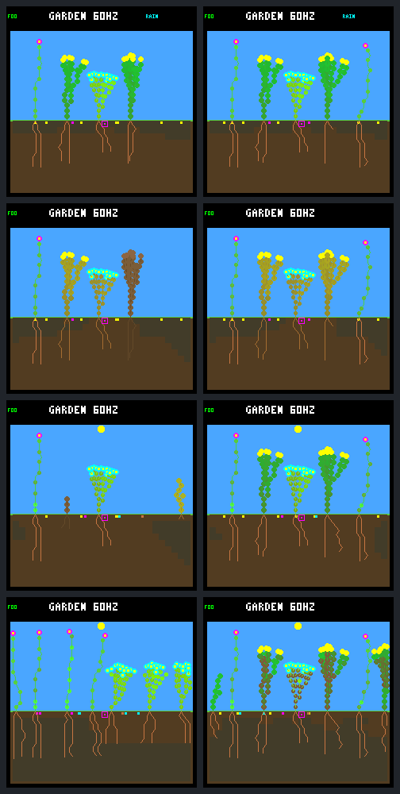

# Exact dark spending guard: survival improves, renewal is not qualified

The fixed host-only guard prevents deaths in this selected eight-day world:
**12 deaths → 0**, with all five founders and all three species retained.
It does not yet establish a better training environment: **14 births → 2**,
and neither guarded descendant produces a seed within the horizon. Both runs
end with seven living plants, but very different populations.

This is the native intervention proposed after the
[exact dark-budget audit](renewal-dark-budget.md). The
[protocol](renewal-dark-guard-protocol.md) was posted to
[issue 30 before capture](https://github.com/aortez/toy-factory/issues/30#issuecomment-5746504116).
The complete [portable summary](renewal-dark-guard-summary.json) retains events,
lineage budgets, quarter-day censuses, tip accounting and frame metadata.
No model training, objective change, firmware promotion, commit or push is part
of this experiment. The implementation and notes remain local and uncommitted.

## Fixed comparison

Two arms, ordinary control and `dark-spending-guard-v1`, use the same frozen
models and world: `0d983a80`, patch seed `05d87ca0`, rainfed-crowded, N `01b9d94a`
for background/descendants and W `c9ea07fd` for founder 5 only. Both retain the
night-growth veto, selective leaf renewal, wide dispersal, headroom-limited root
uptake, 512 nodes and eight plant/seed slots. No gardener or drainage. Patch
events begin on day 16 and do not occur in this eight-day window.

The new `TOY_FACTORY_GARDEN_DARK_GUARD` CMake option is OFF by default and forbidden
in firmware. It checks otherwise eligible growth/finish, leaf renewal and seed
expenses in native order. It rejects only a post-expense fixed-body energy
budget that reaches fatal stress before the next **possible** sunlight income.
Temporary shortages remain allowed; sufficient water and no later spending are
assumptions, not extra resources. Unsupported daylight decisions are unchanged.
Later expenses must pass their own check. Rejected growth preserves proposed
memory, RNG, tip selection, body and resource state; there is no winner reranking.

The predeclared panel used exactly **20 experimental native calls**: two traces
per arm and repeated screenshots at 4,800, 6,720, 7,680 and 30,720 logic ticks.
The control matches all **16,775** prior records and all four saved frames.
After removing diagnostic metadata only, the first **825** records agree across
arms; the first changed census is the expected founder-5 expense at tick **945**.

## Outcomes through day eight

| Measure | Ordinary control | Dark guard |
|---|---:|---:|
| Living plants at end | 7 | 7 |
| Living founders / descendants | 1 / 6 | 5 / 2 |
| Living flowers / shrubs / ground-cover | 4 / 0 / 3 | 2 / 4 / 1 |
| Deaths: energy / water | 9 / 3 | 0 / 0 |
| Births | 14 | 2 |
| Highest generation reached | 3 | 1 |
| Seeds created / expired / remaining | 52 / 30 / 8 | 63 / 53 / 8 |
| Seeds produced by descendants | 27 | 0 |
| Whole-window living-plant exposure, logic ticks | 117,465 | 169,620 |
| Days 4–8 living-descendant exposure, logic ticks | 54,015 | 16,020 |

The guarded offspring are shrubs born at ticks **15,360** and **30,060**, to
founders 4 and 2 respectively. The first survives four days; the second has only
660 ticks of follow-up. Full-day offspring survivors are **6/13 eligible** in
the control and **1/1 eligible** with the guard; each arm also has one too-recent
birth. The latter fraction is not evidence of a general survival rate.

Founder survival is real here, not delayed death before the closing checkpoint.
It is also not continuing generational renewal. All five guarded founders are
tipless by the end. In days 4–8, **94.49%** of guarded living-plant time is tipless,
versus **66.16%** in the control (5,847/6,188 versus 3,060/4,625 ecology-step
exposures). Automatic upkeep, leaf renewal and seed production continue.
Neither node pool fills: peak occupancy is 301/512 control and 315/512 guarded.
These observations do not identify which exact germination condition prevented
each expired seed from recruiting; that would require the seed-attempt diagnostic.

Exposure counts integrate post-census states on `[start, stop)` in 15-tick
intervals. The summary also preserves the older tip auditor's separately labeled
`late` window, which starts at **day one**, not day four.

## What the guard actually changed

All **637** eligible candidate expenses have exact native/Python forecast parity:
348 growth/finish, 226 renewal and 63 seed candidates. Of these, 584 are outside
the immediate guaranteed-dark horizon. The remaining 53 comprise:

- 40 allowed candidates with all projected upkeep paid;
- four allowed candidates with survivable temporary shortages;
- nine rejected growth/finish attempts, all crossing from locally alive to fatal;
- zero already-fatal anchors, seed denials, renewal denials or audit overflows.

Nine denials are **not nine independent rescues**. They are one founder-5 growth
attempt and eight retries of one selected founder-4 tip. Seventeen raw tip bids
belong to these nine uncommitted winners. The original traces retain every bid;
only those bids are removed in the explicitly derived accounting streams.

1. At tick **945**, founder 5 would spend nine energy and five water to grow
   from 33 to 34 nodes. Refusing that expense leaves 148 rather than 139 energy.
   The control dies at 3,000; the guarded plant reaches that point alive at
   stress six, recovers after light returns, and remains alive at day eight.
2. Saving founder 5 also changes other plants' competition and seed scheduling.
   Founder 2 buys three seeds in the second daylight, not four; its energy at
   4,635 is **226 versus 208** in the control. It survives the next dark interval
   at stress five. **No direct seed denial** caused this change, and the energy
   difference is not simply an isolated 48-unit saving.
3. Founder 4 is allowed to grow **56 → 57 nodes** at 4,635: its post-cost 246
   energy predicts survivable stress seven. At 4,680–4,785, however, paying eight
   energy to finish the selected tip would reach stress eight. All eight retries
   are rejected. This is a paid FINISH, not an extension or a new upkeep tier.
   It reaches 6,870 alive at stress seven, then recovers. The control grows to
   60 nodes during this period and dies at 6,660.

There are no further denials after tick 4,785. The improved later outcomes are
the downstream trajectory of those early interventions, not continuous universal
protection. In particular, zero water deaths is not proof of a water-survival
guard: different children are born into different competition.

## Native visual review

Left: control. Right: guarded. Rows: ticks **4,800; 6,720; 7,680; 30,720**.
These are independent shared-renderer captures, with state hashes checked
against the full traces and byte-identical repeats. The retained original
founders are visible on the right; the closing control instead contains a new
flower/ground-cover population. Appearance alone does not demonstrate renewal.



## Verification and retained evidence

- All **69 default CTests**, **66 experimental-control CTests**, and both
  guard-specific CTests pass. The Python guard suite has 11 tests and compares
  **6,144 native/reference forecasts** across every sun phase, energy/body sizes
  and initial stress. C tests cover both arbitration modes, rejection atomicity,
  renewal fallback, same-step expense order, invalid inputs and bounded overflow.
- Full live resource/leaf/tip accounting reconciles **7,833 control / 11,310
  guarded transitions**, including newborn steps. The 12 control terminal steps
  retain their observed death flags; cleared terminal income is not reconstructed.
- All raw trace repeats, eight repeated frame pairs, source/input fingerprints,
  capture inventory and repeated analysis match. The derived trace never rewrites
  census states, committed decisions or leaf proposals.
- GCC 13.3 in the existing Docker builder produced both assertion-enabled
  `RelWithDebInfo` / `-O2 -g` UBSan builds. A local GCC 15 attempt encountered an
  unrelated existing physics warning; no physics fix was mixed into this change.
  The repository's container formatter and whitespace checks pass.
- The local bundle is `artifacts/garden-renewal-dark-guard-v1`, with 78 hashed
  artifacts totaling 44,217,916 bytes. Capture took 1.89 seconds, analysis plus
  its repeat 6.09 seconds, excluding builds/tests/export. This is not a device
  performance measurement or a maximum host-throughput benchmark.

Manifest SHA-256:
`0078077eeabf0fe95393870a626ebb8f9c407d62d7f6225d5dce8f89fcbaaa52`.

Offline verification, without launching simulations:

```sh
python3 -W error sim/garden_renewal_dark_guard.py \
  --output artifacts/garden-renewal-dark-guard-v1 --verify \
  --check-export benchmarks/garden-longevity/renewal-dark-guard
```

## Next proposal

Keep the rule frozen and host-only. Discuss a small predeclared **multi-world,
longer-horizon paired comparison**, retaining existing no-patch and patch
conditions. Measure founder/species retention alongside late descendant births,
full-cycle survival, descendant reproduction and tipless exposure, with fixed
native review frames and adverse cases retained. Do not tune a threshold, alter
fitness, resume model search or promote the rule from this single example.

This reused, selected world is not held-out evidence. Repeats prove determinism,
not independent replication; descendants' numeric identities diverge across
arms. The energy-only horizon ends before possible income, not guaranteed actual
morning recovery. Daylight spending, water failures, long-run succession and
generalization remain open.
