# Dark guard: fixed 64-day native review

Four reused review worlds; not independent held-out tests.
Columns pair control/guard at **days 8, 32 and 64**. Rows follow the four declared seeds.
Every image uses the production renderer and matches its census and exact repeat.

## no-patch

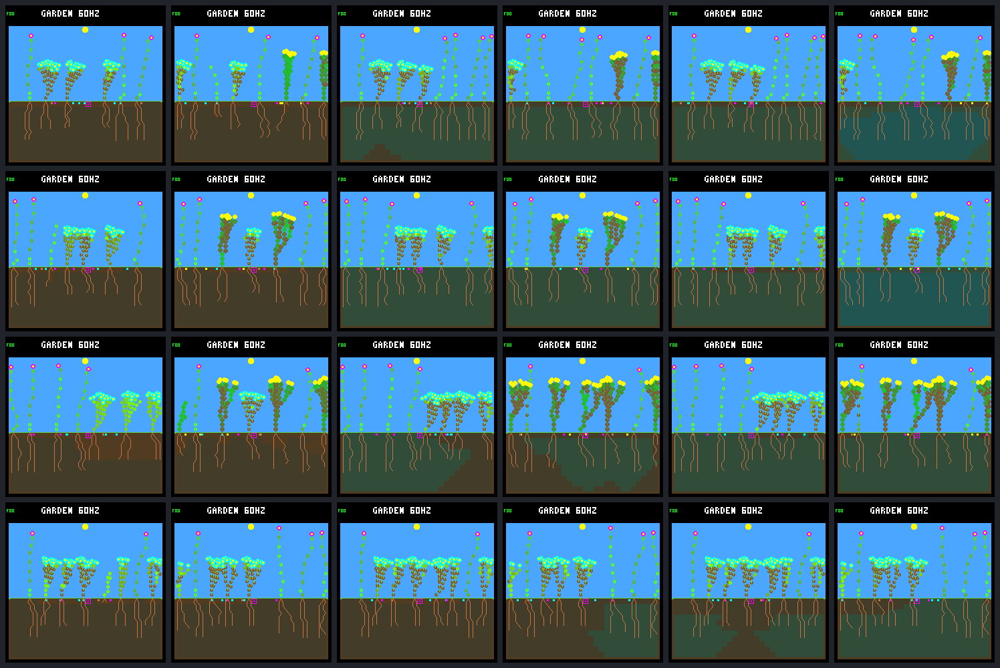

| Row | World seed | End living control / guard | Closing births control / guard | Closing descendant seeds control / guard |
|---:|---|---:|---:|---:|
| 1 | `abf7af73` | 8 / 8 | 0 / 0 | 96 / 96 |
| 2 | `58e36558` | 8 / 7 | 0 / 0 | 40 / 0 |
| 3 | `0d983a80` | 8 / 7 | 0 / 0 | 112 / 19 |
| 4 | `beda710e` | 8 / 8 | 0 / 0 | 40 / 48 |

### abf7af73

| Day | Control | Guard |
|---:|---|---|
| 8 |  |  |
| 32 | 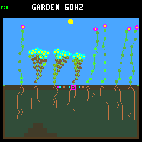 | 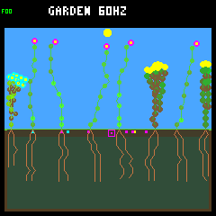 |
| 64 | 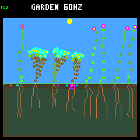 | 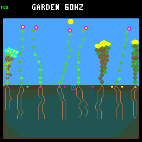 |

### 58e36558

| Day | Control | Guard |
|---:|---|---|
| 8 | 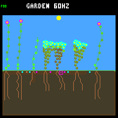 | 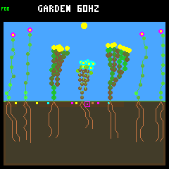 |
| 32 | 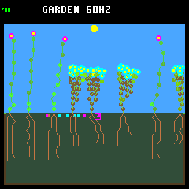 | 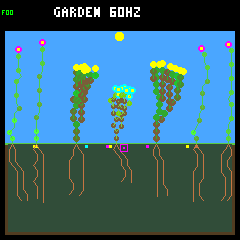 |
| 64 | 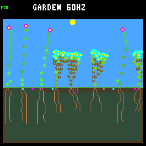 | 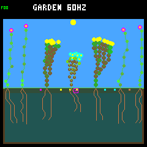 |

### 0d983a80

| Day | Control | Guard |
|---:|---|---|
| 8 | 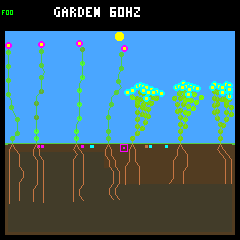 | 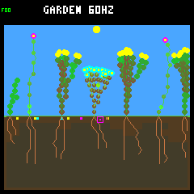 |
| 32 | 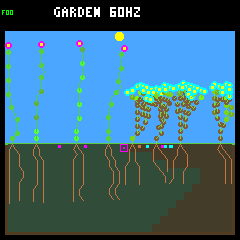 | 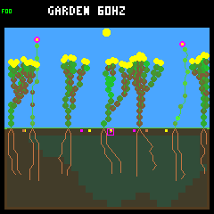 |
| 64 | 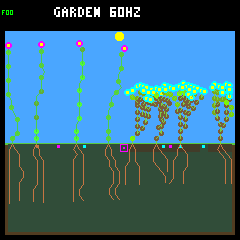 | 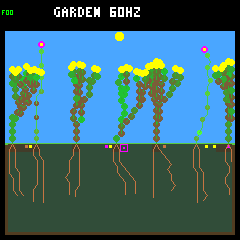 |

### beda710e

| Day | Control | Guard |
|---:|---|---|
| 8 | 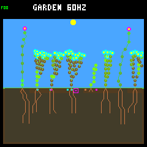 | 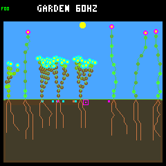 |
| 32 | 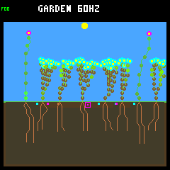 | 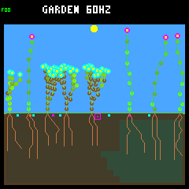 |
| 64 | 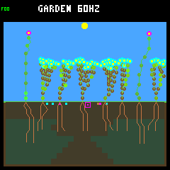 | 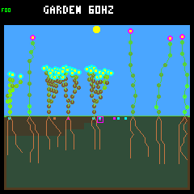 |
## patch

| Row | World seed | End living control / guard | Closing births control / guard | Closing descendant seeds control / guard |
|---:|---|---:|---:|---:|
| 1 | `abf7af73` | 8 / 8 | 1 / 2 | 113 / 113 |
| 2 | `58e36558` | 7 / 7 | 2 / 3 | 72 / 55 |
| 3 | `0d983a80` | 8 / 8 | 2 / 4 | 113 / 84 |
| 4 | `beda710e` | 8 / 8 | 4 / 2 | 59 / 80 |

### abf7af73

| Day | Control | Guard |
|---:|---|---|
| 8 | 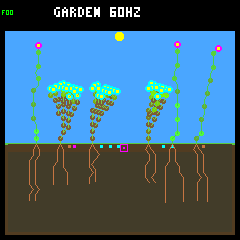 | 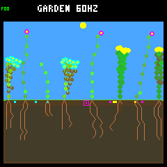 |
| 32 | 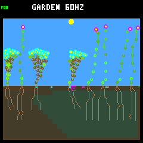 | 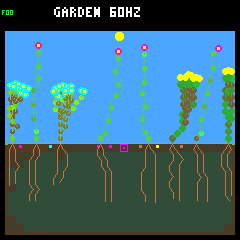 |
| 64 | 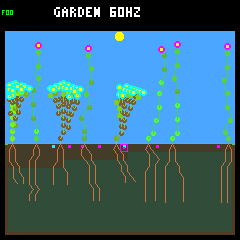 | 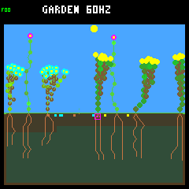 |

### 58e36558

| Day | Control | Guard |
|---:|---|---|
| 8 |  |  |
| 32 | 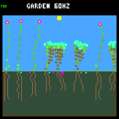 | 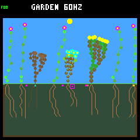 |
| 64 | 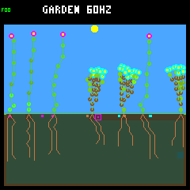 | 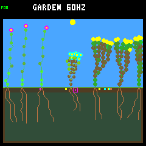 |

### 0d983a80

| Day | Control | Guard |
|---:|---|---|
| 8 |  |  |
| 32 | 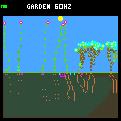 | 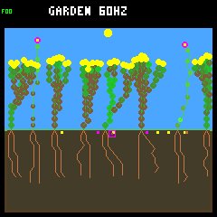 |
| 64 | 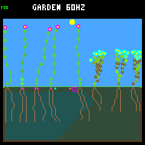 | 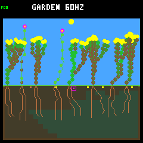 |

### beda710e

| Day | Control | Guard |
|---:|---|---|
| 8 |  |  |
| 32 | 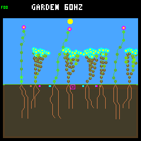 | 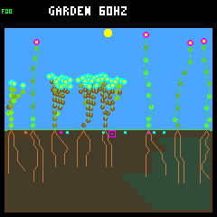 |
| 64 | 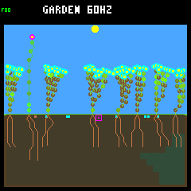 | 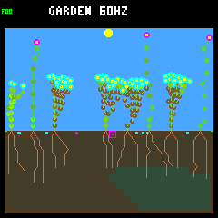 |
