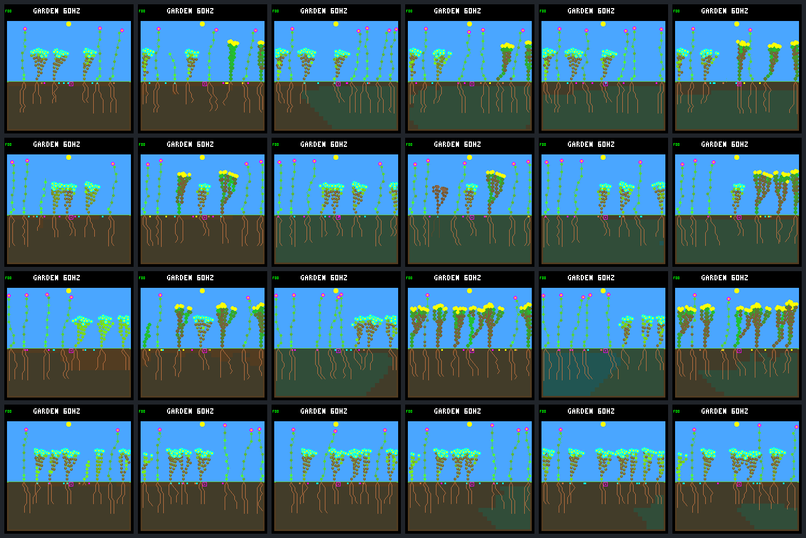

# Frozen dark guard: lower mortality, mixed generational renewal

The eight-day survival gain partly carries into a four-world, 64-day comparison,
but **the unchanged guard is not a general renewal improvement**. Natural deaths
fall overall, and more species/founders remain. With the existing patch schedule,
closing births rise **9 → 11**, yet whole-run durable descendant parents fall
**18 → 11**. Without patches, both arms stop recruiting late in the run.

Keep the rule experimental and OFF by default. No ecology, controller, fitness,
firmware or native code was changed for this panel. No new model search, commit,
push or device deployment is part of it.

## Fixed comparison

The [protocol](renewal-dark-panel-protocol.md) was recorded in
[issue 30 before collection](https://github.com/aortez/toy-factory/issues/30#issuecomment-5746657916).
All four previously declared review worlds are retained: `abf7af73`, `58e36558`,
`0d983a80`, `beda710e`. Each has control/guard arms with and without the existing
`05d87ca0` patch schedule: **eight matched pairs, sixteen trajectories**. They run
for 245,760 logic ticks, or 64 garden days; the closing window is days 48–64.

The inspector/replay binaries and models are byte-for-byte copies from the
[eight-day guard bundle](renewal-dark-guard.md), not rebuilt variants. Both arms
use rainfed-crowded, no gardener, wide dispersal, headroom water uptake, selective
leaf renewal, the night-growth veto, 512 nodes, eight plant/seed slots and no
drainage. N `01b9d94a` controls background/descendants; W `c9ea07fd` controls only
founder 5. This does not test all-N/all-W controllers or other layouts/schedules.

Every full ecology/bid/guard trace repeats exactly. Every trajectory has repeated
native screenshots at days **8, 32 and 64**: 32 inspector and 96 replay calls,
exactly the **128-call** experimental budget. The
[portable summary](renewal-dark-panel-summary.json) contains all paired results,
daily populations, lifetimes, guard counters and frame identities. The
[fixed gallery](renewal-dark-panel-gallery.md) includes all 48 native images,
not just favorable examples.

## Whole-run outcomes

Values below are totals across the four worlds in each condition. Repeats and
patch/no-patch versions of a seed are not independent replicates.

| Measure, days 0–64 | No-patch control | No-patch guard | Patch control | Patch guard |
|---|---:|---:|---:|---:|
| Natural deaths | 45 | 21 | 51 | 33 |
| Environmental patch deaths | 0 | 0 | 25 | 24 |
| Births | 57 | 31 | 87 | 68 |
| Full-day offspring survivors / eligible | 26 / 57 | 21 / 31 | 51 / 87 | 51 / 66 |
| Durable descendant parents | 8 | 4 | 18 | 11 |
| Seeds produced by descendants | 1,096 | 615 | 1,222 | 951 |
| Final living plants | 32 | 30 | 31 | 31 |
| Final living founders / descendants | 9 / 23 | 14 / 16 | 6 / 25 | 8 / 23 |
| Final three-species worlds | 0 / 4 | 2 / 4 | 0 / 4 | 2 / 4 |
| Final extinct worlds | 0 | 0 | 0 | 0 |

A durable descendant parent is itself an offspring that survives a full garden
day and has a child that also survives a full day. It is not merely a seed buyer.
Higher survivor fractions here do not guarantee more survivors: with patches,
the number remains **51** while births fall; without patches it falls **26 → 21**.
Two patched guarded births lack full-day follow-up: one is still alive, one is
already dead. Neither is included in the eligible denominator or credited as a
full-day survivor.

Species retention improves in the first two declared seeds, from two to three
living species, in both conditions. The other two remain at two species. This
small reused panel does not establish persistent three-species coexistence.

## The closing 16 days

| Measure, days 48–64 | No-patch control | No-patch guard | Patch control | Patch guard |
|---|---:|---:|---:|---:|
| Births | 0 | 0 | 9 | 11 |
| Natural deaths / patch deaths | 0 / 0 | 0 / 0 | 2 / 8 | 2 / 10 |
| Full-day survivors among closing-born / eligible | 0 / 0 | 0 / 0 | 7 / 9 | 9 / 9 |
| Closing-born durable parents | 0 | 0 | 0 | 0 |
| Seeds produced by descendants | 288 | 163 | 357 | 332 |
| Descendant parents producing those seeds | 18 | 12 | 26 | 26 |
| Worlds with births | 0 / 4 | 0 / 4 | 4 / 4 | 4 / 4 |
| Living-plant exposure that is tipless | 100% | 100% | 98.39% | 98.26% |

`0 / 0` means no eligible offspring, not a measured zero survival probability.
All eight patched trajectories recruit late, and all have descendant seed
production. Nevertheless, the two additional eligible guarded survivors are
both in the already-inspected `0d983a80` world. The other guarded birth increases
are the two recent births mentioned above; `beda710e` instead has two fewer
closing births and deaths, with the same two full-day survivors.

The unpatched worlds are not frozen simulations: upkeep, leaf renewal and seed
production continue. Each arm buys **512 seeds** and expires **512 seeds** in
this window, with every seed slot occupied throughout. Plant slots are full for
100% of control world-time versus 50% with the guard; two guarded worlds remain
at seven plants despite the vacancy. No node pool fills anywhere in this panel
(largest observed post-step occupancy: 423/512). Thus insufficient seed
production or a full node pool is not the general explanation for stalled
recruitment. These traces do not identify each failed germination's exact
pre-attempt blocker; spacing, light and moisture must not be inferred solely
from a post-step census.

Event windows use `(start, stop]`; exposure uses post-event states on
`[start, stop)` in 15-tick intervals. Patch losses are accounted separately from
natural deaths, and the post-patch state is carried into the next ordinary step.

## Every seed's direction, including regressions

Each cell is **control → guard**. Deaths and durable parents cover the whole run;
closing births cover days 48–64.

| World | No-patch natural deaths | Patch natural deaths | Patch closing births | Patch durable descendant parents |
|---|---:|---:|---:|---:|
| `abf7af73` | 13 → 12 | 13 → 17 | 1 → 2 | 3 → 5 |
| `58e36558` | 10 → 1 | 10 → 6 | 2 → 3 | 3 → 1 |
| `0d983a80` | 14 → 3 | 17 → 4 | 2 → 4 | 7 → 2 |
| `beda710e` | 8 → 5 | 11 → 6 | 4 → 2 | 5 → 3 |

The `abf7af73` patch regression is real: natural deaths rise by four and patch
deaths by one, so total deaths rise **18 → 23**. All 17 guarded natural deaths
are energy deaths. Yet this same pair gains durable parents and a third species.
Conversely, the strongest mortality improvement (`0d983a80`) loses five durable
parents. Neither mortality nor births alone orders these ecological outcomes.
Identical patch coordinates do not imply identical victims after trajectories
diverge. Descendant numeric IDs are also not matched counterfactual individuals.

## What the guard did—and did not do

All **32,536** native candidate forecasts match the independent Python reference.
There are **397 denials**, all growth/FINISH; no renewal or seed denials occur.
Of these, 213 cross the local nonfatal-to-fatal boundary; **184 already have a
fatal projected energy budget before the proposed expense**. There are 334
retries of previously denied selected nodes. These are repeated decisions, not
397 independently rescued plants. The original traces retain all 1,264 raw bids
removed from the derived accounting streams as rejected, uncommitted proposals.

Another 595 candidates can pay all projected upkeep and 118 have survivable
temporary shortages. The remaining **31,426** candidates are outside the
immediate guaranteed-dark interval and are unchanged. The guard is an energy-only
local check, not a daylight-income forecast or water guarantee. Denying an
expense cannot repair a budget that was already fatal. Aggregate candidate
counts include shared pre-patch histories in both conditions; they are audit
coverage, not independent treatment events.

## Native visual review and verification

Both contact sheets were visually reviewed. Columns pair control/guard at days
8, 32 and 64; rows follow the declared seed order. The no-patch gardens retain
largely stable mature canopies between days 32 and 64, while the patched rows
show replacement. Appearance is not evidence of a full-day survivor or durable
parent; the linked census/lineages supply those checks.



- **70 default CTests, 67 experimental-control CTests and both guard-specific
  CTests pass.** The new offline panel suite has 13 tests, including patch-boundary
  corruption, resource/tip agreement, censoring, paired adverse directions and
  inclusion of every image. The guard suite again checks 6,144 native/reference
  forecasts. Tests are separate from the experimental call budget.
- All full trace repeats, 48 framebuffer repeat pairs and state/CRC checks pass.
  Patch/no-patch histories match through the ordinary day-16 pre-patch census
  for every world/arm. Both conditions reproduce the old world's full eight-day
  traces and saved frames. All current C/header fingerprints and copied binaries
  match the frozen baseline; only offline tooling/tests and notes changed here.
- Live resource, leaf-condition, stress, growth, seed-production, ownership and
  lifetime checks agree across **1,954,739 live transitions**. Natural terminal
  income is cleared by the simulator; those **150 steps** remain explicitly
  unaccounted rather than reconstructed. Patch
  losses are exactly known from validated before/event/after records.
- Repeated full analysis agrees exactly. The local bundle
  `artifacts/garden-renewal-dark-panel-v1` has **332 hashed artifacts / 412,236,738
  bytes**. Capture took 129.66 seconds including compression; analysis and its
  repeat took 384.94 seconds. These are collection costs, not device or maximum
  host-throughput benchmarks. No failed or replacement runs were needed.

Manifest SHA-256:
`d62a870fea9ecfede3a32cebe1465097c0391f53a0cf781358574fc2db2e4ae8`.

```sh
# Offline: no simulations, training or firmware access.
python3 -W error sim/garden_renewal_dark_panel.py \
  --output artifacts/garden-renewal-dark-panel-v1 --verify \
  --check-export benchmarks/garden-longevity/renewal-dark-panel
```

## Next proposal

Use the saved traces to audit the **remaining guarded natural deaths**, especially
the patched `abf7af73` regression. Separate water failures, already-fatal budgets
and failures after the guaranteed-dark horizon; trace the preceding spending/body
history before proposing a broader rule. Retain the other worlds as comparison
cases instead of tuning to that one regression. No new native runs are needed
for that offline diagnostic. Discuss its scope before implementation; leave
training, promotion and additional ecology changes on hold.
