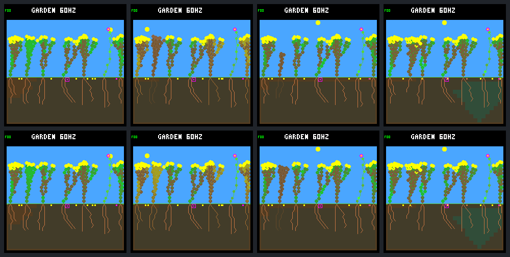

# Deferring FINISH through dawn delays death; it does not rescue the seedling

The [fixed comparison](renewal-dawn-finish-protocol.md) preserved child 12's last
eight energy through the first dawn maintenance. It survived that payment, then
paid the deferred FINISH and died at the following maintenance: **68,340 →
68,400**, four ecology steps / one simulation second later. It produced no seeds
or offspring. This is a negative lasting-survival result, not an adult rescue.

## What actually happened

Both arms reuse the optional-light [wet-germination world](renewal-wet-germination.md).
The only selected transaction is shrub 12's final root tip at (47,193), depth 9:
FINISH costs eight energy/five water without adding tissue. The experiment refuses
that otherwise-allowed transaction, including retries, from 66,090 through
68,340 inclusive. It never grants resources or changes ordinary guard decisions.

There are **ten actual refusals**, at 66,090..66,225 (sun phases 118..127), all
on node 378. The night wrapper subsequently selects WAIT, and low stores later
prevent further growth decisions. These are not additional experimental refusals.
Normal WAIT decisions still advance policy state; the experiment is not a pause.

| Tick / sun phase | Control | Deferred FINISH |
| --- | --- | --- |
| 66,075 / 117 | 251 energy, stress 0, one tip | Identical |
| 66,090 / 118 | Pays FINISH: 243 energy, no tips | Keeps 251 energy and its tip |
| 68,310 / 10 | 0 energy, stress 7 | 0 energy, stress 6 |
| 68,325 / 11 | Earns 2; stress 7 | Earns 2; stress 6 |
| 68,340 / 12 | Energy death | Earns 1, pays 3 of 8 upkeep; stress rises to 7 |
| 68,355 / 13 | Dead | Released to normal policy; 2 energy, stress 7 |
| 68,370 / 14 | Dead | Earns 4; 6 energy, stress 7 |
| 68,385 / 15 | Dead | Earns 3; FINISH spends 8 of its 9 energy |
| 68,400 / 16 | Dead | Energy death at the next maintenance |

The eventual purchase leaves **one energy before an eight-energy upkeep bill**.
At phase 15 the ordinary dark forecast is outside its supported interval, so it
allows this FINISH. The structural guard also allows it: there is no node added.
Stress never recovers to zero after this night in either arm. Water is adequate.
Terminal death clears income/payments, so the final step's income is unknown;
the report does not fill it in using another arm or a shadow estimate.

The full live ledgers telescope from the same 64-energy seedling allocation:

- Control: 64 + 2,059 income − 936 overflow − 536 growth − 649 upkeep = 2.
- Deferral: 64 + 2,069 income − 936 overflow − 536 growth − 660 upkeep = 1.

Neither buys leaf renewal or seeds. The final growth cost is unchanged over its
lifetime; it was delayed, not removed. Reclamation also shifts by 60 ticks,
69,240 → 69,300. All other lineage records—including birth/death times, ancestry,
genomes and seed counts—match, but the complete worlds are not identical.

## Population and visual follow-up

Both arms reach day 64 with seven living plants, four descendants, six shrubs
and one flower, representing three founder families. Both have nine births,
six natural deaths and one explicit founder export. Seed totals remain 514
purchased, nine germinated, 497 expired and eight pending. Every paired seed's
ancestry and birth/end/outcome record matches, although some landing columns
and blocker histories differ. Do not interpret equal aggregate totals as equal
world hashes or pixel output.

Post-gap outcomes remain five births, three full-day survivors and one day-64
survivor. The fixed day-48..64 window still has **zero births and zero deaths**,
with 128 seed purchases. Living exposure increases by only four ecology steps.
No enduring generational-renewal gain is demonstrated.



Rows: control, then deferral. Columns: ticks 66,075; 68,340; 69,120; 245,760.
The first frames are pixel-identical. The target near the left side stays green
at the first dawn payment, then is brown in both arms by the next frame. Its
later decomposition explains the temporary shape difference. Day-64 frames
differ by eleven pixels in the ground-level seed markers, not in a surviving
target plant. Every image is a genuine native framebuffer, captured twice.

## Evidence and validation

- Exactly 24 declared experimental native calls; eight full traces and sixteen
  frame replays. No extra outcome runs, experimental training, firmware changes
  or flashing.
- Rebuilt control world/site traces match the historical capture byte-for-byte;
  historical final frame metadata and pixels also match exactly.
- 44,446 identical raw prefix records before the isolated first transaction.
- All ten refusals independently match winning bids, ordinary guard receipts,
  no-cost resource/tip state and unchanged decision telemetry.
- 221,022 full-population live resource checks; 32,770 ordinary seed-site
  checkpoints; 1,028 seed lifetimes. Target histories include 660/664 live steps
  and one explicitly unaccounted terminal step per arm.
- Full analysis repeated exactly, portable export independently checked with
  Docker/Python 3.12, and all eight native images manually reviewed.
- **82 default and 82 experimental CTests pass**, including native rejection,
  retry/remapped-node identity, inclusive deadline, release, reset, private-state
  preservation and Python receipt-corruption tests. Formatting and diff checks pass.
  The first test invocation used the player image without pyserial; rerunning
  in the established firmware-builder environment resolved that dependency issue.

Original frozen bundle: `artifacts/garden-renewal-dawn-finish-v1`, manifest SHA-256
`9e5e240868c65f4029e28e8944dc1c3c64f494e8901c74ef40e2cc338f2ebc97`.
An analysis-only resume fix now verifies existing derived files instead of
trying to create them again. The original bundle remains unchanged. The revised
analysis lives in `artifacts/garden-renewal-dawn-finish-v1-analysis-v2`, manifest
`ae0c428ba07359a56cda2cea5441b71b7deb5ab79cdde5fdffdade36a2f5e910`;
it includes the original manifest and records revised analysis-source hashes.
Both `capture.json` and `results.json` are byte-identical to the original. No
native call was repeated for this tooling fix. The initial portable export is
preserved under `artifacts/garden-renewal-dawn-finish-portable-v1`.
Portable [summary](renewal-dawn-finish-summary.json), SHA-256
`cef6b7d4b4d38958faf4adb07c8ac82a594074455dd1870a784e058e021b6fce`,
contains the complete focal histories, population and seed ledgers, refusal
receipts and frame metadata, with hashes identifying the frozen provenance.

```sh
docker compose run --rm firmware python3 -W error sim/garden_renewal_dawn_finish.py \
  --output artifacts/garden-renewal-dawn-finish-v1-analysis-v2 --verify \
  --check-export benchmarks/garden-longevity/renewal-dawn-finish
```

## Next proposal, not implemented

Test a **reserve-aware handoff on this same pending FINISH**: after the dawn
deferral, keep refusing it until paying eight energy would still leave the next
eight-energy maintenance bill in store. Cap the diagnostic at the first noon and
follow day-64 survival/reproduction again. This tests the newly observed handoff
failure without adding energy or changing body size, light, rain or seedling
reserves. It is still a selected-case experiment, not justification for a general
rule, training restart, or a fix for separate startup/spacing failures.

The hook remains host-only, opt-in, off in ordinary builds and absent from
firmware. Work is uncommitted; discuss that follow-up before implementing it.
