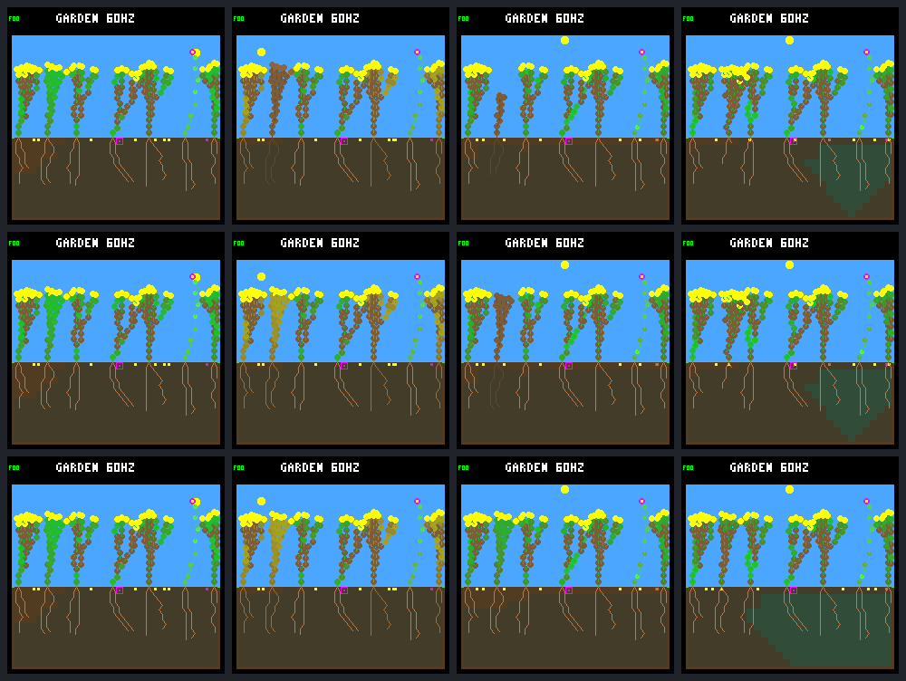

# A reserve-aware FINISH handoff rescues the plant, not generational renewal

The [fixed three-arm comparison](renewal-dawn-reserve-protocol.md) succeeds at
the selected survival test. Shrub 12 lives through day 64, instead of dying at
68,340 (control) or 68,400 (dawn-only deferral). Three additional refusals let it
pay the deferred FINISH at **68,445 with 19 energy**, leaving 11 for an
eight-energy upkeep bill. Stress returns to zero at 68,760.

This is not an ecosystem-level renewal gain. The rescued plant makes **one seed,
which expires**, and no offspring. The two later seedlings present in the old
arms never appear. Final living population, species/family counts and closing
births remain unchanged; historical full-day survivors and reproducing-parent
credit fall. Keep this selected diagnostic host-only, not a general policy.

## The handoff and subsequent nights

All three arms retain the same model routing, rain, 512-node pool, ordinary dark
and structural guards, leaf maintenance, and day-12 founder export followed by
wet germination. The new arm exactly reproduces the old deferral through 68,340.
After that, the same 61-node root FINISH may pay only when cost eight plus upkeep
eight fits current energy. The diagnostic expires at first noon, 69,120; it
does not protect later nights or grant resources.

| Tick / phase | Reserve arm's target |
| --- | --- |
| 66,090..66,225 / 118..127 | Same ten refusals as the old deferral |
| 68,340 / 12 | Pays only 3 of 8 upkeep; energy 0, stress 7 |
| 68,385 / 15 | Refuses FINISH at energy 9; preserves the tip and private decision state |
| 68,400 / 16 | Earns 4; pays 8 upkeep; energy 5, stress falls to 6 |
| 68,415 / 17 | Refuses again at energy 9 |
| 68,430 / 18 | Refuses again at energy 13 |
| 68,445 / 19 | Earns 6, reaches 19, pays FINISH 8/5; energy 11, water 507, no tips |
| 68,460 / 20 | Earns 6, pays 8 upkeep; energy 9, stress 5 |
| 68,760 / 40 | Stress recovers to zero |
| 69,120 / 64 | First noon: energy 248, stress 0; experimental window is over |
| 245,760 / 64 | Day 64: alive, energy 248, water 506, stress 0 |

There are **13 actual refusals**, not one per intervening ecology step. Normal
night WAIT decisions still commit; low stores suppress other growth checks.
The handoff pays the ordinary full cost and commits once. The experiment leaves
body size at 61, with 18 roots and 42 leaves; no tissue or storage capacity is
added. Native tests cover the unobserved equality boundary: 15 energy refuses,
16 permits and retains eight. They also cover noon expiry without a handoff.

The plant survives 46 further nights after the first noon, with recurrent energy
shortage and recovery. This does not mean it becomes shortage-free: every later
recorded stress episode peaks at seven, one below death. Water shortages do not
occur in its recorded lifetime. Normal paid leaf renewal continues.

Its complete live ledger reconciles from the original seedling allocation:

- Energy: 64 + 65,826 income − 40,578 overflow − 536 growth − 2,412 leaf renewal
  − 48 seed purchase − 22,068 upkeep = **248**.
- Water: 24 + 20,481 uptake − 335 growth − 1,340 leaf renewal − 24 seed purchase
  − 18,300 upkeep = **506**.

Lifetime growth spending remains 536 energy in all three arms. The intervention
changes payment timing, not its price. All 12,489 live target steps reconcile.
The two old target histories retain their explicitly unreconstructed terminal
steps, since death clears the last income/payment counters.

## Population tradeoffs

| Day-64 measure | Control | Dawn-only defer | Reserve handoff |
| --- | ---: | ---: | ---: |
| Births | 9 | 9 | 7 |
| Natural deaths | 6 | 6 | 4 |
| Explicit founder exports | 1 | 1 | 1 |
| Full-day offspring survivors / eligible | 6/9 | 6/9 | 4/7 |
| Full-day descendant parents with a full-day child | 1 | 1 | 0 |
| Post-gap births / full-day survivors / still alive | 5 / 3 / 1 | 5 / 3 / 1 | 3 / 1 / 1 |
| Final living plants / descendants | 7 / 4 | 7 / 4 | 7 / 4 |
| Final species / founder families | 2 / 3 | 2 / 3 | 2 / 3 |
| Seeds purchased / germinated / expired / pending | 514 / 9 / 497 / 8 | 514 / 9 / 497 / 8 | 513 / 7 / 498 / 8 |
| Closing day-48..64 births / deaths / seed purchases | 0 / 0 / 128 | 0 / 0 / 128 | 0 / 0 / 128 |

Do not read two fewer deaths as two rescued existing plants. Among lineages
already present before the intervention, only target 12's lifetime changes.
The old arms' later children 13 and 14 are not born in the reserve arm; child 13
would have died, while 14 would have survived. Seed contributions from several
existing adults also change. This is a different competitive trajectory, not
the old garden plus one survivor.

All arms end with six shrubs and one flower, founder-family counts 4/2/1 for
families 2/4/5. Reserve has 379 nodes versus 382. Whole-run living exposure rises
only 221 ecology-plant steps against defer (110,510 → 110,731), about 0.20%.

The target's only seed is purchased at 149,580, lands in column 11, and expires
at 153,420. All 248 mature snapshots list living shrub 9 as a spacing occupant;
31 also have a moisture blocker. There is no germination. The bank contains
eight seeds at all 4,096 closing-window snapshots in every arm. These are
post-step observations, not reconstructed ordered purchase/germination failures.
They justify inspecting reproductive opportunity, not declaring a sole cause
for the target's low seed count.

## Actual native screenshots



Rows are control, dawn-only defer, reserve. Columns are 66,075; 68,340; 69,120;
245,760. All first-column images match; defer/reserve also match in column two.
At first noon, the target near the left stays green only in the reserve arm;
the old arms show dead, decomposing tissue. The final images show different
canopies/root layouts despite identical living/species counts. These are twelve
native 240×240 framebuffers, each captured twice, not reconstructed illustrations.
The HUD's 60 Hz is the configured simulation rate, not a host/device performance
measurement from this experiment.

## Evidence and validation

- Exactly **36 experimental native calls**: twelve full world/bid/site traces
  and twenty-four frame replays. No new training, device call or replacement
  outcome run.
- Both rebuilt historical arms reproduce all traces and four metadata/pixel
  pairs exactly, checked before collecting reserve.
- The original intervention has 44,446 matching raw prefix records. The new
  handoff comparison has **46,170**, with its first difference precisely the
  9-energy FINISH at 68,385 and no simultaneous neighbor/ordinary-guard change.
- All refusals, the paid handoff, 331,756 live population budgets, 49,155
  ordinary site checkpoints and 1,541 seed lifetimes reconcile.
- Full analysis repeats exactly. Portable results and all twelve images were
  independently verified with Docker/Python 3.12 and visually reviewed.
- **83 normal and 83 experimental CTests pass**, including native transaction
  preservation, both arbitration modes, invalid/duplicate receipts, 15/16
  threshold, old inclusive endpoint, exclusive noon cutoff, recovery and reset.
  Twelve new Python tests check inventory, boundaries and corrupted evidence.
  Formatting and diff checks pass.

One initial preflight rejected CMake's extra `-DNDEBUG` before any native call.
That zero-call failure is retained in
`artifacts/garden-renewal-dawn-reserve-preflight-v1`. The actual capture uses
the parent configuration exactly: GCC 13.3, `-O2 -g`, UBSan, and the same opt-in
flags. No outcome was discarded or replaced. The shared ecology source is
unchanged by this turn; only the existing host diagnostic, its CLI and tests
gain the reserve handoff.

Frozen bundle: `artifacts/garden-renewal-dawn-reserve-v1`.
Manifest SHA-256:
`ee74ce6b80ff164c5f2358fbcc9829832fac6debebc032086e78b2c52a39f06b`.
Full results SHA-256:
`ff3ab9f36ea7e29ff72ca1066d75faa413ca218684d7fa2643134b90f12b7849`.
Portable [summary](renewal-dawn-reserve-summary.json) SHA-256:
`2cbf7bb6b4568bce1f022d8ff28d330e473b3ca46ebd031e2a44688ceadb3163`.
It includes complete target histories, receipts, population/seed ledgers and
frame metadata. Ignored local raw evidence is not hosted by the portable export.
Capture took 39.78 seconds; analysis plus its repeat took 64.27 seconds on this
host. These include diagnostic/IO overhead and are not simulation benchmarks.
Results are also recorded on
[issue #30](https://github.com/aortez/toy-factory/issues/30#issuecomment-5767777356).

```sh
docker compose run --rm --no-deps firmware python3 -W error sim/garden_renewal_dawn_reserve.py \
  --output artifacts/garden-renewal-dawn-reserve-v1 --verify \
  --check-export benchmarks/garden-longevity/renewal-dawn-reserve
```

## Next proposal, not implemented

Audit this saved trajectory's **reproductive opportunity**: why does the rescued
adult make only one seed while the bank stays full and later recruitment stops?
Compare resources, eligibility, bank occupancy and existing adults' seed access
against the two controls, retaining the limits of post-step evidence. Start
read-only; do not add bank capacity, remove neighbors or introduce a new rule.

The selected rescue establishes a real timing mechanism, not a qualified general
dawn gate. Any generalized policy still needs a separately discussed fixed-panel
test. No promotion, automatic follow-up experiment, training, flashing, commit
or push accompanies this result.
