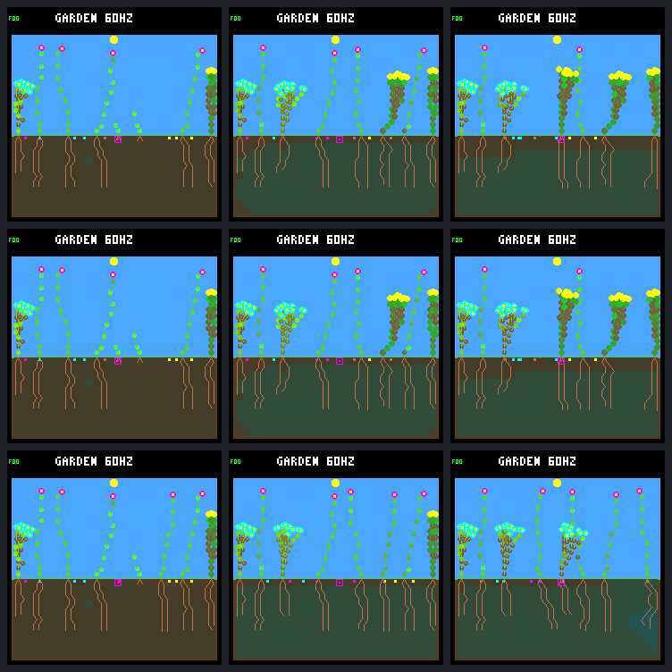

# Two FINISH refusals bridge the gap — but do not improve every outcome

Refusing both uncovered daylight attempts **rescues flower 22 through day 64**.
It creates 29 seeds and has four germinated offspring, two still alive at the
endpoint. The one-shot refusal and unchanged control both kill it at tick
72,000, without seeds. This establishes a retry/timing mechanism in this case,
not a qualified general spending policy: whole-world natural deaths rise
**17 → 21**, living exposure falls, and shrubs disappear from the final garden.

This is the same selected `abf7af73.patch.guard` world and existing models,
weather, routing, capacity, selective leaf renewal and eight scheduled patches.
The general dark guard is unchanged. The [protocol](renewal-finish-retry-protocol.md)
was [posted before collection](https://github.com/aortez/toy-factory/issues/30#issuecomment-5747614942).
There is no extension veto in this comparison.

## What the two refusals change

The host-only hook rejects two exact winning FINISH receipts by flower 22,
tip 271. It preserves resources, the tip, private RNG/memory, growth phase,
cooldown and action counters; it does not refund or select another action.
Both proposals cost nine energy and five water without adding a node.

| Tick / phase | Retry arm after processing | Meaning |
| --- | --- | --- |
| 69,885 / 115 | 92 energy, 152 water, 21 nodes | First forced refusal, identical to the previous one-shot intervention |
| 69,900 / 116 | 90 energy, 161 water, 21 nodes | Second forced refusal; the one-shot arm pays here |
| 69,915 / 117 | 91 energy, 172 water, stress 0 | Diagnostic ends; ordinary guard denies FINISH |
| 72,150 / 10 | 0 energy, stress 7, still alive | Last zero-income ecology step of this night |
| 72,165 / 11 | 3 energy, stress 7 | First actual dawn income |
| 72,210 / 14 | 5 energy, 507 water, stress 6 | FINISH finally pays nine/five after income returns |
| 72,540 / 36 | 59 energy, 32 nodes, stress 0 | Ordinary growth continues and stress recovers |

At the handoff, retaining 91 energy projects survival with peak stress seven;
paying to reach 82 projects stress eight and death at 72,000. The unchanged
guard rejects that expense and subsequent eligible retries during its covered
interval. The two forced refusals defer **one nine-energy payment**, not two
separate purchases or an eighteen-energy saving. Once stores become too low,
ordinary affordability also prevents purchases. Neither intervention remains
active at dawn. The eventual FINISH receipt names node 254 after pool
compaction; raw node indices are not permanent identities.

The target ends with 36 nodes, no growth tips, 251 energy, 510 water and zero
stress. It produces **29 seeds**, including 16 in days 48–64. Its offspring are:

| Child | Birth tick | Observed outcome through 245,760 |
| --- | ---: | --- |
| 26 | 142,080 | Energy death at 144,960; no seeds; less than one full day alive |
| 27 | 150,180 | Energy death at 151,140; no seeds; less than one full day alive |
| 35 | 218,820 | Alive for more than seven days; no seeds yet |
| 36 | 241,410 | Alive for more than one day; no seeds yet |

Thus this is one surviving parent with two observed full-day children, not
four successful reproductive lineages. Survival and reproduction after the
fixed endpoint remain censored. This case recovers after dawn; it does not
resolve the separate post-horizon deaths found in the broader panel.

## Whole-world effects

| Through day 64 | Control | One-shot FINISH | Retry-aware FINISH |
| --- | ---: | ---: | ---: |
| Natural deaths (all energy) | 17 | 17 | 21 |
| Scheduled patch deaths | 6 | 6 | 7 |
| Germinations | 26 | 26 | 31 |
| Full-day offspring survivors / eligible | 16 / 25 | 16 / 25 | 18 / 31 |
| Full-day descendant parents with full-day child | 5 | 5 | 7 |
| Seed purchases | 525 | 525 | 528 |
| Living plants / descendants at endpoint | 8 / 7 | 8 / 7 | 8 / 7 |
| Living species at endpoint | 3 | 3 | 2 |
| Closing births (days 48–64) | 2 | 2 | 5 |
| Closing full-day survivors / eligible | 1 / 1 | 1 / 1 | 4 / 5 |
| Closing natural deaths | 0 | 0 | 1 |

Control and one-shot each have one recently born living plant without a full
day of follow-up; the retry arm has none. These plants are excluded from the
eligible denominator, not counted as failures. More total survivors coexist
with a lower whole-run survival fraction and more mortality. Whole-run living
exposure falls **1.94%** (124,954 → 122,528 ecology-step plant observations);
closing exposure falls **0.32%** (32,322 → 32,220).

No other pre-intervention plant changes its lifetime. Seed output does change:
founder 5: 41 → 42, shrub 6: 66 → 78, ground-cover 13: 159 → 154, flower 17:
14 → 13, flower 20: 31 → 24. Shrub 18 still dies at 68,400, and shrub 6 still
dies in the scheduled patch at 131,595. No subsequent shrub germinates in the
retry arm. It ends with **five flowers and three ground-cover plants**, versus
three flowers, three shrubs and two ground-cover plants in the control. The
final seed bank also contains no shrub descendants. Later recruitment differs;
newborn IDs after divergence are not matched individuals across arms.

These effects do not mean that rescuing an individual necessarily worsens an
ecosystem, or that mortality alone should decide the objective. They show why
we must retain establishment, survival, reproduction, exposure and variety
together. All arms still depend on the same recurring disturbance schedule;
this is not evidence for autonomous indefinite renewal without it.

## Fixed native screenshots

Rows: **control, one-shot FINISH, retry-aware FINISH**. Columns: **days 19, 32, 64**.
Control and one-shot images are byte-identical. The retry row retains the extra
tall flower at day 19 and has a visibly different later canopy, consistent with
the recorded loss of shrubs and different recruitment. All nine images use
the production renderer and match their own census and repeated framebuffer.



Individual images: [renewal-finish-retry-frames/](renewal-finish-retry-frames/).

## Verification and evidence

- **24 predeclared native calls**, six complete traces and eighteen frame
  replays, with exact repeats and no failed capture. No extra world, training,
  general guard change, commit, push or device flash.
- Rebuilt control **and** one-shot raw traces and all saved frames/metadata
  are byte-identical to the frozen parent. Retry prefixes preserve **48,889**
  raw records versus control and **48,903** versus one-shot before the selected
  transactions. Exactly two forced refusals occur; ordinary forecasts and
  guard-denial counters remain separate and independently audited.
- **13,780 guard events** and **372,464 live resource budgets** reconcile,
  together with leaf renewal/wear, stress, tips, lineages, seed flows, exposure
  and patch boundaries. Cleared natural terminal budgets are not reconstructed.
  Repeated offline analysis and the portable export check are exact.
- **73 default host CTests** and all five focused native/guard/diagnostic
  suites pass, including nine retry-specific Python tests. Native fixtures
  cover both arbitration modes, two atomic refusals, missing/duplicate/invalid
  receipts, unchanged guard metadata, guard handoff, later spending and reset.
  The embedded-C conventions kept this diagnostic host-only and fail-closed
  at its receipt boundary; default/device behavior is unchanged.
- The [portable summary](renewal-finish-retry-summary.json) retains full
  lineage/cohort/neighbor results and selected target receipts. Complete target
  ecology histories and raw evidence remain in the frozen local bundle.
  The export distinguishes a guard-allowed but forcibly refused attempt from
  an actually paid purchase.

Local bundle: `artifacts/garden-renewal-finish-retry-v1`, **87 hashed artifacts**,
148,823,420 bytes. Manifest SHA-256:
`7e3fd0628912287cdd36954d3f9b38e7471d012f1df31b87cfacde009d044d45`.
Full results SHA-256:
`f32ddd3f509129753dba63f0be7419b527625e2465a2ff2092fa646c0bd0a481`.

```sh
python3 -W error sim/garden_renewal_finish_retry.py \
  --output artifacts/garden-renewal-finish-retry-v1 --verify \
  --check-export benchmarks/garden-longevity/renewal-finish-retry
```

## Next proposal

Audit post-intervention recruitment and mortality from the saved traces before
choosing a general spending rule: separate additional birth opportunities from
poorer seedling survival, and locate where shrub recruitment stops despite
more shrub seeds. Compare cohorts and opportunities, not coincident later IDs.
That read-only follow-up needs no additional native runs. Do not tune a broad
dusk gate or restart training from this single-plant rescue alone.
