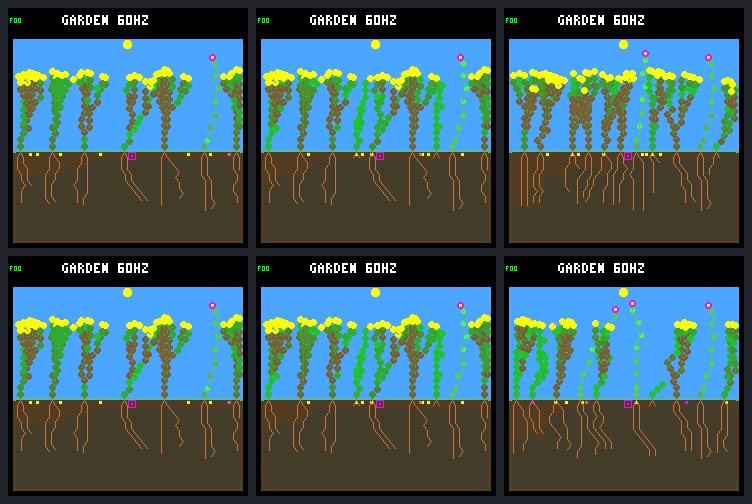

# Full-pool execution permits WAIT, but does not finish stalled tips

The [fixed host-only comparison](renewal-full-pool-protocol.md) does **not** pass
its predeclared gates. With 512 nodes still enforced, the candidate executes
6,224 WAITs and refuses 6,060 allocating EXTEND winners before expense or private
state commit. It selects **no FINISH** and no geometrically exhausted EXTEND at
full capacity. New full-day survivors fall **17 → 16**; durable new parents stay
at six, and the same six boundary incumbents eventually die.

The transaction path works in the native fixtures, but merely allowing the
controller to run does not make it choose useful non-allocating completion.
Keep this diagnostic off by default; this is not environment qualification.

## One isolated change

Both arms reuse the saved sixteen-slot trajectory: `rainfed-crowded` seed
`0d983a80`, N background/descendants (`01b9d94a`), W founder 5 (`c9ea07fd`),
512 nodes and eight seeds. The common eight-slot prefix, subsequent sixteen-slot
admission, founder export, fractional canopy, wet germination, spacing,
purchase order, costs, guards, models and weather are unchanged.

After tick 69,120, `--full-pool nonallocating` bypasses only the blanket
pre-policy node-capacity gate. Resource eligibility, cooldown and leaf-renewal
precedence remain. Arbitration chooses its normal winner; an allocating winner
is refused before expense, RNG, memory, growth-phase, previous-tip or committed
telemetry changes. There is no fallback, forced FINISH or reprioritization.
Non-allocating paid actions retain their existing expense guards and prices.

An EXTEND with no geometrically available candidate retains the existing
exhausted-tip behavior. That path and FINISH work at full capacity in focused
tests, but neither occurs there in this saved-model comparison. FINISH clears a
tip and can mark an existing shoot as flowering; **it does not free a node**.

The rebuilt control reproduces the previous sixteen-slot raw traces, frame
JSON and pixels byte-for-byte before candidate capture. All previously derived
control results agree. Both arms share 46,704 world/bid and 4,613 site records
through the boundary, ignoring only the new diagnostic metadata.

## What the newly executed policy actually does

| Selected action at that plant's full-pool growth entry | Count |
| --- | ---: |
| WAIT, committed | 6,224 |
| EXTEND requiring a node, refused before expense | 6,060 |
| FINISH, selected or committed | 0 |
| Geometrically exhausted EXTEND | 0 |
| Non-allocating winner rejected by a later expense guard | 0 |
| Total selected winners | 12,284 |

These receipts belong to candidate plants 7, 15, 19, 20 and 39. Control has no
full-pool bids because its gate runs before policy evaluation; it has no
observable hypothetical action to label a rejected request.

A supplementary read of the saved raw bids finds **no FINISH among any of the
39,143 bids** evaluated at those full-entry decisions, not merely no winning
FINISH. Of the 6,224 WAIT winners, **6,220** were EXTEND before the unchanged
`no-night-growth-v1` wrapper; four were already WAIT. Most newly committed WAITs
therefore reflect the existing night rule, not a newly learned allocation
response. The neural policy can choose FINISH, and already enforces it at
maximum depth or geometric exhaustion; the full-entry selected tips are below
their depth limits. The current observation contains plant-local body/resource
information, but no global free-node count or allocation-refusal history.
This establishes the observed behavior, not that adding such an input would
improve survival.

This intervention is not a no-op when no tip finishes. WAIT commits the normal
private state and telemetry, and the existing no-tip path can advance growth
bookkeeping when the policy gate no longer skips it. The first physical hash
difference is tick **80,955**, with no other exported census-field difference.
The first exported census change beyond the hash is WAIT telemetry at **81,600**.
Neither timestamp should be described as a new tissue allocation or a rescue.

All allocation refusals reconcile with zero growth expense, no committed action,
unchanged tip/node counts and unchanged exported agent telemetry. Native tests
also check the private RNG/memory/phase/previous-tip fields directly. Only these
independently checked uncommitted bids are omitted from legacy expense analysis;
raw evidence, leaf observations and authoritative world records are preserved.

## Fixed day-64 outcomes

Post-boundary means `(69120,245760]`; closing means `(184320,245760]`.
The candidate's two most recent seedlings are only 915 and 60 ticks old at the
endpoint, versus 3,840 ticks for a garden day. They remain explicitly censored,
not counted as either full-day successes or failures.

| Outcome | Saved sixteen-slot control | Non-allocating candidate |
| --- | ---: | ---: |
| Post-boundary births | 27 | 29 |
| New full-day survivors / eligible seedlings | 17 / 27 | 16 / 27 |
| New full-day parents with a full-day-surviving child | 6 | 6 |
| New seedlings alive at endpoint | 10 | 9 |
| New seedling deaths | 17 | 20 |
| Boundary incumbent deaths | 6 / 7 | 6 / 7 |
| Closing births / natural deaths | 19 / 19 | 21 / 22 |
| Whole-run births / natural deaths | 34 / 27 | 36 / 30 |
| Final living / descendants | 11 / 10 | 10 / 9 |
| Final species / founder families | 2 / 2 | 2 / 2 |
| Maximum generation | 4 | 5 |
| Whole-run purchases / germinations / expiries | 516 / 34 / 474 | 520 / 36 / 476 |
| Peak occupied plant records | 12 | 11 |
| Full-node post-boundary checkpoints | 7,703 / 11,776 | 6,539 / 11,776 |
| Endpoint nodes | 512 / 512 | 417 / 512 |

Eight seeds remain pending in each arm. The earlier manual founder export is
separate from natural deaths. Both generation-five candidate seedlings are
recent/censored. Numeric descendant IDs after divergence are not paired
cross-arm identities. More births or a higher generation alone does not reverse
the failed mechanism and survivor gates.

Full-node occupancy falls from 65.4% to 55.5%, but this accompanies a different
turnover trajectory with more deaths, not reclaimed nodes from a FINISH action.
Neither arm reaches sixteen occupied plant records. All endpoint nodes in both
arms belong to living plants. The control's last birth/death are 225,885/228,780;
the candidate's are 245,700/244,800. Activity near the endpoint is not proof of
sustained renewal beyond the fixed horizon.

### Incumbent retention is unchanged, timing is not

| Stable boundary identity | Control death tick | Candidate death tick |
| --- | ---: | ---: |
| Shrub 2 | 199,860 | 199,800 |
| Shrub 4 | 214,200 | 210,120 |
| Flower 5 | — | — |
| Shrub 6 | 192,960 | 192,960 |
| Shrub 7 | 144,840 | 144,840 |
| Shrub 9 | 206,520 | 241,140 |
| Shrub 12 | 194,760 | 194,760 |

Flower 5 survives in both arms. The previous audit's water/energy problems have
not been resolved by this action-gate change. A delayed death is not a retained
incumbent at the endpoint; equally, these timings do not imply one common cause
for all six deaths.

## Predetermined visual review

Rows: control, non-allocating candidate. Columns: ticks 69,120, 72,960 and
245,760. Both early frame pairs are identical; the endpoint candidate has more
open canopy and a changed root layout. All six frames and repeats are retained.
No rendering corruption is visible. Appearance is not a substitute for the
survival/renewal counters.



## Implementation and verification

The host-only option is reset off and explicitly disabled by ordinary build
scripts. It requires the plant-slot experiment, rejects firmware compilation,
and records bounded, overflow-checked per-world receipts outside the physical
hash. The instrumented host world grows **10,808 → 10,956 bytes**, entirely from
148 bytes of configuration/diagnostics. This is not a device RAM or speed result;
the new code/storage is excluded from normal firmware.

- **92/92 default and 97/97 experimental CTests pass**, with strict warnings and
  UBSan. Eleven focused Python cases plus native fixtures cover both arbitration
  modes, no fallback, expense/private-state preservation, cooldown/leaf
  precedence, existing guards, reset/isolation, activation, one-past limits,
  diagnostic overflow and a newborn filling the final four slots.
- Exactly **20 planned research calls**, all repeated as specified; capture
  time 28.76 seconds. Repeated offline analysis takes 72.67 seconds. No sweep,
  training, extra horizon or device flash.
- **286,700 live-step budgets**, 32,770 canonical site checkpoints and 1,036 seed
  lifetimes reconcile. **57 cleared terminal budgets remain unknown**. Every
  full-pool receipt reconciles with ordered per-plant node-entry accounting.
- All captures, analysis repeats and six images agree. Independent Docker
  Python verification reproduces the host export. An initial independent
  verification process exited with signal-style status 130; an unchanged,
  analysis-only retry completed. No research recapture or analysis correction
  was needed.
- Embedded-C conventions guided the bounded transaction boundary, explicit
  failure handling and state-preservation tests; unrelated native behavior is
  checked against the archived parent sources.

Evidence:

- [Portable summary](renewal-full-pool-summary.json), SHA-256
  `4a99f3776ba5ac5fae4bdd45ac60f5ca8e5109224c9035c07dcc0ad28621c873`.
- Bundle `artifacts/garden-renewal-full-pool-v1`, manifest SHA-256
  `c35c3ab8ec8479312e6bf2b14a9a78867a536b72693a5ce492cc6d64bd03a97a`.
- Full results SHA-256
  `24f61a0d585789d17943978fdc08c3730d444e43ee530bd03b5c235304e86123`.
- Protocol, native/analysis sources, build settings, binaries, models, parent
  controls and raw repeats are sealed. Earlier evidence remains unchanged;
  historical verifiers retain their stricter historical-source requirements.

Current-checkout verification, analysis only:

```sh
docker compose run --rm -T --no-deps firmware python3 -W error \
  sim/garden_renewal_full_pool.py \
  --output artifacts/garden-renewal-full-pool-v1 --verify \
  --check-export benchmarks/garden-longevity/renewal-full-pool
```

## Next discussion

Separate **action legality**, **what the controller observes/chooses**, and
**releasing occupied storage**. This test repairs the first path mechanically;
it does not solve the other two. Do not automatically promote it, force FINISH,
substitute a lower bid, retrain or add RAM following this negative outcome.

The next useful design question is living-body turnover: can a plant shed an
unproductive terminal part, reclaiming its node without orphaning useful
structure? First establish what the saved histories can identify, what topology
or productivity observations are missing, and how much seedling/growth space
could actually be recovered. Discuss the local action, structural safety and
costs before implementing a pruning mechanism. Water availability remains a
separate limitation. No commit, push, default promotion or firmware change.
