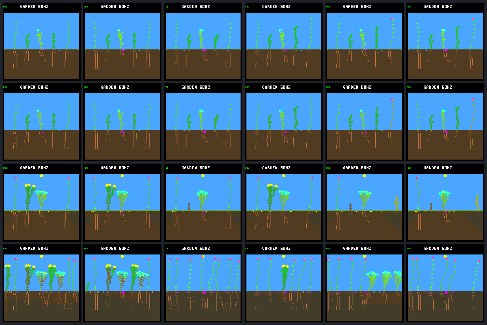

# One-neighbor swaps: two routes to early shrub failure

Changing **either the ground-cover or the far-right flower alone** from N to W
is enough to kill the unchanged N-controlled shrub near day 1.8 in this world.
Changing the other shrub causes a later death; changing the left flower does
not kill the observed shrub within eight days. The early failures have different
resource histories: reduced photosynthetic income in one, an extra automatic
seed purchase enabled by bank availability in the other.

[Predeclared protocol](renewal-neighbors-protocol.md) ·
[Verified resource/decision data](renewal-neighbors-summary.json) ·
[Previous reciprocal swap](renewal-swap.md)

## What was held fixed

Observed founder shrub **2** always uses N (`01b9d94a`). Each new case switches
exactly one other founder to W (`c9ea07fd`), using its stable lineage identity;
every other plant and every descendant remains N. World `0d983a80`, reset hash
`e663996c`, eight days, 512 nodes, eight plants/seeds, rainfed-crowded, wide
dispersal, headroom uptake, selective leaf maintenance and nighttime-growth veto
are unchanged. No gardener, drainage, reserve gate or new model. The first
scheduled patch is after this horizon.

The previous native executables, models and configuration were reused verbatim.
The N/N and N/W references are copied verified captures, not rerun simulations.
N/W also gives W to all descendants: it is a contextual reference, **not** an
all-four-founder factorial treatment with N descendants or an additive prediction.

## Results and native screenshots

Second sunset is tick 4,800 / day 1.25. All observed shrubs in this table pay
**seven energy per upkeep charge**: none crosses the higher 57-node threshold.

| Founder switched to W | Shrub 2 nodes / sunset energy | Shrub 2 outcome | Day-eight flowers / shrubs / ground-cover |
|---|---:|---|---|
| None: saved N/N control | 55 / 205 | Alive through day 8 | 3 / 3 / 2 |
| 1: left flower | 55 / 205 | Alive through day 8 | 2 / 3 / 2 |
| 3: ground-cover | 54 / 185 | Energy death at tick 6,840, day 1.781 | 8 / 0 / 0 |
| 4: other shrub | 55 / 205 | Energy death at tick 26,040, day 6.781 | 5 / 1 / 0 |
| 5: far-right flower | 55 / 187 | Energy death at tick 6,840, day 1.781 | 4 / 0 / 3 |
| All nonfocal plants: saved N/W reference | 54 / 185 | Energy death at tick 6,840, day 1.781 | 6 / 0 / 0 |

Columns follow that table: **N/N, neighbor 1, neighbor 3, neighbor 4, neighbor 5,
N/W**. Rows are days **0.25, 0.75, 2, 8**. These are native-renderer frames, not
illustrations. Sixteen new checkpoints and eight saved reference checkpoints
each have an exact independent repeat.



Post-reset births/deaths in the four new cases are **4/2, 6/3, 6/5, 14/12**.
The left-flower case retains two living focal offspring; the other-shrub case
has one living focal offspring despite the parent's later death. The two early
death cases have no germinated focal offspring by day eight. These are endpoint
censuses, not qualification as durable parents; recent offspring have limited
follow-up. Descendant IDs are not matched across worlds.

## Ground-cover: less income, not an extra seed

With only founder 3 changed, shrub 2 enters the second daylight with **five more
energy** than control, then receives **45 less photosynthetic energy**. It saves
eight energy on growth and loses thirteen less to overflow, but spends one more
on upkeep. Both buy **three seeds**, costing 144 energy per world in that interval.

The exact sunset difference is `+5 - 45 + 8 + 13 - 1 = -20`. It has 185 energy,
first fails upkeep at tick 6,420, and dies at 6,840. Immediately beforehand it
has zero energy, 512 water and stress seven. Having one fewer body node does
not lower its seven-unit upkeep charge.

The first recorded resource difference is water uptake at tick 675; the first
body-count difference is a changed tip count at 2,970. This is not an isolated
shading intervention: geometry, root uptake, light, decisions and automatic
reproduction interact. Lower total photosynthetic income is measured, but we
have not isolated which ray, leaf or neighbor interaction accounts for it.

## Far-right flower: the shared seed bank changes spending

With only founder 5 changed, the focal energy/water/income/stress history remains
identical through tick **4,245**. At **4,260**, the changed world purchases a seed
and the control does not. The raw censuses show:

| Measurement | N/N control | Neighbor 5 switched |
|---|---:|---:|
| Seed-bank occupancy at 4,245 | 8 / 8 | 7 / 8 |
| Focal stored energy at 4,245 | 256 | 256 |
| Focal reproduction cooldown at 4,245 | 1 | 1 |
| New seeds during step 4,260 | 0 | 1, from shrub 2 |
| Focal energy after step 4,260 | 249 | 201 |
| Seed-bank occupancy after step 4,260 | 8 / 8 | 8 / 8 |

There are no germinations or expirations in that step. The full-bank check in
[`update_reproduction()`](../../src/garden_world.c) blocks the control's purchase;
the unused slot permits the swapped world's purchase, debiting **48 energy and
24 water**. The remaining eligibility rules still apply. This is not a claim
that a dead parent deletes its seeds: the bank contents and other parents'
purchase histories have changed through the intervening ecology.

After a seed expires, the control buys again at 4,560 and the swapped world at
4,620. The focal second-daylight totals become **three versus four purchases**.
Growth and upkeep spending are identical. The swapped case receives two less
photosynthetic energy and discards 32 less overflow; its closing difference is
`-2 + 32 - 48 = -18`, leaving **187 rather than 205** at sunset.

It first fails upkeep at 6,420 and dies at 6,840 with full water immediately
beforehand. Seed-bank availability is therefore a concrete route by which a
distant plant can change focal spending. **Reproduction is automatic, outside
the neural growth controller's action set.** A full bank can suppress spending;
this is not evidence that the N controller learned prudent reproductive timing.
Whether blocking the additional late purchase would restore survival remains
a separate counterfactual, not proven by adding 48 back on paper.

## Later failure and tied decisions

The other-shrub swap has the same second-sunset body and complete second-daylight
resource budget as control. Its first focal resource difference is an additional
seed purchase at tick 7,740. It retains the same body counts until death at
26,040, showing why the whole predeclared horizon matters: a day-two snapshot
would miss this failure. The last living sample again has zero energy and full
water. Its detailed late causal chain has not been isolated here.

The tie audit finds **one equal-recorded-bid-set/different-winner event each** in
the left-flower, other-shrub and far-right-flower swaps, at ticks **2,700, 2,775
and 2,685**. Each is a **nighttime WAIT**, not an immediate paid growth action.
After excluding only global tip indices and declared routing CRC, the complete
recorded bid multisets match, but the first maximum-priority bid differs.
The engine's rotating global-node scan explains how equal priorities can select
different tips when surrounding plants change the pool ordering.

This confirms ordering sensitivity in recorded decisions, not its causal role
in the deaths. WAIT still proposes private memory updates, which these traces
do not expose fully. The left-flower case survives despite its event. No such
equal-recorded-bid-set event was found for the ground-cover swap or N/W reference;
their differing tied decisions also have differing recorded bids. Do not call
those cases pure reordering or conclude that the ordering events are harmless.

## Verification and provenance

- **128 renewal-family Python tests pass**, including fourteen new tests for
  routing, strict tie classification, missing/duplicate evidence, seed timing
  and the fixed native-call budget. CMake registers the new test suite.
- All **134 native C/header files** match the pinned prior snapshot. Executable,
  model and build-cache bytes are copied from the already-tested UBSan build.
  No native rebuild, simulation change or device testing was needed.
- Exactly **40 new native calls**: eight traces plus 32 frame replays, including
  repeats. No reference reruns, training or mutation calls. Capture took
  **3.09 seconds**, analysis plus its identical repeat **10.85 seconds**; these
  are diagnostic timings, excluding source-copy/container startup work.
- All four new full traces repeat byte-for-byte. Their **8,196 census samples,
  37,434 live-step resource budgets, 19,840 growth bids and 6,263 committed
  decisions** reconcile with leaf and tip accounting. Every growth bid uses the
  intended controller, including descendants staying on N.
- All sixteen new native checkpoints match the traced state and repeat in both
  JSON and RGB565 bytes. Both copied references reproduce the old saved analysis;
  their eight saved frame pairs also verify. Including references, the audit
  covers 12,294 samples, 54,995 live resource steps and 9,132 decisions, not six
  newly sampled worlds.
- **22 new terminal steps**, 31 including references, retain the explicit
  cleared-income limitation. Final death-step resource spending is not invented.
  Inputs, commands, source and capture hashes were sealed before analysis, with
  no failed or extra experimental runs. Portable export and reanalysis verify.

The ignored bundle is `artifacts/garden-renewal-neighbors-v1`, **149 artifacts /
51,989,151 bytes**, excluding manifest. Manifest SHA-256:
`ca91af24f73667e34f686d6a97ce0a5613b94f9f0aea55f5be7dffe7b41fbdcc`.

```sh
# Offline verification; invokes no native simulations:
python3 -W error sim/garden_renewal_neighbors.py \
  --output artifacts/garden-renewal-neighbors-v1 --verify \
  --check-export benchmarks/garden-longevity/renewal-neighbors
```

## Next proposal

The most focused next test is the **far-right-flower case with only shrub 2's
fourth seed purchase during the second daylight suppressed**. Limit that
diagnostic to the single founder and daylight interval, leave all ordinary
costs/growth/other parents unchanged, and compare against the saved case. A
three-purchase ceiling for that interval must also reject retries; skipping one
tick would merely postpone a purchase. Check whether the shrub survives the
following dawn and the eight-day horizon, while retaining bank/descendant
side effects rather than assuming their histories stay fixed.

This would be a causal probe, not a proposed permanent reproduction quota.
The previous [sunset-aware seed-reserve panel](seed-reserve.md) already showed
mixed tradeoffs; this is not a reason to silently enable that gate or repeat a
broad search. The ground-cover's no-extra-seed failure remains a distinct problem.
Discuss the targeted probe before implementing it. No ecology/fitness/default
change, new training, deployment, commit or push followed this investigation.
