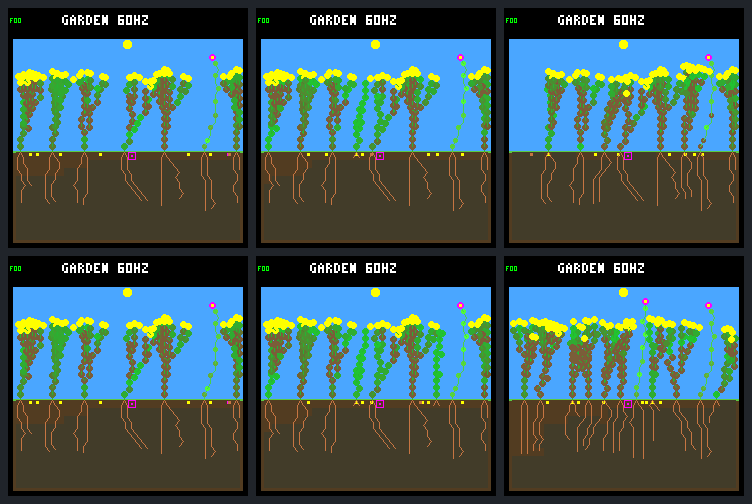

# More plant slots unlock descendants, then encounter the node ceiling

The [fixed eight-versus-sixteen comparison](renewal-plant-slots-protocol.md)
produces genuine further-generation reproduction: **17 new full-day survivors
and six new full-day parents with full-day-surviving children**, versus two and
zero in the eight-slot control. Maximum generation reaches four instead of two.

It is still a **mixed result under the predeclared gates**. Six of seven boundary
incumbents die instead of one, and a founder family disappears. The 512-node
pool is completely occupied at 65.4% of post-boundary checkpoints. Do not promote
the rule or increase RAM on the strength of this one selected world.

## The isolated change

Both arms use the saved fractional-canopy candidate, `rainfed-crowded` seed
`0d983a80`, N background/descendants (`01b9d94a`) and W founder 5 (`c9ea07fd`).
The earlier founder export, wet germination, two-column spacing, rotating
purchases, guards, weather, models, fees, **512 nodes and eight seeds** are fixed.

The build has 16 physical plant records, but admission stays eight through tick
69,120 inclusive. Only `--plant-slots 16` raises admission afterward. The first
eligible ecology step is 69,135; the first **physical** divergence is 70,080,
when the candidate admits another seedling. The control remains eight throughout.
Dead plants retain their slots until normal decomposition. No forced deaths,
reordering, reserved slots, spacing relaxation or eviction are added.

The historical fractional-canopy control's raw traces, frame JSON and pixels
reproduce byte-for-byte before candidate capture, and every previously derived
control result reconciles. Both arms share 46,704 world/bid and 4,613 site prefix
records through the checkpoint; only candidate admission metadata differs.

## Outcomes at the fixed day-64 endpoint

Post-boundary means `(69120,245760]`; closing means `(184320,245760]`.
All new seedlings have a full day of potential follow-up; none are recent/censored
by the endpoint. A full-day survivor can still die later.

| Outcome | Eight-slot control | Sixteen-slot candidate |
| --- | ---: | ---: |
| Post-boundary births | 2 | 27 |
| New full-day survivors / eligible | 2 / 2 | 17 / 27 |
| New seedlings alive at endpoint | 2 | 10 |
| New seedling deaths | 0 | 17 |
| New full-day parents with a full-day-surviving child | 0 | 6 |
| Deaths among seven boundary incumbents | 1 | 6 |
| Closing births / natural deaths | 1 / 1 | 19 / 19 |
| Whole-run births / natural deaths | 9 / 5 | 34 / 27 |
| Final living / descendants | 8 / 5 | 11 / 10 |
| Final species / founder families | 2 / 3 | 2 / 2 |
| Maximum generation | 2 | 4 |
| Whole-run purchases / germinations / expiries | 514 / 9 / 497 | 516 / 34 / 474 |
| Peak occupied plant slots | 8 | 12 |
| Final node use | 429 / 512 | 512 / 512 |

Eight seeds remain pending in each arm. The identical earlier manual founder
export is separate from natural deaths. Numeric IDs after divergence are not
cross-arm identity matches. Six qualifying new candidate parents are 13, 17,
19, 25, 26 and 27; some subsequently die. This is observed descendant survival,
not merely paid seed purchases or a higher instantaneous population.

The candidate passes the survivor, durable-parent and species-retention gates.
It fails the predeclared incumbent-loss and founder-family-retention gates.
Deaths can be part of ecological turnover; these gates do not establish that
every replacement is undesirable. They prevent relabeling a birth increase as
an unqualified improvement after seeing the result. Broader ecology and
longer-term persistence remain unqualified.

## Where pressure moved

| Post-boundary observation | Eight slots | Sixteen slots |
| --- | ---: | ---: |
| Site checkpoints | 11,776 | 11,776 |
| Full at the actual plant limit | 11,658 | 0 |
| More than eight occupied plant slots | 0 | 10,467 |
| Node pool completely full | 0 | 7,703 |
| Fewer than four free nodes for a seedling | 0 | 7,727 |
| Retained mature-seed observations | 91,031 | 86,601 |
| Plant-capacity-only post-step masks | 5,543 | 0 |
| Node-capacity-only post-step masks | 0 | 865 |

The candidate never reaches 16 plant records: its peak is 12. There is no reason
to fill those records artificially; two-column spacing in 28 columns already
limits how many plants can coexist. Node-space rejection first appears at 80,760,
and the pool first reaches 512 at 80,940. The candidate remains full from 230,220
through the endpoint—about **4.05 garden days**. Its last birth is 225,885 and last
death 228,780, so the closing birth/death totals should not be mistaken for
continuous renewal right up to the endpoint.

At the endpoint all 512 nodes belong to living plants: 11 occupants, zero dead
tissue awaiting reclamation. Thus faster decomposition alone cannot release
that endpoint storage. Four living plants retain tips, while the others are
tipless. All eleven have zero stress at that census; this is a snapshot, not a
prediction of subsequent survival or proof that every blocked action is useful.

Of the candidate's mature post-step observations, node pressure overlaps other
gates: 865 node-only, 3,967 node+moisture, 8,586 node+spacing and 46,449 with all
three. The remaining masks are moisture (2,534), spacing (4,308), and both
(19,892). No plant-capacity bit remains after the boundary. These repeated
observations are correlated and **not counts of distinct failed births**;
the previous allocation-only code-order proof is not automatically applied to
node masks after growth has run.

Resource histories also become more competitive. Among audited post-boundary
plant-steps, shared live root-cell exposure rises from zero to 11,209. That
documents overlap, not which neighbor caused a death or how much water it took.
The candidate's 23 post-boundary natural deaths comprise 13 energy, eight water
and two combined shortages. Node fullness alone does not attribute those deaths.

## Incumbents and the surviving flower family

| Boundary incumbent | Control death | Candidate death / recorded shortage |
| --- | ---: | --- |
| Shrub 2 | — | 199,860 / water |
| Shrub 4 | — | 214,200 / energy |
| Flower 5 | — | — |
| Shrub 6 | — | 192,960 / water |
| Shrub 7 | 200,580 / water | 144,840 / energy |
| Shrub 9 | — | 206,520 / energy |
| Shrub 12 | — | 194,760 / energy and water |

Founder flower 5 remains a 36-node, 20-root, eight-leaf, tipless body with no
sampled shortage in either arm. Its post-boundary income is 36,427 versus 36,348
energy units; all 14,720 upkeep units are paid in each. It buys **one versus 24
seeds**, with zero versus one germinated child. Candidate flower 30 is born at
212,355, survives to the endpoint and buys one seed; it has no germinated child
yet. The final candidate contains two flowers and nine shrubs, from founder
families 5 and 2. Family 4 is absent from both the living population and seed bank.

Live-step budgets are checked exactly; resource fields cleared on natural death
remain unaccounted at the terminal step. Sampled leaf light is not treated as a
measurement of the entire canopy.

## Predetermined visual review

Rows: eight-slot control, sixteen-slot candidate. Columns: ticks 69,120, 72,960
and 245,760. All six native frames and repeats are preserved, including the
mixed outcome. The shared checkpoint is identical; later candidate frames show
extra bodies and a denser root network. No rendering corruption is visible.



## Implementation, memory and validation

The host flag is reset off, excluded from the physical hash, logged as
`plant_admission`, and requires fractional canopy configuration. Normal build
scripts explicitly turn it off; firmware compilation rejects it. The same
effective limit governs direct planting, germination and site queries. Storage
bounds, world validity and diagnostic arrays support 16 without changing
controller inputs or allocation order.

Measured host `sizeof(world)` rises **8,760 → 10,808 bytes**, a 2,048-byte increase:
992 bytes for eight extra plant records, 960 for ordinary guard diagnostics and
96 for full-night diagnostics. Configuration fits existing padding. This is an
instrumented host layout, not a measured device RAM or performance cost. No
device build/flash or firmware default changes were made.

- **90/90 default and 94/94 experimental CTests** pass, with strict warnings and
  UBSan. Ten new Python cases and native admission/boundary/node-limit/reset/
  sequential-seed/one-past/overflow fixtures cover the change. Diagnostic tests
  fill all 48 ordinary and 16 full-night entries and check overflow handling.
- Exactly **20 fixed native captures**, no research training or additional
  outcome-selected captures; capture time 26.59 seconds. Repeated offline
  analysis takes 64.04 seconds for both passes.
- Both arms' **266,066 live-step budgets**, 32,770 canonical site checkpoints and
  1,030 seed lifetimes reconcile. All repeated captures and six frames agree;
  independent Docker verification agrees with the host portable export.
- Default integration tests caught a missing new helper in the standalone audit
  package; the collector now includes it. Two source-freeze checks also rejected
  concurrent editing during an initial test run. Clean, source-frozen reruns
  passed. No research capture or analysis recovery was necessary.

Evidence:

- [Portable summary](renewal-plant-slots-summary.json), SHA-256
  `5aca6ec16c07185aeb857f9267537e7346b0510b2dd7abd7f8f4977395059c82`.
- `artifacts/garden-renewal-plant-slots-v1/manifest.json`:
  `1cec5406f4f595972fde3cfea355d9f8c6c712fb279112d81f8e0ec3a77e0d3b`.
- Full results SHA-256
  `4962a80a7338cddb8cde5e6019289e530ebbba75d34c730d5a8763afb064a6f1`.
- Sources, binaries, models, build configuration, fixed protocol, parent
  controls and raw captures are sealed in that bundle. Prior bundles remain
  unchanged; historical verifiers still require their historical sources.

Current-checkout verification (analysis only, no simulator execution):

```sh
docker compose run --rm -T firmware python3 -W error \
  sim/garden_renewal_plant_slots.py \
  --output artifacts/garden-renewal-plant-slots-v1 --verify \
  --check-export benchmarks/garden-longevity/renewal-plant-slots
```

## Next discussion

Use the saved candidate histories to audit **who owns the node pool, which
growth/establishment requests are denied, and what precedes the six incumbent
deaths**. Separate useful living structure, stalled growth and dead-reclaimable
tissue, with light/water competition treated independently. The experiment
supports removing the eight-plant bottleneck for further investigation, but
does not establish that adding more nodes, shrinking bodies, accelerating decay
or introducing an allocation quota would improve renewal. Agree on that next
intervention only after the audit. No new rule is implemented by this proposal.

Work remains uncommitted and unpushed. No defaults, fitness, training or device
firmware have been promoted or changed by this host-only experiment.
