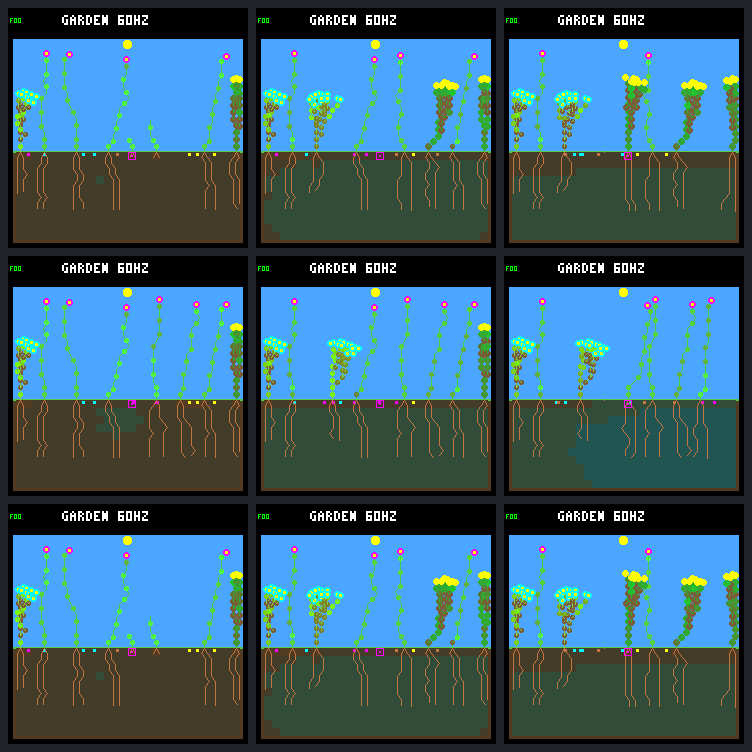

# One purchase can change survival — and the rest of the garden

The isolated **32 → 33-node extension veto rescues flower 21 through day 64**.
The isolated **FINISH veto does not rescue flower 22**: it retries one ecology
step later and still dies at the original tick. Neither result justifies
promoting a broader rule: the extension arm loses shrubs from the final garden.

These are two separate interventions in `abf7af73.patch.guard`, not a combined
policy or independent validation worlds. The unchanged dark guard, models,
founder routing, weather, capacity and eight scheduled patches remain fixed.
The [protocol](renewal-purchase-veto-protocol.md) was
[posted to issue 30 before collection](https://github.com/aortez/toy-factory/issues/30#issuecomment-5747306599).

## What each veto actually does

The host-only hook rejects the eligible winning transaction before spending,
tip mutation, private RNG/memory, growth phase/cooldown or action counters
commit. It does not refund a completed action or replace it with another bid.
Each arm rejects exactly one fixed receipt. Subsequent retries remain ordinary
decisions, and forced vetoes are separate from the guard's denial counters.

### Extension: deferral is enough in this case

At tick **66,060**, flower 21 keeps **151 energy / 510 water / 32 nodes**, instead
of paying nine energy and five water to reach 33 nodes. At the next dark anchor
it has **152 energy / 32 nodes**, versus the original **143 / 33**. The lower
upkeep tier is four rather than five per maintenance payment.

It does not stay at 32 nodes indefinitely. The same root tip extends at
**68,160**, 2,100 logic ticks / 140 ecology steps later. At that point the
unchanged guard accepts the purchase: only two maintenance payments remain
before possible dawn income; projected stress peaks at two without death.
Actual dawn recovery is harder, reaching stress four after more growth, but
the plant recovers to zero stress at **68,640**. The control plant had died at
**68,220**.

The rescued plant is alive at **245,760 / day 64**, with 36 nodes, zero tips,
251 energy, and zero stress. It creates **34 seeds** (17 in the closing window).
One child germinates at **138,120**, creates nine seeds, and survives until a
scheduled patch kills it at **212,655**. This is an observed long-lived
parent/child pair, not merely a seed-production credit. Survival beyond day 64
is censored, not assumed.

### FINISH: one skipped payment just moves the payment

At **69,885**, flower 22 retains its tip and **92 energy / 152 water** rather
than paying to reach 83 / 147. At **69,900**, the same winning tip retries
FINISH and pays nine/five; daylight is still outside guard coverage. Its dark
entry is again **82 energy / 21 nodes**, below the fixed-dark minimum of 90.
It dies at **72,000**, exactly as in the control, without producing seeds.

All 16,393 ordinary/patch census pairs were compared offline. Their world
hashes differ for only 14 ecology samples, **69,885 through 70,080**; every
later census hash and non-diagnostic census field matches. Guard counters and
veto metadata intentionally retain the different history. All lineage outcomes
and all three fixed screenshots match the control. This tests a one-shot veto,
not whether preventing this payment across its retries would help.

## Whole-world effects, including the losses

| Through day 64 | Control | Extension veto | FINISH veto |
| --- | ---: | ---: | ---: |
| Natural deaths | 17 | 14 | 17 |
| Scheduled patch deaths | 6 | 7 | 6 |
| Germinations | 26 | 24 | 26 |
| Full-day offspring survivors / eligible | 16 / 25 | 17 / 23 | 16 / 25 |
| Full-day descendant parents with full-day child | 5 | 6 | 5 |
| Seed purchases | 525 | 524 | 525 |
| Living plants / descendants at endpoint | 8 / 7 | 8 / 7 | 8 / 7 |
| Living species at endpoint | 3 | 2 | 3 |
| Closing-window births (days 48–64) | 2 | 4 | 2 |
| Closing full-day survivors / eligible | 1 / 1 | 2 / 3 | 1 / 1 |
| Closing natural deaths | 0 | 1 | 0 |

Each arm also has one recent living offspring without a full day's follow-up;
it is excluded from the eligible denominator. Newborn identities after an
intervention are not assumed to identify the same plant across arms.

The extension arm ends with **six flowers and two ground-cover plants**, versus
three flowers, three shrubs and two ground-cover plants. Shrubs are absent
from both the living plants and seed bank at the endpoint. The existing shrub
18 still dies at 68,400; shrub 6 still dies in its scheduled patch at 131,595.
No pre-intervention neighbor gains or loses lifetime relative to control; their
seed output can change (shrub 6: 66 → 64, ground-cover 13: 159 → 131, flower 17:
14 → 16, flower 20: 31 → 27). Later recruitment is different, rather than a
direct new mortality event assigned to an already-existing neighbor.

Whole-run living exposure falls **0.57%**; closing living exposure falls
**3.95%** despite more closing births. The closing extension arm also contains
one new energy death. Fewer total natural deaths therefore cannot stand alone
as the evaluation function. Neither arm demonstrates autonomous sustained
renewal without disturbance: both use the same existing patch schedule.

## Fixed native screenshots

Rows: **control, extension veto, FINISH veto**. Columns: **days 19, 32, 64**.
All use the production renderer, match their own census hash, and repeat exactly.
Manual review agrees with the recorded endpoint composition: the extension
row retains tall flowers but loses the bushy shrubs. Control and FINISH images
are byte-identical at every checkpoint; they are retained rather than omitted.



Individual native images are in [renewal-purchase-veto-frames/](renewal-purchase-veto-frames/).

## Verification and evidence

- **24 predeclared native calls**, six complete traces and eighteen replays;
  each trajectory and frame repeats exactly. No failed experimental capture,
  extra world, training, mutation, new guard rule, or device flash.
- New disabled-hook control is **byte-identical to the frozen 64-day raw
  control trace**; saved day-32/day-64 control frames and metadata also match.
  Interventions preserve **46,531 / 48,889 raw records** respectively before
  the selected transaction; all earlier bids and census hashes match.
- **13,405 native guard events** reconcile against the independent forecast;
  **374,175 live resource budgets** reconcile, along with leaf wear/renewal,
  stress, tips, births, deaths, seed flows and patch boundaries. Cleared natural
  terminal budgets are not reconstructed. Repeated offline analysis is exact.
- **72 default host CTests**, the focused native/guard suites, and **10 new
  Python tests** pass. C tests cover both arbitration modes, exact receipt
  rejection, atomic private-state preservation, unchanged guard metadata,
  normal later retries and reset. Compile gates forbid firmware/no-guard use;
  malformed/duplicate CLI selections and corrupt accounting fail.
- The [portable summary](renewal-purchase-veto-summary.json) preserves full
  lineage/cohort/neighbor results and selected target receipts. Complete
  ecology histories remain in the frozen local bundle. The compact exporter
  was added after collection and records its own source fingerprint; no
  native or analysis result was changed to produce the export.

Local bundle: `artifacts/garden-renewal-purchase-veto-v1`, 76 hashed artifacts,
113,557,120 bytes. Manifest SHA-256:
`4a2c01588a204bbd4794d55da6b16cbd96948c0827e7cb3e7339fbd82dea5e4d`.
Full results SHA-256:
`3f00e02e8cc79df7903a7ac7505f98b5f11c8fa88ff30763221ebe2447bb5c14`.

```sh
python3 -W error sim/garden_renewal_purchase_veto.py \
  --output artifacts/garden-renewal-purchase-veto-v1 --verify \
  --check-export benchmarks/garden-longevity/renewal-purchase-veto
```

## Next proposal

Discuss one **retry-aware FINISH diagnostic**: reject the same selected
purchase on its remaining uncovered daylight attempts, then hand decisions
back to the unchanged guard once its forecast applies. Keep normal growth,
models, weather, and whole-world follow-up unchanged. This separates an
insufficient one-shot intervention from an expense that cannot be rescued.
Do not tune a general dusk policy from the extension rescue alone; species
retention and living exposure must remain visible. Dawn recovery is still a
separate limitation. Nothing is committed, pushed, or deployed by this work.
