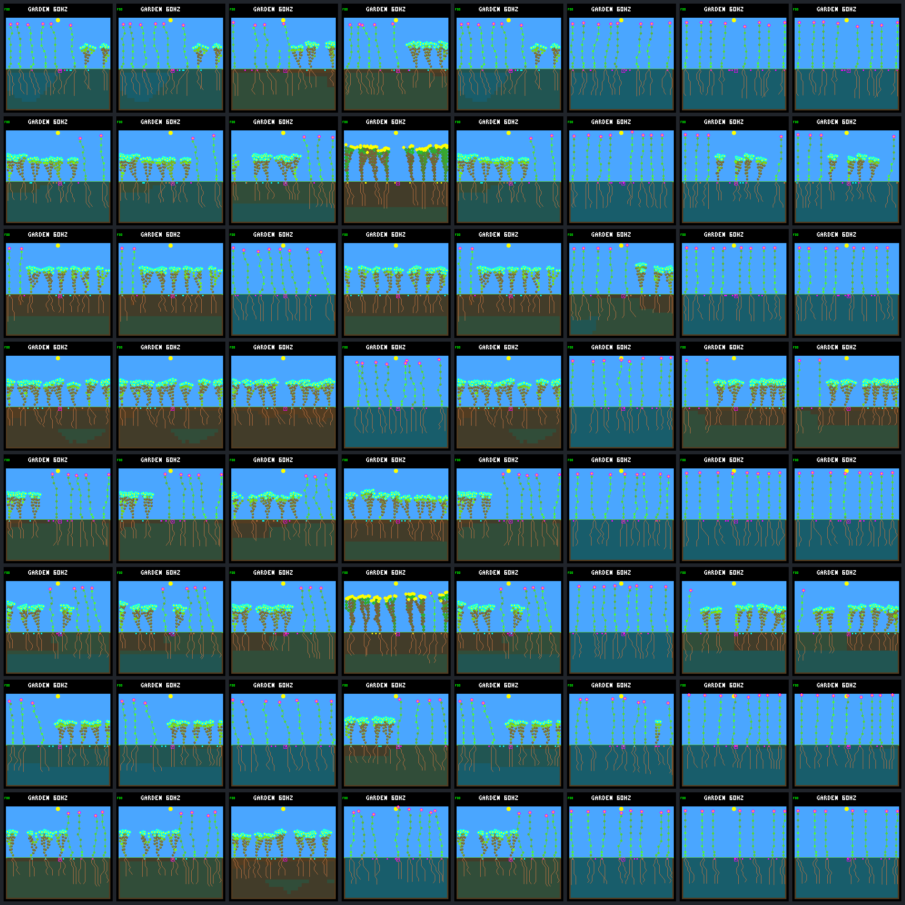
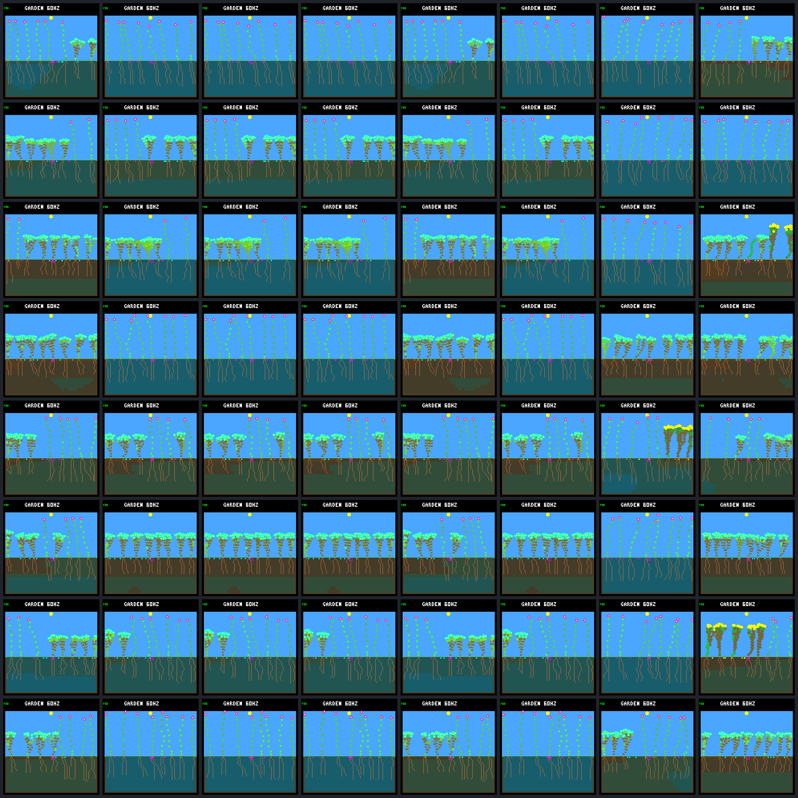

# Independent renewal-training replicas: all generations

Each sheet: columns **A0, A1, A2, A3, B0, B1, B2, B3**; all images at day 192.
A selects persistence-v2, B bounded renewal. Both replicas share the fixed review worlds,
but use different mutation streams. Review never selects parents; all outcomes remain.

| Row | Review schedule | World seed |
|---:|---|---|
| 1 | review-1 | `abf7af73` |
| 2 | review-1 | `58e36558` |
| 3 | review-1 | `0d983a80` |
| 4 | review-1 | `beda710e` |
| 5 | review-2 | `abf7af73` |
| 6 | review-2 | `58e36558` |
| 7 | review-2 | `0d983a80` |
| 8 | review-2 | `beda710e` |

## R1 — mutation seed `d4146f83`

| Frame | Model CRC | Living | World hash | Framebuffer CRC |
|---|---|---:|---|---|
| [r1.v2.g0.review-1.abf7af73](renewal-replication-frames/r1.v2.g0.review-1.abf7af73.png) | `dc5e849d` | 8 | `86829018` | `edd111ee` |
| [r1.v2.g1.review-1.abf7af73](renewal-replication-frames/r1.v2.g1.review-1.abf7af73.png) | `dc5e849d` | 8 | `86829018` | `edd111ee` |
| [r1.v2.g2.review-1.abf7af73](renewal-replication-frames/r1.v2.g2.review-1.abf7af73.png) | `725f7eca` | 8 | `2cee0662` | `2679c169` |
| [r1.v2.g3.review-1.abf7af73](renewal-replication-frames/r1.v2.g3.review-1.abf7af73.png) | `46fad3c2` | 8 | `a47fcec3` | `0985b14f` |
| [r1.renewal.g0.review-1.abf7af73](renewal-replication-frames/r1.renewal.g0.review-1.abf7af73.png) | `dc5e849d` | 8 | `86829018` | `edd111ee` |
| [r1.renewal.g1.review-1.abf7af73](renewal-replication-frames/r1.renewal.g1.review-1.abf7af73.png) | `a14ea8b7` | 8 | `7c130e58` | `83049e71` |
| [r1.renewal.g2.review-1.abf7af73](renewal-replication-frames/r1.renewal.g2.review-1.abf7af73.png) | `7ce0ed84` | 8 | `4955fc6f` | `ebddf994` |
| [r1.renewal.g3.review-1.abf7af73](renewal-replication-frames/r1.renewal.g3.review-1.abf7af73.png) | `7ce0ed84` | 8 | `4955fc6f` | `ebddf994` |
| [r1.v2.g0.review-1.58e36558](renewal-replication-frames/r1.v2.g0.review-1.58e36558.png) | `dc5e849d` | 8 | `6a1a7312` | `8ebac8ac` |
| [r1.v2.g1.review-1.58e36558](renewal-replication-frames/r1.v2.g1.review-1.58e36558.png) | `dc5e849d` | 8 | `6a1a7312` | `8ebac8ac` |
| [r1.v2.g2.review-1.58e36558](renewal-replication-frames/r1.v2.g2.review-1.58e36558.png) | `725f7eca` | 8 | `65067601` | `7ff8a027` |
| [r1.v2.g3.review-1.58e36558](renewal-replication-frames/r1.v2.g3.review-1.58e36558.png) | `46fad3c2` | 8 | `3c4f58b1` | `d401a830` |
| [r1.renewal.g0.review-1.58e36558](renewal-replication-frames/r1.renewal.g0.review-1.58e36558.png) | `dc5e849d` | 8 | `6a1a7312` | `8ebac8ac` |
| [r1.renewal.g1.review-1.58e36558](renewal-replication-frames/r1.renewal.g1.review-1.58e36558.png) | `a14ea8b7` | 8 | `f391f117` | `34a243f4` |
| [r1.renewal.g2.review-1.58e36558](renewal-replication-frames/r1.renewal.g2.review-1.58e36558.png) | `7ce0ed84` | 8 | `4b95d026` | `642d91de` |
| [r1.renewal.g3.review-1.58e36558](renewal-replication-frames/r1.renewal.g3.review-1.58e36558.png) | `7ce0ed84` | 8 | `4b95d026` | `642d91de` |
| [r1.v2.g0.review-1.0d983a80](renewal-replication-frames/r1.v2.g0.review-1.0d983a80.png) | `dc5e849d` | 8 | `166f01d0` | `aa10b74f` |
| [r1.v2.g1.review-1.0d983a80](renewal-replication-frames/r1.v2.g1.review-1.0d983a80.png) | `dc5e849d` | 8 | `166f01d0` | `aa10b74f` |
| [r1.v2.g2.review-1.0d983a80](renewal-replication-frames/r1.v2.g2.review-1.0d983a80.png) | `725f7eca` | 8 | `49c68cbd` | `30a502e8` |
| [r1.v2.g3.review-1.0d983a80](renewal-replication-frames/r1.v2.g3.review-1.0d983a80.png) | `46fad3c2` | 8 | `c62a5f8d` | `6cb38272` |
| [r1.renewal.g0.review-1.0d983a80](renewal-replication-frames/r1.renewal.g0.review-1.0d983a80.png) | `dc5e849d` | 8 | `166f01d0` | `aa10b74f` |
| [r1.renewal.g1.review-1.0d983a80](renewal-replication-frames/r1.renewal.g1.review-1.0d983a80.png) | `a14ea8b7` | 8 | `2acd12e2` | `45f372a4` |
| [r1.renewal.g2.review-1.0d983a80](renewal-replication-frames/r1.renewal.g2.review-1.0d983a80.png) | `7ce0ed84` | 8 | `f3c4e921` | `f9571c76` |
| [r1.renewal.g3.review-1.0d983a80](renewal-replication-frames/r1.renewal.g3.review-1.0d983a80.png) | `7ce0ed84` | 8 | `f3c4e921` | `f9571c76` |
| [r1.v2.g0.review-1.beda710e](renewal-replication-frames/r1.v2.g0.review-1.beda710e.png) | `dc5e849d` | 8 | `b04b115d` | `3f30c8d5` |
| [r1.v2.g1.review-1.beda710e](renewal-replication-frames/r1.v2.g1.review-1.beda710e.png) | `dc5e849d` | 8 | `b04b115d` | `3f30c8d5` |
| [r1.v2.g2.review-1.beda710e](renewal-replication-frames/r1.v2.g2.review-1.beda710e.png) | `725f7eca` | 8 | `a0b28dc9` | `0fcf5911` |
| [r1.v2.g3.review-1.beda710e](renewal-replication-frames/r1.v2.g3.review-1.beda710e.png) | `46fad3c2` | 8 | `6daca31b` | `d91dfb8f` |
| [r1.renewal.g0.review-1.beda710e](renewal-replication-frames/r1.renewal.g0.review-1.beda710e.png) | `dc5e849d` | 8 | `b04b115d` | `3f30c8d5` |
| [r1.renewal.g1.review-1.beda710e](renewal-replication-frames/r1.renewal.g1.review-1.beda710e.png) | `a14ea8b7` | 8 | `c4dade5f` | `71105cd5` |
| [r1.renewal.g2.review-1.beda710e](renewal-replication-frames/r1.renewal.g2.review-1.beda710e.png) | `7ce0ed84` | 8 | `9e41cfe7` | `92df186d` |
| [r1.renewal.g3.review-1.beda710e](renewal-replication-frames/r1.renewal.g3.review-1.beda710e.png) | `7ce0ed84` | 8 | `9e41cfe7` | `92df186d` |
| [r1.v2.g0.review-2.abf7af73](renewal-replication-frames/r1.v2.g0.review-2.abf7af73.png) | `dc5e849d` | 8 | `e7f06fdd` | `45c13a32` |
| [r1.v2.g1.review-2.abf7af73](renewal-replication-frames/r1.v2.g1.review-2.abf7af73.png) | `dc5e849d` | 8 | `e7f06fdd` | `45c13a32` |
| [r1.v2.g2.review-2.abf7af73](renewal-replication-frames/r1.v2.g2.review-2.abf7af73.png) | `725f7eca` | 8 | `ca9669f6` | `c1b699f3` |
| [r1.v2.g3.review-2.abf7af73](renewal-replication-frames/r1.v2.g3.review-2.abf7af73.png) | `46fad3c2` | 8 | `08e1ad27` | `b33e8481` |
| [r1.renewal.g0.review-2.abf7af73](renewal-replication-frames/r1.renewal.g0.review-2.abf7af73.png) | `dc5e849d` | 8 | `e7f06fdd` | `45c13a32` |
| [r1.renewal.g1.review-2.abf7af73](renewal-replication-frames/r1.renewal.g1.review-2.abf7af73.png) | `a14ea8b7` | 8 | `3293c825` | `8c820f4f` |
| [r1.renewal.g2.review-2.abf7af73](renewal-replication-frames/r1.renewal.g2.review-2.abf7af73.png) | `7ce0ed84` | 8 | `562fce00` | `acda8ad1` |
| [r1.renewal.g3.review-2.abf7af73](renewal-replication-frames/r1.renewal.g3.review-2.abf7af73.png) | `7ce0ed84` | 8 | `562fce00` | `acda8ad1` |
| [r1.v2.g0.review-2.58e36558](renewal-replication-frames/r1.v2.g0.review-2.58e36558.png) | `dc5e849d` | 8 | `4f927e11` | `265e7891` |
| [r1.v2.g1.review-2.58e36558](renewal-replication-frames/r1.v2.g1.review-2.58e36558.png) | `dc5e849d` | 8 | `4f927e11` | `265e7891` |
| [r1.v2.g2.review-2.58e36558](renewal-replication-frames/r1.v2.g2.review-2.58e36558.png) | `725f7eca` | 8 | `c8dfd96f` | `452be86f` |
| [r1.v2.g3.review-2.58e36558](renewal-replication-frames/r1.v2.g3.review-2.58e36558.png) | `46fad3c2` | 8 | `917ad53f` | `ee80aee0` |
| [r1.renewal.g0.review-2.58e36558](renewal-replication-frames/r1.renewal.g0.review-2.58e36558.png) | `dc5e849d` | 8 | `4f927e11` | `265e7891` |
| [r1.renewal.g1.review-2.58e36558](renewal-replication-frames/r1.renewal.g1.review-2.58e36558.png) | `a14ea8b7` | 8 | `1290634f` | `5a0ef9b1` |
| [r1.renewal.g2.review-2.58e36558](renewal-replication-frames/r1.renewal.g2.review-2.58e36558.png) | `7ce0ed84` | 8 | `edb6181d` | `f3f02603` |
| [r1.renewal.g3.review-2.58e36558](renewal-replication-frames/r1.renewal.g3.review-2.58e36558.png) | `7ce0ed84` | 8 | `edb6181d` | `f3f02603` |
| [r1.v2.g0.review-2.0d983a80](renewal-replication-frames/r1.v2.g0.review-2.0d983a80.png) | `dc5e849d` | 8 | `f2b48e9e` | `8442f85a` |
| [r1.v2.g1.review-2.0d983a80](renewal-replication-frames/r1.v2.g1.review-2.0d983a80.png) | `dc5e849d` | 8 | `f2b48e9e` | `8442f85a` |
| [r1.v2.g2.review-2.0d983a80](renewal-replication-frames/r1.v2.g2.review-2.0d983a80.png) | `725f7eca` | 7 | `df8b0e20` | `d15dd754` |
| [r1.v2.g3.review-2.0d983a80](renewal-replication-frames/r1.v2.g3.review-2.0d983a80.png) | `46fad3c2` | 8 | `a0b78729` | `568e2a4b` |
| [r1.renewal.g0.review-2.0d983a80](renewal-replication-frames/r1.renewal.g0.review-2.0d983a80.png) | `dc5e849d` | 8 | `f2b48e9e` | `8442f85a` |
| [r1.renewal.g1.review-2.0d983a80](renewal-replication-frames/r1.renewal.g1.review-2.0d983a80.png) | `a14ea8b7` | 8 | `de66da26` | `e898c287` |
| [r1.renewal.g2.review-2.0d983a80](renewal-replication-frames/r1.renewal.g2.review-2.0d983a80.png) | `7ce0ed84` | 8 | `a47fc90b` | `cc124bde` |
| [r1.renewal.g3.review-2.0d983a80](renewal-replication-frames/r1.renewal.g3.review-2.0d983a80.png) | `7ce0ed84` | 8 | `a47fc90b` | `cc124bde` |
| [r1.v2.g0.review-2.beda710e](renewal-replication-frames/r1.v2.g0.review-2.beda710e.png) | `dc5e849d` | 8 | `195d7ef6` | `cfaa5c47` |
| [r1.v2.g1.review-2.beda710e](renewal-replication-frames/r1.v2.g1.review-2.beda710e.png) | `dc5e849d` | 8 | `195d7ef6` | `cfaa5c47` |
| [r1.v2.g2.review-2.beda710e](renewal-replication-frames/r1.v2.g2.review-2.beda710e.png) | `725f7eca` | 8 | `720aafe4` | `28d29b9f` |
| [r1.v2.g3.review-2.beda710e](renewal-replication-frames/r1.v2.g3.review-2.beda710e.png) | `46fad3c2` | 8 | `bdc2e47c` | `0718251b` |
| [r1.renewal.g0.review-2.beda710e](renewal-replication-frames/r1.renewal.g0.review-2.beda710e.png) | `dc5e849d` | 8 | `195d7ef6` | `cfaa5c47` |
| [r1.renewal.g1.review-2.beda710e](renewal-replication-frames/r1.renewal.g1.review-2.beda710e.png) | `a14ea8b7` | 8 | `f0f69942` | `943d9950` |
| [r1.renewal.g2.review-2.beda710e](renewal-replication-frames/r1.renewal.g2.review-2.beda710e.png) | `7ce0ed84` | 7 | `a9552fd3` | `12dee64c` |
| [r1.renewal.g3.review-2.beda710e](renewal-replication-frames/r1.renewal.g3.review-2.beda710e.png) | `7ce0ed84` | 7 | `a9552fd3` | `12dee64c` |

## R2 — mutation seed `2700a5a8`

| Frame | Model CRC | Living | World hash | Framebuffer CRC |
|---|---|---:|---|---|
| [r2.v2.g0.review-1.abf7af73](renewal-replication-frames/r2.v2.g0.review-1.abf7af73.png) | `dc5e849d` | 8 | `86829018` | `edd111ee` |
| [r2.v2.g1.review-1.abf7af73](renewal-replication-frames/r2.v2.g1.review-1.abf7af73.png) | `f51cb1d4` | 8 | `afadfae5` | `af508a10` |
| [r2.v2.g2.review-1.abf7af73](renewal-replication-frames/r2.v2.g2.review-1.abf7af73.png) | `f51cb1d4` | 8 | `afadfae5` | `af508a10` |
| [r2.v2.g3.review-1.abf7af73](renewal-replication-frames/r2.v2.g3.review-1.abf7af73.png) | `f51cb1d4` | 8 | `afadfae5` | `af508a10` |
| [r2.renewal.g0.review-1.abf7af73](renewal-replication-frames/r2.renewal.g0.review-1.abf7af73.png) | `dc5e849d` | 8 | `86829018` | `edd111ee` |
| [r2.renewal.g1.review-1.abf7af73](renewal-replication-frames/r2.renewal.g1.review-1.abf7af73.png) | `f51cb1d4` | 8 | `afadfae5` | `af508a10` |
| [r2.renewal.g2.review-1.abf7af73](renewal-replication-frames/r2.renewal.g2.review-1.abf7af73.png) | `caaf9cbe` | 8 | `e9ee1895` | `4d1ca635` |
| [r2.renewal.g3.review-1.abf7af73](renewal-replication-frames/r2.renewal.g3.review-1.abf7af73.png) | `01b9d94a` | 8 | `6093b352` | `639dbdfa` |
| [r2.v2.g0.review-1.58e36558](renewal-replication-frames/r2.v2.g0.review-1.58e36558.png) | `dc5e849d` | 8 | `6a1a7312` | `8ebac8ac` |
| [r2.v2.g1.review-1.58e36558](renewal-replication-frames/r2.v2.g1.review-1.58e36558.png) | `f51cb1d4` | 8 | `c47e93ba` | `c713fd71` |
| [r2.v2.g2.review-1.58e36558](renewal-replication-frames/r2.v2.g2.review-1.58e36558.png) | `f51cb1d4` | 8 | `c47e93ba` | `c713fd71` |
| [r2.v2.g3.review-1.58e36558](renewal-replication-frames/r2.v2.g3.review-1.58e36558.png) | `f51cb1d4` | 8 | `c47e93ba` | `c713fd71` |
| [r2.renewal.g0.review-1.58e36558](renewal-replication-frames/r2.renewal.g0.review-1.58e36558.png) | `dc5e849d` | 8 | `6a1a7312` | `8ebac8ac` |
| [r2.renewal.g1.review-1.58e36558](renewal-replication-frames/r2.renewal.g1.review-1.58e36558.png) | `f51cb1d4` | 8 | `c47e93ba` | `c713fd71` |
| [r2.renewal.g2.review-1.58e36558](renewal-replication-frames/r2.renewal.g2.review-1.58e36558.png) | `caaf9cbe` | 8 | `f4d4bd26` | `9e7ec348` |
| [r2.renewal.g3.review-1.58e36558](renewal-replication-frames/r2.renewal.g3.review-1.58e36558.png) | `01b9d94a` | 8 | `ea438982` | `efa385fe` |
| [r2.v2.g0.review-1.0d983a80](renewal-replication-frames/r2.v2.g0.review-1.0d983a80.png) | `dc5e849d` | 8 | `166f01d0` | `aa10b74f` |
| [r2.v2.g1.review-1.0d983a80](renewal-replication-frames/r2.v2.g1.review-1.0d983a80.png) | `f51cb1d4` | 8 | `7c46c257` | `30a5da45` |
| [r2.v2.g2.review-1.0d983a80](renewal-replication-frames/r2.v2.g2.review-1.0d983a80.png) | `f51cb1d4` | 8 | `7c46c257` | `30a5da45` |
| [r2.v2.g3.review-1.0d983a80](renewal-replication-frames/r2.v2.g3.review-1.0d983a80.png) | `f51cb1d4` | 8 | `7c46c257` | `30a5da45` |
| [r2.renewal.g0.review-1.0d983a80](renewal-replication-frames/r2.renewal.g0.review-1.0d983a80.png) | `dc5e849d` | 8 | `166f01d0` | `aa10b74f` |
| [r2.renewal.g1.review-1.0d983a80](renewal-replication-frames/r2.renewal.g1.review-1.0d983a80.png) | `f51cb1d4` | 8 | `7c46c257` | `30a5da45` |
| [r2.renewal.g2.review-1.0d983a80](renewal-replication-frames/r2.renewal.g2.review-1.0d983a80.png) | `caaf9cbe` | 8 | `9ad74c4b` | `263933cb` |
| [r2.renewal.g3.review-1.0d983a80](renewal-replication-frames/r2.renewal.g3.review-1.0d983a80.png) | `01b9d94a` | 8 | `2dea5e6d` | `7a7e2dac` |
| [r2.v2.g0.review-1.beda710e](renewal-replication-frames/r2.v2.g0.review-1.beda710e.png) | `dc5e849d` | 8 | `b04b115d` | `3f30c8d5` |
| [r2.v2.g1.review-1.beda710e](renewal-replication-frames/r2.v2.g1.review-1.beda710e.png) | `f51cb1d4` | 8 | `88a864fa` | `ec7506f7` |
| [r2.v2.g2.review-1.beda710e](renewal-replication-frames/r2.v2.g2.review-1.beda710e.png) | `f51cb1d4` | 8 | `88a864fa` | `ec7506f7` |
| [r2.v2.g3.review-1.beda710e](renewal-replication-frames/r2.v2.g3.review-1.beda710e.png) | `f51cb1d4` | 8 | `88a864fa` | `ec7506f7` |
| [r2.renewal.g0.review-1.beda710e](renewal-replication-frames/r2.renewal.g0.review-1.beda710e.png) | `dc5e849d` | 8 | `b04b115d` | `3f30c8d5` |
| [r2.renewal.g1.review-1.beda710e](renewal-replication-frames/r2.renewal.g1.review-1.beda710e.png) | `f51cb1d4` | 8 | `88a864fa` | `ec7506f7` |
| [r2.renewal.g2.review-1.beda710e](renewal-replication-frames/r2.renewal.g2.review-1.beda710e.png) | `caaf9cbe` | 8 | `b842772f` | `223b043d` |
| [r2.renewal.g3.review-1.beda710e](renewal-replication-frames/r2.renewal.g3.review-1.beda710e.png) | `01b9d94a` | 8 | `dad8cc2e` | `82d267d6` |
| [r2.v2.g0.review-2.abf7af73](renewal-replication-frames/r2.v2.g0.review-2.abf7af73.png) | `dc5e849d` | 8 | `e7f06fdd` | `45c13a32` |
| [r2.v2.g1.review-2.abf7af73](renewal-replication-frames/r2.v2.g1.review-2.abf7af73.png) | `f51cb1d4` | 8 | `218904aa` | `0a09c1f5` |
| [r2.v2.g2.review-2.abf7af73](renewal-replication-frames/r2.v2.g2.review-2.abf7af73.png) | `f51cb1d4` | 8 | `218904aa` | `0a09c1f5` |
| [r2.v2.g3.review-2.abf7af73](renewal-replication-frames/r2.v2.g3.review-2.abf7af73.png) | `f51cb1d4` | 8 | `218904aa` | `0a09c1f5` |
| [r2.renewal.g0.review-2.abf7af73](renewal-replication-frames/r2.renewal.g0.review-2.abf7af73.png) | `dc5e849d` | 8 | `e7f06fdd` | `45c13a32` |
| [r2.renewal.g1.review-2.abf7af73](renewal-replication-frames/r2.renewal.g1.review-2.abf7af73.png) | `f51cb1d4` | 8 | `218904aa` | `0a09c1f5` |
| [r2.renewal.g2.review-2.abf7af73](renewal-replication-frames/r2.renewal.g2.review-2.abf7af73.png) | `caaf9cbe` | 8 | `13f9ced6` | `1756cdb5` |
| [r2.renewal.g3.review-2.abf7af73](renewal-replication-frames/r2.renewal.g3.review-2.abf7af73.png) | `01b9d94a` | 8 | `faa4ce38` | `a0a76242` |
| [r2.v2.g0.review-2.58e36558](renewal-replication-frames/r2.v2.g0.review-2.58e36558.png) | `dc5e849d` | 8 | `4f927e11` | `265e7891` |
| [r2.v2.g1.review-2.58e36558](renewal-replication-frames/r2.v2.g1.review-2.58e36558.png) | `f51cb1d4` | 8 | `c2db1ea3` | `d37be4bb` |
| [r2.v2.g2.review-2.58e36558](renewal-replication-frames/r2.v2.g2.review-2.58e36558.png) | `f51cb1d4` | 8 | `c2db1ea3` | `d37be4bb` |
| [r2.v2.g3.review-2.58e36558](renewal-replication-frames/r2.v2.g3.review-2.58e36558.png) | `f51cb1d4` | 8 | `c2db1ea3` | `d37be4bb` |
| [r2.renewal.g0.review-2.58e36558](renewal-replication-frames/r2.renewal.g0.review-2.58e36558.png) | `dc5e849d` | 8 | `4f927e11` | `265e7891` |
| [r2.renewal.g1.review-2.58e36558](renewal-replication-frames/r2.renewal.g1.review-2.58e36558.png) | `f51cb1d4` | 8 | `c2db1ea3` | `d37be4bb` |
| [r2.renewal.g2.review-2.58e36558](renewal-replication-frames/r2.renewal.g2.review-2.58e36558.png) | `caaf9cbe` | 8 | `3b0c2da2` | `efca4483` |
| [r2.renewal.g3.review-2.58e36558](renewal-replication-frames/r2.renewal.g3.review-2.58e36558.png) | `01b9d94a` | 8 | `5f8777ab` | `24f9196a` |
| [r2.v2.g0.review-2.0d983a80](renewal-replication-frames/r2.v2.g0.review-2.0d983a80.png) | `dc5e849d` | 8 | `f2b48e9e` | `8442f85a` |
| [r2.v2.g1.review-2.0d983a80](renewal-replication-frames/r2.v2.g1.review-2.0d983a80.png) | `f51cb1d4` | 8 | `c14279a8` | `c2652011` |
| [r2.v2.g2.review-2.0d983a80](renewal-replication-frames/r2.v2.g2.review-2.0d983a80.png) | `f51cb1d4` | 8 | `c14279a8` | `c2652011` |
| [r2.v2.g3.review-2.0d983a80](renewal-replication-frames/r2.v2.g3.review-2.0d983a80.png) | `f51cb1d4` | 8 | `c14279a8` | `c2652011` |
| [r2.renewal.g0.review-2.0d983a80](renewal-replication-frames/r2.renewal.g0.review-2.0d983a80.png) | `dc5e849d` | 8 | `f2b48e9e` | `8442f85a` |
| [r2.renewal.g1.review-2.0d983a80](renewal-replication-frames/r2.renewal.g1.review-2.0d983a80.png) | `f51cb1d4` | 8 | `c14279a8` | `c2652011` |
| [r2.renewal.g2.review-2.0d983a80](renewal-replication-frames/r2.renewal.g2.review-2.0d983a80.png) | `caaf9cbe` | 8 | `ee9eead4` | `a9cdf2cc` |
| [r2.renewal.g3.review-2.0d983a80](renewal-replication-frames/r2.renewal.g3.review-2.0d983a80.png) | `01b9d94a` | 8 | `73915c78` | `94e451bd` |
| [r2.v2.g0.review-2.beda710e](renewal-replication-frames/r2.v2.g0.review-2.beda710e.png) | `dc5e849d` | 8 | `195d7ef6` | `cfaa5c47` |
| [r2.v2.g1.review-2.beda710e](renewal-replication-frames/r2.v2.g1.review-2.beda710e.png) | `f51cb1d4` | 8 | `7fa48800` | `c7f2a13e` |
| [r2.v2.g2.review-2.beda710e](renewal-replication-frames/r2.v2.g2.review-2.beda710e.png) | `f51cb1d4` | 8 | `7fa48800` | `c7f2a13e` |
| [r2.v2.g3.review-2.beda710e](renewal-replication-frames/r2.v2.g3.review-2.beda710e.png) | `f51cb1d4` | 8 | `7fa48800` | `c7f2a13e` |
| [r2.renewal.g0.review-2.beda710e](renewal-replication-frames/r2.renewal.g0.review-2.beda710e.png) | `dc5e849d` | 8 | `195d7ef6` | `cfaa5c47` |
| [r2.renewal.g1.review-2.beda710e](renewal-replication-frames/r2.renewal.g1.review-2.beda710e.png) | `f51cb1d4` | 8 | `7fa48800` | `c7f2a13e` |
| [r2.renewal.g2.review-2.beda710e](renewal-replication-frames/r2.renewal.g2.review-2.beda710e.png) | `caaf9cbe` | 8 | `fe7b4936` | `736bf0e5` |
| [r2.renewal.g3.review-2.beda710e](renewal-replication-frames/r2.renewal.g3.review-2.beda710e.png) | `01b9d94a` | 8 | `db068654` | `67f05539` |

All 128 framebuffers independently repeat byte-for-byte and match native ledger endpoints.
Images alone do not establish reproductive health or generalization.
See the [report](renewal-replication.md) and [paired data](renewal-replication-summary.json).

Manifest SHA-256: `8cc60dbe89f9040457f4abd60e81b2c3f5379dac6987b5b3deb872dcc870a45f`.
