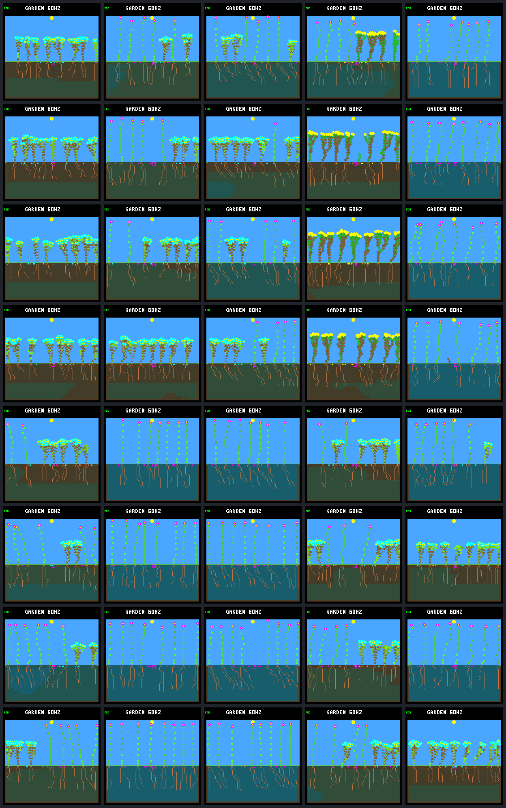

# Frozen wide finalists: return to the old cross

Columns: **original, R1 N3, R1 W3, R2 N3, R2 W3**. All images at day 192.
N/W trained on eight/sixteen worlds; no training occurs in this check.
Original/N columns reuse 24 captures and repeats; W columns add 16 repeated captures.
Rows use first-in-panel worlds fixed before outcomes, not selected successes.
TT/TR/RT/RR label world-set then schedule-set (training/review).

| Row | Cell | World seed | Schedule |
|---:|---|---|---|
| 1 | TT | `b3376513` | train-1 / `a3b7e953` |
| 2 | TT | `b3376513` | train-2 / `50a32378` |
| 3 | TR | `b3376513` | review-1 / `05d87ca0` |
| 4 | TR | `b3376513` | review-2 / `b69a372e` |
| 5 | RT | `abf7af73` | train-1 / `a3b7e953` |
| 6 | RT | `abf7af73` | train-2 / `50a32378` |
| 7 | RR | `abf7af73` | review-1 / `05d87ca0` |
| 8 | RR | `abf7af73` | review-2 / `b69a372e` |

| Frame | Capture | Model CRC | Living | World hash | Framebuffer CRC |
|---|---|---|---:|---|---|
| [original.tt.train-1.b3376513](renewal-return-frames/original.tt.train-1.b3376513.png) | Reused | `dc5e849d` | 8 | `4a2f7e12` | `bfcbd0c0` |
| [r1-n.tt.train-1.b3376513](renewal-return-frames/r1-n.tt.train-1.b3376513.png) | Reused | `7ce0ed84` | 7 | `b4850b2a` | `55770072` |
| [r1-w.tt.train-1.b3376513](renewal-return-frames/r1-w.tt.train-1.b3376513.png) | New | `502e34a2` | 8 | `8b04eb01` | `a88c8eee` |
| [r2-n.tt.train-1.b3376513](renewal-return-frames/r2-n.tt.train-1.b3376513.png) | Reused | `01b9d94a` | 8 | `dffa44a9` | `13469e88` |
| [r2-w.tt.train-1.b3376513](renewal-return-frames/r2-w.tt.train-1.b3376513.png) | New | `c9ea07fd` | 7 | `448161c7` | `95a1ee7b` |
| [original.tt.train-2.b3376513](renewal-return-frames/original.tt.train-2.b3376513.png) | Reused | `dc5e849d` | 8 | `d99383e3` | `a069148d` |
| [r1-n.tt.train-2.b3376513](renewal-return-frames/r1-n.tt.train-2.b3376513.png) | Reused | `7ce0ed84` | 8 | `c86646c4` | `6aacc87d` |
| [r1-w.tt.train-2.b3376513](renewal-return-frames/r1-w.tt.train-2.b3376513.png) | New | `502e34a2` | 8 | `165e8afc` | `6f31adf0` |
| [r2-n.tt.train-2.b3376513](renewal-return-frames/r2-n.tt.train-2.b3376513.png) | Reused | `01b9d94a` | 8 | `4093f717` | `88205ad7` |
| [r2-w.tt.train-2.b3376513](renewal-return-frames/r2-w.tt.train-2.b3376513.png) | New | `c9ea07fd` | 8 | `a9e18177` | `c0fe1afe` |
| [original.tr.review-1.b3376513](renewal-return-frames/original.tr.review-1.b3376513.png) | Reused | `dc5e849d` | 8 | `741b5733` | `68bb69de` |
| [r1-n.tr.review-1.b3376513](renewal-return-frames/r1-n.tr.review-1.b3376513.png) | Reused | `7ce0ed84` | 7 | `ef8d5dd7` | `83096151` |
| [r1-w.tr.review-1.b3376513](renewal-return-frames/r1-w.tr.review-1.b3376513.png) | New | `502e34a2` | 8 | `b099e932` | `2a7ccd8e` |
| [r2-n.tr.review-1.b3376513](renewal-return-frames/r2-n.tr.review-1.b3376513.png) | Reused | `01b9d94a` | 8 | `97687bab` | `44c89d7b` |
| [r2-w.tr.review-1.b3376513](renewal-return-frames/r2-w.tr.review-1.b3376513.png) | New | `c9ea07fd` | 8 | `8b8172d8` | `56e578b8` |
| [original.tr.review-2.b3376513](renewal-return-frames/original.tr.review-2.b3376513.png) | Reused | `dc5e849d` | 8 | `13083a37` | `ccc8fb73` |
| [r1-n.tr.review-2.b3376513](renewal-return-frames/r1-n.tr.review-2.b3376513.png) | Reused | `7ce0ed84` | 8 | `64f0a3f9` | `cb6ec99c` |
| [r1-w.tr.review-2.b3376513](renewal-return-frames/r1-w.tr.review-2.b3376513.png) | New | `502e34a2` | 8 | `a364fa28` | `a1e9f8a6` |
| [r2-n.tr.review-2.b3376513](renewal-return-frames/r2-n.tr.review-2.b3376513.png) | Reused | `01b9d94a` | 7 | `d279b1d6` | `0ce6f562` |
| [r2-w.tr.review-2.b3376513](renewal-return-frames/r2-w.tr.review-2.b3376513.png) | New | `c9ea07fd` | 7 | `7ee642f8` | `c7950c5c` |
| [original.rt.train-1.abf7af73](renewal-return-frames/original.rt.train-1.abf7af73.png) | Reused | `dc5e849d` | 7 | `884a1efb` | `5f5e3871` |
| [r1-n.rt.train-1.abf7af73](renewal-return-frames/r1-n.rt.train-1.abf7af73.png) | Reused | `7ce0ed84` | 7 | `b9f10789` | `b5dd4eb1` |
| [r1-w.rt.train-1.abf7af73](renewal-return-frames/r1-w.rt.train-1.abf7af73.png) | New | `502e34a2` | 7 | `06e01c2a` | `a6f5077d` |
| [r2-n.rt.train-1.abf7af73](renewal-return-frames/r2-n.rt.train-1.abf7af73.png) | Reused | `01b9d94a` | 7 | `cbe17e0f` | `ed1ae2bb` |
| [r2-w.rt.train-1.abf7af73](renewal-return-frames/r2-w.rt.train-1.abf7af73.png) | New | `c9ea07fd` | 7 | `3856314b` | `ce7e6e33` |
| [original.rt.train-2.abf7af73](renewal-return-frames/original.rt.train-2.abf7af73.png) | Reused | `dc5e849d` | 8 | `443f36d5` | `69dd9725` |
| [r1-n.rt.train-2.abf7af73](renewal-return-frames/r1-n.rt.train-2.abf7af73.png) | Reused | `7ce0ed84` | 8 | `325c2351` | `d063bea0` |
| [r1-w.rt.train-2.abf7af73](renewal-return-frames/r1-w.rt.train-2.abf7af73.png) | New | `502e34a2` | 8 | `a9a7249f` | `0efa3ff3` |
| [r2-n.rt.train-2.abf7af73](renewal-return-frames/r2-n.rt.train-2.abf7af73.png) | Reused | `01b9d94a` | 8 | `6cd87969` | `b324c6a4` |
| [r2-w.rt.train-2.abf7af73](renewal-return-frames/r2-w.rt.train-2.abf7af73.png) | New | `c9ea07fd` | 8 | `f2059392` | `db956c18` |
| [original.rr.review-1.abf7af73](renewal-return-frames/original.rr.review-1.abf7af73.png) | Reused | `dc5e849d` | 8 | `86829018` | `edd111ee` |
| [r1-n.rr.review-1.abf7af73](renewal-return-frames/r1-n.rr.review-1.abf7af73.png) | Reused | `7ce0ed84` | 8 | `4955fc6f` | `ebddf994` |
| [r1-w.rr.review-1.abf7af73](renewal-return-frames/r1-w.rr.review-1.abf7af73.png) | New | `502e34a2` | 8 | `5ff991ac` | `5766661c` |
| [r2-n.rr.review-1.abf7af73](renewal-return-frames/r2-n.rr.review-1.abf7af73.png) | Reused | `01b9d94a` | 8 | `6093b352` | `639dbdfa` |
| [r2-w.rr.review-1.abf7af73](renewal-return-frames/r2-w.rr.review-1.abf7af73.png) | New | `c9ea07fd` | 8 | `b3cc6bbc` | `2435b8b1` |
| [original.rr.review-2.abf7af73](renewal-return-frames/original.rr.review-2.abf7af73.png) | Reused | `dc5e849d` | 8 | `e7f06fdd` | `45c13a32` |
| [r1-n.rr.review-2.abf7af73](renewal-return-frames/r1-n.rr.review-2.abf7af73.png) | Reused | `7ce0ed84` | 8 | `562fce00` | `acda8ad1` |
| [r1-w.rr.review-2.abf7af73](renewal-return-frames/r1-w.rr.review-2.abf7af73.png) | New | `502e34a2` | 8 | `621f62f1` | `37301086` |
| [r2-n.rr.review-2.abf7af73](renewal-return-frames/r2-n.rr.review-2.abf7af73.png) | Reused | `01b9d94a` | 8 | `faa4ce38` | `a0a76242` |
| [r2-w.rr.review-2.abf7af73](renewal-return-frames/r2-w.rr.review-2.abf7af73.png) | New | `c9ea07fd` | 8 | `ce011c89` | `9f218bd6` |

All images agree with native ledger endpoints, independent repeats and PNG conversion.
Images alone do not prove reproductive health, coexistence or generalization.
See the [report](renewal-return.md) and [paired data](renewal-return-summary.json).

Manifest SHA-256: `7b20a1dc42516b6d5c13cb2e5335fea9133cb6084c7811049c3d8c263d3c2b98`.
