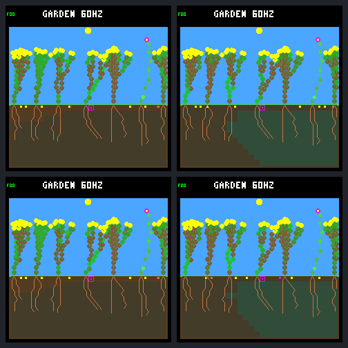

# Rotating seed order improves access, not establishment

The [fixed host A/B](renewal-seed-order-protocol.md) changes rescued shrub 12's
lifetime purchases from **1 to 42**, including **0 to 13** in the closing 16
days. Its lifetime, body, final stores and complete stress-episode history are
unchanged. No offspring results: 41 seeds expire and one remains pending, with
stable spacing blockers at all 10,405 mature observations.

This demonstrates an allocation effect, not ecosystem renewal. Total seed
purchases, births, deaths, full-day offspring survival, living families/species
and closing turnover remain unchanged. Keep the rule host-only and off by
default. No training, model or device changes were made.

## The one change

Both arms reproduce the previous reserve-aware FINISH handoff, with the same
rainfed-crowded world/seed, frozen N/W routing, founder-1 export, wet germination,
leaf renewal and safety guards. Capacity stays at eight plants, eight seeds and
512 nodes. Seed cost remains 48 energy/24 water.

The new option visits the existing plant array starting at
`((tick - 69120) / 60) % plant_count` on maintenance ticks after 69,120, wrapping
once. The first rotation tick is 69,180. Before then and off cadence it starts
at zero. It does not reorder storage, germination or growth, draw random numbers,
favor a named parent, grant resources, or bypass any gate. Each slot still gets
one cooldown decrement. The world-owned opt-in resets off and is separately
recorded experiment configuration, like the existing FINISH selection, not an
additional physical-hash field.

The two raw prefixes match through noon after removing only that explicit
metadata: 46,704 world/bid records and 4,613 seed-site records. The first physical
hash difference is at **69,300**, phase 76: fixed order gives the released slot
to parent 2; rotating starts at index 3 and parent 6 buys instead. The target's
first rotating-arm purchase follows at 69,480.

## Who buys the same finite supply

| Parent | Whole run, fixed | Whole run, rotating | Closing fixed | Closing rotating |
| --- | ---: | ---: | ---: | ---: |
| 2 | 170 | 106 | 39 | 14 |
| 4 | 129 | 76 | 36 | 19 |
| 5 | 61 | 43 | 16 | 10 |
| 6 | 103 | 104 | 32 | 33 |
| 7 | 21 | 74 | 5 | 24 |
| 9 | 1 | 41 | 0 | 15 |
| 12 | 1 | 42 | 0 | 13 |

Earlier dead/exported parents' 27 purchases are unchanged. Total whole-run
purchases remain **513**; total closing purchases remain **128**. Late in both
arms, 128 expiries release slots on 112 ecology steps, all immediately refilled.
The same daily release phases remain: 44/52/56/64/76/120 once each, 88 twice.
No seeds germinate after first noon in either arm.

The target's 1,024 closing maintenance checks partition as follows:

| Outcome | Fixed | Rotating |
| --- | ---: | ---: |
| Independently ineligible | 765 | 802 |
| Otherwise eligible, bank full at loop entry | 189 | 164 |
| Otherwise eligible, earlier visits fill the bank | 70 | 45 |
| Actual purchase | 0 | 13 |

These eligibility counts exclude the final safety guard when capacity prevents
it from running. They are repeated checks, not independent chances or unique
slots. The rotating arm has more cooldown failures because it actually buys:
39 closing checks versus zero. It also has 767 energy failures versus 765;
failure counters overlap and must not be added to the table. There are no
target seed safety-guard refusals. Across all parents, such refusals fall 18 to
11; ordinary growth refusals remain 617, renewal refusals zero.

The target visits each rank 146 or 147 times in the closing interval, instead
of always going seventh. This selected seven-plant comparison does not prove
universal fairness: population-count changes and phase/count aliasing still
matter for this stateless schedule.

## The extra spending is affordable here

The target makes 41 additional purchases, costing **1,968 energy and 984 water**.
Its recorded photosynthetic income is unchanged at 65,826. Energy overflow
falls by exactly 1,968, from 40,578 to 38,610; root uptake rises by exactly 984,
from 20,481 to 21,465. Growth, paid leaf renewal and upkeep totals are unchanged.
No resources were granted or fees waived.

Both arms finish with the target alive at energy 248, water 506, stress zero,
61 nodes, 18 roots and 42 leaves. Its full 49-episode stress history compares
exactly, including the 46 recurrent post-noon nights with peak stress seven.
All plants' birth/death/reclamation histories and ancestry are unchanged;
purchase counts differ. This is evidence of no survival penalty in this one
trajectory, not a general safety guarantee for more reproduction.

## Planting space is saturated

The rotating target's seeds cover all nine reachable columns: 0, 1, 7, 8, 9,
10, 11, 12 and 13. Forty-one expire; one purchased at 242,100 remains pending.
Of their **10,405 mature observations**, 5,284 have spacing alone as the blocker
and 5,121 have spacing plus insufficient moisture. Every observation has a
stable living spacing witness: parent 2 on 4,464 samples, parent 7 on 1,736,
and parent 9 on 4,205. These are repeated exposure samples, not germination
probabilities. The single fixed-arm seed has 248 such observations, all with
parent 9.

A read-only check of the declared seed-site captures establishes the wider
limit too. The seven living origins stay at columns **0, 4, 8, 13, 18, 23, 27**.
In both arms, **all 28 columns** carry the spacing blocker at every one of the
11,777 first-noon-and-later checkpoints, including all 4,096 closing checkpoints.
The eighth plant slot is never occupied during that window. The final body
pool uses 379/512 nodes. Available array/node capacity does not imply an
available planting site.

| Whole-world outcome | Fixed | Rotating |
| --- | ---: | ---: |
| Births / natural deaths / explicit exports | 7 / 4 / 1 | 7 / 4 / 1 |
| Full-day offspring survivors / eligible | 4 / 7 | 4 / 7 |
| Full-day descendant parents with a full-day child | 0 | 0 |
| Final living / descendants / species / families | 7 / 4 / 2 / 3 | 7 / 4 / 2 / 3 |
| Seeds purchased / germinated / expired / pending | 513 / 7 / 498 / 8 | 513 / 7 / 498 / 8 |
| Closing births / deaths / purchases | 0 / 0 / 128 | 0 / 0 / 128 |

The next discussion should address **establishment and competition**: how can
new plants challenge a stable occupied garden? More bank capacity, further
allocation tuning or retraining alone cannot create spacing-free columns in
this saved state. Review the base-column exclusion rule alongside light/root
competition and turnover before selecting a bounded mechanics test. This
result does not authorize relaxing spacing, forcing mortality, or promoting the
rotation to firmware.

## Actual native frames



Rows: fixed, rotating. Columns: tick 69,120, tick 245,760. Noon pixels match
exactly. Day-64 bodies/canopies look alike; seed markers and some soil shading
differ, consistent with unchanged anatomy but redistributed seed costs and
water uptake. These are four actual 240×240 native framebuffers, each captured
twice. The HUD's 60 Hz is configured simulation cadence, not measured device
performance.

## Evidence and validation

- [Portable summary](renewal-seed-order-summary.json), SHA-256
  `3b8d9554080e014eeb1f82430b33791919ee27846b81896ecdac46af02db0cea`.
- Immutable bundle: `artifacts/garden-renewal-seed-order-v1`, manifest
  `1910c4d9b739692e7fc1bb2d7433cce866603237a32b471709f0b036614aea61`.
- Full results SHA-256:
  `960bddb345248cf45e3eccd20022d1ae7a7436861a1265e341ea989ac3e2fee1`.
- Exactly **16/16 declared experimental native calls**. Both fixed raw traces,
  repeats and both historical frame pairs matched before rotating started.
  All new repeats, prefixes, world/site/frame receipts and costs reconcile.
- **221,468 live budgets**, **1,026 seed lifetimes**, **55,370 living maintenance
  checks** and **32,770 site checkpoints** verify. Four terminal resource steps
  per arm remain explicitly unreconstructed. Seed-ledger/access traversal views
  never replace the authoritative plant arrays or raw censuses.
- Historical derived fixed outcomes/access match their saved summaries. New
  analysis repeats exactly; portable export is independently checked in Docker.
  Source/build/binary/model fingerprints and all native frames are retained.
- **85/85 default and 86/86 experimental CTests pass**, including eight new
  Python tests and a native production-step fixture. Formatter and whitespace
  checks pass. Header scope checks reject firmware/missing dependencies; normal
  build scripts explicitly disable the feature. No failed experimental captures
  or undeclared reruns were needed.

```sh
docker compose run --rm --no-deps firmware python3 -W error \
  sim/garden_renewal_seed_order.py --output artifacts/garden-renewal-seed-order-v1 \
  --verify --check-export benchmarks/garden-longevity/renewal-seed-order
```

The runner's `--finish` is analysis-only recovery; it never invokes captured
binaries or replaces observations. Work remains uncommitted/unpushed.
