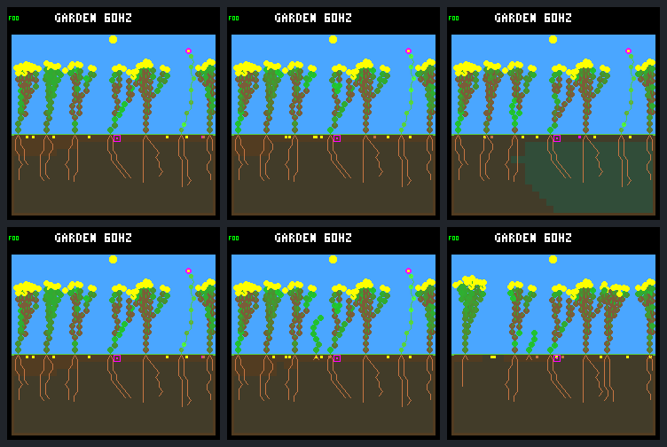

# Closer spacing permits establishment, with substantial mortality

The [fixed host A/B](renewal-seed-spacing-protocol.md) reduces minimum base
spacing from three columns to two after tick 69,120. Both arms retain rotating
seed purchases and every other selected-world rule.

**Nineteen additional seedlings germinate. Six of seventeen with a complete
day of follow-up survive that day/night cycle.** Three remain alive at day 64,
including one only 120 logic ticks old. This opens establishment, but does not
qualify sustained renewal: sixteen new seedlings and three incumbents die,
and the last flower/founder-5 family disappears.

Keep the change host-only and off by default. No training or device changes.

## What changed

The control exactly reproduces the previous rotating-order raw world/site
streams and historical frame pairs. All 46,704 world/bid and 4,613 site prefix
records agree through 69,120 after removing only explicit spacing metadata.
The boundary framebuffer is identical.

At 69,135, two-column spacing frees the expected nine columns: 2, 6, 10, 11,
15, 16, 20, 21, 25. They are initially all moisture-blocked. First physical
divergence is at **70,050**: shrub 12's seed germinates in column 11 as child 13.
The control still rejects this base within two columns of incumbent 9.
No starting-resource bonus is added and no incumbent is evicted.

| Outcome through day 64 | Three columns | Two columns |
| --- | ---: | ---: |
| Births after the shared boundary | 0 | 19 |
| Newborns surviving a full day / eligible | 0 / 0 | 6 / 17 |
| Post-boundary newborns alive at endpoint | 0 | 3 |
| Post-boundary newborn deaths | 0 | 16 |
| Deaths among the seven boundary incumbents | 0 | 3 |
| Births / deaths in closing 16 days | 0 / 0 | 10 / 11 |
| Whole-run births / natural deaths | 7 / 4 | 26 / 23 |
| Final living / descendants | 7 / 4 | 7 / 5 |
| Final species / founder families | 2 / 3 | 1 / 2 |
| Whole-run seed purchases | 513 | 520 |
| Final node use / capacity | 379 / 512 | 357 / 512 |

The identical earlier founder-1 export is separate from natural deaths.
Two new seedlings lack a full day of possible follow-up; one is alive and
one already dead. Neither enters the 17 eligible denominator.

## Survival is mixed, not just extra births

The six new full-day survivors are 13, 16, 20, 21, 22 and 29. Four new plants
buy seeds (16, 21, 22, 29); three have germinated offspring (21, 22, 29).
**None of these post-boundary parents has a child that survives a full day
within the horizon.** The whole-run historical count of full-day descendants
with a full-day child rises from zero to three, all pre-boundary plants:
6, 9 and 12. That is different from stable further-generation renewal.

Examples from the new cohort:

| Child | Parent / column | Observed outcome |
| --- | --- | --- |
| 13 | 12 / 11 | Survives 1.46 days, then dies energy-starved |
| 16 | 12 / 11 | Survives 2.43 days, buys one seed, then dies energy-starved |
| 21 | 4 / 10 | Survives 34.16 days, buys 17 seeds, then dies energy-starved |
| 22 | 6 / 21 | Alive at endpoint; two children, neither survives a full day |
| 29 | 2 / 1 | Alive at endpoint; one child dies, the other is very young |

Fifteen of the sixteen new deaths have energy shortage as the terminal cause;
one has water shortage. Six (14, 15, 18, 19, 23, 30) have **zero recorded
photosynthetic income before their terminal step**, despite recorded water
uptake and remaining water before death. This motivates an audit of birth
timing, available light and early growth spending, not an immediate grant of
more starting energy. Terminal income is cleared by death and is not guessed.

Incumbent 7 dies water-starved at 200,160; flower 5 dies energy-starved at
214,200; rescued shrub 12 dies energy-starved at 241,200. All seven survive in
the control. Shrub 12 now has three children, two surviving a day, but none
survives to the endpoint. These are coupled outcomes of the changed trajectory;
the A/B does not isolate a particular neighbor or purchase as each death's cause.

## Capacity and competition

Two-column spacing never excludes all 28 columns after the boundary. But the
plant array is full at **11,025 / 11,776** post-boundary checkpoints (93.6%),
including **3,860 / 4,096** closing checkpoints (94.2%). It finishes with seven
living plants and one unreclaimed dead seedling occupying the eighth slot.
No sampled checkpoint lacks the four node slots needed for germination.

There are 372 completely open column-observations after the boundary, versus
zero in the control. These are **post-step queries**, after successful
germination may already consume a vacancy; they are not counts of actual
seed-check opportunities. The first post-step open query occurs at 76,560,
after the first germination and death.

Root uptake remains in original array order. The pre-step root-location audit
finds **zero shared root-cell exposure** in the audited live steps in both
arms. This run therefore provides no evidence of direct same-cell uptake-order
contention. Indirect competition through moisture transport is still possible;
post-step moisture and aggregate uptake cannot attribute the last unit of
water to a particular root. The stored per-lineage budgets, ranks, stress,
first-day states and daily histories keep these limitations explicit.

The next useful investigation is read-only: compare failed and established
seedlings' light/energy trajectories, and examine the loss of the flower.
Do not yet increase the plant limit, force lifespan/death, promote spacing,
change fitness or restart training. One selected, previously rescued world
does not qualify the broader environment.

## Native screenshots



Rows: control, two columns. Columns: shared tick 69,120; tick 72,960, one day
later; endpoint 245,760. These are six actual native 240×240 framebuffers,
each replayed twice. The middle candidate frame has the small new shoot;
the endpoint has changed canopy structure and no flower at the right.
The HUD's 60 Hz is configured simulation cadence, not measured device speed.

## Verification and evidence

- [Portable summary](renewal-seed-spacing-summary.json), SHA-256
  `bdd740f2b1a2b74488c3e2aed8b674b750a516a13dd9b56fd2b656deafc6fb0e`.
- Frozen bundle: `artifacts/garden-renewal-seed-spacing-v1`, manifest
  `f230a7eeb305eb9bef28381ea618cb8fec44a3da4d5885bd5978eeb675507007`.
- Full results SHA-256
  `b500f8a62111fee82e4cef94d6784a874b5912c4d716a27a49a61a320567680d`.
- Exactly **20/20** declared experimental native calls, with no capture failures
  or additional simulation runs. Exact control, shared prefixes, repeats and
  world/site/frame receipts verify.
- **231,407 live resource budgets, 1,033 seed lifetimes, 32,770 site checkpoints**
  checked. The 27 cleared terminal steps remain explicitly unreconstructed.
- Native production-step tests cover the boundary, sequential germination fees,
  same/adjacent/dead occupancy, ordinary gates and plant/node capacity.
  Ten Python tests cover analysis/CLI/header scope and input preservation.
  **86/86 default and 88/88 experimental CTests pass.**
- Repeated analysis, host export and independent Docker export check agree.
  The first analysis stopped on historical witness-list ordering: the old
  analyzer used a rotated view. Only unordered witness sets are canonicalized
  for comparison; bank order, masks, ages, identities and dead flags stay exact.
  The recovery is recorded in the bundle; no captured observations were changed.

```sh
docker compose run --rm --no-deps firmware python3 -W error \
  sim/garden_renewal_seed_spacing.py --output artifacts/garden-renewal-seed-spacing-v1 \
  --verify --check-export benchmarks/garden-longevity/renewal-seed-spacing
```

Work remains uncommitted/unpushed.
