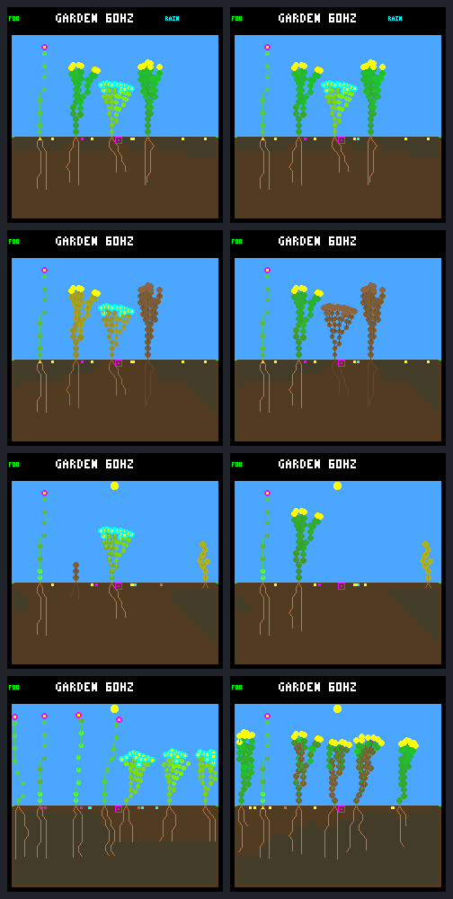

# Fourth-seed veto: shrub rescued, expense transferred to its neighbor

Suppressing **one late seed purchase** rescues the observed shrub through day
eight, with three living offspring. But the ground-cover immediately buys a
seed in the available bank slot and dies earlier. This establishes a causal
effect of the scoped intervention; it does **not** establish a better garden
or justify a permanent three-seed quota.

[Predeclared protocol](renewal-seed-veto-protocol.md) ·
[Verified data](renewal-seed-veto-summary.json) ·
[Previous single-neighbor diagnostic](renewal-neighbors.md)

## What changed

Same world `0d983a80`, reset `e663996c`, eight days, patch schedule `05d87ca0`
(first event day 16), saved N `01b9d94a` and W `c9ea07fd`. Only founder flower 5
uses W; every other plant and all descendants use N. The previous 512-node,
eight-plant/eight-seed, rainfed-crowded, wide-dispersal, headroom-uptake,
selective-leaf and night-growth-veto settings remain fixed.

The host-only `TOY_FACTORY_GARDEN_FOCAL_SEED_VETO` option is OFF by default.
When ON, founder lineage 2 may buy only three seeds during its second daylight,
ticks `[2880, 4800)`. Ordinary spent-flower flags count purchases; all retries
are blocked after the third. The check runs after ordinary eligibility and
flower selection, before RNG, resource debit, flower marking or cooldown.
It neither refunds resources nor reserves the bank slot. Other plants, all
descendants and other daylight periods retain normal reproduction.

No world-state field, neural observation, action, memory or model changed.
The embedded-C conventions guided the guarded host-only option, pure bounded
check and real production-path tests. Firmware builds reject the option;
`make host-build` explicitly clears it. The latter wrapper safeguard was added
after capture and does not change either frozen diagnostic binary.

## Exact isolation and focal outcome

The rebuilt OFF control reproduces **all 16,775 saved trace records** and both
shared old frame checkpoints exactly. With only the declared veto metadata
removed, the ON run matches the first **4,451 records**, including growth/leaf
decisions before reproduction on tick **4,620**. That tick's fourth purchase is
the first divergence, with exactly **48 energy / 24 water retained**, no cooldown
and no fourth spent flower. No earlier controller or resource difference appears.

| Observed shrub 2 | Control | Fourth purchase vetoed |
|---|---:|---:|
| Second-daylight seeds purchased | 4 | 3 |
| Second-sunset energy, tick 4,800 | 187 | 235 |
| Following dawn energy / stress, tick 6,720 | 0 / 6 | 11 / 0 |
| Outcome at control's death, tick 6,840 | Dead | Alive, stress 1 |
| Day-eight status | Dead since day 1.781 | Alive, energy 249, stress 0 |
| Living direct offspring at day eight | 0 | 3 |

All other focal second-daylight energy-budget terms are identical: income 1,544,
overflow 764, growth 304, upkeep 183, renewal zero. The entire **48-energy saving
persists to sunset**. Body size stays 55 nodes, with seven-unit upkeep. It clears
its brief dawn-recovery stress at tick 6,900. This is survival with a transient
shortage, not a guarantee of uninterrupted positive energy.

The focal growth bids are identical across the two complete traces: its last
tip finished at 4,590, before the intervention. The rescue does not require
a different neural growth choice. Normal reproduction resumes at tick 7,320;
it makes 31 purchases over the complete horizon, including five in the next
daylight. The ceiling was not silently kept in force.

Its direct offspring are born at 14,745, 14,985 and 26,160 and remain alive at
30,720. Follow-up is about 4.16, 4.10 and 1.19 days respectively—not proof of
indefinite survival or a new training qualification.

## The available slot transfers the expense

Both worlds have **seven seeds immediately before tick 4,620 and eight after**.
The last seed's parent changes from shrub 2 to ground-cover 3; its column is 16
in both worlds, but it is not the same seed or lineage. Reproduction visits
parents in order. Skipping the shrub's purchase leaves a slot that the next
eligible plant can use in the same step.

| Ground-cover founder 3 | Control | Shrub veto enabled |
|---|---:|---:|
| Energy immediately after tick 4,620 | 248 | 200 |
| Second-daylight seed purchases | 0 | 1 |
| Second-sunset energy | 231 | 183 |
| Energy death | Tick 14,340 / day 3.734 | Tick 6,600 / day 1.719 |

Its other second-daylight budget terms match exactly: income 2,064, overflow
1,363, growth 280, upkeep 209 and no renewal. The extra 48-energy purchase
accounts for its sunset deficit. It has 59 nodes and eight-unit upkeep. This is
ordinary downstream feedback from the intervention, not a direct veto on the
ground-cover. Its individual purchase has not received a separate counterfactual.

At day eight, the control contains **four flowers and three ground-cover plants**;
the veto case contains **one flower and five shrubs**. Births/deaths change from
14/12 to 9/8, and living population from seven to six. Descendant identities and
exposure differ; lower death counts alone are not a fitness improvement. Neither
endpoint retains all three species. The earlier ground-cover-controller-swap
case, with lower income rather than an extra purchase, also remains unresolved.

## Native screenshots

Left **control**, right **veto**. Rows: second sunset (4,800), following dawn
(6,720), day two (7,680), day eight (30,720). These are shared native-renderer
frames, each independently repeated and matched to its traced world state.
The late pictures show changed species composition, not general superiority.



## Verification and provenance

- Assertion-enabled `-O2 -g` builds, strict warnings and UBSan. Preflight caught
  and corrected CMake's initial `-DNDEBUG` default before the experiment.
- All **61 OFF-build CTests** pass. Six focused ON-build production/routing/audit
  suites pass, including eleven new Python contract/prefix/compiler-guard tests.
  The normal host-build wrapper also rebuilds successfully and all **65 default
  CTests** pass with the new option explicitly OFF. Formatting and `git diff
  --check` pass. The full ordinary-ecology regression suite is not claimed for
  the intervention configuration.
- Production tests cover the first three purchases, fourth/retries, founder
  slot changes, noninheritance, other parents/days, interval endpoints, dawn
  reset, ordinary affordability/maturity/cooldown checks, and no veto debit,
  RNG consumption, flower marking or artificial cooldown.
- Exactly **20 native panel calls**: four full traces and sixteen frame replays,
  including repeats. No additional experimental runs, failures, training or
  mutations. Build/unit validation is separate from that panel budget.
- Both unique traces reconcile **4,098 census samples, 16,153 live resource
  budgets, 14,611 growth bids and 3,952 committed decisions**, with correct model
  routing including descendants. Twenty terminal steps retain the explicit
  cleared-income limitation. Every trace and all eight checkpoint pairs repeat
  exactly; the control also matches the prior saved evidence.
- Native source changes are limited to the guarded reproduction check/header
  and inspector/replayer rule metadata, plus the new production test. Both
  caches match the previous build except for the new OFF/ON option. All inputs,
  source, binaries, commands and captures are frozen before analysis.

Ignored bundle: `artifacts/garden-renewal-seed-veto-v1`, **72 artifacts /
45,771,741 bytes**, excluding manifest. Manifest SHA-256:
`dd44e765e15d4be5ed0c5c99273699718358ac8e5790af838162121620bcb5ae`.
Capture took **1.89 seconds**, analysis plus repeat **4.61 seconds**, excluding
source-copy/container startup. These are diagnostic timings, not training speed.

```sh
# Offline verification/export check; no native simulations:
python3 -W error sim/garden_renewal_seed_veto.py \
  --output artifacts/garden-renewal-seed-veto-v1 --verify \
  --check-export benchmarks/garden-longevity/renewal-seed-veto
```

## Next proposal

Audit the **existing general sunset-reserve forecast** at these two purchases
against their realized remaining-daylight and dawn-recovery budgets, using the
saved traces. Does that existing rule actually reject the observed overspending,
or does its income forecast overestimate what remains near sunset? This is a
bounded offline check before changing a general reproduction rule.

The earlier [broad reserve-gate panel](seed-reserve.md) already had mixed results;
do not assume it solves this case, widen these founder-specific exceptions or
promote the veto. The seed bank currently acts as an incidental spending throttle,
so improving the training objective alone cannot give the growth controller
direct control over these automatic purchases. No training, default/fitness
promotion, device deployment, commit or push followed this investigation.
