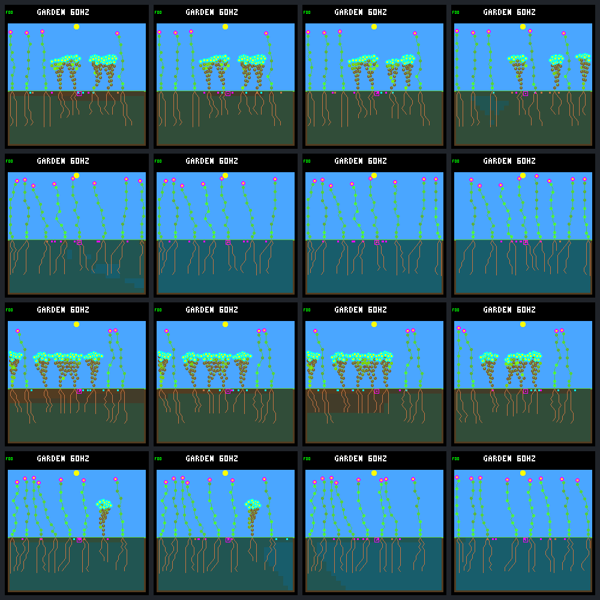

# Selected renewal stalls: matched native frames

Outcome-selected cases, not a representative panel. Columns: **days 62, 78, 94, 110**.
Rows: seed 1824c139 original/broad, then seed 4d5f9ee1 original/broad. Fresh-2 only.
The first three views bracket the (62,94] zero-credit interval; the last is a later comparison.

| Frame | World hash | Framebuffer CRC32 |
|---|---|---|
| [original / 1824c139 / day 62](renewal-stalls-frames/g0.1824c139.62.png) | `b91382e6` | `dd72b52a` |
| [original / 1824c139 / day 78](renewal-stalls-frames/g0.1824c139.78.png) | `4adb2c84` | `320a5fc3` |
| [original / 1824c139 / day 94](renewal-stalls-frames/g0.1824c139.94.png) | `ec824ff3` | `c5517e58` |
| [original / 1824c139 / day 110](renewal-stalls-frames/g0.1824c139.110.png) | `04a9c743` | `944b3253` |
| [broad-final / 1824c139 / day 62](renewal-stalls-frames/g3.1824c139.62.png) | `26acbf34` | `2e90e0a0` |
| [broad-final / 1824c139 / day 78](renewal-stalls-frames/g3.1824c139.78.png) | `07b24e9c` | `598a6d73` |
| [broad-final / 1824c139 / day 94](renewal-stalls-frames/g3.1824c139.94.png) | `d1d44f38` | `22f7ae28` |
| [broad-final / 1824c139 / day 110](renewal-stalls-frames/g3.1824c139.110.png) | `dfec3064` | `befe6346` |
| [original / 4d5f9ee1 / day 62](renewal-stalls-frames/g0.4d5f9ee1.62.png) | `ac99ba8e` | `f18811e2` |
| [original / 4d5f9ee1 / day 78](renewal-stalls-frames/g0.4d5f9ee1.78.png) | `6b25c9c6` | `96da38fc` |
| [original / 4d5f9ee1 / day 94](renewal-stalls-frames/g0.4d5f9ee1.94.png) | `ebf8cf82` | `67db153e` |
| [original / 4d5f9ee1 / day 110](renewal-stalls-frames/g0.4d5f9ee1.110.png) | `2ad7063b` | `480c4fd6` |
| [broad-final / 4d5f9ee1 / day 62](renewal-stalls-frames/g3.4d5f9ee1.62.png) | `670c6b12` | `bf561e5b` |
| [broad-final / 4d5f9ee1 / day 78](renewal-stalls-frames/g3.4d5f9ee1.78.png) | `f96f5982` | `bb5e4072` |
| [broad-final / 4d5f9ee1 / day 94](renewal-stalls-frames/g3.4d5f9ee1.94.png) | `c3610930` | `c7bb6dfe` |
| [broad-final / 4d5f9ee1 / day 110](renewal-stalls-frames/g3.4d5f9ee1.110.png) | `78e810a6` | `b557aad9` |

All 16 frames reproduced pixel-for-pixel after independent resets and matched the
same-tick population-inspector hashes. Four day-192 anchors match original saved hashes.
Images alone do not establish reproductive health; see the [case study](renewal-stalls.md).

Manifest SHA-256: `7e2b0136cfc43babd2d8ffd9442fefe6239eaa3a5ce1a73e588df58ddcb7c1ca`.
