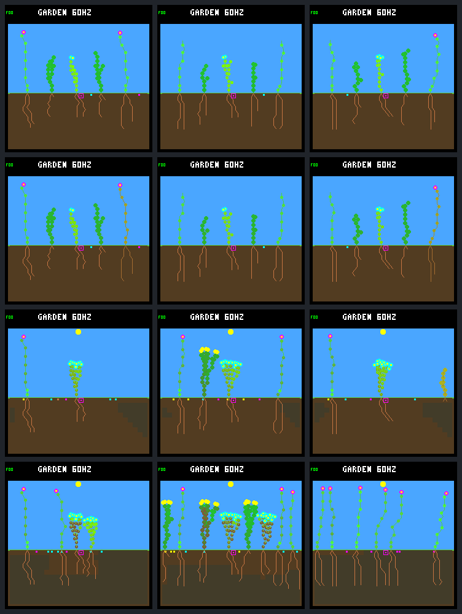

# Startup survival: body upkeep and seedling water allocation

The first eight days explain the selected species loss: **adult shrubs exhaust
energy overnight, and the wide controller's replacement shrub exhausts water
before extending a root**. The narrow controller retains one founder shrub and
has two living shrub offspring by day eight. This is a useful physical diagnosis
of one inspected world, not general superiority or a new training result.

[Fixed protocol](renewal-startup-protocol.md) ·
[Resource/decision data](renewal-startup-summary.json) ·
[Prior cohort audit](renewal-cohorts.md)

## Native visual comparison

Columns: **original / R2 narrow / R2 wide**. Rows: day **0.25** (first sunset),
**0.75** (first dawn), **2**, **8**. Reset starts at noon. These are unchanged
native-renderer frames, not illustrations. Every frame and complete trace has an
exact independent repeat.



## Same starting world, different survival

Frozen models are original `dc5e849d`, R2 N3 `01b9d94a`, R2 W3 `c9ea07fd`, on
`0d983a80`. The original five founders and reset hash are identical. All use the
existing 512-node rainfed-crowded ecology, eight plant/seed slots, wide dispersal,
headroom uptake, selective maintenance and night-growth veto. No gardener,
drainage, reserve gate or model changes. The first scheduled patch is day 16,
outside this diagnostic; both saved schedules have matching startup histories.

| Controller | Births after reset | Natural deaths | Living at day 8 | Flowers / shrubs / ground-cover |
|---|---:|---:|---:|---|
| Original | 11 | 12 | 4 | 2 / 0 / 2 |
| R2 N3 | 4 | 1 | 8 | 3 / 3 / 2 |
| R2 W3 | 9 | 8 | 6 | 6 / 0 / 0 |

More births here accompany more churn, not better survival. The narrow endpoint
is not proof of continued renewal: its long-run behavior and late scores remain
those reported in the [return check](renewal-return.md). This world was selected
because those outcomes differed; it is not a held-out sample. Descendant IDs
are local to each run. Only the identical reset founders can be matched directly.

## Founder shrub 2: four extra nodes cross an upkeep step

At the **second sunset**, tick 4,800 (day 1.25), the same starting shrub has:

| Controller | Nodes | Roots | Active leaves | Stored energy | Energy per upkeep debit | Outcome |
|---|---:|---:|---:|---:|---:|---|
| Original | 59 | 16 | 42 | 200 | 8 | Dies at tick 6,780, day 1.766 |
| R2 N3 | 55 | 18 | 36 | 205 | 7 | Survives through day 8 |
| R2 W3 | 59 | 13 | 45 | 199 | 8 | Dies at tick 6,720, day 1.750 |

Ordinary upkeep is `ceil(nodes / 8)`, charged every 60 logic ticks. Crossing
56 nodes raises the charge from seven to eight. During the recorded interval
after this sunset and before dawn, **all three have zero photosynthetic energy,
zero growth spending, zero seed spending, and zero leaf-renewal spending**.
Their built bodies consume the reserves; the night-growth veto is functioning.

W pays 24 full eight-energy charges, leaving seven energy at tick 6,240.
The next charge fails at 6,300. Eight consecutive failed maintenance checks
raise stress to the death threshold at 6,720. Immediately before death it has
**zero energy and 512 water**. The death flags name energy shortage, not water.

N first fails maintenance later, at 6,600. It reaches stress five during the
dim early dawn, then enough income returns: stress falls from tick 6,900 and
reaches zero at 7,140. N does **not** maintain a comfortable overnight surplus;
its smaller upkeep bill lets the existing stress tolerance bridge the gap.
Its other founder shrub still dies with 59 nodes, so this is not a universal
shrub rescue by N.

Shape diverges very early: by tick 60 the chosen tip sites for founder shrub 2
are already different even though both have 139 energy and 50 water before
the action. At first sunset N has fifteen root nodes and eight active leaves;
W has thirteen roots and ten active leaves. This is a trajectory change, not
just an end-of-run score-label difference. The trace does not isolate the effect
of the focal controller from its differently controlled neighbors.

## Founder flower 5: equal body count is not equal reserve

The matched flower in N and W has **34 nodes** at first sunset. Both spend 288
energy on growth and 47 on upkeep before then, with no seed/renewal spending
or energy overflow. But daylight income is **369 N versus 341 W**. Starting
from 128, that leaves **162 versus 134** energy at sunset.

At first dawn N still has two energy; W has none and stress six. W dies at tick
3,000 (day 0.781), while N recovers. Geometry/resource income matters alongside
body size; a node-count-only explanation would miss this difference. The original
flower also dies at 3,000, but its earlier budget includes a 48-energy seed
purchase, so it is not the same accounting as W.

## The replacement shrub fails for a different reason

W's founder shrubs are absent at day 1.75, but a saved seed germinates at tick
7,005 (day 1.824). That child, local lineage 6 from founder 4, makes **seven
shoot extensions and zero root extensions**. Its two seed roots occupy the
same surface cell, which dries out.

Its last growth decision at tick 7,275 has exactly five water and selects
another shoot extension, consuming the remaining water. Across its live steps:
24 initial water + 20 absorbed = 35 growth spending + 9 upkeep spending + zero
remaining. No renewal or reproduction consumes water. Once it cannot afford
the ordinary growth price, the engine no longer asks the growth policy to act;
root recovery cannot be purchased from zero water.

At the last living sample it has **256 energy, zero water, and stress seven**.
It dies at tick 7,860 (day 2.047) with water-shortage flags. This closes the
temporary shrub recovery seen in the old ledger. Thus adult energy failure and
seedling water failure both contribute; adding energy alone would not address
the complete observed sequence. Later W loses its original ground-cover too,
at tick 10,680 (day 2.781), with energy-shortage flags.

## Verification and provenance

- **244 focused Python tests pass**, including fourteen new startup tests.
- Exactly **30 native calls**: three complete traces plus three repeats, and
  twelve frame replays plus twelve repeats. No training/mutation calls.
- All **6,147 census samples**, **25,172 live-step budgets**, **4,978 committed
  growth decisions**, leaf proposals/wear, node ownership and tip accounting
  reconcile. The three full traces repeat byte-for-byte.
- All observed startup births/deaths and available early checkpoint hashes
  agree with both saved 192-day schedules. Later deaths are right-censored;
  schedules sharing startup are not independent observations.
- All twelve untraced replay states agree with traced states, with matching
  repeated JSON and RGB565 bytes. Source/configuration, input hashes and portable
  summary/contact-sheet checks pass. No native rebuild or device test was needed.

There are **21 terminal steps with intentionally unreconstructed resource
income**: native death clears stores and income. Cause flags and preceding live
samples are available, but the analyzer does not invent the cleared final debit.
Budgets use the recorded window boundaries, with post-sunset night windows
ending just before dawn; they are not predictions of a no-death world.

An initial analyzer check expected a world-level policy name that the frozen
inspector does not emit. All thirty captures had already completed. Their bytes,
original source snapshot and failure record were sealed, then analysis was
corrected to validate existing bid-level veto metadata, frozen command/binary
identity and independent replays. **Recovery used zero new native calls.** The
revised analyzer/source snapshot is separately retained. Native capture timings
were not persisted before that exception and are marked unavailable rather than
estimated; corrected analysis plus repeat took **3.98 seconds**.

Ignored bundle: `artifacts/garden-renewal-startup-v1`, **94 artifacts /
46,611,121 bytes**, excluding manifest. Manifest SHA-256:
`301d0df74768bd4c1a8a3fbe2b26dbc2f5a10025c40c76dd213b0f7b5fbd3467`.

```sh
python3 -W error sim/garden_renewal_startup.py \
  --output artifacts/garden-renewal-startup-v1 --verify \
  --check-export benchmarks/garden-longevity/renewal-startup
```

## Next proposed test

The adult energy mechanism resembles the earlier [reserve-gate findings](reserve-panel.md),
whose tradeoffs remain relevant; this does not establish a reason to promote
that gate or add a diversity reward. Both resource allocation and interactions
with neighbors can affect the evolved body.

Propose a **reciprocal founder-shrub controller swap** on this same short world:
N controlling only founder shrub 2 in an otherwise W garden, and W controlling
that shrub in an otherwise N garden, alongside unchanged N/W controls. Keep
all other plants (including descendants) on the background controller, and
leave resources, rules, genomes and selective leaf maintenance unchanged. This
tests whether the focal survival difference follows its own growth policy or
depends on the changed surrounding garden. It is a proposed host-only diagnostic,
**not implemented here**. The separate seedling water trap remains a later
question, not silently included as a second intervention.

Firmware, ecology, scoring, defaults and models are unchanged. No commit, push,
deployment or further training followed this diagnostic.
