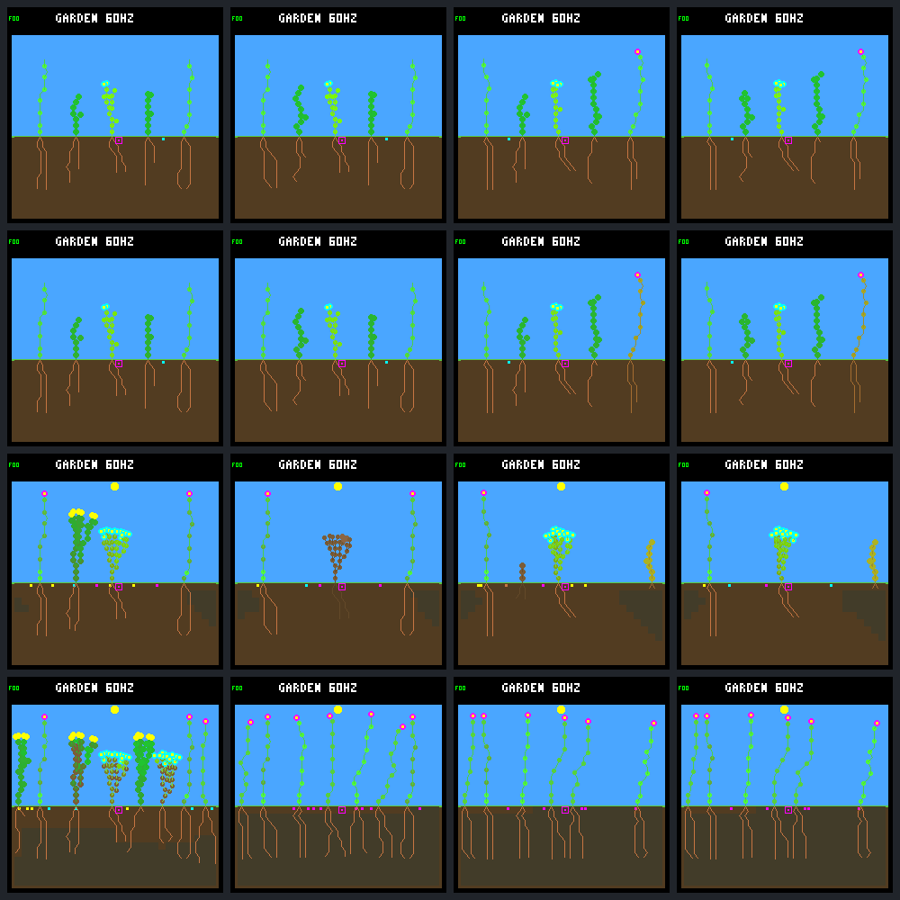

# Reciprocal controller swap: survival depends on the combination

**Only N controlling founder shrub 2 in an N-controlled garden survived.**
Putting that N controller in the W garden did not rescue the shrub; putting W
on that shrub in the N garden killed it. Both unchanged controls reproduce the
earlier results exactly. This establishes an effect of the focal/background
controller combination in this selected world, not a generally superior
individual controller or proof of ecological cooperation.

[Predeclared protocol](renewal-swap-protocol.md) ·
[Verified resource/decision summary](renewal-swap-summary.json) ·
[Previous startup diagnostic](renewal-startup.md)

## Fixed intervention and native images

Names are **focal-in-background**: `n-in-w` means N controls only founder shrub
2; W controls every other plant, including any descendants. The router follows
stable lineage identity through slot compaction, not a plant-array index. It
does not change observations, genomes, private memory, random streams or the
ordinary arbitration/commit rules. Only the selected controller changes;
subsequent world trajectories can naturally diverge.

Models remain R2 N3 `01b9d94a` and W3 `c9ea07fd`. World `0d983a80`, reset hash
`e663996c`, 512 nodes, eight plants/seeds, wide dispersal, headroom uptake,
selective leaf maintenance, nighttime-growth veto and all other ecology are
unchanged. No gardener or drainage. Schedule `05d87ca0` has its first patch at
day 16, beyond this eight-day test. N/W name the saved controllers; **both
worlds still use the same wide seed-dispersal rule**.

Columns: **N-in-N / W-in-N / N-in-W / W-in-W**. Rows: days **0.25**, **0.75**,
**2**, **8**. These are production-renderer frames, not illustrations. The
full raw traces and all sixteen frames each have an independent exact repeat.



## Outcomes

Second-sunset measurements are at tick 4,800, day 1.25. Upkeep is
`ceil(nodes / 8)` energy every 60 logic ticks.

| Focal / background | Nodes / roots / active leaves | Sunset energy / upkeep | Focal outcome | Living at day 8: flowers / shrubs / ground-cover |
|---|---:|---:|---|---|
| N / N, control | 55 / 18 / 36 | 205 / 7 | Alive through day 8 | 3 / 3 / 2 |
| W / N, swap | 59 / 16 / 42 | 201 / 8 | Energy death: tick 6,780, day 1.766 | 7 / 0 / 0 |
| N / W, swap | 54 / 18 / 35 | 185 / 7 | Energy death: tick 6,840, day 1.781 | 6 / 0 / 0 |
| W / W, control | 59 / 13 / 45 | 199 / 8 | Energy death: tick 6,720, day 1.750 | 6 / 0 / 0 |

The N/N shrub has two living germinated children by day eight. No focal child
germinates by that endpoint in the other three cases, despite their seed
production. Descendant IDs are local to each world and are not paired across
cases. Total post-reset births/deaths are respectively **4/1, 7/5, 9/8, 9/8**.

## A smaller body is not sufficient

N in W actually builds one fewer node than N in N and keeps the same seven-unit
upkeep rate. It nevertheless enters the second night with **20 less energy**.
It first fails maintenance at tick **6,420**, rather than **6,600** in N/N, and
reaches lethal stress at 6,840. Immediately before death it has zero energy,
512 water and stress seven. All three focal deaths have energy-shortage flags.

The N/N control reaches stress five at 6,840, receives enough income to reduce
stress at 6,900, and clears stress at 7,140. This is a narrow survival margin,
not comfortable overnight reserves. We cannot assume the dead counterfactual
would have earned the same post-death income.

The exact **second-daylight budget difference**, N-in-W minus N-in-N, is:

- 5 more energy at the starting dawn checkpoint;
- 8 less photosynthetic income;
- 8 less growth spending and 24 less discarded overflow;
- **48 more seed spending** and 1 more upkeep spending;
- no leaf-renewal spending in either case.

Thus `+5 - 8 + 8 + 24 - 48 - 1 = -20` at sunset. N/N makes three seed purchases
in that interval, at ticks 3,720 / 4,020 / 4,560; N/W makes four, at
3,660 / 3,900 / 4,200 / 4,620. Seed creation is the existing automatic mechanism,
not a newly added neural action. The extra purchase is an accounting term, not
an isolated experiment proving that canceling one seed would save the plant.
It would also change later resources and random-state consumption.

All four shrubs have **zero nighttime photosynthetic income, growth, seed or
renewal spending** in the recorded second-night window. Their built bodies
consume their reserves. W in N still crosses the eight-unit upkeep step; its
slightly higher sunset reserve delays death by only one maintenance interval
relative to W in W. The previously tested reserve gates remain separate
experiments; this result does not promote them.

## The effect spreads beyond the swapped plant

With every other controller still N, swapping only shrub 2 to W also changes
the fate of the original ground-cover. It reaches the second sunset with
**57 nodes instead of 56**, crossing from seven to eight energy per upkeep
debit, and **231 instead of 235 energy**. It dies at tick **6,960**; its N/N
counterpart survives through day eight. The W/N endpoint has seven flowers and
no shrubs or ground-cover, whereas the N/N control retains all three species.

This is a causal total effect of the one-founder intervention, with feedback
allowed. It does not isolate shading, soil competition, collision/space,
reproductive timing, or shared-world arbitration. In particular,
`grow_best_tip()` scans a rotating global node-pool order and retains the first
equal-priority bid: changing other plants can change that ordering as well as
physical resources. Per-plant random state and counter-based weather avoid a
simple shared weather/decision-RNG explanation, but this experiment does not
separate all indirect mechanisms or establish cooperation.

## Verification and reproducibility

- All **58 experimental-host CTests** pass, plus **three focused default-build
  CTests**. Nine new Python tests cover routing identity, strict control
  comparison and the fixed budget. Native CLI checks reject 33 invalid cases
  and compare 56 short self-routing records. The C adapter tests cover errors,
  output/input preservation, stable identity after compaction and noninheritance.
- Both builds use strict warnings and UBSan; C formatting and `git diff --check`
  pass. The neural unit-test target now explicitly retains assertions in
  release-style configurations. Shared simulation/firmware source is unchanged.
- The saved native configuration matches the old baseline, including `-O2 -g`.
  Shared C/header hashes match the archived sources. Changes are confined to
  host diagnostic plumbing; previously added founder-exit handling is inactive
  and explicitly rejected with a focal swap.
- Exactly **40 experimental native calls**: eight full traces and 32 frame
  replays, including repeats. Collection took **2.61 seconds**; analysis plus an
  identical second analysis took **7.00 seconds**, excluding build/test/container
  startup. These are diagnostic timings, not a training-throughput benchmark.
- The two same-model controls match **all 30,194 old trace records** after
  removing only declared routing metadata, plus every old replay result and
  framebuffer byte. All four new traces repeat byte-for-byte; all sixteen
  untraced replay states match their traced states and repeat exactly.
- **8,196 census samples, 33,432 live-step budgets, 15,286 growth bids and 5,605
  committed decisions** reconcile, including node ownership, leaf maintenance
  and tip accounting. Every growth bid records the intended controller CRC.
  **22 terminal steps** retain the existing explicit gap: death clears stores
  and income, so those final resource debits are not reconstructed.

Raw capture commands, timings and hashes were sealed before analysis; there
were no failed or extra experimental runs. Build/unit/short CLI validation is
separate from the fixed forty-call panel. The ignored bundle is
`artifacts/garden-renewal-swap-v1`: **124 artifacts / 32,958,266 bytes**, excluding
manifest. Manifest SHA-256:
`9f2be4fb09b00d2464273b5a53c20c478de8e39a1e060a2c68e51684a6b4d9dd`.

```sh
# Offline verification only; invokes no native simulations:
python3 -W error sim/garden_renewal_swap.py \
  --output artifacts/garden-renewal-swap-v1 --verify \
  --check-export benchmarks/garden-longevity/renewal-swap
```

## Next proposal

Keep shrub 2 on N and change **one other founder at a time** from N to W,
starting from the same reset. Use the saved N/N and N/W endpoints as controls
for the comparison, retain ordinary background-N descendants, and inspect
resource, seed-purchase and tied-bid timing as well as survival. This would
localize which single-neighbor changes are sufficient, while retaining the
possibility that the failure needs a combination. Agree the bounded panel
before running it; no new fitness term, rescue rule or training is warranted
from this one selected world alone.

Firmware, ecology, scoring, defaults and model bytes are unchanged. No device
deployment, further training, commit or push followed this experiment.
