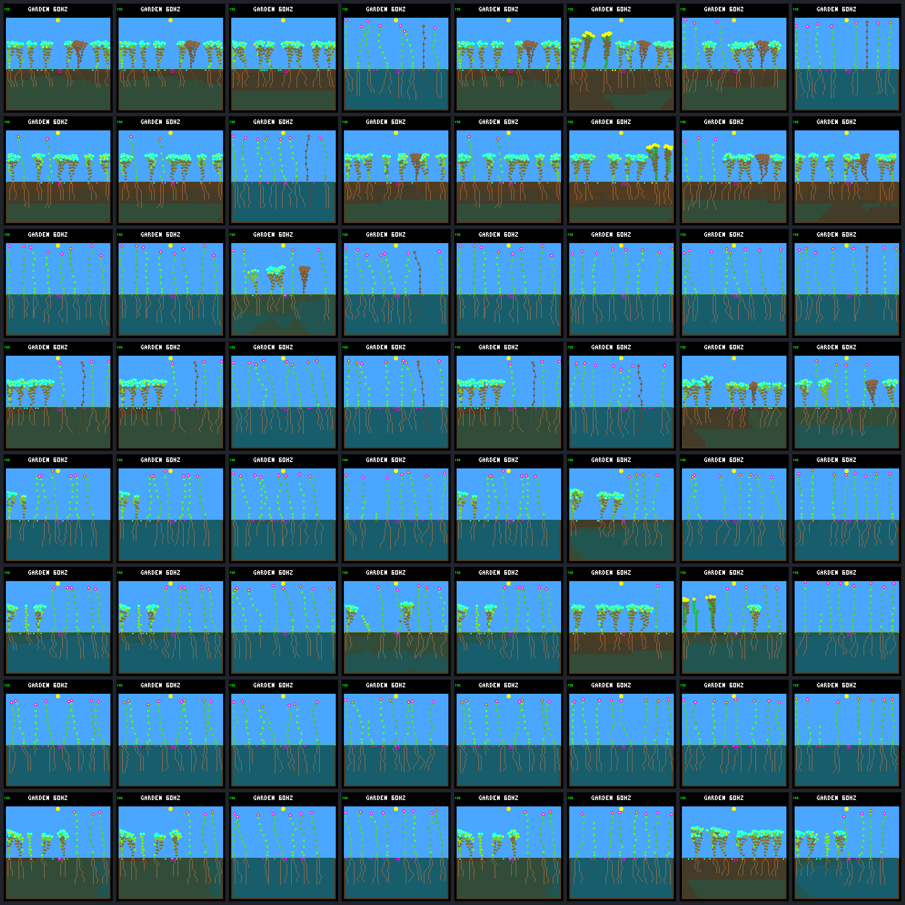

# Old fitness versus bounded renewal: generation gallery

Fixed fresh review panel; all images at day 192. Columns: **A0, A1, A2, A3, B0, B1, B2, B3**.
A selects persistence-v2; B selects individual bounded renewal. Rows follow the table below.
Review never selects search parents; unchanged champions and failed worlds are retained.

| Row | Schedule | Seed |
|---:|---|---|
| 1 | fresh-1 | `78a542dc` |
| 2 | fresh-1 | `8bb188f7` |
| 3 | fresh-1 | `decad72f` |
| 4 | fresh-1 | `6d889ca1` |
| 5 | fresh-2 | `78a542dc` |
| 6 | fresh-2 | `8bb188f7` |
| 7 | fresh-2 | `decad72f` |
| 8 | fresh-2 | `6d889ca1` |

| Frame | Model CRC | Living | World hash | Framebuffer CRC |
|---|---|---:|---|---|
| [v2.g0.fresh-1.78a542dc](renewal-training-frames/v2.g0.fresh-1.78a542dc.png) | `dc5e849d` | 7 | `a6ef3aba` | `c6e36079` |
| [v2.g1.fresh-1.78a542dc](renewal-training-frames/v2.g1.fresh-1.78a542dc.png) | `dc5e849d` | 7 | `a6ef3aba` | `c6e36079` |
| [v2.g2.fresh-1.78a542dc](renewal-training-frames/v2.g2.fresh-1.78a542dc.png) | `556a5dd2` | 8 | `f236ae15` | `c5367101` |
| [v2.g3.fresh-1.78a542dc](renewal-training-frames/v2.g3.fresh-1.78a542dc.png) | `c7c1b31e` | 7 | `a29073c9` | `045fa1bd` |
| [renewal.g0.fresh-1.78a542dc](renewal-training-frames/renewal.g0.fresh-1.78a542dc.png) | `dc5e849d` | 7 | `a6ef3aba` | `c6e36079` |
| [renewal.g1.fresh-1.78a542dc](renewal-training-frames/renewal.g1.fresh-1.78a542dc.png) | `9f694f3f` | 7 | `920ffd6a` | `7e66ac85` |
| [renewal.g2.fresh-1.78a542dc](renewal-training-frames/renewal.g2.fresh-1.78a542dc.png) | `165d9670` | 7 | `b4369255` | `2e8ab503` |
| [renewal.g3.fresh-1.78a542dc](renewal-training-frames/renewal.g3.fresh-1.78a542dc.png) | `b5670bb9` | 7 | `bf5b4107` | `620a313e` |
| [v2.g0.fresh-1.8bb188f7](renewal-training-frames/v2.g0.fresh-1.8bb188f7.png) | `dc5e849d` | 8 | `721c1941` | `ae95d44c` |
| [v2.g1.fresh-1.8bb188f7](renewal-training-frames/v2.g1.fresh-1.8bb188f7.png) | `dc5e849d` | 8 | `721c1941` | `ae95d44c` |
| [v2.g2.fresh-1.8bb188f7](renewal-training-frames/v2.g2.fresh-1.8bb188f7.png) | `556a5dd2` | 7 | `831e6776` | `1058fcc8` |
| [v2.g3.fresh-1.8bb188f7](renewal-training-frames/v2.g3.fresh-1.8bb188f7.png) | `c7c1b31e` | 7 | `74d20f34` | `e18cdee6` |
| [renewal.g0.fresh-1.8bb188f7](renewal-training-frames/renewal.g0.fresh-1.8bb188f7.png) | `dc5e849d` | 8 | `721c1941` | `ae95d44c` |
| [renewal.g1.fresh-1.8bb188f7](renewal-training-frames/renewal.g1.fresh-1.8bb188f7.png) | `9f694f3f` | 7 | `ac2d9e32` | `e8229e66` |
| [renewal.g2.fresh-1.8bb188f7](renewal-training-frames/renewal.g2.fresh-1.8bb188f7.png) | `165d9670` | 7 | `06ec65c6` | `c0351859` |
| [renewal.g3.fresh-1.8bb188f7](renewal-training-frames/renewal.g3.fresh-1.8bb188f7.png) | `b5670bb9` | 7 | `2f93d3b6` | `1fe8bb5c` |
| [v2.g0.fresh-1.decad72f](renewal-training-frames/v2.g0.fresh-1.decad72f.png) | `dc5e849d` | 8 | `b1fb886f` | `4fb5f029` |
| [v2.g1.fresh-1.decad72f](renewal-training-frames/v2.g1.fresh-1.decad72f.png) | `dc5e849d` | 8 | `b1fb886f` | `4fb5f029` |
| [v2.g2.fresh-1.decad72f](renewal-training-frames/v2.g2.fresh-1.decad72f.png) | `556a5dd2` | 7 | `6f5ea937` | `fccaa2f7` |
| [v2.g3.fresh-1.decad72f](renewal-training-frames/v2.g3.fresh-1.decad72f.png) | `c7c1b31e` | 7 | `3d6d21ca` | `0757868f` |
| [renewal.g0.fresh-1.decad72f](renewal-training-frames/renewal.g0.fresh-1.decad72f.png) | `dc5e849d` | 8 | `b1fb886f` | `4fb5f029` |
| [renewal.g1.fresh-1.decad72f](renewal-training-frames/renewal.g1.fresh-1.decad72f.png) | `9f694f3f` | 8 | `3e8ca510` | `00a0ca43` |
| [renewal.g2.fresh-1.decad72f](renewal-training-frames/renewal.g2.fresh-1.decad72f.png) | `165d9670` | 8 | `87fb16c9` | `1cd8cc7a` |
| [renewal.g3.fresh-1.decad72f](renewal-training-frames/renewal.g3.fresh-1.decad72f.png) | `b5670bb9` | 7 | `2738917c` | `9f02a064` |
| [v2.g0.fresh-1.6d889ca1](renewal-training-frames/v2.g0.fresh-1.6d889ca1.png) | `dc5e849d` | 7 | `bcfff65c` | `15ccd217` |
| [v2.g1.fresh-1.6d889ca1](renewal-training-frames/v2.g1.fresh-1.6d889ca1.png) | `dc5e849d` | 7 | `bcfff65c` | `15ccd217` |
| [v2.g2.fresh-1.6d889ca1](renewal-training-frames/v2.g2.fresh-1.6d889ca1.png) | `556a5dd2` | 8 | `f1a16da3` | `9e7e5b28` |
| [v2.g3.fresh-1.6d889ca1](renewal-training-frames/v2.g3.fresh-1.6d889ca1.png) | `c7c1b31e` | 7 | `014b0246` | `fcea509d` |
| [renewal.g0.fresh-1.6d889ca1](renewal-training-frames/renewal.g0.fresh-1.6d889ca1.png) | `dc5e849d` | 7 | `bcfff65c` | `15ccd217` |
| [renewal.g1.fresh-1.6d889ca1](renewal-training-frames/renewal.g1.fresh-1.6d889ca1.png) | `9f694f3f` | 7 | `47791985` | `cbf1fa1e` |
| [renewal.g2.fresh-1.6d889ca1](renewal-training-frames/renewal.g2.fresh-1.6d889ca1.png) | `165d9670` | 7 | `8893a1b3` | `32be378b` |
| [renewal.g3.fresh-1.6d889ca1](renewal-training-frames/renewal.g3.fresh-1.6d889ca1.png) | `b5670bb9` | 7 | `669712e9` | `c7bad104` |
| [v2.g0.fresh-2.78a542dc](renewal-training-frames/v2.g0.fresh-2.78a542dc.png) | `dc5e849d` | 8 | `24944b98` | `1a793905` |
| [v2.g1.fresh-2.78a542dc](renewal-training-frames/v2.g1.fresh-2.78a542dc.png) | `dc5e849d` | 8 | `24944b98` | `1a793905` |
| [v2.g2.fresh-2.78a542dc](renewal-training-frames/v2.g2.fresh-2.78a542dc.png) | `556a5dd2` | 8 | `39bfc500` | `a9d55536` |
| [v2.g3.fresh-2.78a542dc](renewal-training-frames/v2.g3.fresh-2.78a542dc.png) | `c7c1b31e` | 8 | `5f312dc5` | `dbb772a7` |
| [renewal.g0.fresh-2.78a542dc](renewal-training-frames/renewal.g0.fresh-2.78a542dc.png) | `dc5e849d` | 8 | `24944b98` | `1a793905` |
| [renewal.g1.fresh-2.78a542dc](renewal-training-frames/renewal.g1.fresh-2.78a542dc.png) | `9f694f3f` | 7 | `9e3fe18f` | `7db83d76` |
| [renewal.g2.fresh-2.78a542dc](renewal-training-frames/renewal.g2.fresh-2.78a542dc.png) | `165d9670` | 7 | `5faa7771` | `53a7ddf9` |
| [renewal.g3.fresh-2.78a542dc](renewal-training-frames/renewal.g3.fresh-2.78a542dc.png) | `b5670bb9` | 8 | `ac127d94` | `fd55a776` |
| [v2.g0.fresh-2.8bb188f7](renewal-training-frames/v2.g0.fresh-2.8bb188f7.png) | `dc5e849d` | 8 | `a3004db1` | `754c2bc8` |
| [v2.g1.fresh-2.8bb188f7](renewal-training-frames/v2.g1.fresh-2.8bb188f7.png) | `dc5e849d` | 8 | `a3004db1` | `754c2bc8` |
| [v2.g2.fresh-2.8bb188f7](renewal-training-frames/v2.g2.fresh-2.8bb188f7.png) | `556a5dd2` | 8 | `9b433e33` | `2f5191c0` |
| [v2.g3.fresh-2.8bb188f7](renewal-training-frames/v2.g3.fresh-2.8bb188f7.png) | `c7c1b31e` | 8 | `5e406849` | `209dac98` |
| [renewal.g0.fresh-2.8bb188f7](renewal-training-frames/renewal.g0.fresh-2.8bb188f7.png) | `dc5e849d` | 8 | `a3004db1` | `754c2bc8` |
| [renewal.g1.fresh-2.8bb188f7](renewal-training-frames/renewal.g1.fresh-2.8bb188f7.png) | `9f694f3f` | 6 | `bc5f3060` | `1fc45f58` |
| [renewal.g2.fresh-2.8bb188f7](renewal-training-frames/renewal.g2.fresh-2.8bb188f7.png) | `165d9670` | 8 | `cdce8004` | `16e89b7a` |
| [renewal.g3.fresh-2.8bb188f7](renewal-training-frames/renewal.g3.fresh-2.8bb188f7.png) | `b5670bb9` | 8 | `5c3cf40a` | `95f1d2b8` |
| [v2.g0.fresh-2.decad72f](renewal-training-frames/v2.g0.fresh-2.decad72f.png) | `dc5e849d` | 8 | `64cc4b53` | `bf6926c9` |
| [v2.g1.fresh-2.decad72f](renewal-training-frames/v2.g1.fresh-2.decad72f.png) | `dc5e849d` | 8 | `64cc4b53` | `bf6926c9` |
| [v2.g2.fresh-2.decad72f](renewal-training-frames/v2.g2.fresh-2.decad72f.png) | `556a5dd2` | 7 | `fbb339e5` | `8f299495` |
| [v2.g3.fresh-2.decad72f](renewal-training-frames/v2.g3.fresh-2.decad72f.png) | `c7c1b31e` | 8 | `c6144b7c` | `314d8301` |
| [renewal.g0.fresh-2.decad72f](renewal-training-frames/renewal.g0.fresh-2.decad72f.png) | `dc5e849d` | 8 | `64cc4b53` | `bf6926c9` |
| [renewal.g1.fresh-2.decad72f](renewal-training-frames/renewal.g1.fresh-2.decad72f.png) | `9f694f3f` | 8 | `dea17db4` | `6fbfd9c1` |
| [renewal.g2.fresh-2.decad72f](renewal-training-frames/renewal.g2.fresh-2.decad72f.png) | `165d9670` | 8 | `cf3518fe` | `103682a7` |
| [renewal.g3.fresh-2.decad72f](renewal-training-frames/renewal.g3.fresh-2.decad72f.png) | `b5670bb9` | 8 | `ece0fd59` | `1db639ca` |
| [v2.g0.fresh-2.6d889ca1](renewal-training-frames/v2.g0.fresh-2.6d889ca1.png) | `dc5e849d` | 8 | `dba9ba4a` | `bd3bb5f1` |
| [v2.g1.fresh-2.6d889ca1](renewal-training-frames/v2.g1.fresh-2.6d889ca1.png) | `dc5e849d` | 8 | `dba9ba4a` | `bd3bb5f1` |
| [v2.g2.fresh-2.6d889ca1](renewal-training-frames/v2.g2.fresh-2.6d889ca1.png) | `556a5dd2` | 7 | `a3889e46` | `db79b7b4` |
| [v2.g3.fresh-2.6d889ca1](renewal-training-frames/v2.g3.fresh-2.6d889ca1.png) | `c7c1b31e` | 8 | `fe4e9ba6` | `8d5f3a85` |
| [renewal.g0.fresh-2.6d889ca1](renewal-training-frames/renewal.g0.fresh-2.6d889ca1.png) | `dc5e849d` | 8 | `dba9ba4a` | `bd3bb5f1` |
| [renewal.g1.fresh-2.6d889ca1](renewal-training-frames/renewal.g1.fresh-2.6d889ca1.png) | `9f694f3f` | 8 | `f228c0a0` | `ff43eaca` |
| [renewal.g2.fresh-2.6d889ca1](renewal-training-frames/renewal.g2.fresh-2.6d889ca1.png) | `165d9670` | 7 | `3dd5b8b3` | `ace5716e` |
| [renewal.g3.fresh-2.6d889ca1](renewal-training-frames/renewal.g3.fresh-2.6d889ca1.png) | `b5670bb9` | 8 | `67b0755f` | `5ddd3e4d` |

All 64 framebuffers independently repeat byte-for-byte and match native ledger hashes.
Images alone do not prove reproductive health or generalization. These are exploratory review worlds, not a final test.
See the [report](renewal-training.md) and [paired data](renewal-training-summary.json).

Manifest SHA-256: `61d464b839b2dc988c99c1adb95008b4db8b88a71808991264b5acaf08d43a3f`.
