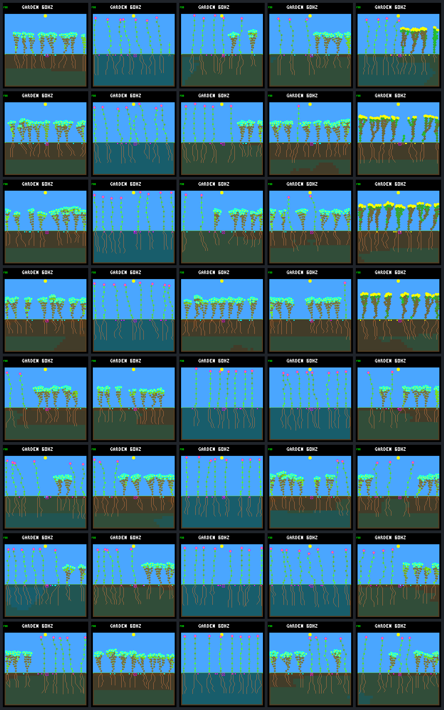

# Frozen-model world/schedule transfer gallery

Columns: **original, R1 A, R1 B, R2 A, R2 B**. All images at day 192.
World seeds are fixed first-in-panel anchors, not outcome-selected examples.
TT/TR/RT/RR label world-set then schedule-set (training/review).

| Row | Cell | World seed | Schedule | Capture |
|---:|---|---|---|---|
| 1 | TT | `b3376513` | train-1 / `a3b7e953` | New |
| 2 | TT | `b3376513` | train-2 / `50a32378` | New |
| 3 | TR | `b3376513` | review-1 / `05d87ca0` | New |
| 4 | TR | `b3376513` | review-2 / `b69a372e` | New |
| 5 | RT | `abf7af73` | train-1 / `a3b7e953` | New |
| 6 | RT | `abf7af73` | train-2 / `50a32378` | New |
| 7 | RR | `abf7af73` | review-1 / `05d87ca0` | Reused |
| 8 | RR | `abf7af73` | review-2 / `b69a372e` | Reused |

| Frame | Model CRC | Living | World hash | Framebuffer CRC |
|---|---|---:|---|---|
| [original.tt.train-1.b3376513](renewal-transfer-frames/original.tt.train-1.b3376513.png) | `dc5e849d` | 8 | `4a2f7e12` | `bfcbd0c0` |
| [r1-a.tt.train-1.b3376513](renewal-transfer-frames/r1-a.tt.train-1.b3376513.png) | `46fad3c2` | 8 | `8c726b3a` | `7c45e693` |
| [r1-b.tt.train-1.b3376513](renewal-transfer-frames/r1-b.tt.train-1.b3376513.png) | `7ce0ed84` | 7 | `b4850b2a` | `55770072` |
| [r2-a.tt.train-1.b3376513](renewal-transfer-frames/r2-a.tt.train-1.b3376513.png) | `f51cb1d4` | 7 | `445576e7` | `953ce616` |
| [r2-b.tt.train-1.b3376513](renewal-transfer-frames/r2-b.tt.train-1.b3376513.png) | `01b9d94a` | 8 | `dffa44a9` | `13469e88` |
| [original.tt.train-2.b3376513](renewal-transfer-frames/original.tt.train-2.b3376513.png) | `dc5e849d` | 8 | `d99383e3` | `a069148d` |
| [r1-a.tt.train-2.b3376513](renewal-transfer-frames/r1-a.tt.train-2.b3376513.png) | `46fad3c2` | 8 | `342b8a27` | `97161c82` |
| [r1-b.tt.train-2.b3376513](renewal-transfer-frames/r1-b.tt.train-2.b3376513.png) | `7ce0ed84` | 8 | `c86646c4` | `6aacc87d` |
| [r2-a.tt.train-2.b3376513](renewal-transfer-frames/r2-a.tt.train-2.b3376513.png) | `f51cb1d4` | 8 | `18c814c2` | `c72718eb` |
| [r2-b.tt.train-2.b3376513](renewal-transfer-frames/r2-b.tt.train-2.b3376513.png) | `01b9d94a` | 8 | `4093f717` | `88205ad7` |
| [original.tr.review-1.b3376513](renewal-transfer-frames/original.tr.review-1.b3376513.png) | `dc5e849d` | 8 | `741b5733` | `68bb69de` |
| [r1-a.tr.review-1.b3376513](renewal-transfer-frames/r1-a.tr.review-1.b3376513.png) | `46fad3c2` | 8 | `fe223f0d` | `7bc523ae` |
| [r1-b.tr.review-1.b3376513](renewal-transfer-frames/r1-b.tr.review-1.b3376513.png) | `7ce0ed84` | 7 | `ef8d5dd7` | `83096151` |
| [r2-a.tr.review-1.b3376513](renewal-transfer-frames/r2-a.tr.review-1.b3376513.png) | `f51cb1d4` | 8 | `367add1c` | `662ebac3` |
| [r2-b.tr.review-1.b3376513](renewal-transfer-frames/r2-b.tr.review-1.b3376513.png) | `01b9d94a` | 8 | `97687bab` | `44c89d7b` |
| [original.tr.review-2.b3376513](renewal-transfer-frames/original.tr.review-2.b3376513.png) | `dc5e849d` | 8 | `13083a37` | `ccc8fb73` |
| [r1-a.tr.review-2.b3376513](renewal-transfer-frames/r1-a.tr.review-2.b3376513.png) | `46fad3c2` | 8 | `66db27bf` | `ab0c41c2` |
| [r1-b.tr.review-2.b3376513](renewal-transfer-frames/r1-b.tr.review-2.b3376513.png) | `7ce0ed84` | 8 | `64f0a3f9` | `cb6ec99c` |
| [r2-a.tr.review-2.b3376513](renewal-transfer-frames/r2-a.tr.review-2.b3376513.png) | `f51cb1d4` | 8 | `8930034a` | `6b6fcd03` |
| [r2-b.tr.review-2.b3376513](renewal-transfer-frames/r2-b.tr.review-2.b3376513.png) | `01b9d94a` | 7 | `d279b1d6` | `0ce6f562` |
| [original.rt.train-1.abf7af73](renewal-transfer-frames/original.rt.train-1.abf7af73.png) | `dc5e849d` | 7 | `884a1efb` | `5f5e3871` |
| [r1-a.rt.train-1.abf7af73](renewal-transfer-frames/r1-a.rt.train-1.abf7af73.png) | `46fad3c2` | 7 | `a5149dc0` | `72c683a8` |
| [r1-b.rt.train-1.abf7af73](renewal-transfer-frames/r1-b.rt.train-1.abf7af73.png) | `7ce0ed84` | 7 | `b9f10789` | `b5dd4eb1` |
| [r2-a.rt.train-1.abf7af73](renewal-transfer-frames/r2-a.rt.train-1.abf7af73.png) | `f51cb1d4` | 8 | `d75c5d4e` | `f2a7bab6` |
| [r2-b.rt.train-1.abf7af73](renewal-transfer-frames/r2-b.rt.train-1.abf7af73.png) | `01b9d94a` | 7 | `cbe17e0f` | `ed1ae2bb` |
| [original.rt.train-2.abf7af73](renewal-transfer-frames/original.rt.train-2.abf7af73.png) | `dc5e849d` | 8 | `443f36d5` | `69dd9725` |
| [r1-a.rt.train-2.abf7af73](renewal-transfer-frames/r1-a.rt.train-2.abf7af73.png) | `46fad3c2` | 8 | `ec308f2d` | `a704d3a0` |
| [r1-b.rt.train-2.abf7af73](renewal-transfer-frames/r1-b.rt.train-2.abf7af73.png) | `7ce0ed84` | 8 | `325c2351` | `d063bea0` |
| [r2-a.rt.train-2.abf7af73](renewal-transfer-frames/r2-a.rt.train-2.abf7af73.png) | `f51cb1d4` | 8 | `583f1c27` | `a778b83d` |
| [r2-b.rt.train-2.abf7af73](renewal-transfer-frames/r2-b.rt.train-2.abf7af73.png) | `01b9d94a` | 8 | `6cd87969` | `b324c6a4` |
| [original.rr.review-1.abf7af73](renewal-transfer-frames/original.rr.review-1.abf7af73.png) | `dc5e849d` | 8 | `86829018` | `edd111ee` |
| [r1-a.rr.review-1.abf7af73](renewal-transfer-frames/r1-a.rr.review-1.abf7af73.png) | `46fad3c2` | 8 | `a47fcec3` | `0985b14f` |
| [r1-b.rr.review-1.abf7af73](renewal-transfer-frames/r1-b.rr.review-1.abf7af73.png) | `7ce0ed84` | 8 | `4955fc6f` | `ebddf994` |
| [r2-a.rr.review-1.abf7af73](renewal-transfer-frames/r2-a.rr.review-1.abf7af73.png) | `f51cb1d4` | 8 | `afadfae5` | `af508a10` |
| [r2-b.rr.review-1.abf7af73](renewal-transfer-frames/r2-b.rr.review-1.abf7af73.png) | `01b9d94a` | 8 | `6093b352` | `639dbdfa` |
| [original.rr.review-2.abf7af73](renewal-transfer-frames/original.rr.review-2.abf7af73.png) | `dc5e849d` | 8 | `e7f06fdd` | `45c13a32` |
| [r1-a.rr.review-2.abf7af73](renewal-transfer-frames/r1-a.rr.review-2.abf7af73.png) | `46fad3c2` | 8 | `08e1ad27` | `b33e8481` |
| [r1-b.rr.review-2.abf7af73](renewal-transfer-frames/r1-b.rr.review-2.abf7af73.png) | `7ce0ed84` | 8 | `562fce00` | `acda8ad1` |
| [r2-a.rr.review-2.abf7af73](renewal-transfer-frames/r2-a.rr.review-2.abf7af73.png) | `f51cb1d4` | 8 | `218904aa` | `0a09c1f5` |
| [r2-b.rr.review-2.abf7af73](renewal-transfer-frames/r2-b.rr.review-2.abf7af73.png) | `01b9d94a` | 8 | `faa4ce38` | `a0a76242` |

All frames match native ledger endpoints and independent repeats. Ten RR captures
and their original repeats are reused; the remaining 30 pairs were newly captured.
Images do not prove reproductive health or isolate why a controller transfers poorly.
See the [report](renewal-transfer.md) and [paired data](renewal-transfer-summary.json).

Manifest SHA-256: `0422c3be1c55801ce921014f5314f6cecd655ea34345f140522a15de15b42279`.
