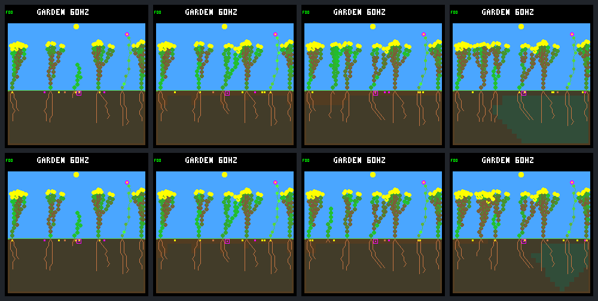

# Wet germination: more recruits, not sustained renewal

Removing the immediate light gate permits recruitment into the selected gap,
including children of the previously blocked shrub. It does **not** establish
sustained renewal: post-gap births rise **1 → 5**, but four treatment recruits
eventually die of energy shortage. Both worlds finish with seven living plants,
four living descendants, and no births in days 48–64. Keep this host-only rule
experimental and off by default.

This is the one selected 64-day comparison declared in the
[frozen protocol](renewal-wet-germination-protocol.md), not a held-out panel or
evidence for changing firmware/training defaults.

## Isolated change and first divergence

Both arms use world `0d983a80`, rainfed-crowded, N model `01b9d94a` for the
background/descendants, and W `c9ea07fd` only for reset founder 5. They retain
the no-night-growth policy, selective leaf maintenance, ordinary dark-spending
and full-night capacity guards, 512 nodes and eight plant/seed slots. No gardener,
irrigation or recurring patches are active.

Both export founder flower 1 immediately after tick **46,080 / day 12**, removing
the same 36 nodes, 240 energy and 510 water. The ordinary and post-export hashes
remain `5eea8cea` → `adf1a789`. Only then does the optional-light arm activate
`wet-germination-v1`, producing hash `a0530e04` without changing physical state,
time, counters, agents or RNG. Activation changes the rule identity and removes
only the LIGHT bit from eligibility queries. The required-light control exactly
reproduces the previous named-gap world/site traces and all four native frames.

The first physical divergence is tick **50,610 / day 13.1796875**. Rescued shrub
7's seed, purchased at 49,560 in column 3, has age 70, moisture **13** and light
**24** at its actual sequential check. Six plant slots and 318 nodes are occupied.
It passes every unchanged gate and becomes treatment child 10. In the control,
light below 80 still blocks that seed. The worlds are physically identical up to
this check; subsequent children and seed purchases must not be paired by ID.

Seedlings still receive the existing **64 energy / 24 water**, and germination
still consumes 12 surface-soil water and allocates four nodes. Growth can spend
some reserves in the same ecology step, so the first full-world snapshot is not
the initial allocation. Rain, raw light, photosynthesis, seed costs, dormancy,
expiry, spacing, uptake and decomposition are unchanged.

## Outcomes

| Measure | Light required | Light optional after gap |
| --- | ---: | ---: |
| Post-gap births | 1 | 5 |
| Post-gap full-day survivors / eligible | 1/1 | 3/5 |
| Post-gap recruits alive at day 64 | 1 | 1 |
| Post-gap natural deaths | 0 | 4, all energy shortage |
| Whole-run births / natural deaths | 5 / 2 | 9 / 6 |
| Whole-run full-day survivors / eligible | 4/5 | 6/9 |
| Historical full-day descendant parents with a full-day child | 0 | 1 |
| Rescued shrub 7: seeds / children | 20 / 0 | 30 / 2 |
| Whole-run seeds / descendant-produced seeds | 513 / 116 | 514 / 128 |
| Days 48–64: births / natural deaths | 0 / 0 | 0 / 0 |
| Days 48–64: seeds / descendant-produced seeds | 128 / 33 | 128 / 38 |
| Final living plants / descendants / nodes | 7 / 4 / 379 | 7 / 4 / 382 |

The historical parent metric does improve: shrub 7 and treatment child 13 both
survive a full day. **That child later dies**, so this is not a new enduring
family branch or continued generational turnover. Both arms retain one flower,
six shrubs and founder families 2, 4 and 5, with the same 4/2/1 family counts.
There is one fixed export in each arm, separate from natural mortality. No
post-gap offspring are too recent for full-day follow-up.

### Every post-gap recruit

IDs are local to each trajectory. All five post-gap treatment germinations have
light 24; the control germination has light 97. All are shrub descendants in founder
2's family. “First shortage” refers only to the first full day after birth.

| Arm / child | Parent / generation / column | Birth tick (soil water) | First shortage tick | Full day? | Later outcome |
| --- | --- | ---: | ---: | --- | --- |
| Required / 10 | 2 / 1 / 5 | 57,360 (34) | 60,780 | Yes | Alive at day 64; one seed, expired; no child |
| Optional / 10 | 7 / 2 / 3 | 50,610 (13) | 52,800 | No | Energy death 53,220; lifetime 0.680 days; no seeds |
| Optional / 11 | 2 / 1 / 3 | 55,065 (12) | 57,000 | No | Energy death 57,420; lifetime 0.613 days; no seeds |
| Optional / 12 | 2 / 1 / 4 | 58,440 (36) | 60,900 | Yes | Energy death 68,340; lifetime 2.578 days; no seeds |
| Optional / 13 | 7 / 2 / 5 | 70,050 (13) | None in first day | Yes | Energy death 79,860; lifetime 2.555 days; no seeds |
| Optional / 14 | 2 / 1 / 5 | 81,525 (15) | 83,700 | Yes | Alive at day 64; one seed, expired; no child |

All five treatment recruits come from new post-export purchases, not the bank
present at export. Shrub 7's 30 seeds yield two children, 27 expirations and one
pending seed. Neither child produces seeds. The final opening is again occupied
by a founder-2 child, not a surviving child of shrub 7. Treatment child 14 takes
the site about 6.3 days later than the control's long-lived recruit, after several
failed occupants; these are different seeds, genomes and trajectories.

At first shortage, treatment children 10/11 still have 124/171 stored water,
respectively, but zero energy; they die before their first full day. Children
12 and 14 recover from an initial energy shortage, while child 13 has none in
its first day. Thus neither “germinated in darkness” nor “had an early shortage”
alone predicts the subsequent outcome. Explaining their spending and later
nights requires a separate diagnostic, not an assumption of water starvation.

### Occupancy, costs and the closing stall

Occupancy integrates half-open ecology intervals, using the post-export/
post-activation state at day 12. Plant slots include unreclaimed dead plants.
Whole/post/late denominators are 16,384 / 13,312 / 4,096 intervals.

| Interval | Living-plant steps, required → optional | Occupied-plant-slot steps | Occupied-seed-slot steps | Full-seed-bank steps |
| --- | ---: | ---: | ---: | ---: |
| Whole | 110,472 → 110,506 | 110,592 → 110,851 | 129,212 → 128,718 | 16,076 → 15,582 |
| Post-gap | 92,432 → 92,466 | 92,432 → 92,691 | 106,496 → 106,002 | 13,312 → 12,818 |
| Days 48–64 | 28,672 → 28,672 | 28,672 → 28,672 | 32,768 → 32,768 | 4,096 → 4,096 |

The post-gap living exposure gain is only 34 plant-steps, about **0.037%**.
Treatment adds 225 dead-plant-slot steps during reclamation. Neither arm ever
fills all eight plant slots or has a plant/node-capacity-blocked seed check.
The post-gap seed bank is full 100% versus 96.289% of intervals, returning to
100% in both closing windows. Mean post-gap occupied nodes fall slightly,
374.38 → 372.72; this is not evidence of a capacity bottleneck.

Post-gap seed purchases rise 417 → 418 (at unchanged 48 energy / 24 water each).
Germination soil-water debits rise 12 → 60. Seedling node allocations rise
4 → 20, subsequent growth allocations 97 → 221, and reclaimed nodes 0 → 137.
These are extra establishment/replacement costs, not five successful adults.

In **each** closing window, all **31,744 actual mature seed checks** carry the
spacing blocker. Neither the light-gate removal nor continued seed production
creates another usable opening. The 128 seeds purchased in this window have
120 expirations and eight pending at the horizon; the 128 expiry events in the
window also include seeds purchased before it. Do not confuse those cohorts.

## Fixed native screenshots

Top: required light. Bottom: optional light. Left to right: days **12, 13, 16,
64** (ticks 46,080, 49,920, 61,440, 245,760). Both day-12 pixel buffers are
identical after activation; day 13 is also before the first physical divergence.
Day 16 shows different establishment progress; the broadly similar endpoints
do not reveal the treatment's intervening deaths. All eight 240×240 images are
native framebuffer captures, with exact repeated pixels and metadata.

Individual images and world/framebuffer identities are in the
[portable results](renewal-wet-germination-summary.json) and
[frame directory](renewal-wet-germination-frames/).

## Verification and provenance

- Exactly **28 experimental native calls**, no training or added outcome-driven
  captures. All world/site/attempt/frame repeats match. Full control world/site
  traces and four frames match the saved named-gap reference.
- Both raw prefixes match through export: 27,768 world/bid records and 3,075
  site records. Activation and both event boundaries are explicitly audited;
  neither boundary is an additional ecology step.
- All **32,773 seed-state checkpoints**, **257,930 ordered bank visits** and
  **1,027 seed lifetimes** reconcile with independent world/site observations.
  Guard/routing checks and **220,984 live resource budgets** pass. Optional-light
  checking requires the explicit new rule; old traces remain light-required.
- Native tests cover all 256 light values, unchanged gate thresholds, allocation,
  expiry/order, full state preservation and audited/plain stepping equivalence.
  CLI/synthetic tests cover boundaries, missing/reordered events, invalid flags,
  resource tampering, firmware rejection and normal-build opt-out. All **80
  default / 79 experimental CTests** pass with strict warnings and UBSan.
- Analysis ran twice identically; portable data and all native images were then
  independently verified. Native capture took **29.93 s**, the analysis/repeat
  and image stage **55.36 s**; these exclude prior-input validation and are not a
  maximum-throughput benchmark. Artifact payload is 99,541,849 bytes.

Full local bundle: `artifacts/garden-renewal-wet-germination-v1`.
Manifest SHA-256:
`645ea3d984e064d56263238955188b3efd5eee9b9bc9de5a4c96d4e8f4349cef`.
Portable SHA-256:
`50f90c2d2cdf349f0595c22c201992a056336f426de04075d3573f131a502eb1`.
The bundle freezes exact dirty sources, build flags/compiler inputs, binaries,
models, protocol and parent evidence. Reproduction commands are in
[garden experiments](../../docs/garden-experiments.md#post-gap-wet-germination-ab).

## Next proposal — not implemented

Use these saved traces to compare the first few nights of **all six post-gap
recruits**: startup reserves, photosynthetic income, growth/maintenance spending,
body upkeep, first shortages, recoveries and deaths. Separate inability to reach
the first useful light from later growth/resource failures. Include both final
survivors and both multi-day failures rather than selecting only the first death.

That bounded, read-only diagnostic can determine whether a subsequent experiment
should target seedling spending, paid startup reserves or establishment timing.
Do not increase reserves, change rainfall/spacing, retrain or promote the light
rule on this result alone. A full-day survivor is a useful intermediate outcome,
not sufficient evidence of sustainable reproduction.

Work stops uncommitted with issue #30 updated. No device deployment, automatic
promotion, broader panel or new training is included.
