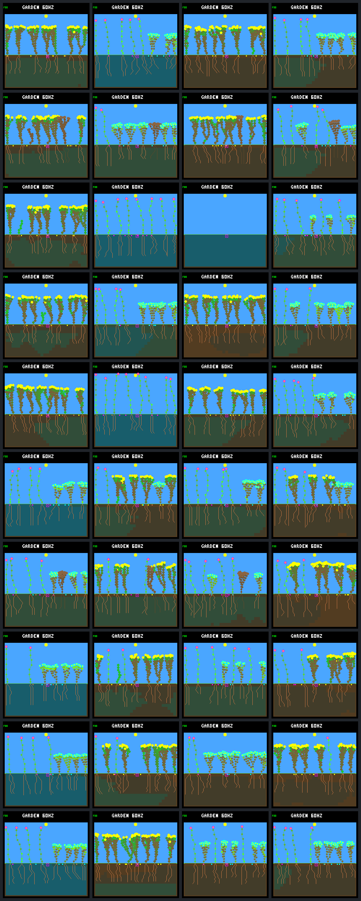

# Reserve-aware growth A/B

Protocol fixed 2026-09-12 before candidate outcomes. Follow-up to the
[drainage policy diagnostic](drainage-policy.md). No training, world-rule changes,
storage increase, firmware deployment or commit.

## Fixed candidate: energy-reserve-v1

Wrap frozen neural model `dc5e849d` after the existing night-growth veto; retain
selective leaf renewal. New host policy name: `neural-reserve-growth`. No new
observations, model weights, recurrent memory or world fields. Forecast each
remaining paid EXTEND/FINISH bid using only the existing observation:

1. Charge the ordinary species/vigor growth price. EXTEND predicts one extra
   node if any candidate is available; FINISH or blocked EXTEND predicts none.
2. Predicted upkeep `m = max(1, ceil(post-action nodes / 8))` per maintenance debit.
3. With daylight steps `D = 128 - sun_phase`, credit
   `floor(last_energy_income * (D - 1) / 2)` before sunset. The fixed one-half
   factor discounts current income; it is a heuristic, not a guarantee about
   future shade or leaves. No speculative benefit from the new tissue is credited.
4. Debit `floor((D + maintenance_phase) / 4) * m` through sunset, including the
   phase-128 debit. Projected post-sunset stores are capped at the existing 256.
5. Require post-growth actual energy to cover at least one upkeep debit, and
   projected sunset stores to cover 32 further maintenance debits through the
   next phase-zero dawn. No additional water gate, reproduction reserve or
   leaf-renewal change. The existing night veto remains first.

Reject by turning the bid into WAIT, clearing its candidate order but retaining
priority, tip identity, arbitration and proposed memory. A rejected high-priority
tip can therefore block a lower-priority affordable one. Do not also change tip
selection: this isolates an action gate. WAIT is not charged growth resources.

Limits declared in advance: forecasting aggregate daylight income before applying
the cap misses intermediate overflow; income/shading may change. The gate cannot
shrink an already oversized body. Requiring a zero-shortage night budget can
reject high-upkeep growth even in bright light when capped stores cannot cover
it; this is a conservative policy constraint, not a new world body-size limit.
Existing stress tolerance can make excluded bodies viable. FINISH costs energy
but does not add upkeep, and may still be rejected. Establishment, flowering and
reproduction could suffer; these are required outcomes, not tuning opportunities.

## Panel and checks

Same two rainfed world seeds (`b61837dc`, `9c530b07`), five schedules, 512 nodes,
both drainage settings and unchanged 192-day horizon. Compare original neural
night-veto policy against the reserve-wrapped neural policy: 40 runs, not 40
independent seeds. Preserve all cases/native final screenshots, including empty
or stagnant worlds. No retuning within this trial.

Original neural analyses must exactly match the frozen drainage baseline. Each
case gets independent day-64/128/192 replay checks. Compare closing 32-day and
post-day-16 eligible/full-day survivors, durable parents, extinction, births,
families/species/traits and soil stock. Recent births remain censored.

Full focal `b61837dc/fresh-2` traces under all four combinations through day 128
must agree with sparse daily hashes. Log inputs/forecast terms and pre-gate bids;
independently recompute the rule in Python, validate winning priorities, live
resource spending and natural terminal-step exclusions. Boundary tests cover
exact affordability, one-below, upkeep step changes, FINISH/no-space EXTEND,
vigor/species prices, sunset, storage clipping, input immutability and failures.
Freeze source, binaries, commands, inputs and all results in a completed manifest.

## Reproduction

Rebuild the existing 512-node off/on drainage configurations, then run:

```sh
docker compose run --rm firmware cmake --build artifacts/build-host-leaves-512
docker compose run --rm firmware cmake --build artifacts/build-host-drainage-512
python3 sim/garden_policy_diagnostic.py \
  --baseline artifacts/garden-bottom-drainage-512 \
  --off-build artifacts/build-host-leaves-512 \
  --on-build artifacts/build-host-drainage-512 \
  --reference reserve --output artifacts/garden-reserve-growth --jobs 4
```

Use a new output directory. The collector defaults to the prior adaptive
comparison unless `--reference reserve` is explicit; its manifest records the
reference policy. Both compared policies use the same frozen model here.

## Results — 2026-09-12

All 40 fixed runs completed. The gate prevents the previously observed extinction
and improves the fraction of offspring surviving a full day in both drainage
settings. It also reduces births, does not improve every case, and leaves the
undisturbed controls without late newborns. This is a useful growth-policy
diagnostic, not a qualified controller or evidence of self-sustaining ecology.

### Focused panel

Each row below aggregates eight disturbed runs: two already-examined world seeds
under four schedules, not eight independent worlds. Closing cohorts are born
during days 160–192; post-establishment cohorts are born after day 16. A full-day
survivor need not remain alive at day 192. A durable parent is itself a full-day
survivor with a child that also survives a full day.

| Policy / drainage | Closing births | Closing day survivors / eligible | Closing durable parents | Post-day-16 survivors / eligible | Post-day-16 durable parents | Final living | Extinction |
| --- | ---: | ---: | ---: | ---: | ---: | ---: | ---: |
| Neural / off | 61 | 40/59 | 1 | 226/349 | 65 | 59 | 0/8 |
| Reserve / off | 37 | 31/36 | 3 | 198/230 | 67 | 62 | 0/8 |
| Neural / on | 61 | 29/60 | 1 | 280/522 | 99 | 52 | 1/8 |
| Reserve / on | 44 | 37/44 | 3 | 200/255 | 68 | 61 | 0/8 |

Recent living closing births are respectively 2, 1, 1, 0; none is scored before
its full-day boundary. No recent closing deaths occur. Closing survival fractions
rise from 67.8% to 86.1% off and 48.3% to 84.1% on. However, the off setting has
**fewer actual late survivors**, 40 to 31, and on-drainage cumulative durable
parents fall from 99 to 68. Total historical births fall 479 to 315 off and
703 to 347 on. Reduced churn is not automatically improved continuing succession.

All per-case closing survivor/eligible counts (N = original neural, R = reserve):

| Seed / schedule | N off | R off | N on | R on |
| --- | ---: | ---: | ---: | ---: |
| `b61837dc` / control | 0/3 | 0/0 | 5/7 | 0/0 |
| `b61837dc` / fresh-1 | 2/10 | 3/3 | 5/11 | 4/6 |
| `b61837dc` / fresh-2 | 8/12 | 3/3 | 0/0, extinct | 4/4 |
| `b61837dc` / fresh-3 | 5/8 | 2/2 | 8/16 | 5/6 |
| `b61837dc` / fresh-4 | 6/7 | 4/4 | 3/7 | 5/5 |
| `9c530b07` / control | 0/0 | 0/0 | 0/0 | 0/0 |
| `9c530b07` / fresh-1 | 4/5 | 5/5 | 4/12 | 6/6 |
| `9c530b07` / fresh-2 | 3/3 | 3/3 | 3/3 | 5/7 |
| `9c530b07` / fresh-3 | 6/6 | 4/6 | 4/8 | 3/5 |
| `9c530b07` / fresh-4 | 6/8 | 7/10 | 2/3 | 5/5 |

### The previously failed world

`b61837dc/fresh-2`, unchanged drainage-on world, now ends with eight living plants
and eight seeds rather than zero of each. Historical births fall 131 to 43 and
maximum generation 19 to five. Four late offspring survive a full day; none
is yet a closing durable parent. The post-day-16 cohort has 23/29 full-day
survivors and seven durable parents. This is survival plus some replacement,
not merely saving the original founders, but is not indefinite renewal.

At day 192 the reserve population comprises flowers and ground-cover, with
32–45 nodes per living plant. At the day-128 detailed checkpoint it has 36–56
nodes per plant, all eight tipless. The old neural terminal adults had 58–73
nodes. The gate changes the growth trajectory from startup, including subsequent
species/genomes; it does not rescue or shrink those already-grown old bodies.
Numerical lineage IDs across policies are not paired organisms.

The trace directly verifies that the added rule acts before night. For example,
at tick 915 (sun phase 125), founder flower 1 proposes going from 32 to 33 nodes
with 160 energy and zero current income. The proposed node crosses an upkeep
step, from four to five per debit. After the eight-energy growth price and
remaining five-energy sunset debit, predicted reserves are 147 versus 160 needed
for the following night. The gate defers that bid. This does not require the
large-body storage ceiling to activate.

Across the two reserve focal traces through day 128:

| Drainage | All audited tip bids | Added reserve vetoes | Vetoed winning bids | Vetoed EXTEND / FINISH bids | Rejected winner blocks an allowed paid alternative |
| --- | ---: | ---: | ---: | ---: | ---: |
| Off | 18,582 | 1,764 | 577 | 1,744 / 20 | 0 |
| On | 22,249 | 2,371 | 656 | 2,239 / 132 | 0 |

These are tip bids, not independent plants or all committed actions. The existing
night veto acts first; the added-veto counts exclude it. The diagnostic's older
`vetoed_bids` field counts both gates relative to raw neural proposals. No sampled
rejection here was due to nominal night upkeep exceeding 256; these trajectories
diverged earlier. Preserved priorities did not block an allowed paid alternative
in these focal traces, but that remains a possible behavior of this wrapper.

The forecast is not a guarantee: the on-reserve day-128 window still contains
28 energy-shortage-flagged living samples out of 2,048, though no water-shortage
samples. At that checkpoint all plants are tipless, so there are no growth
decisions left to veto. Automatic reproduction and leaf maintenance continue to
spend energy. There is no evidence here that every future energy shortage has
been eliminated or that either of those separate mechanisms should be changed.

### Stagnation, variety and water

Both reserve controls in each drainage setting end with eight living plants and
eight seeds, but **zero births during days 160–192**. Only one reserve-control
offspring is born after day 16 across all four controls. All final plants are
tipless, have flowers collectively, and retain active seed production histories:
each control creates 1,536 seeds over the run, of which 1,514–1,520 expire. The
closing 32-day window creates and expires 256 seeds per control, with zero
newborns. These are mature,
occupied gardens, not plants indefinitely prevented from finishing by WAIT.
That does not by itself establish which capacity/establishment mechanism prevents
late recruitment. No vacancy rule or age limit is changed in this trial.

Across disturbed worlds, mean extant family/species counts rise 1.50 to 1.625 off
and 1.375 to 2.00 on; mean living trait-combination counts rise 5.75 to 6.375 off
and 5.125 to 6.375 on. These small-panel means include the extinct baseline as
zero. Composition is not uniformly improved: `9c530b07/fresh-4/off` becomes
shrub-only, and two `b61837dc` off-reserve runs become flower-only. No coexistence
qualification follows from a higher pooled average.

Final actual soil water averages fall 37,133.5 to 33,219.125 off and 19,009 to
12,008.625 on, but some reserve worlds become much wetter. For example,
`b61837dc/fresh-2/off` rises 14,323 to 75,843 while `9c530b07/fresh-2/off` falls
74,310 to 13,274. Changed surviving bodies change uptake; lower mean soil stock
is not a policy fitness score. This experiment uses direct final cell totals,
not the saturating display summary, and does not repeat the separate stage-level
water audit for every new policy case.

### Native screenshots

All 40 day-192 host captures using the shared renderer. Columns are **neural off,
reserve off, neural on, reserve on**. First five rows: `b61837dc`; last five:
`9c530b07`. Within each seed: control, fresh-1, fresh-2, fresh-3, fresh-4. The
empty third-row/third-column baseline is deliberately retained.



## Verification and provenance

- All **93 tests** pass: 31 normal, 19 per off capacity and 12 per on capacity
  at 256/512 nodes. UBSan and strict warnings remain enabled; the new C source
  also has permanent conversion/sign-conversion warnings. Boundary tests and
  tampered-forecast/action/priority checks pass.
- All 20 baseline neural analyses exactly match the preceding frozen baseline,
  including 3,860 daily checkpoints, offspring cohorts and disturbance records.
- All 120 independent day-64/128/192 replays agree in state hash and policy/model
  identity. Forty native final frames pass their framebuffer CRC checks.
- Four full focal traces agree with every sparse daily checkpoint through day
  128 (516 checks). They validate 850,034 live-step resource balances and 50,738
  committed growth decisions; 192 natural terminal steps retain explicitly
  unaccounted erased income. All 40,831 reserve tip forecasts are independently
  recomputed from their recorded inputs.
- All 325 source fingerprints stayed fixed during collection. All 362 completed
  artifact digests were independently verified before adding these results.

Local ignored bundle: `artifacts/garden-reserve-growth`. Completed manifest SHA-256:
`fb6d4845c3fcf954dd165fabf92405818059d5c025d529588f407669ef6f7fa2`.
The manifest explicitly identifies reference policy `neural-reserve-growth`;
its generic collector kind remains `garden-drainage-policy`. The archive retains
the pre-result protocol/source snapshot, frozen model and baseline, commands,
both inspector/replayer binaries/build caches, sparse/full traces, analyses and
all frames. Model CRC remains `dc5e849d`; model SHA-256 remains
`bd9f9c6ba7f5fd17309f917972da5f759c305c077798e1d4ba9a52701e2cd48b`.

An initial collection was stopped after a separate strict compile exposed a
signed-conversion warning in the species price expression. Its partial artifacts
remain in `artifacts/garden-reserve-growth-incomplete-conversion` with an explicit
incomplete marker and no completed manifest. The fix made the subtraction
unsigned and added the permanent strict source flags; the forecast rule was not
retuned. The entire fixed panel was rerun into the clean completed bundle above.

The embedded-C conventions guided a bounded, host-only, caller-owned wrapper,
explicit failure/identity behavior and boundary/neutrality tests. No authoritative
world fields, firmware layout or neural ABI changed. The wrapper reads existing
raw observations; the NN's compressed feature encoding does not directly expose
all of those values (including exact node count and sun phase). This is a
hand-authored controller aid, not proof the current NN could learn the same rule
without a representation change. Defaults, drainage, storage, automatic
reproduction and model weights remain unchanged. No flash, model search, commit
or push was performed.

## Proposed next discussion

Keep `energy-reserve-v1` frozen and broaden its paired evaluation to the remaining
existing world panel and both node capacities before adopting it or changing
another mechanism. That tests robustness beyond the known failure and review
worlds, not untouched-test qualification. Retain births, survival denominators,
durable parents, empty/stagnant controls and visual outcomes; do not select a
winner by survival fraction alone.

Then discuss the distinction between a useful conservative controller and an
environment that permits continuing recruitment. The present result does not
justify bundling aging, pruning, reproduction or larger storage into this policy
test. The known age-counter boundary must still be fixed separately before runs
reaching 256 days. Nothing is promoted to device or training defaults yet.
