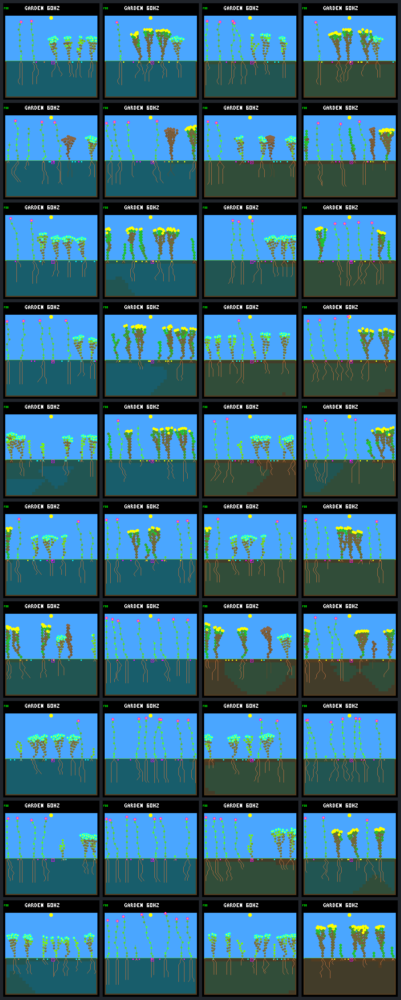
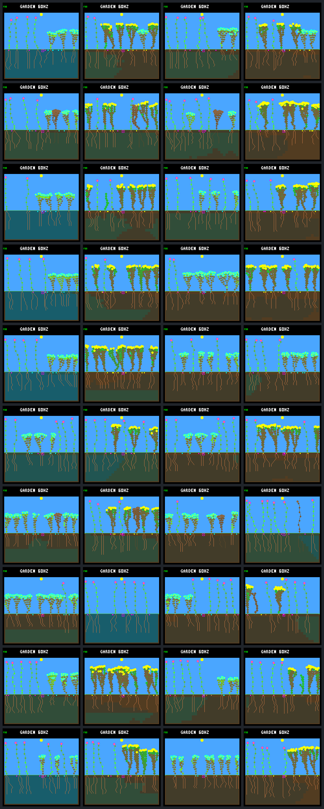

# Reserve-aware growth: full existing panel

Protocol fixed 2026-09-12 before collecting broader candidate outcomes. This
extends the [focused reserve-growth A/B](reserve-growth.md), not the controller,
world rules or training objective.

## Fixed question and scope

Does the unchanged `energy-reserve-v1` gate remain useful across the existing
seed/layout/capacity panel, including crowded gardens? Compare frozen model
`dc5e849d` with the existing night veto versus that same model/veto plus
`neural-reserve-growth`. Keep selective leaf renewal, automatic reproduction,
energy/storage limits, observations, memory, arbitration and drainage untouched.
No gardener, new weather, selected replacement seeds, policy tuning or training.

Use all eight seeds already derived from `0x6d617463`: `6f47c12c`, `7a6a1f51`,
`9c530b07`, `b61837dc`, `c7f54e18`, `c92854df`, `d08c20c0`, `e59eb9eb`.
Use both `rainfed` and `rainfed-crowded`, control and fresh-1/2/3/4 schedules,
drainage off/on, and 256/512 node capacities. Each run lasts the unchanged
192 Garden days (737,280 logic ticks). This is **640 runs / 320 matched policy
pairs**, not 640 independent seeds. The forty prior 512-node focused runs are
included and must reproduce their frozen analyses exactly. The other 600 runs
extend this policy comparison; all environments have been examined before, so
this is not unseen-world or held-out qualification. Do not extend past the known
living-plant age-counter boundary.

## Evidence fixed before outcomes

- Validate the complete 80-case drainage baseline per capacity and use its
  original scenario, seed and schedule, without retargeting empty patch hits.
- Rerun both policies. All 320 baseline-neural population analyses must match
  their frozen drainage off/on results, including every daily checkpoint and
  lifetime cohort. Recheck the previous forty focused policy analyses at 512.
- Independently replay days 64/128/192 for every run (1,920 replays). Verify
  state hashes, policy/model/drainage identities, native frame size and CRC.
- Retain all 640 final native screenshots, including empty and stagnant worlds.
  Produce a contact sheet per seed/layout, plus a fixed `9c530b07` review sheet
  covering both layouts and all five schedules at each capacity. Any subsequent
  failure close-up must be labeled post-hoc, not replace the fixed visual panel.
- Reuse the existing validated sparse birth/death/disturbance census and resource
  identities. Full per-step ledgers were collected in the focused study; do not
  claim a new full resource ledger for every broad case. Smoke tests cover full,
  sparse and native trace neutrality in both layouts and capacities.
- Report controls separately from disturbed runs. Summarize closing days
  160–192 and post-day-16 eligible offspring, full-day survivors and durable
  parents, recent-birth censoring, extinction, living/seeds, family/species/trait
  retention and actual final soil water. Include layout-specific and paired
  regressions; distinguish fractional survival from the number of survivors.
- Freeze sources, binaries, model, commands, input manifests, analyses and frames
  in completed SHA-256 bundles. Do not edit source/documents during collection.

Interpret robustness, not merely the pooled best-looking metric. New extinctions,
lost durable recruitment, control stagnation and species collapse remain adverse
outcomes even if survival fraction improves. No default is promoted automatically;
discuss results before ecology changes, training, committing or flashing.

## Reproduction

Build the existing four experimental configurations with the unchanged firmware
sources. Run once per capacity (replace every `512` below with `256` for the
other pool):

```sh
docker compose run --rm firmware cmake --build artifacts/build-host-leaves-512
docker compose run --rm firmware cmake --build artifacts/build-host-drainage-512
python3 sim/garden_policy_diagnostic.py \
  --baseline artifacts/garden-bottom-drainage-512 \
  --off-build artifacts/build-host-leaves-512 \
  --on-build artifacts/build-host-drainage-512 \
  --reference reserve --panel full \
  --output artifacts/garden-reserve-panel-512 --jobs 4
```

Output directories must be new. The default `--panel focused` keeps the previous
two-world diagnostic and detailed focal ledgers. `--panel full` uses all sixteen
seed/layout combinations, with capacity taken from the verified baseline, and
records scope/capacity/expected run count in its manifest. It retains individual
frames and all seed/layout sheets; `contact-sheet.png` is the fixed review panel,
not every broad result. Neither mode changes the policy itself.

## Results — 2026-09-12

All 640 runs completed, with all baseline/replay checks passing. The unchanged
reserve gate improves aggregate closing full-day survivor and durable-parent
counts in all four capacity/drainage combinations. It avoids the known extinction
without introducing another. This is broader evidence for a useful controller
aid, **not a universal per-world improvement or a qualified ecology**: crowded
off-drainage cases regress, earlier cohorts sometimes regress, variety is mixed,
and undisturbed controls still lack sustained recruitment.

The complete [machine-readable summary](reserve-panel-summary.json) includes
all 320 paired deltas and aggregates by layout, control/disturbance, capacity,
drainage and day 64/128/192. Recreate it from the completed local bundles using:

```sh
python3 benchmarks/garden-longevity/review-reserve-panel.py --output artifacts/reserve-panel-review.json
```

The reviewer verifies both manifests/artifact sets, checks the prior forty
focused analyses, and independently compares 120 aggregated baseline cohorts
against the old drainage summaries. It refuses an existing output file. It is
post-collection analysis, not a simulation or a training-selection procedure.

### Closing offspring and survival

Each row below represents 64 disturbed runs, reusing eight seeds in two layouts
under four schedules. Closing offspring are born during days 160–192. Eligible
offspring have a full day of possible follow-up; survivors live past that first
day boundary, not necessarily until day 192. Durable parents also have a child
that survives a full day. None of these counts alone measures indefinite renewal.

| Nodes / drainage / policy | Closing births | Day survivors / eligible | Durable parents | Final living | Extinctions |
| --- | ---: | ---: | ---: | ---: | ---: |
| 256 / off / neural | 245 | 224/232 | 12 | 426 | 0/64 |
| 256 / off / reserve | 243 | 228/229 | 14 | 437 | 0/64 |
| 256 / on / neural | 270 | 225/254 | 14 | 427 | 0/64 |
| 256 / on / reserve | 274 | 246/259 | 21 | 439 | 0/64 |
| 512 / off / neural | 435 | 281/420 | 20 | 480 | 0/64 |
| 512 / off / reserve | 362 | 289/353 | 24 | 482 | 0/64 |
| 512 / on / neural | 445 | 268/429 | 15 | 469 | 1/64 |
| 512 / on / reserve | 411 | 284/400 | 26 | 469 | 0/64 |

Pooled closing survival fractions rise 96.6% → 99.6%, 88.6% → 95.0%,
66.9% → 81.9%, and 62.5% → 71.0% respectively. Actual survivor gains are much
smaller: +4, +21, +8, +16. At 512, fewer births contribute substantially to the
higher fraction. Total historical disturbed births also fall: 1,973 → 1,820
and 2,161 → 1,979 at 256 off/on, and 3,234 → 2,568 and 3,689 → 3,006 at 512.
Do not equate either higher fractions or lower churn with universal success.

Recent closing births remain outside the eligible denominator. Neural → reserve
recent living counts are 13 → 14 and 16 → 15 at 256 off/on, and 14 → 9 and
13 → 10 at 512. Recent dead counts are zero at 256, and 1 → 0 and 3 → 1 at 512.

The previous `512/rainfed/b61837dc/fresh-2/on` failure reproduces exactly: baseline
first daily extinction at day 120, versus reserve ending with eight living
plants/eight seeds and four late full-day survivors. There are **zero reserve
extinctions in all 320 reserve runs**, including controls. Final total living
at 512/on nevertheless stays 469: gains in some worlds coexist with losses in
others. All forty focused cases match the preceding study; the broader result
does not replace or contradict its adverse cases.

### Layout effects and paired regressions

The aggregate gains are not evenly distributed. Each entry below is neural →
reserve closing full-day survivor count, with 32 disturbed runs per entry.

| Nodes / drainage | Standard rainfed | Crowded rainfed |
| --- | ---: | ---: |
| 256 / off | 107 → 123 | **117 → 105** |
| 256 / on | 115 → 124 | 110 → 122 |
| 512 / off | 129 → 146 | **152 → 143** |
| 512 / on | 131 → 145 | 137 → 139 |

Crowded/off closing durable parents change 6 → 7 at 256, but 11 → 10 at 512.
The latter is a regression in both late survivor and durable-parent counts.

Per-pair lower / unchanged / higher counts, comparing reserve against neural:

| Nodes / drainage | Closing day survivors | Closing durable parents | Extant species |
| --- | ---: | ---: | ---: |
| 256 / off | 27 / 9 / 28 | 8 / 46 / 10 | 16 / 33 / 15 |
| 256 / on | 23 / 13 / 28 | 8 / 47 / 9 | 16 / 35 / 13 |
| 512 / off | 25 / 13 / 26 | 11 / 38 / 15 | 12 / 40 / 12 |
| 512 / on | 26 / 14 / 24 | 12 / 34 / 18 | 13 / 36 / 15 |

The on/512 pooled survivor gain occurs despite more pairs declining than
improving. Schedule replicas within a seed/layout are correlated; no statistical
significance or new independent-seed claim is made from these counts.

A post-hoc regression example, **256/crowded/b61837dc/fresh-4/off**, ends with:

- Neural: eight plants, 256 nodes, eight seeds; closing 7/8 full-day survivors,
  one durable parent; post-day-16 25/27 survivors and eleven durable parents.
- Reserve: five plants, 256 nodes, eight seeds; closing 1/1 survivor, no durable
  parent; post-day-16 21/21 survivors and eight durable parents.

The reserve bodies have 36–64 nodes and high final stores (203–250 energy,
486–507 water). Its three spare plant slots do not imply spare node capacity.
The baseline has several small 10–15-node plants alongside larger ones. Both
retain two species, but not the same species/families. This is not a controlled
rescue/comparison of the same individual organisms; trajectories and inheritance
diverge from startup. High final stores and a full pool suggest a recruitment/
capacity question, **not proof of the cause of missing earlier births**. A seed-site
counterfactual census is needed before changing spacing, body sizes or mortality.

The largest 512/off survivor decline is the same crowded seed under fresh-1:
13 → 5 late survivors, while final living remains seven in both policies.
Thus final population alone would miss that regression too.

### Earlier and cumulative cohorts

The endpoint does not dominate every earlier window. These are preceding 32-day
full-day survivors/eligible at each checkpoint, neural → reserve:

| Nodes / drainage | Ending day 64 | Ending day 128 |
| --- | ---: | ---: |
| 256 / off | 180/188 → 213/221 | 244/265 → 232/242 |
| 256 / on | 192/213 → 199/213 | 236/260 → 258/267 |
| 512 / off | 298/403 → 261/329 | 322/477 → 320/388 |
| 512 / on | 265/474 → 277/413 | 294/515 → 316/428 |

Across all post-day-16 offspring through day 192:

| Nodes / drainage | Day survivors / eligible, neural → reserve | Durable parents, neural → reserve |
| --- | ---: | ---: |
| 256 / off | 1,320/1,404 → 1,426/1,474 | 437 → 499 |
| 256 / on | 1,378/1,533 → 1,458/1,564 | 469 → 509 |
| 512 / off | 1,751/2,495 → 1,689/2,083 | 546 → 571 |
| 512 / on | 1,661/2,833 → 1,751/2,483 | 576 → 621 |

All four cumulative durable-parent totals rise, but cumulative survivor count
falls in the 512/off setting. The focused study's on-drainage durable-parent
regression remains true for its selected two worlds; it does not generalize to
the full panel's aggregate. This is why broadening a fixed rule mattered.

### Controls, variety and water

Controls are sixteen seed/layout combinations per capacity/drainage/policy,
without patch disturbance. None goes extinct. At 256, **neither policy produces
any closing offspring**, and all controls finish at exactly 256 nodes. Reserve
controls still create/expire 4,095 seeds off and 4,063 on in the closing window;
each of the sixteen gardens produces seeds. Missing newborns are not equivalent
to absent reproductive activity.

At 512, neural → reserve closing births are 4 → 10 off and 9 → 10 on, while
full-day survivors remain 1 → 1 and 6 → 6. Only two of sixteen worlds produce
closing offspring in each setting/policy, and none has a closing durable parent.
Reserve controls produce 4,097/4,103 closing seeds off/on; many more seeds expire
than establish. One off-reserve crowded control produces nine late newborns and
zero full-day survivors. The broad controls therefore remain largely stagnant,
not uniformly sterile and not demonstrated to renew indefinitely.

Extant counts include living plants and seed banks; trait combinations count
living plants only. Disturbed means below are neural → reserve:

| Nodes / drainage | Families | Species | Living trait combinations | Single-species worlds |
| --- | ---: | ---: | ---: | ---: |
| 256 / off | 1.578 → 1.719 | 1.516 → 1.500 | 5.594 → 5.625 | 31 → 33 |
| 256 / on | 1.750 → 1.797 | 1.656 → 1.625 | 5.641 → 5.563 | 22 → 27 |
| 512 / off | 1.781 → 1.891 | 1.672 → 1.688 | 6.141 → 6.406 | 22 → 23 |
| 512 / on | 1.766 → 1.813 | 1.594 → 1.641 | 5.828 → 6.078 | 24 → 24 |

More families need not mean more species: crowded starts include multiple
families of the same species. The 256 cases retain more families on average but
lose some species variety. The extinct baseline contributes zero to its mean,
not to the single-species category. No coexistence qualification follows.

Mean final actual soil water changes 58,603 → 60,384 and 22,329 → 25,384 at
256 off/on, and 30,058 → 25,077 and 16,944 → 11,385 at 512. These are cell-stock
totals, not the saturating display summary or a new water-balance ledger. Better
aggregate survival can accompany wetter or drier soil; uptake changes with the
surviving bodies. Do not optimize this scalar as a substitute for viability.

### Fixed native visual review

Both sheets use `9c530b07` at day 192. First five rows: standard rainfed; next
five: crowded rainfed. Within each layout: control, fresh-1, fresh-2, fresh-3,
fresh-4. Columns: **neural off, reserve off, neural on, reserve on**. These fixed
panels were visually inspected; all 640 individual frames and 32 seed/layout
sheets remain in the bundles for further review. The known empty baseline is
retained in its own `b61837dc` sheet, not substituted into this fixed panel.





## Verification and provenance

- **98/98 tests passed**: 32 normal, 20 per off capacity, thirteen per on capacity.
  New panel tests reject missing/duplicate cases, bad identities, wrong horizons,
  capacities and rules; grouping tests keep layouts and policy columns distinct.
  Reserve smoke coverage now includes both layouts, full/sparse/native agreement
  and malformed-forecast checks at both capacities and drainage settings.
- All 320 baseline neural analyses exactly reproduce the old drainage analyses,
  including 61,760 daily checkpoints. All forty previous focused policy analyses
  also reproduce exactly. The review's 120 baseline aggregate cohort checks pass.
- All 1,920 independent day-64/128/192 replays match state hashes and explicit
  model/policy/layout/seed/tick/capacity/drainage/leaf identities. All 640 native
  final framebuffer size/CRC checks pass.
- All 328 source fingerprints remain unchanged throughout both collections;
  all 5,500 completed bundle artifacts were independently verified. The 108 C/
  header sources also match the prior focused study: no policy/world/renderer
  implementation changed for this broader test. Only the Python collection/
  coverage and CMake test registration changed before collection.
- There are no new full-step broad resource ledgers. Those mechanistic checks
  belong to the preceding focused experiment; this study validates the sparse
  lifetime/population census, boundaries and independent replays. Do not extend
  the earlier causal finding automatically to every broad regression.

Completed ignored bundles, each with 2,750 artifacts:

- `artifacts/garden-reserve-panel-256`, manifest SHA-256
  `e746aa7148173b31764d783efde781190206aaf4dac26bcf515c9a6da5f15c3e`.
- `artifacts/garden-reserve-panel-512`, manifest SHA-256
  `e7602b5037b36b54c268671ed30bd71682b6b0dc6ea72f75c0f6042661115182`.

The archives retain the pre-result protocol/source snapshot, frozen input
manifests/analyses, model, binaries/build caches, commands, all traces/analyses,
native frames and gallery metadata. This results section, review helper, exported
summary and repo image copies were added **after** collection. Model CRC remains
`dc5e849d`; its SHA-256 and `energy-reserve-v1` rule are unchanged from the focused
report. No failed broad run was discarded, no rule was retuned, and no model was
trained or firmware flashed. Work remains uncommitted; defaults are unchanged.

## Proposed next discussion

Keep this as a useful **experimental reference controller**, not a mandatory
world rule. Before another heuristic or training run, reuse the existing
seed-site competition diagnostic on the crowded/off regressions with both
policies. Separate seed supply, node capacity, spacing, shade and water blockers,
and inspect how opportunities change after the identical disturbances. Include
a matched successful case instead of treating one bad final screenshot as proof.

That directly tests whether more conservative individual survival is displacing
recruitment, without prematurely installing aging, pruning, larger storage or a
different body-size limit. Agree on the intended turnover/variety objective
before promoting a policy. The known age-counter boundary still needs a separate
fix before runs reaching 256 days; this study stops at 192.
