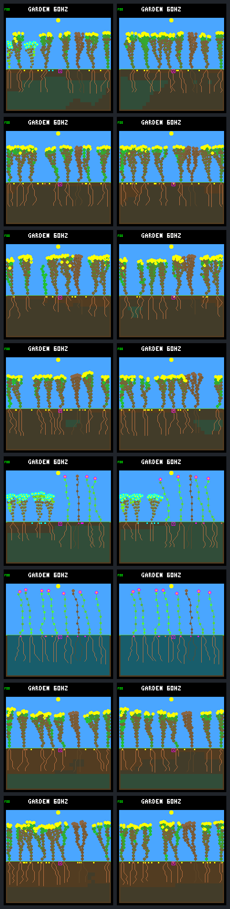

# Early wet-root investment: substantial improvement, not a universal policy

The approved [predeclared experiment](root-bootstrap-protocol.md) confirms that
the [surface-root/shoot-spending failure](seedling-water.md) is often avoidable
at ordinary resource prices. First-day deaths involving water shortage fall
**33 → 3** across the eight paired worlds, and closing natural deaths **62 → 24**.
The targeted sixteen-bank reserve case changes water deaths **7 → 0**, natural
deaths **8 → 2**, and sixteen-day survivors **4/10 → 5/8**.

Keep this **host-only and opt-in**. One already water-successful case has worse
early energy survival; three seedlings still die thirsty after growing roots.
This demonstrates a useful allocation opportunity for a controller to learn,
not a validated universal root-first rule or a reason to change rainfall.

## First verify the missing bids

Before implementing the intervention, four frozen gate-on worlds were replayed:
c7f54e18/reserve/16, b61837dc/baseline/8 and /16, and b61837dc/reserve/16. All
196,612 ordinary world rows and 120 patch boundaries match exactly. The observer
retains 6,096 first-day decisions from all 67 closing offspring, not just deaths.

All 27 first-day water-involved failures in those four worlds have at least one
shoot purchase that beats an available root EXTEND bid into soil holding at
least five water. Together they make 213 such purchases. This is actual candidate
telemetry at decision time, not an inference from post-step root-cell moisture.

In target lineage 65, the birth-step shoot priority is 32; roots score 20 and 16.
Their unblocked destinations contain 21–23 water and the plant can afford the
ordinary growth price. Each of its seven shoot purchases beats a wet root
extension. None of those root bids is blocked by the energy reserve guard.

## What the probe changes

The host inspector and native replayer accept `--root-bootstrap-after 614400`.
All eight previous **seed-reserve-on** worlds are compared with the root probe
disabled/enabled. The seed energy gate stays on in both arms; this is not another
comparison of that gate.

Only offspring born strictly after day 160 qualify. During their first day,
while they still have exactly their two depth-one surface roots, an already
approved root EXTEND can be prioritized into wetter, unblocked deeper soil.
The destination must hold at least the species' ordinary growth water price.
The wettest eligible candidate moves first; ties preserve existing order. The
bid gets maximum priority, with ordinary inter-tip tie handling.

Existing night/energy WAIT or FINISH decisions are never converted to EXTEND.
No water, energy, capacity, weather, growth timing, seed or leaf rule changes.
The chosen base bid's memory update is retained. After the first successful
extension the plant has three roots and the override stops. Founders and
pre-window offspring remain outside the intervention. World-state mutation
continues exclusively through the existing growth path.

All 62 probe-on closing offspring receive one successful boosted root extension
in this panel; the conditions are not selective enough here to distinguish the
seedlings that actually need it. This is an important limitation for promotion.

## Paired results, including the regression

Days (160,192], arrows root probe **off → on**. “Baseline” below means the frozen
neural no-night-growth policy; “reserve” additionally applies energy-aware growth.
Both retain selective leaf maintenance, 512 nodes and the seed energy gate.
One-day and longer survival are strictly beyond the age boundary, with eligible
denominators. The off b61837dc/reserve/8 cohort has one horizon-censored offspring.

| World / growth / bank | Births | First-day water deaths¹ | Natural deaths² | One-day survivors | Eight-day survivors | Sixteen-day survivors |
|---|---:|---:|---:|---:|---:|---:|
| b61837dc / baseline / 8 | 22 → 11 | 8 → 0 | 19 → 5 | 6/22 → 8/11 | 2/21 → 5/9 | 1/11 → 2/5 |
| b61837dc / baseline / 16 | 16 → 9 | 8 → 1 | 11 → 6 | 8/16 → 7/9 | 5/15 → 6/9 | 3/14 → 5/9 |
| b61837dc / reserve / 8 | 12 → 6 | 4 → 1 | 7 → 1 | 6/11 → 4/6 | 5/10 → 3/5 | 3/9 → 3/5 |
| b61837dc / reserve / 16 | 13 → 10 | 4 → 1 | 8 → 5 | 9/13 → 8/10 | 6/12 → 7/9 | 3/9 → 4/8 |
| c7f54e18 / baseline / 8 | 7 → 7 | 0 → 0 | 2 → 2 | 6/7 → 5/7 | 3/6 → 3/6 | 1/4 → 1/5 |
| c7f54e18 / baseline / 16 | 6 → 6 | 0 → 0 | 1 → 1 | 5/6 → 5/6 | 4/5 → 4/5 | 0/3 → 0/3 |
| c7f54e18 / reserve / 8 | 9 → 4 | 2 → 0 | 6 → 2 | 7/9 → 4/4 | 3/7 → 2/3 | 1/4 → 1/2 |
| c7f54e18 / reserve / 16 | 16 → 9 | 7 → 0 | 8 → 2 | 8/16 → 8/9 | 5/13 → 7/9 | 4/10 → 5/8 |

¹ Includes the one off-arm mixed energy/water death. ² Includes adults and
offspring dying naturally during the closing window; excludes fixed patches.

Pooled eligible one-day survival is 55/100 → 49/62; eight-day is 33/89 → 37/55;
sixteen-day is 16/64 → 21/45. Fewer births mean the absolute one-day survivor
count falls even while the fraction improves. These are descriptive totals from
a small repeatedly inspected panel, not exposure-adjusted hazards, independent
replications or held-out evidence. Descendants, shading and resource competition
diverge after the intervention; equal lineage numbers need not identify matched
offspring. The compact export retains all cohort ages and full window counters.

### Targeted case in detail

Mean living plants increases 7.396 → 7.658; seed production stays similar,
518 → 515, while births fall 16 → 9. Both end with seven living plants. The
improvement is persistence and reduced churn, not a larger final population.

The very first intervention changes lineage 65's birth at tick 617805. Its
initial state is matched because every earlier row is identical. Instead of
dying thirsty at age 0.207 days, it reaches its first day with 512 stored water,
produces five seeds and survives 4.590 days until the predetermined patch kills
it. This is a concrete recovery, not immortality or a shifted terminal metric.

Two natural deaths remain: seedling 66 dies from energy shortage, and an older
pre-window adult, 62, also dies from energy shortage. The latter was never
directly overridden; coupled changes can affect existing neighbors. Do not claim
that all later effects are confined to boosted offspring.

### Remaining thirst and energy costs

The three on-arm first-day water failures are b61837dc/baseline/16 lineage 92,
reserve/8 lineage 66 and reserve/16 lineage 68. They make respectively one, two
and four total root extensions. Lineage 92 makes its boosted root at birth, then
nine shoots: **24 initial + 38 uptake − 50 growth − 12 paid upkeep = 0 water**.
It still has 239 energy. Early access is not a substitute for continuing to
balance root growth, shoot growth and available supply.

The adverse c7f54e18/baseline/8 case had no first-day water failure to fix. Its
one-day survival declines 6/7 → 5/7 and mean living plants 7.813 → 7.798; natural
deaths remain two. The matched first affected flower, lineage 38, dies from
energy shortage in both arms, but 600 logic ticks earlier with the probe.
Through its last live step, energy growth spending rises 225 → 270, while
income is 244 → 252. More water access can enable more energy spending; it does
not guarantee a better night reserve. Its later descendant comparison is not
matched, so the extra early death cannot be attributed to one isolated debit.

## Native visual review

Left: probe off, copied from the verified frozen day-192 frame. Right: probe on,
new native replay. Rows follow the table. All eight new frames match their
inspector world hashes, model/configuration identity, counters and RGB565 CRCs.
The full sheet was visually reviewed. Lower regions show changes in root
geometry, but these are still single snapshots, not evidence of motion,
coexistence or indefinitely healthy bodies.



## Implementation and verification

The embedded-C skill guided a bounded host-only wrapper, explicit context
lifetime, unchanged world ownership, stable candidate ordering, error handling
and boundary tests. No `src/` C/header file changes in this experiment; no
firmware/default policy or model is promoted. The wrapper is not exposed to
training. Inspector/replayer options reject unsupported combinations, and shared
trace analyzers reject the new identity unless explicitly opted in.

All **76 CTests pass**: default 38, experimental bank-eight 19, bank-sixteen 19.
Coverage includes affordability boundaries, disabled/before-window/founder/old
offspring cases, depth/root count, dry and blocked candidates, tie ordering,
existing WAIT/FINISH, invalid permutations, callback failure, initialized public
dispatcher errors, CLI rejection and compile-time firmware exclusion. An initial
test wrongly expected the public dispatcher to preserve error output; it was
corrected to verify its existing empty-decision contract separately from callback
output preservation. The rule was not changed or tuned after outcome collection.

The paired collection checks:

- 786,448 native world rows; all eight fresh disabled controls exactly match
  the previous complete histories, boundaries and analyses.
- Identical prefixes until each first changed winning bid. First authoritative
  hash differences coincide with those first overrides in all eight cases.
- 145,595 closing offered bids independently checked in the enabled arms,
  including 124 changed offers and 62 successful, once-per-lineage root boosts.
- 5,584,669 full-world live budgets and 32,094 closing first-day live budgets.
  Terminal clearing and fixed-patch deaths remain distinct.
- All age/censoring ledgers and eight newly rendered frames. Off frames are
  verified reuse, not eight additional fresh renders.

The collector checks offered bids while reading native output. It retains
committed override details and full world/first-day ledgers, not every temporary
offered bid. Repeating the complete offered-bid check requires replaying the
recorded native commands. The separate observational bundle does retain its
selected seedlings' full offered bids.

```sh
python3 sim/garden_root_bids.py --output artifacts/garden-root-bids-new
python3 sim/garden_root_bootstrap.py --output artifacts/garden-root-bootstrap-new
python3 benchmarks/garden-longevity/review-root-bootstrap.py
# Optional: recompute full resource/lifetime and first-day ledgers, no native rerun.
python3 benchmarks/garden-longevity/review-root-bootstrap.py --reanalyze
```

Collectors require the specified frozen baseline and appropriate built binaries,
refuse existing outputs and verify source stability. The observational collector
uses frozen binaries; the A/B collector uses the rebuilt
`artifacts/seed-reserve-build-on-{8,16}` configurations, with runtime probe off/on.
The reviewer verified 114 A/B output artifacts, 19 observational output artifacts
and their frozen inputs; optional full reanalysis is provided, not claimed as a
second execution of all ledgers.

- [Compact summary](root-bootstrap-summary.json) and [protocol](root-bootstrap-protocol.md).
- A/B bundle: `artifacts/garden-root-bootstrap`, 385 source fingerprints.
- A/B manifest SHA-256: `aaf2ebd117045b817822394126c196dae49c0f6f749d684f48003f00f01ab7e8`.
- Observational bundle: `artifacts/garden-root-bids`.
- Observational manifest SHA-256: `36ebd1627c059b6bf7368545d1b6e48f5bbaf97a758aea7b18e21853a2f6c6bb`.
- Input manifest SHA-256: `a4696431b029146d12f241161a7eb53a36b85d71a2efb1351df63ba30a429654`.

## Next discussion

The mechanics offer a usable survival strategy without more water or bigger
reserves. Next separate **when root investment pays** from when it merely enables
overgrowth: preserve these successes, the three remaining water failures and the
energy regression as a small allocation challenge suite. Before another rule or
training run, agree how a learned controller should be evaluated on continuing
resource allocation and first-night survival. Do not automatically ship this
blanket bootstrap, broaden the neural contract or optimize only death counts.
