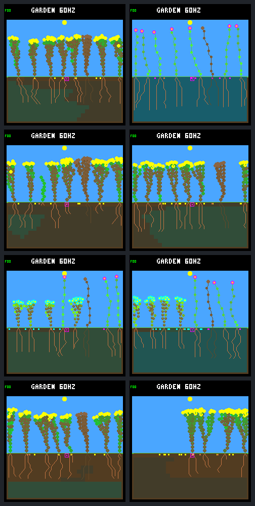

# Eight versus sixteen seeds: more turnover, with important tradeoffs

The [predeclared capacity experiment](seed-bank-protocol.md) is complete. The
16-slot bank raises closing-window day-survivors in three of four pairs, but
one pair regresses substantially and the strongest increase comes with much
more natural mortality. **Keep it experimental; do not promote it as a general
ecology improvement.** No model training or firmware change was made.
Progress is recorded on [issue #30](https://github.com/aortez/toy-factory/issues/30#issuecomment-5649958447).

## Comparison

Only maximum ungerminated seeds changes, 8 → 16. Both sides retain eight plant
bodies, 512 nodes, the frozen `dc5e849d` NN, wide dispersal, water headroom,
selective leaf maintenance, no drainage, and the same fresh-1 disturbance
schedule. Seed cost, dispersal, dormancy, lifetime, placement, germination
requirements and policies are unchanged. No gardener or retargeted patch hits.

Two fixed crowded worlds × two policies × two bank capacities = eight runs.
Each lasts 192 Garden days (737280 logic ticks); the closing window is days
160–192 (8192 ecology steps). These are previously examined diagnostic cases,
not untouched qualification seeds. “Baseline” below means the frozen NN plus
night-growth veto; “reserve” adds the existing `energy-reserve-v1` growth gate.

Every pair has an identical ordinary-state prefix until the first extra bank
slot is used. First different ticks are 11940, 7860, 3900 and 4020 in table
order; seed counts there are 8 → 9, 8 → 10, 8 → 9 and 8 → 9. Thereafter, extra
parental spending and RNG draws legitimately change subsequent trajectories.
This is not a counterfactual that merely places extra seeds into an unchanged
late garden. The production step, NN, reserve controller and renderer sources
remain byte-identical to the preceding observer experiment.

## Offspring and mortality

Arrows always mean **8 slots → 16 slots**, not baseline → reserve policy.
“Day survivors” requires a complete Garden day after birth; the denominator
excludes births too recent for complete follow-up. “Durable” counts those
closing-born survivors with a child that also survives a complete day by the
horizon. It does not mean indefinite survival.

| World / policy | Closing births | Day survivors / eligible | Durable | Natural deaths | Final living |
|---|---:|---:|---:|---:|---:|
| b61837dc / baseline | 17 → 8 | 13/17 → 4/8 | 3 → 0 | 13 → 4 | 7 → 7 |
| b61837dc / reserve | 11 → 7 | 5/10 → 6/7 | 0 → 1 | 5 → 2 | 7 → 7 |
| c7f54e18 / baseline | 3 → 5 | 3/3 → 4/5 | 0 → 0 | 0 → 1 | 7 → 7 |
| c7f54e18 / reserve | 9 → 38 | 7/9 → 33/38 | 0 → 16 | 6 → 37 | 7 → 4 |

The recent eight-slot b61837dc/reserve offspring is alive at the horizon but
not yet eligible. Natural deaths count all living cohorts during the closing
window, not only the offspring in the survival columns. Patch-caused deaths
are separate: 4 → 5, 6 → 5, 4 → 5 and 4 → 4, respectively. Each closing window
has the same six scheduled patches; occupancy changes which ones hit plants.

Pooled day-survivors rise 28 → 47 and durable counts 3 → 17, but the last pair
dominates those gains. Pooled natural deaths also rise 24 → 44. Whole-run
day-survivors in table order are 61 → 35, 40 → 38, 31 → 36 and 29 → 105;
whole-run durable counts are 18 → 15, 13 → 16, 16 → 18 and 9 → 53. Neither
pooling nor a single attractive endpoint captures the full tradeoff.

## Is the extra bank being used?

“Open steps” has at least one hypothetical mature-seed location eligible just
before germination. “Unused” means no seed germinates that step. These are
repeated samples of openings, **not independent vacancies or probabilities**.
All eligible actual seeds germinate, and no mature closing check is node-blocked
in any run. Seed and plant positions still matter after removing memory pressure.

| World / policy | Mean bank occupancy | Bank full, % of steps | Open steps | Unused open steps | Seeds produced / expired |
|---|---:|---:|---:|---:|---:|
| b61837dc / baseline | 7.98 → 7.45 | 98.73 → 0.00 | 675 → 993 | 658 → 985 | 265/248 → 244/238 |
| b61837dc / reserve | 7.99 → 15.98 | 98.82 → 98.19 | 273 → 121 | 262 → 114 | 262/251 → 513/506 |
| c7f54e18 / baseline | 8.00 → 15.99 | 99.77 → 99.02 | 3 → 690 | 0 → 685 | 256/253 → 516/511 |
| c7f54e18 / reserve | 7.99 → 14.30 | 98.85 → 52.97 | 27 → 529 | 18 → 492 | 260/251 → 469/434 |

Produced/expired are events during the window, not a single seed-created cohort.
The final pair has 38 births in 37 successful steps. Detailed phase-separated
attempt counts, complete seed cohorts and resource totals are in the
[exported summary](seed-bank-summary.json).

The first larger-bank run ends with seven flowers instead of seven shrubs.
It does **not** maintain twice as many late seeds: the bank averages only 7.45
and never reaches 16 during the closing window. Adults have much less stress,
but offspring turnover is lower. The other three larger-bank runs produce
roughly twice as many seeds; many still expire at unusable locations.

## Parental resource costs and the high-turnover case

Reproduction still costs 48 energy and 24 water per seed. Actual closing totals:

| World / policy | Parent seed energy | Parent seed water | Mean living plants | Stressed living samples, % |
|---|---:|---:|---:|---:|
| b61837dc / baseline | 12720 → 11712 | 6360 → 5856 | 6.59 → 7.62 | 12.80 → 0.18 |
| b61837dc / reserve | 12576 → 24624 | 6288 → 12312 | 7.15 → 7.74 | 12.36 → 1.12 |
| c7f54e18 / baseline | 12288 → 24768 | 6144 → 12384 | 7.96 → 7.65 | 0.80 → 2.08 |
| c7f54e18 / reserve | 12480 → 22512 | 6240 → 11256 | 7.70 → 5.86 | 9.22 → 9.48 |

These are live-step budget reconciliations. Cleared terminal-step income is not
invented or counted as an exactly reconstructed metabolic debit.

The last pair is genuinely more generationally active: 33 full-day survivors,
16 durable new parents, and 105 whole-run day-survivors. But it is not simply
healthier. There are 37 natural deaths, versus six; mean occupancy falls, and
the final plot has four living shrubs. Of those 37 deaths, 31 carry the energy
shortage flag and six the water shortage flag. These are observed terminal flags,
not proof that the extra seed debit alone caused the deaths. Mean water held
per living-plant sample falls from 499.4 to 406.0. Changed bodies, roots, seed
spending, ages and crowding all follow the changed early history.

The data support an interaction between bank size, controller and population
history. They do not isolate seed coverage as the sole cause or establish a
universal optimum capacity.

## Native visual review

All panels use the native RGB565 renderer at 240×240, with independent replay
hash and framebuffer CRC checks. Left: eight seeds. Right: sixteen. Rows follow
the tables above. Capture does not change the simulated world.



[Day 64 panel](seed-bank-64.png) · [Day 128 panel](seed-bank-128.png).
The first pair's flower/shrub divergence and the last pair's large final gap
are visible. These snapshots do not show motion or establish long-term health.

## Implementation, verification and reproduction

`TOY_FACTORY_GARDEN_LARGE_SEED_BANK=ON` is an explicitly guarded host-only
option, requiring the undrained 512-node maintenance experiment. Normal and
Zephyr builds keep eight seeds. The embedded-C conventions guided bounded
array ownership, shared capacities, last-slot/overflow/expiry tests and explicit
experiment identity. No new heap allocation, model features or runtime switches
in the simulation.

Each host Garden world grows 7636 → 7796 bytes (**+160**); each Garden render
payload grows 3926 → 3942 bytes (**+16**). The host-only seed audit buffer also
scales with its compile-time bound. These are structure sizes, not a device RAM
budget or total process memory estimate. No hardware timing qualification.

All **130 CTests pass**: default 33; leaf 256/512 25 each; drainage 256/512 16
each; new 16-bank build 15. UBSan and strict warnings are enabled. Last-slot
hash/render participation, one-past-capacity rejection, full-bank expiry,
sequential seed visits, native ledgers, invalid identities and truncated input
are covered. Initial setup tests exposed a mismatched Release/NDEBUG build and
incomplete hand-built parent/leaf fixtures; these were corrected before the
recorded experiment, without changing ecology. The eight-seed-specific ecology
smokes are not silently applied to the 16-seed variant.

The complete bundle is `artifacts/garden-seed-bank` (ignored, local), with 153
recorded artifacts and 352 frozen source fingerprints. Its manifest SHA-256:

`0feca7b8584012cfa384e9a5fde197bc8ed8ddec3c1f10a1a254b4828815e7ff`

Verification includes 393224 world/site checkpoint pairs, 65544 exact-attempt
checkpoint comparisons, 240 scheduled patch records per inspection/attempt
stream set, 24 independent native frame replays, exact frozen eight-seed
world/site/boundary/final-frame equality, and four validated divergence prefixes.
Raw traces, seed lifetimes, lineage/resource ledgers, binaries, model, build
caches, source archive, commands, protocol and frames are retained.

The 16-bank build uses the existing builder; match the baseline's assertion-enabled
configuration rather than silently selecting a different optimization mode:

```sh
docker compose run --rm firmware cmake -S sim -B artifacts/build-host-seed-bank-16 \
  -DCMAKE_BUILD_TYPE= -DTOY_FACTORY_SIMULATOR_SANITIZERS=ON \
  -DTOY_FACTORY_GARDEN_WIDE_DISPERSAL=ON -DTOY_FACTORY_GARDEN_WATER_HEADROOM=ON \
  -DTOY_FACTORY_GARDEN_COMBINED_EXPERIMENT=ON -DTOY_FACTORY_GARDEN_LARGE_POOL=ON \
  -DTOY_FACTORY_GARDEN_LEAF_MAINTENANCE=ON -DTOY_FACTORY_GARDEN_LARGE_SEED_BANK=ON
docker compose run --rm firmware cmake --build artifacts/build-host-seed-bank-16 -j 8
docker compose run --rm firmware cmake --build artifacts/build-host-leaves-512 -j 8
python3 sim/garden_seed_bank.py \
  --baseline artifacts/garden-crowded-recruitment \
  --build-8 artifacts/build-host-leaves-512 \
  --build-16 artifacts/build-host-seed-bank-16 \
  --output artifacts/garden-seed-bank-new
python3 benchmarks/garden-longevity/review-seed-bank.py \
  --reanalyze --output artifacts/seed-bank-review-new.json
```

Outputs must not already exist. The reviewer verifies all saved artifact hashes
and can rebuild the numerical analyses from traces without running a simulator.
The original protocol/source is frozen; this report and compact export were
added after collection. No failed experiment bundle was discarded.

## Next discussion

Keep both capacities available only for host comparison. Before promoting a
larger bank or spending a broader panel/training budget, inspect the high-turnover
reserve case's lifetime and resource timing in the existing traces: are we
getting useful sustained generations, or repeated resource-fragile replacement?
The one-day survival gate alone does not settle that distinction. The strong
baseline regression must remain part of that review. No new ecology tweak is
implicitly selected; the known plant-age wrap remains a separate issue before
any run beyond the current 192-day horizon.
