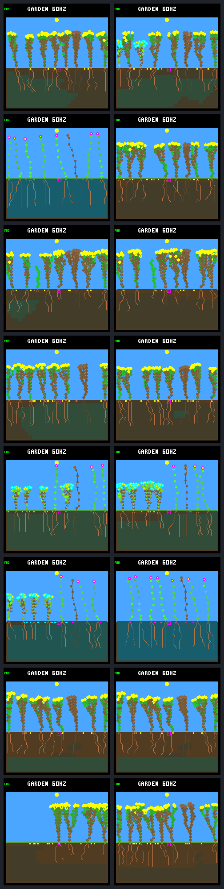

# Sunset-aware seed spending: targeted improvement, mixed panel

The approved [single-rule experiment](seed-reserve-protocol.md) substantially
reduces the specific adult-turnover failure identified in the [previous audit](turnover.md),
but is **not a general improvement across the panel**. Keep it host-only and
opt-in. No firmware, default ecology, model, training or fitness change is promoted.

Progress note: [issue #30](https://github.com/aortez/toy-factory/issues/30#issuecomment-5651104765).

## What changed

`TOY_FACTORY_GARDEN_SEED_RESERVE=ON` adds `sunset-seed-reserve-v1` before automatic
seed production. After subtracting the existing 48-energy seed price, forecast
remaining daylight with half the current income (rounded down per ecology step),
the actual storage-cap-before-upkeep ordering, and unchanged body size. Require
enough post-sunset energy for the 31 remaining pre-dawn upkeep payments. Existing
water, stress, flower, cooldown, bank and other reproduction checks still apply.

This uses present observations, not future-world access. It does not promise
dawn recovery or protection against later shading, growth or leaf-renewal costs.
No body-size or lifespan cap, larger store, NN feature or persistent world field
was added. The heuristic was held fixed throughout this experiment.

## The high-turnover case improves

`c7f54e18`, reserve-aware growth, sixteen-seed bank; closing days (160,192]:

| Measurement | Gate off | Gate on |
|---|---:|---:|
| Natural deaths | 37 | 8 |
| Energy-only deaths | 31 | 1 |
| Water-only deaths | 6 | 7 |
| Mean living plants | 5.864 | 7.396 |
| Living at day 192 | 4 | 7 |
| Offspring born | 38 | 16 |
| Survive beyond 1 day / eligible | 33/38 | 8/16 |
| Survive beyond 4 days / eligible | 18/38 | 7/16 |
| Survive beyond 8 days / eligible | 2/28 | 5/13 |
| Survive beyond 16 days / eligible | 0/16 | 4/10 |
| Seeds produced | 469 | 518 |
| Seeds expired | 434 | 501 |
| New durable parents under the old one-day metric | 16 | 1 |

The remaining eight natural deaths are **all seedlings younger than one day**.
Seven die from water shortage at ages 0.207–0.262 days, before any sunset. The
single energy death is lineage 66, aged 0.652 days: its nine-node body enters
sunset with 56 energy, short of 62 needed for the remaining night. It has never
produced a seed. There are no closing natural adult deaths in the gate-on run.

This is not just suppressing reproduction: seed output rises, while persistent
adults replace the repeated birth/death cycle. The old durable-parent metric
falls sharply because it counted short-lived parents and children that each
survived one day; it was not a persistence measure. Only one of the sixteen old
durable parents survives to the horizon; the one new qualifying parent does not.
Do not optimize that count in isolation.

Age denominators exclude offspring without sufficient follow-up. In the common
birth cohort (160,176], with a full sixteen-day follow-up for everyone, survival
beyond ages 1/2/4/8/16 changes **15/15/9/2/0 out of 16** to
**6/6/5/5/4 out of 10**. These are different descendant populations, not matched
individuals. Fixed patches account for two deaths in each full-follow-up cohort.

The corresponding eight-seed reserve run is completely unchanged: all 49,153
world rows match after removing rule metadata, all 1,548 purchases pass the
forecast, and native frames are identical. Its four closing energy deaths
therefore remain. The gate cannot fix costs incurred by non-reproducing plants.

## Retain every pair, including regressions

Same two world seeds, two frozen growth policies and two bank capacities. All
worlds have 512 nodes, the same frozen neural model, rainfed-crowded layout,
selective leaf maintenance and patch schedule. “Baseline” means the existing
neural no-night-growth policy; “reserve” adds the existing growth reserve gate.
Arrows are **seed reserve off → on**, not eight → sixteen seeds.

Closing days (160,192]; survival means strictly beyond the age boundary:

| World / growth / bank | Births | Natural deaths | 1-day survivors / eligible | 8-day survivors / eligible | 16-day survivors / eligible |
|---|---:|---:|---:|---:|---:|
| b61837dc / baseline / 8 | 17 → 22 | 13 → 19 | 13/17 → 6/22 | 6/14 → 2/21 | 3/11 → 1/11 |
| b61837dc / baseline / 16 | 8 → 16 | 4 → 11 | 4/8 → 8/16 | 2/8 → 5/15 | 1/7 → 3/14 |
| b61837dc / reserve / 8 | 11 → 12 | 5 → 7 | 5/10 → 6/11 | 5/10 → 5/10 | 3/9 → 3/9 |
| b61837dc / reserve / 16 | 7 → 13 | 2 → 8 | 6/7 → 9/13 | 4/7 → 6/12 | 3/6 → 3/9 |
| c7f54e18 / baseline / 8 | 3 → 7 | 0 → 2 | 3/3 → 6/7 | 3/3 → 3/6 | 1/2 → 1/4 |
| c7f54e18 / baseline / 16 | 5 → 6 | 1 → 1 | 4/5 → 5/6 | 2/4 → 4/5 | 2/4 → 0/3 |
| c7f54e18 / reserve / 8 | 9 → 9 | 6 → 6 | 7/9 → 7/9 | 3/7 → 3/7 | 1/4 → 1/4 |
| c7f54e18 / reserve / 16 | 38 → 16 | 37 → 8 | 33/38 → 8/16 | 2/28 → 5/13 | 0/16 → 4/10 |

Window choice matters. The adverse first pair has fewer deaths over the whole
192 days despite worse closing offspring survival. Conversely, the b61837dc
sixteen-bank pairs worsen in whole-run mortality as well as closing mortality.
Absolute deaths are counts, not exposure-adjusted hazards; occupancy and birth
cohort sizes differ. The export preserves full windows, resource budgets and
lineage ages, not just the favorable endpoint.

| World / growth / bank | Whole-run births | Whole-run natural deaths | Closing seeds produced | Closing mean living plants |
|---|---:|---:|---:|---:|
| b61837dc / baseline / 8 | 96 → 73 | 76 → 51 | 265 → 265 | 6.591 → 7.093 |
| b61837dc / baseline / 16 | 59 → 101 | 36 → 75 | 244 → 514 | 7.618 → 7.218 |
| b61837dc / reserve / 8 | 71 → 72 | 43 → 45 | 262 → 256 | 7.152 → 7.015 |
| b61837dc / reserve / 16 | 48 → 74 | 19 → 49 | 513 → 514 | 7.744 → 7.511 |
| c7f54e18 / baseline / 8 | 37 → 39 | 10 → 9 | 256 → 259 | 7.959 → 7.813 |
| c7f54e18 / baseline / 16 | 43 → 46 | 12 → 19 | 516 → 245 | 7.649 → 7.610 |
| c7f54e18 / reserve / 8 | 36 → 36 | 13 → 13 | 260 → 260 | 7.705 → 7.705 |
| c7f54e18 / reserve / 16 | 140 → 75 | 119 → 47 | 469 → 518 | 5.864 → 7.396 |

This is a small, repeatedly inspected exploratory panel. Changed seed timing
changes descendants, genes, crowding and future random histories. The matched
worlds test the intervention, but do not isolate the fate of one parent with
and without its seed debit. No held-out qualification claim follows.

## Native visual review

Left: gate off. Right: gate on. Eight rows follow the tables above. These are
240×240 native RGB565 renders, not sketches or a separate drawing implementation.
The last row's large gap is reduced; the seventh row is pixel-identical. The
second row changes from sparse flowers to shrubs, another reason that a fuller
screenshot alone is not evidence of better ecological variety or survival.



[Day 64](seed-reserve-64.png) · [Day 128](seed-reserve-128.png).
All three panels were visually reviewed. Screenshots are snapshots, not evidence
of motion or indefinite health.

## Audit corrections, tests and provenance

Two analysis assumptions were corrected without changing the native rule:

1. A refusal can transfer the last bank slot to a later parent in the same step.
   At tick 595860, b61837dc/reserve/8 refuses parent 43 (projected sunset 236,
   required 248); parent 55 passes at 248 and uses the freed slot. Exact debit,
   spent flower, cooldown, retained seeds and append order reconcile. There is
   another such transfer in c7f54e18/baseline/8 at tick 62040.
2. A gate may have no effect. The entire c7f54e18/reserve/8 control history remains
   identical; that result is retained instead of requiring every run to change.

The failed bundles `artifacts/garden-seed-reserve` and `artifacts/garden-seed-reserve-v2`
remain intact. The first correction prompted a native rerun. After the second,
all sixteen complete captures and 45 completed native frames were frozen into a
new bundle and rechecked. Exact binary/model hashes and native C/header source
fingerprints must match before reuse. All sixteen worlds were reanalyzed; only
the three missing frame replays were newly executed. `native_reuse` records the
distinction; saved command arrays describe reproducible commands, not a claim
that every command ran again during recovery. No outcome or forecast was tuned.

All **113 CTests pass** across default (35), gate-off banks 8/16 (28/18), and
gate-on banks 8/16 (16/16). The corrected Python audit tests were rerun in every
configuration. Tests cover storage/upkeep/phase boundaries, exact affordability,
one-past invalid input, output preservation, real seed purchases and refusals
(including no RNG/cooldown/flower/debit on refusal), rule identity and firmware
guards. Existing compiler warnings, UBSan and formatting checks pass. An initial
Release/NDEBUG setup was replaced with the baseline assertion-enabled build;
a test's hand-calculated three-step income boundary was corrected before the
native panel. Neither changed the forecast.

The embedded-C skill guided the pure bounded forecast, explicit host-only
guards, state-preserving refusal and boundary tests. World/snapshot sizes remain
7636/3926 bytes at bank eight and 7796/3942 at bank sixteen. These are structure
sizes, not total process memory or device performance measurements. No hardware
qualification, flashing, training or default-rule promotion occurred.

Complete ignored local bundle: `artifacts/garden-seed-reserve-v3`, **407 artifacts**
and **368 source fingerprints**. Manifest SHA-256:

`a4696431b029146d12f241161a7eb53a36b85d71a2efb1351df63ba30a429654`

Checks cover 786448 world rows, 5604082 live-plant resource budgets, all lifetime
transitions and patch boundaries, 17412 gate-on seed purchases, and 48 native
replay frames. All eight controls reproduce prior world rows, boundaries, full
analyses and frames exactly. Seven first divergences are explained by seed
refusals (two also reassign the freed slot); one full history is identical.
The separate review helper verifies every artifact hash and regenerates the
compact and lifetime summaries. Detailed death histories remain in the bundle.

## Reproduce and next decision

[Versioned summary and focused death records](seed-reserve-summary.json).
The protocol and frozen CMake caches specify all build options; use the existing
Docker builder, assertion-enabled default build type and UBSan. Build folders
are `artifacts/seed-reserve-build-{off,on}-{8,16}`. `make host-build` explicitly
turns the seed-reserve and large-bank experiments off.

```sh
python3 sim/test_garden_seed_reserve.py
python3 sim/garden_seed_reserve.py --output artifacts/garden-seed-reserve-new
python3 benchmarks/garden-longevity/review-seed-reserve.py \
  --output artifacts/seed-reserve-review-new.json
# Optional full read-only reanalysis of the saved worlds:
python3 benchmarks/garden-longevity/review-seed-reserve.py --reanalyze
```

Output paths must not already exist. Do not silently overwrite a prior run.
The current reviewed bundle was finalized with `--reuse artifacts/garden-seed-reserve-v2`;
ordinary collection without `--reuse` executes the full native panel.

Recommendation: retain this as a useful experimental intervention, not a new
default. Before more rule changes, examine the water budgets/root access of the
failed seedlings and whether the same mechanism explains the adverse pairs.
Broader untouched-seed validation is needed before promoting any rule. Do not
add more guards, change initial water, or launch training automatically.
