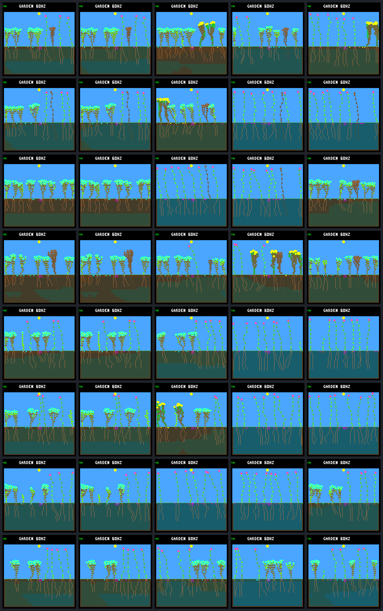

# Coverage training: generation gallery

Fixed review worlds, never used for automated selection. Rows follow the declared
schedule/seed order; columns show **0 / 1 / 2 / 3 / narrow reference** at day **192**.
These are all 40 required native captures, not a selected set of favorable worlds.
All scored checkpoint hashes and independent byte-for-byte frame repeats match.

| Row | Schedule | World seed |
|---:|---|---|
| 1 | fresh-1 | `eb300b12` |
| 2 | fresh-1 | `1824c139` |
| 3 | fresh-1 | `4d5f9ee1` |
| 4 | fresh-1 | `fe1dd56f` |
| 5 | fresh-2 | `eb300b12` |
| 6 | fresh-2 | `1824c139` |
| 7 | fresh-2 | `4d5f9ee1` |
| 8 | fresh-2 | `fe1dd56f` |

## Native frames and endpoint diagnostics

Counts describe living species and founder families, not seed-bank extinctions.
Fitness key: terminal tier, renewing-child live ticks, descendant live ticks,
renewing parents, new establishments. Tick totals sum over plants, not CPU time.

| Generation / condition | Model CRC | Living | Species / families | World key | World hash / framebuffer CRC |
|---|---|---:|---:|---|---|
| [g0.fresh-1.eb300b12](training-coverage-frames/g0.fresh-1.eb300b12.png) | `dc5e849d` | 7 | 2 / 2 | `[1, 183750, 941325, 3, 3]` | `ce079ab6` / `a421d510` |
| [g0.fresh-1.1824c139](training-coverage-frames/g0.fresh-1.1824c139.png) | `dc5e849d` | 7 | 2 / 2 | `[1, 195450, 953025, 4, 5]` | `6a74ef5b` / `add51478` |
| [g0.fresh-1.4d5f9ee1](training-coverage-frames/g0.fresh-1.4d5f9ee1.png) | `dc5e849d` | 8 | 1 / 1 | `[1, 255375, 939090, 3, 4]` | `3d4021d4` / `4299abbf` |
| [g0.fresh-1.fe1dd56f](training-coverage-frames/g0.fresh-1.fe1dd56f.png) | `dc5e849d` | 6 | 1 / 1 | `[1, 194730, 829425, 4, 5]` | `53fdeff1` / `a115c2b5` |
| [g0.fresh-2.eb300b12](training-coverage-frames/g0.fresh-2.eb300b12.png) | `dc5e849d` | 8 | 2 / 3 | `[1, 178620, 815640, 1, 3]` | `2c828bec` / `55855edf` |
| [g0.fresh-2.1824c139](training-coverage-frames/g0.fresh-2.1824c139.png) | `dc5e849d` | 8 | 2 / 3 | `[1, 266235, 828630, 5, 5]` | `ee750365` / `0aa48c8f` |
| [g0.fresh-2.4d5f9ee1](training-coverage-frames/g0.fresh-2.4d5f9ee1.png) | `dc5e849d` | 8 | 2 / 2 | `[1, 166380, 836955, 2, 4]` | `4fbd982c` / `7631785a` |
| [g0.fresh-2.fe1dd56f](training-coverage-frames/g0.fresh-2.fe1dd56f.png) | `dc5e849d` | 7 | 2 / 2 | `[1, 162030, 828825, 2, 4]` | `4633fcd8` / `c20f36af` |
| [g1.fresh-1.eb300b12](training-coverage-frames/g1.fresh-1.eb300b12.png) | `dc5e849d` | 7 | 2 / 2 | `[1, 183750, 941325, 3, 3]` | `ce079ab6` / `a421d510` |
| [g1.fresh-1.1824c139](training-coverage-frames/g1.fresh-1.1824c139.png) | `dc5e849d` | 7 | 2 / 2 | `[1, 195450, 953025, 4, 5]` | `6a74ef5b` / `add51478` |
| [g1.fresh-1.4d5f9ee1](training-coverage-frames/g1.fresh-1.4d5f9ee1.png) | `dc5e849d` | 8 | 1 / 1 | `[1, 255375, 939090, 3, 4]` | `3d4021d4` / `4299abbf` |
| [g1.fresh-1.fe1dd56f](training-coverage-frames/g1.fresh-1.fe1dd56f.png) | `dc5e849d` | 6 | 1 / 1 | `[1, 194730, 829425, 4, 5]` | `53fdeff1` / `a115c2b5` |
| [g1.fresh-2.eb300b12](training-coverage-frames/g1.fresh-2.eb300b12.png) | `dc5e849d` | 8 | 2 / 3 | `[1, 178620, 815640, 1, 3]` | `2c828bec` / `55855edf` |
| [g1.fresh-2.1824c139](training-coverage-frames/g1.fresh-2.1824c139.png) | `dc5e849d` | 8 | 2 / 3 | `[1, 266235, 828630, 5, 5]` | `ee750365` / `0aa48c8f` |
| [g1.fresh-2.4d5f9ee1](training-coverage-frames/g1.fresh-2.4d5f9ee1.png) | `dc5e849d` | 8 | 2 / 2 | `[1, 166380, 836955, 2, 4]` | `4fbd982c` / `7631785a` |
| [g1.fresh-2.fe1dd56f](training-coverage-frames/g1.fresh-2.fe1dd56f.png) | `dc5e849d` | 7 | 2 / 2 | `[1, 162030, 828825, 2, 4]` | `4633fcd8` / `c20f36af` |
| [g2.fresh-1.eb300b12](training-coverage-frames/g2.fresh-1.eb300b12.png) | `556a5dd2` | 8 | 2 / 2 | `[1, 166890, 924465, 3, 7]` | `d0580d76` / `3f5cc11c` |
| [g2.fresh-1.1824c139](training-coverage-frames/g2.fresh-1.1824c139.png) | `556a5dd2` | 7 | 3 / 3 | `[1, 163875, 960705, 3, 4]` | `3005d0f6` / `8c1e1c0a` |
| [g2.fresh-1.4d5f9ee1](training-coverage-frames/g2.fresh-1.4d5f9ee1.png) | `556a5dd2` | 7 | 1 / 1 | `[1, 165525, 943425, 3, 3]` | `81d365e0` / `6154a0ce` |
| [g2.fresh-1.fe1dd56f](training-coverage-frames/g2.fresh-1.fe1dd56f.png) | `556a5dd2` | 7 | 2 / 2 | `[1, 255450, 939165, 2, 6]` | `7b178eeb` / `4fc16d77` |
| [g2.fresh-2.eb300b12](training-coverage-frames/g2.fresh-2.eb300b12.png) | `556a5dd2` | 7 | 2 / 3 | `[1, 186900, 806010, 2, 4]` | `69c71b94` / `02180fd3` |
| [g2.fresh-2.1824c139](training-coverage-frames/g2.fresh-2.1824c139.png) | `556a5dd2` | 8 | 3 / 3 | `[1, 224100, 825480, 2, 4]` | `dbe99b11` / `46e50e38` |
| [g2.fresh-2.4d5f9ee1](training-coverage-frames/g2.fresh-2.4d5f9ee1.png) | `556a5dd2` | 7 | 1 / 1 | `[1, 185670, 927660, 2, 3]` | `18d6b502` / `2f390dc1` |
| [g2.fresh-2.fe1dd56f](training-coverage-frames/g2.fresh-2.fe1dd56f.png) | `556a5dd2` | 8 | 2 / 3 | `[1, 186870, 805980, 3, 4]` | `b7998b7f` / `3a924c5f` |
| [g3.fresh-1.eb300b12](training-coverage-frames/g3.fresh-1.eb300b12.png) | `c7c1b31e` | 7 | 2 / 2 | `[1, 133245, 908985, 3, 3]` | `fa98cc04` / `45f25690` |
| [g3.fresh-1.1824c139](training-coverage-frames/g3.fresh-1.1824c139.png) | `c7c1b31e` | 7 | 1 / 2 | `[1, 161235, 958065, 3, 4]` | `ab76b0e2` / `c0166f62` |
| [g3.fresh-1.4d5f9ee1](training-coverage-frames/g3.fresh-1.4d5f9ee1.png) | `c7c1b31e` | 7 | 1 / 2 | `[1, 144495, 959490, 2, 3]` | `b0861ce0` / `1b1a23b0` |
| [g3.fresh-1.fe1dd56f](training-coverage-frames/g3.fresh-1.fe1dd56f.png) | `c7c1b31e` | 7 | 2 / 2 | `[1, 141165, 898740, 3, 9]` | `b39c802b` / `2b9f5915` |
| [g3.fresh-2.eb300b12](training-coverage-frames/g3.fresh-2.eb300b12.png) | `c7c1b31e` | 8 | 1 / 2 | `[1, 297690, 791715, 4, 5]` | `742bf4aa` / `b3c728da` |
| [g3.fresh-2.1824c139](training-coverage-frames/g3.fresh-2.1824c139.png) | `c7c1b31e` | 8 | 1 / 2 | `[1, 206550, 837315, 2, 4]` | `c4ff39f4` / `2c154b01` |
| [g3.fresh-2.4d5f9ee1](training-coverage-frames/g3.fresh-2.4d5f9ee1.png) | `c7c1b31e` | 8 | 1 / 2 | `[1, 180390, 809595, 2, 4]` | `9478e6dc` / `1240e031` |
| [g3.fresh-2.fe1dd56f](training-coverage-frames/g3.fresh-2.fe1dd56f.png) | `c7c1b31e` | 7 | 2 / 2 | `[1, 206130, 948120, 2, 4]` | `2b57dc91` / `5d5c0232` |
| [narrow.fresh-1.eb300b12](training-coverage-frames/narrow.fresh-1.eb300b12.png) | `449c35fe` | 8 | 2 / 2 | `[1, 162870, 920445, 6, 6]` | `821e3a80` / `8d9aafe9` |
| [narrow.fresh-1.1824c139](training-coverage-frames/narrow.fresh-1.1824c139.png) | `449c35fe` | 7 | 1 / 2 | `[1, 190665, 948240, 4, 5]` | `43148543` / `8d196f86` |
| [narrow.fresh-1.4d5f9ee1](training-coverage-frames/narrow.fresh-1.4d5f9ee1.png) | `449c35fe` | 7 | 1 / 1 | `[1, 183210, 940785, 4, 5]` | `3852c983` / `2f90de5a` |
| [narrow.fresh-1.fe1dd56f](training-coverage-frames/narrow.fresh-1.fe1dd56f.png) | `449c35fe` | 7 | 1 / 1 | `[1, 175005, 932580, 3, 5]` | `2f4de63e` / `6196925f` |
| [narrow.fresh-2.eb300b12](training-coverage-frames/narrow.fresh-2.eb300b12.png) | `449c35fe` | 8 | 1 / 2 | `[1, 185430, 843510, 2, 3]` | `0a96363d` / `e501a7f7` |
| [narrow.fresh-2.1824c139](training-coverage-frames/narrow.fresh-2.1824c139.png) | `449c35fe` | 8 | 1 / 2 | `[1, 218190, 837300, 3, 4]` | `fa2f2450` / `3c15f5ce` |
| [narrow.fresh-2.4d5f9ee1](training-coverage-frames/narrow.fresh-2.4d5f9ee1.png) | `449c35fe` | 8 | 2 / 2 | `[1, 214380, 833490, 3, 4]` | `ae1959ce` / `f93c520e` |
| [narrow.fresh-2.fe1dd56f](training-coverage-frames/narrow.fresh-2.fe1dd56f.png) | `449c35fe` | 8 | 2 / 3 | `[1, 127350, 828795, 2, 4]` | `c803e37a` / `6658d0cf` |

[All candidate scores, paired diagnostics and lifetime attribution](training-coverage-summary.json).

Frozen bundle manifest SHA-256: `a9142bff1570b3912b7f7d5dc71dbf4575c3db6df10249cf9b3539643abaf460`.
