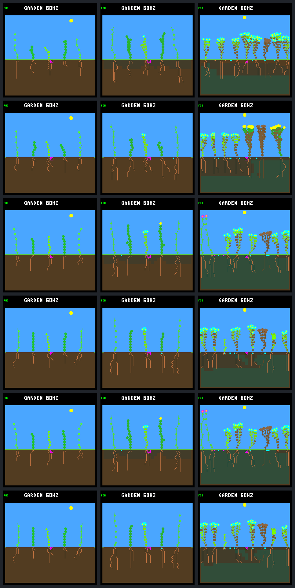

# Persistence pilot: generation review

Two review seeds, never used for automated selection. Generation 0 is the unchanged
control; generations 1 and 2 use the same winning model. Their duplicate images are
intentional: every completed generation is retained.

Columns: tick **480** (early daylight), **2880** (first dawn), **737280** (day 192).
All images use native 240×240 shared-renderer output. Each state hash matches the
scored simulation; a separate reset/process reproduces every frame byte-for-byte.

| Row | Generation | World seed | Model CRC | Final living | Species / founder families | World fitness key |
|---:|---:|---|---|---:|---:|---|
| 1 | 0 | `6c696665` | `dc5e849d` | 7 | 1 / 1 | `[1, 77460, 892455, 2, 2]` |
| 2 | 0 | `72657632` | `dc5e849d` | 6 | 2 / 2 | `[1, 215670, 850365, 3, 4]` |
| 3 | 1 | `6c696665` | `fa0c2cd8` | 7 | 2 / 2 | `[1, 166065, 962895, 2, 3]` |
| 4 | 1 | `72657632` | `fa0c2cd8` | 7 | 1 / 1 | `[1, 80985, 972000, 2, 2]` |
| 5 | 2 | `6c696665` | `fa0c2cd8` | 7 | 2 / 2 | `[1, 166065, 962895, 2, 3]` |
| 6 | 2 | `72657632` | `fa0c2cd8` | 7 | 1 / 1 | `[1, 80985, 972000, 2, 2]` |

World key: terminal tier, recent renewing-child live ticks, all-descendant live
ticks, renewing parents, new establishments. Tick totals sum over plants; they are
not frame times. Established descendants are present at every recorded endpoint.

## Individual native frames

| Frame (generation / seed / tick) | World hash | Framebuffer CRC32 |
|---|---|---|
| [g0.6c696665.480](training-pilot-frames/g0.6c696665.480.png) | `67dc9c28` | `c233859e` |
| [g0.6c696665.2880](training-pilot-frames/g0.6c696665.2880.png) | `94e79e73` | `8077aa28` |
| [g0.6c696665.737280](training-pilot-frames/g0.6c696665.737280.png) | `3b800c25` | `a9ef53a8` |
| [g0.72657632.480](training-pilot-frames/g0.72657632.480.png) | `de59df29` | `b26f1165` |
| [g0.72657632.2880](training-pilot-frames/g0.72657632.2880.png) | `da28b767` | `32ec7615` |
| [g0.72657632.737280](training-pilot-frames/g0.72657632.737280.png) | `32b33c45` | `d4b212f0` |
| [g1.6c696665.480](training-pilot-frames/g1.6c696665.480.png) | `c9df9b38` | `3babf1f1` |
| [g1.6c696665.2880](training-pilot-frames/g1.6c696665.2880.png) | `cccd6cfe` | `5d235726` |
| [g1.6c696665.737280](training-pilot-frames/g1.6c696665.737280.png) | `50339138` | `f11b87f8` |
| [g1.72657632.480](training-pilot-frames/g1.72657632.480.png) | `b955eb2a` | `4edf181e` |
| [g1.72657632.2880](training-pilot-frames/g1.72657632.2880.png) | `0ecc0ed5` | `ae07e0a8` |
| [g1.72657632.737280](training-pilot-frames/g1.72657632.737280.png) | `9ce498c7` | `03b27e1a` |
| [g2.6c696665.480](training-pilot-frames/g2.6c696665.480.png) | `c9df9b38` | `3babf1f1` |
| [g2.6c696665.2880](training-pilot-frames/g2.6c696665.2880.png) | `cccd6cfe` | `5d235726` |
| [g2.6c696665.737280](training-pilot-frames/g2.6c696665.737280.png) | `50339138` | `f11b87f8` |
| [g2.72657632.480](training-pilot-frames/g2.72657632.480.png) | `b955eb2a` | `4edf181e` |
| [g2.72657632.2880](training-pilot-frames/g2.72657632.2880.png) | `0ecc0ed5` | `ae07e0a8` |
| [g2.72657632.737280](training-pilot-frames/g2.72657632.737280.png) | `9ce498c7` | `03b27e1a` |

[Complete portable scores and model identities](training-pilot-summary.json).

Bundle manifest SHA-256: `9c9dc94e44cee155b4d8a83276339936d17e97cce4b995259faed4cd31059950`.
