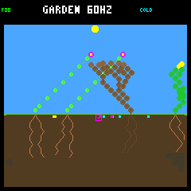
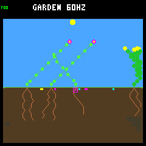
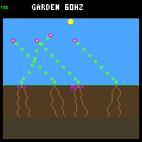

# Seasonal Garden v1: renewal and controller evaluation

Bounded follow-up to [winter/drought implementation](../../docs/garden-seasons.md).
Default device-sized ecology: 256 nodes, eight plant slots, eight seeds, no gardener
or recurring irrigation. Climate remains v1 (2–4-day drought); no tuning is promoted.

## Fresh eight-year panel

Four predeclared world/weather seeds from base `0x73656132`, two layouts, two
reference policies and four climates: 64 runs of 128 Garden days. Layouts and
policies share seeds; these are four weather replicates, not 64 independent ones.
All 64 worlds retained living plants; none reached an observed empty world.

| Climate | Worlds reproducing in final year | Final-year births | Final-year full-day survivors | Final-year durable parents | Multi-species endpoints, including seeds |
|---|---:|---:|---:|---:|---:|
| Steady | 1/16 | 1 | 0 | 0 | 13/16 |
| Winter | 2/16 | 7 | 3 | 0 | 5/16 |
| Drought | 8/16 | 36 | 30 | 6 | 0/16 |
| Both | 8/16 | 37 | 30 | 6 | 1/16 |

“Final-year” cohorts are born strictly after day 112. A durable parent is a
descendant which survived a full day and had a child which also survived a full
day. Recent births without a full day of possible follow-up are censored. These
are cumulative achievements within the cohort, not a promise of future survival.

The combined arm produces 583 births and 157 historical durable parents over
eight years, versus 100 and eight for steady controls. This demonstrates real
descendant reproduction, but does **not** qualify broad ecological variety:
15/16 combined worlds lose all but one species even counting unexpired seeds.
In 8/16 combined worlds every mature seed observed in the final year was
spacing-blocked. Shade and water blockers often overlap; one combined world also
shows node pressure. Increasing RAM alone would not resolve all of these cases.

Controller decisions matter. On `rainfed / ed52188b`, baseline ends in ground-cover
and adaptive in flowers under identical climate/rain. They produce 15 versus eight
historical durable parents; neither reproduces in the final year. This is a matched
policy comparison, not proof that a particular action caused the difference or
that baseline is generally superior.

## Initial diagnosis and isolated tuning

The original two-seed, 64-day panel was repeated with ancestry and uniform seed
site sampling. Of eight combined worlds, all had one living species; seven also
had only one viable species when seeds were counted. Six had every final-year
mature seed spacing-blocked, with no node-capacity blocker anywhere in that arm.

Selected 8-day death audits (`rainfed / fb4118d5`, baseline and adaptive) reconcile
all 13 natural-death receipts. Baseline's shrub and ground-cover founders die of
energy shortage during spring, before either hazard. Adaptive keeps those founders
until the first drought, when both die water-starved despite retaining substantial
energy: terminal pre-step reserves are 216 and 229 energy, zero water, with six
water upkeep due. These are terminal-step receipts, not complete lifetime budgets.

One isolated worktree of the evaluator checkpoint (rebased as `89cd384`) changes
only drought duration to 1–2 days.
The [exact patch](short-drought.patch) is retained and **not applied to production**.
All 32 day-0-through-4 prefixes and all 16 complete steady/winter negative controls
match exactly, including state histories and trace SHA-256s.

| Combined climate, 64 days | Original | Short drought |
|---|---:|---:|
| Multiple viable species at end | 1/8 | 2/8 |
| Worlds reproducing in final year | 2/8 | 2/8 |
| Final-year full-day offspring survivors | 3 | 5 |
| Final-year durable parents | 0 | 1 |
| Historical durable parents | 15 | 11 |

The candidate fails the predeclared historical-renewal retention gate. It is a
tradeoff, not a universal improvement. No fresh candidate run or second parameter
search follows that failed screen. Keep the original settings; discuss spatial
recruitment/dispersal and the desired renewal/diversity tradeoff separately.

## Real rendered checkpoints

Fixed first fresh seed `ed52188b`, rainfed/adaptive, combined climate. Images come
from the production renderer; each replay matches its recorded world hash and
RGB565 framebuffer CRC. They are not selected for best outcome.

| Winter, day 14 | Spring, day 16 | End of year eight, day 128 |
|---|---|---|
|  |  |  |

The late frame illustrates persistent spatial occupancy; plant survival and a
stocked seed bank are not equivalent to continuing renewal.

## Saved-model bridge

The evaluator, matched bundles, deep traces, seed-site audits and galleries now
carry explicit climate identity/version and seed lifetime. Steady remains the
evaluation default; the trainer and its objective are unchanged.

An existing model, CRC `01b9d94a` (`r2-n.tgm` from prior research), was evaluated
without retraining: two fresh seeds from `0x73656133`, two layouts, 32 days,
combined climate. All 12 evaluator trajectories validate; two selected detailed
replays, eight seed-site audits and 18 real rendered frames reproduce their
recorded hashes, with the gallery additionally replayed byte-for-byte.
This is a workflow/compatibility check, **not model promotion**. The old model
goes extinct in one of four layout/seed cases, versus zero for adaptive.

## Retained evidence and reproduction

- [Fresh 128-day summary](fresh-128.json): all 64 endpoints, per-case cohort and
  blocker metrics, source/binary hashes and original full-report SHA-256.
- [Short-drought screen](short-drought-screen.json): both 32-case panels, named
  gates, exact-prefix/negative-control checks and provenance.
- Full daily/event reports, raw frames and death traces remain in ignored
  `artifacts/garden-seasons-diagnosis`, `artifacts/garden-seasons-fresh-128` and the
  isolated treatment worktree. Frame paths in JSON refer to those original bundles.
- Saved-model bundles remain under `artifacts/garden-seasonal-model-{eval,gallery,sites}`.

```sh
make host-seasons-garden GARDEN_SEASONS_OUT=artifacts/new-baseline \
  GARDEN_SEASONS_ARGS="--days 64 --trials 2 --jobs 4 --seed-audit --screenshots"
make host-seasons-garden GARDEN_SEASONS_OUT=artifacts/new-fresh \
  GARDEN_SEASONS_ARGS="--days 128 --trials 4 --seed-base 0x73656132 --jobs 4 --seed-audit --screenshots"
python3 sim/garden_season_report.py --control artifacts/new-fresh/results.json \
  --out artifacts/new-fresh-summary.json
```

For the treatment, use a separate worktree at `89cd384`, apply the retained patch
with `git apply --unidiff-zero /path/to/short-drought.patch`, build there, and rerun
the baseline command. Summarize with `--control`,
`--candidate` and a new `--out`; the script rejects mismatched panels, changed
negative controls and changed early prefixes. Source/collector changes can alter
byte-level provenance even when authoritative world hashes remain unchanged.

This closes a bounded seasonal-environment implementation and evaluation pass.
It does not close roadmap #30's environment-qualification or training milestones.
All 100 default and 105 research host tests pass; standalone checks and a pristine
Zephyr build also pass. Firmware remains at 257,596 bytes of flash and 223,004
bytes of main RAM, plus the unchanged separate 8 KiB Core 1 reservation. Host-only
evaluation/analysis adds no device storage or model-ABI changes.
Hardware flashing/playtesting remains pending: no PicoSystem was visible over USB.
