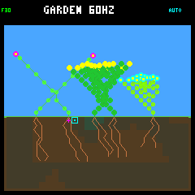

# Garden Simulator design

[GitHub issue #4](https://github.com/aortez/toy-factory/issues/4) records the
completed playable prototype. The [Garden A-life roadmap](garden-alife-roadmap.md)
and [issue #30](https://github.com/aortez/toy-factory/issues/30) track environment
validation, visual review, and training. This document records the implementation
contract that must remain synchronized with the native and device tests.

## Scope

Garden is a deterministic side-view pocket terrarium. Its variety comes from
two coupled resources and three parameterized growth forms rather than a large
collection of unrelated subsystems:

- water enters a coarse soil field, travels downward, diffuses sideways,
  evaporates, and is absorbed by roots;
- a deterministic moving sun casts light through the canopy along slanted
  integer rays, so established plants shade later growth and daylight varies
  over time;
- flower, shrub, and ground-cover species vary their cadence, costs, branching,
  height, root reach, leaf density, shade, and horizontal tendency;
- a compact per-plant genome perturbs growth rate, root/shoot allocation,
  resource seeking, branching, stature, reserves, and seed dispersal without
  dynamic content or unstable random ordering.

Insects, disease, nutrients, persistence, and rigid-body stems remain outside
the current scope. Resource maintenance, stress, reproduction, death, and
decomposition are part of the authoritative simulation.

## Fixed-capacity state

[`garden_world.c`](../src/garden_world.c) has no Zephyr, renderer, allocation,
or wall-clock dependency. Its caller-owned state is 4,352 bytes and contains:

- eight plant records, including eight bytes of lifetime policy memory and 40
  bytes of derived decision telemetry each, and a shared pool of 256 ten-byte
  plant nodes;
- a dense eight-entry dormant-seed bank with compact genomes and lineage IDs;
- a 28 x 11 byte soil-moisture field covering eight-pixel cells;
- a derived 28 x 14 byte canopy-light field; the sun itself is derived from
  the ecology tick and consumes no persistent world storage;
- cursor, selected-tool, automatic-policy, deterministic-random, cadence,
  lifecycle state, and bounded cumulative diagnostic counters.

Every node refers only to an earlier parent. Stems and roots share the pool;
leaf, flower, active-tip, pending-branch, and pruning state are flags on a node.
Pool exhaustion stops further growth without reallocating or corrupting the
existing garden.

The authoritative loop remains 60 Hz. Node interpolation and cursor input run
at that cadence, while moisture, light collection, decomposition, and growth
advance every 15 ticks, producing a 4 Hz ecology update. Plants pay maintenance
every four ecology updates, or once per second. Cursor input moves immediately
on a new direction, then uses a deterministic delay and repeat rate while held.

The 256-ecology-tick sun cycle lasts 64 seconds. Reset begins at noon; the sun
moves toward sunset, remains at minimum ambient strength overnight, then moves
from sunrise back to noon. Its signed Q4 ray slope ranges from -0.75 to +0.75
canopy cells per row. Each target cell traces toward the source and accumulates
the opacity of leaves it crosses, clamping at a nonzero ambient floor. This is
bounded integer work with no trigonometry or allocation.

## Environmental water

The playable Garden has seeded rain enabled from reset. The auto-gardener remains
off until explicitly enabled; it is optional assistance, not the environmental
water source. Initial founders still receive their fixed startup watering and
32 units of internal water. There is no subsequent rescue watering unless the
player enables automation or uses the tool.

Rain version 1 schedules one 4--8 second shower within each 32-second window,
with a seed-dependent start time and intensity of 2--4 water units per surface
column per ecology step. Windows have dry margins; consecutive showers can be
separated by 4--48 seconds. This is a deliberately small starting climate, not
a calibrated seasonal model. All 28 surface columns receive the same offered
rain. Existing downward flow, lateral diffusion, and root uptake determine
where that water subsequently goes. Unlike the watering tool, rain does not
deposit directly into the second soil row or overlap neighboring deposits.

Weather is a pure integer function of an independent immutable seed and the
ecology tick. Plant births, deaths, policy decisions, and random-number use
cannot alter it. No clock, atmosphere grid, raindrop particles, heap storage,
or random stream advances are required. The world stores a four-byte weather
seed and two four-byte saturating diagnostic counters: water deposited and
water rejected at saturated surface cells (runoff). These counters exclude
startup/tool watering and are not a complete ecosystem water budget.

This is an open system: rain supplies external water; evaporation and plant
costs remove it. Runoff leaves the world. There is no groundwater source,
atmospheric recycling, canopy interception, rain shading, or decomposition
water return in this version. The existing plant observations are unchanged;
policies see moisture and resource income, not privileged weather forecasts.

Bare `garden_world_reset` leaves rain disabled for isolated tests and historical
benchmarks. `garden_world_set_weather` selects a seed (zero disables rain)
without changing time, moisture, or plant randomness. Enabled weather contributes
a tagged version/seed extension to the Garden v5 hash. Rain-disabled worlds
retain their previous hashes exactly. The snapshot carries only the current
rain rate; a small `RAIN` header indicator changes only at wet/dry transitions,
with matching dirty-region invalidation.

Training now uses the `rainfed` and `rainfed-crowded` environments, with three
and five founders respectively. Both have startup water, seeded rain, no fixed
irrigation, and no gardener. Candidates receive matched world/weather seeds.
The old unassisted/irrigated/crowded suite remains an explicit diagnostic baseline;
`make host-evaluate-garden GARDEN_EVAL_RAINFED=1` selects the training environments.
See the [rainfall checks](../benchmarks/garden-longevity/rainfall.md) for the
first long-run results and limitations.

## Growth and tools

A new seed creates one soil-line base, one shoot tip, and two root tips. Roots
choose among bounded downward steps using nearby moisture. Shoots choose among
five upward steps using canopy light, species tendency, stored lean, and a
stable per-plant random stream. Selected depths schedule at most one secondary
branch. Leaves begin collecting energy and casting shade after a fixed visible
growth threshold; terminal tips flower after their species threshold.

Each plant also carries eight signed one-byte traits in the range -2 through
+2. Species parameters remain immutable templates in flash; the genome is only
a compact set of offsets around that template. Traits influence growth cadence,
shoot allocation, light and water seeking, branch spacing, shoot/root stature,
night reserves, and dispersal. The complete genome is included in the agent
observation, so a later learned policy can act on the same inherited state.

A mature flower may produce one seed per Garden day after paying 48 energy and
24 water while retaining its strategy-adjusted reserve. That reserve is capped
at what storage can retain after the current maintenance debit and seed cost:
`min(requested_reserve, storage_limit - upkeep - seed_cost)`. Large plants can
therefore reproduce at full stores without demanding more than the 256 energy
or 512 water they can hold. The retained budget remains a safety margin; plants
can still overgrow or reproduce into a night they cannot survive.

The flower is marked spent until the next dawn, when living flowers renew using
the existing node flag. Renewal does not grow tissue or consume extra world
storage, and no seed is created unless daylight, zero stress, resources, and
seed-bank space permit it. All flowers on a plant share the existing 16-ecology-
step (four-second) reproduction cooldown. Dead flowers remain spent while
decomposing. Tissue aging and structural regrowth are not part of this change.

Seeds disperse a
bounded horizontal distance, remain dormant for eight ecology ticks (two
seconds), and expire after 256 ecology ticks (64 seconds). A dormant seed
germinates only when its surface soil has sufficient moisture, the bottom
canopy row has sufficient light, plant spacing is valid, and fixed plant/node
capacity is available. Mutation is deterministic: three quarters of new seeds
change exactly one trait by one bounded step. Every plant has a monotonic
lineage ID, parent lineage, generation, and offspring count; cumulative seed,
germination, expiration, and mutation counters survive parent reclamation.

Living plant age uses a saturating 32-bit ecology counter; the compact policy
observation caps age at 65,535 without changing its layout. Host-only natural
death receipts capture terminal resources before live telemetry is cleared.
See [long-run correctness and the death-audit workflow](garden-long-run-correctness.md).

Each one-second maintenance event costs one energy unit per eight total nodes
and one water unit per eight shoot nodes, rounded up. A failed payment records
which resource was short and increments plant stress; a successful event heals
one stress point. Stress reaching eight kills a plant; without a recovery, that
takes eight seconds. The baseline growth policy keeps a forty-maintenance-period
reserve at minimum ambient light. The adaptive policy starts preserving that
reserve as daylight fades, allowing a healthy plant to cross the normal night
instead of spending its reserves on blind growth.

Dead tissue stops collecting resources and growing, changes to a brown palette,
then disappears from the tips inward over roughly 12--16 seconds. Once every
node is gone, an in-place stable compaction returns the whole plant and all of
its nodes to the fixed pools. A transient 256-byte old-to-new node map repairs
parent and plant references; there is no heap, free list, or persistent second
pool.

The player-facing controls are:

- D-pad: move the garden cursor;
- A: apply the selected seed, water, or prune tool;
- B: select the next tool;
- X: toggle the auto-gardener;
- short/long Y: reset or select the next scene, as in every playable scene.

Pruning pinches a nearby live shoot tip rather than deleting graph storage. Its
next segment turns outward, which redirects the visible form without requiring
a free list or invalidating child indexes.

## Agent boundary and adaptive policy

Growth decisions cross a versioned, fixed-capacity observation/decision
boundary. A 104-byte observation describes one active tip, its parent-relative
orientation, the plant's energy, water, age, morphology totals, stress,
maintenance costs and phase, recent resource income, plant status, and up to
five canonical growth candidates. Each candidate reports its endpoint, local
light or moisture, bounded clearance, and nearby own/foreign tissue. The
observation also reports sun phase, strength, and signed ray slope. A 12-byte
proposal selects an action, supplies a priority for later arbitration, and
ranks the candidate indexes without receiving mutable world access. A complete
20-byte decision pairs that proposal with the plant's next eight-byte signed
memory vector.

The world owns that lifetime memory and passes its current value immutably to a
caller-supplied pure callback. It validates the callback's proposal before
transactionally committing its next memory, private random stream, and tip
cursor; rejected or failed decisions commit none of those fields. Memory is
not heritable: a germinated offspring starts with zero memory while receiving
its parent-derived genome. Nonzero memory participates in the authoritative
state hash and is exposed by the host lineage diagnostics.

The original hand-authored policy remains available as an explicit A/B oracle.
It carries memory through unchanged and uses the original phased root/shoot and
round-robin tip selection. Normal Garden updates use the adaptive policy. Its
eight memory channels smooth energy pressure, water pressure, stress, recent
energy income, recent water income, and local crowding while tracking lifetime
root/shoot allocation and consecutive choices. Those signals, current
morphology, inherited shoot bias, shortages, and candidate quality determine a
bounded integer priority. A three-leaf establishment bias strongly favors shoot
growth until a seedling can collect useful light.

Adaptive plants use all-tip arbitration: every active root and shoot tip bids
against the same immutable memory and deterministic random nonce. The world
scans from a stable rotating origin, resolves equal priorities by that order,
and commits only the winning decision's memory, random advance, and tip cursor.
Terminal and physically blocked tips bid to finish, and low-light proposals may
wait to protect maintenance reserves. Any callback error or invalid proposal
rejects the whole plant decision without leaking private state. The world
remains the sole authority for resource costs and graph mutation, so this same
path hosts quantized learned policies without creating a second simulation.

### Integer neural policy contract

Neural inference consumes a separately versioned signed-byte feature contract:
32 common plant/environment features plus nine features for each of up to five
growth candidates. The common vector includes species and tissue identity,
shape and depth, energy/water reserve margins, resource income, stress, light,
sun direction, morphology totals, selected genome traits, and the existing
eight lifetime-memory bytes. Candidate rows encode direction, light, moisture,
clearance, bounds, availability, and nearby own/foreign tissue. Unused fixed
capacity remains zero.

The 1,204-byte position-independent model is immutable data suitable for XIP
flash. Its header locks a magic value, model version, feature version, exact
size, and three bounded scaling shifts. Signed 8-bit weights feed a 16-unit ReLU
plant layer, three action logits, a tip-arbitration priority, eight next-memory
outputs, and an eight-unit shared candidate layer. Accumulators and biases are
signed 32-bit integers; explicit division gives identical negative-value
rounding on the host and RP2040. Model validation rejects incompatible headers,
unsafe biases, and shifts before inference.

The candidate layer combines plant context with each candidate before scoring
it. This nonlinearity matters: in a purely linear shared scorer, the plant term
would be the same for every direction and cancel during ranking. Here the same
light reading can matter differently to a shoot than to a root. Equal scores
retain a deterministic nonce-rotated order. Maximum-depth and physically
blocked tips are hard world-contract envelopes around model output, and the
world still validates every proposal before committing state.

A five-candidate shoot bid performs at most 1,872 multiply-accumulates; a
three-candidate root bid performs 1,456. Inference uses only small call-local
vectors and the existing eight bytes of persistent plant memory. The included
fixed reference model is intentionally untrained: it exercises the full ABI and
provides a reproducible evaluator control while the adaptive policy remains the
normal Garden policy.

Every accepted selected decision increments saturating per-plant and cumulative
telemetry: extend/wait/finish, root/shoot arbitration wins, root/shoot extend
choices, and the most recent tip, action, and priority. Invalid callback output
does not leak into either telemetry or policy state. Per-plant counters disappear
when that plant is reclaimed, while the world aggregate survives reclamation.
These diagnostics are deliberately excluded from the authoritative hash, so
observability does not redefine simulation identity.

A fixed-capacity host evaluator runs the original baseline, normal adaptive,
and untrained neural-reference policies against identical seeds in unassisted,
irrigated, and crowded plots.
It reports survival as the first gate, established reproduction as the second,
then descendant plant-time, generation depth, resources, memory, and decision
measurements rather than imposing one fitness function. Persistent lineage IDs
let the host partition those results by species and initial founder even after
dead plants and their nodes have been compacted out of the live world. Death
causes and sampled seed-germination blockers expose why a candidate failed, not
just its final population.
The host-only lifetime ledger also distinguishes a 64-second cycle-surviving
offspring from short-lived establishment, retains parent credit after death,
and reports mortality by age and sun phase. Recent births are reported separately
so unequal follow-up does not inflate or depress the cycle-survival rate. These
diagnostics do not change the trainer's fitness or occupy firmware RAM.
`make host-evaluate-garden` prints the comparison and stores the full trial report in
`artifacts/garden-evaluation.json`; see the [host simulator guide](host-simulator.md)
for its exact experiment contract.

## Auto-gardener

The auto-gardener is an ordinary deterministic policy, not a privileged state
editor. It chooses a target, visibly moves the same cursor, selects an ordinary
tool, and calls the same planting, watering, or pruning operation exposed to
manual control. Fixed priority and rotating scan origins make ties reproducible.
It establishes a five-plant mixture, waters low-resource plants, and
occasionally pinches a mature tip in deep shade. Below that population target,
it waters a viable dormant seed before buying another seedling, allowing
natural offspring to claim reclaimed space.

This gives the idle toy an autonomous mode and supplies a long-running workload
for capacity, determinism, and rendering tests.

## Presentation and validation

The renderer receives a 1,622-byte garden payload inside the existing
scene-tagged snapshot union. Each rendered node is five bytes: position,
backward parent distance, growth progress, and packed style. Each dormant seed
uses two bytes for its screen column and packed species/dormancy style. The
complete immutable snapshot is 1,664 bytes. Soil moisture is copied directly;
the 392-byte derived light field and authoritative genomes are not duplicated.
A small sun marker makes the cycle visible. Garden uses the established 30 Hz
full-frame path while ecology and input remain authoritative at 60 Hz.

The host prototype now treats that framebuffer as a pixel cache. A bounded
semantic planner compares the last-presented and current Garden snapshots,
marks conservative 8 x 8 damage tiles for visible moisture bands, cursor and
automation state, header text, and old/new plant geometry, then coalesces equal
horizontal runs across rows. The planner itself needs only a 30-row bit mask
plus iterator state; it does not allocate a second framebuffer. Firmware
integration will also need a last-presented Garden history, whose placement
must be chosen against the renderer's measured stack and shared-memory budget.
Across initial, growing, and established checkpoints at 30, 10, and 4 Hz, 540
reconstructed frames match full renders exactly. Firmware still uses
full-frame presentation until device measurements establish an adaptive
partial/full cutoff.

The strict-warning/UBSan native suites currently cover invalid inputs, spacing,
plant and node capacity, downward water travel, evaporation, cursor repeat,
tool cycling, pruning, distinct species growth, exact paired replays, healthy
night survival, reversible resource stress, dry death, graph compaction, twelve
death/replant cycles without leakage, reproduction costs and attainable reserve
limits across all reserve traits and maximum body size, one-unit resource
boundaries, daily flower renewal, full-bank recovery, cooldowns, single-trait bounded
mutation, seed dormancy/expiry, germination, parent-child lineage, exact seed
damage rendering, recurrent-memory carry/reset/hash behavior, pressure-sensitive
adaptive choices, memory bounds, shared-input all-tip bidding, winner-only
commit, injected-policy determinism and rejection, and a five-minute automatic
soak. The mixed sequence fixture waters the plot, plants another flower,
enables automation, and advances 930 exact ticks to five plants, 137 nodes,
four blooms, and one dormant seed at hash `28489ef5` and framebuffer CRC-32
`fc95584f`, during a shower. Continuing the same state to tick 3,771 reaches five
healthy plants, 188 nodes, 15 blooms, and six dormant seeds at hash `4345d5b7`
and CRC-32 `1f128cce`.

A separate gardener-free lifecycle fixture now runs through tick 18,030:
rain delays the old dry-plot deaths, so the longer fixture exercises two deaths,
two reclamations, and one germination, ending with three living plants at hash
`a9cbbc66` and CRC-32 `283abd58`. The generation fixture enables automation at
tick 4,530, then continues through tick 8,430 with five living plants, 18 produced
seeds, one germination, nine expirations, and 16 mutations. It reaches hash
`08d270fc` and CRC-32 `bd42bea8`. UBSan host runs reproduce all four checkpoints.
The PIM559 also reproduced the rainy 930-tick and 8,430-tick fixtures, including
both framebuffers.
These playable checkpoints use Garden hash v5 with the rain-v1 extension.
The [longevity investigation](../benchmarks/garden-longevity/README.md) retains
the historical rain-disabled results.

Under the preceding lifecycle rules, a 32-repetition optimized host profile had
median ecology steps ranging from
6.201 to 8.446 microseconds across the three checkpoints, and the slowest
observed step was 18.285 microseconds. The established checkpoint's 8.446
microsecond median is about 16% above the preceding phased-policy baseline. On
the PIM559 after the generation replay, a 412-tick live window maintained 60.0
Hz with no skipped or over-budget updates. Complete updates averaged 0.890 ms
and peaked at 10.851 ms; world/model work averaged 0.452 ms and peaked at 10.268
ms. Full-frame presentation held 29.3 fps; the last/maximum core-1 raster times
were 11.742/12.055 ms and the last display transfer took 18.372 ms.

The first Garden-capable image booted on the PIM559, but its Hourglass startup
run reached 4,956/5,120 bytes on the renderer stack. Adding the larger snapshot
had expanded both current and previous snapshots, and inlining reserved the
dirty-region scratch on full-frame calls too. The renderer now stores only an
836-byte rigid-scene damage history and isolates the 1,040-byte dirty-region
call frame. The compiler reports a 2,552-byte renderer entry frame, down from
4,344 bytes, with no increase in static RAM or configured stack size. The
game-demo translation unit emits stack-usage reports and fails compilation if
an individual frame exceeds 3,072 bytes. On the PIM559, main, renderer, and
core-1 stack high-water marks reached 4,256/5,120, 3,164/5,120, and 360/4,096
bytes respectively.

In the preceding vertical-light build, a full 256-node, 2,467-tick device
window maintained 60.0 Hz simulation and 29.6 fps presentation without skipped
or over-budget updates. Complete updates averaged 0.616 ms and peaked at 3.623
ms. Mature-scene rasterization took 12.7-13.0 ms and the final DMA transfer took
18.387 ms, so full-screen presentation—not ecology—is the limiting path. With
the shared clipped Garden renderer, the fast adaptive-policy image uses 255,612
bytes of Zephyr RAM and 261,588 bytes of flash, leaving 5,508 bytes of linked
RAM plus the separately reserved 8 KiB core-1 area.

Physical playtesting confirmed that manual planting, watering, pruning, tool
selection, reset, and the visible auto-gardener behave smoothly on the PIM559.
The directional-light revision also passed both exact device replays and a
coherent framebuffer capture on the PIM559.

Pruning uses a 32-bit squared distance: opposite corners can exceed 65,535
square pixels. A native regression verifies that a distant tip cannot appear
nearby through 16-bit wraparound and that a rejected prune preserves state.

## Prototype boundary

The current version deliberately favors bounded behavior over a finished-game
progression. Whole-plant reclamation recovers the shared pool, but individual
pruning still redirects growth instead of freeing arbitrary subtrees. Branches
use a small set of integer steps, nearby leaves can merge into dense circular
clusters, and soil moisture is a visibly coarse field. Tool identity is
communicated primarily by cursor color, with no plant inspection or resource
overlay. Nutrients, richer inspection channels, and a quantized learned policy
remain future simulation layers. The host profiler reconstructs
initial, growing, and established Gardens and measures model, snapshot, raster,
primitive-work, framebuffer-delta, and exact semantic damage behavior without
requiring the PicoSystem.
